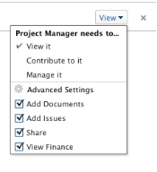

# Condividere un’attività

L’amministratore Adobe Workfront può concedere l’accesso alla visualizzazione o alla modifica delle attività quando assegna livelli di accesso. Per ulteriori informazioni sulla concessione dell&#39;accesso alle attività, vedere [Concedere l’accesso alle attività](../../administration-and-setup/add-users/configure-and-grant-access/grant-access-tasks.md).

Oltre al livello di accesso concesso agli utenti, puoi anche concedere loro le autorizzazioni per visualizzare, Contribute o gestire attività specifiche a cui hai accesso per condividere.

Le autorizzazioni sono specifiche per un elemento in Workfront e definiscono quali azioni è possibile eseguire su tale elemento.

## Considerazioni durante la condivisione di un’attività

Oltre alle considerazioni seguenti, vedi [Panoramica della condivisione delle autorizzazioni sugli oggetti](../../workfront-basics/grant-and-request-access-to-objects/sharing-permissions-on-objects-overview.md).

* Per impostazione predefinita, l’autore di un’attività dispone delle autorizzazioni di gestione.
* È possibile condividere le attività singolarmente oppure in blocco.\
   La condivisione delle attività è identica alla condivisione di altri oggetti. Per ulteriori informazioni sulla condivisione di elementi in Workfront, vedi [Condividere un oggetto](../../workfront-basics/grant-and-request-access-to-objects/share-an-object.md).

* È possibile concedere le seguenti autorizzazioni a un&#39;attività: 

   * Visualizza
   * Gestisci
   * contribuire\
        

* Quando si condivide un&#39;attività, per impostazione predefinita gli utenti ereditano le stesse autorizzazioni su tutti gli oggetti secondari associati all&#39;attività. Ad esempio, ereditano le stesse autorizzazioni sulle attività secondarie, sui problemi e sui documenti associati all’attività.\
   Per ulteriori informazioni sulla gerarchia degli oggetti in Workfront, consulta  [Comprendere gli oggetti in Adobe Workfront](../../workfront-basics/navigate-workfront/workfront-navigation/understand-objects.md).

   L’amministratore di Workfront può specificare se i documenti devono ereditare le autorizzazioni da oggetti superiori nel livello di accesso dell’utente. Per ulteriori informazioni sulla limitazione delle autorizzazioni ereditate ai documenti, vedere [Creare o modificare livelli di accesso personalizzati](../../administration-and-setup/add-users/configure-and-grant-access/create-modify-access-levels.md).

* È possibile rimuovere le autorizzazioni ereditate da un&#39;attività.\
   Per ulteriori informazioni sulla rimozione delle autorizzazioni ereditate dagli oggetti, vedere  [Rimuovere le autorizzazioni dagli oggetti](../../workfront-basics/grant-and-request-access-to-objects/remove-permissions-from-objects.md).

## Modi per condividere un’attività

È possibile condividere un&#39;attività nei seguenti modi:

* Manualmente, singolarmente o in massa. La condivisione manuale delle attività è simile alla condivisione di qualsiasi altro oggetto in Workfront.

   Per ulteriori informazioni sulla condivisione di oggetti in Workfront, vedi  [Condividere un oggetto](../../workfront-basics/grant-and-request-access-to-objects/share-an-object.md).

* Automaticamente, eseguendo le operazioni seguenti:

   * Specificare le autorizzazioni per uno qualsiasi degli oggetti principali dell&#39;attività: progetto, programma o portfolio. Le attività ereditano le autorizzazioni dai relativi oggetti principali. Per informazioni sulla visualizzazione delle autorizzazioni ereditate sugli oggetti, vedere [Visualizzare le autorizzazioni ereditate sugli oggetti](../../workfront-basics/grant-and-request-access-to-objects/view-inherited-permissions-on-objects.md).
   * Aggiungi entità a Condivisione progetti in un modello utilizzato per creare il progetto su cui si trova l&#39;attività. Per informazioni sulla condivisione di progetti da modelli, consulta [Condividere un modello](../../workfront-basics/grant-and-request-access-to-objects/share-a-template.md).

   * Specifica le autorizzazioni per tutte le attività di un progetto quando modifichi il progetto. Per informazioni sulla gestione dell’accesso alle attività del progetto in base alle autorizzazioni di un utente per il progetto, consulta la sezione  sezione dell&#39;articolo [Modifica progetti](../../manage-work/projects/manage-projects/edit-projects.md).
   >[!TIP]
   >
   >Se non si specificano le autorizzazioni per l’attività che gli utenti devono avere quando vengono assegnati alle attività del progetto, per impostazione predefinita ricevono le stesse autorizzazioni disponibili per il progetto.

## Autorizzazioni attività

Nella tabella seguente vengono visualizzate le autorizzazioni che è possibile concedere agli utenti quando consentono loro di visualizzare, Contribute o gestire un&#39;attività:

<table border="2" cellspacing="15" cellpadding="1"> 
 <col> 
 <col> 
 <col> 
 <col> 
 <thead> 
  <tr> 
   <th><strong>Azione</strong> </th> 
   <th><strong>Gestisci</strong> </th> 
   <th><strong>contribuire</strong> </th> 
   <th><strong>Visualizza</strong> </th> 
  </tr> 
 </thead> 
 <tbody> 
  <tr> 
   <td scope="row">Aggiungi attività</td> 
   <td>✓</td> 
   <td>✓</td> 
   <td> </td> 
  </tr> 
  <tr> 
   <td scope="row">Aggiungi predecessori</td> 
   <td>✓</td> 
   <td> </td> 
   <td> </td> 
  </tr> 
  <tr> 
   <td scope="row">Aggiungi problemi</td> 
   <td>✓</td> 
   <td>✓</td> 
   <td>✓</td> 
  </tr> 
  <tr> 
   <td scope="row">Cancella l'Attività</td> 
   <td>✓</td> 
   <td> </td> 
   <td> </td> 
  </tr> 
  <tr> 
   <td scope="row"> 
Modifica attività generale 
 </td> 
   <td>✓</td> 
   <td>✓</td> 
   <td> </td> 
  </tr> 
  <tr> 
   <td scope="row">Modifica stato attività</td> 
   <td>✓</td> 
   <td>✓</td> 
   <td> </td> 
  </tr> 
  <tr> 
   <td scope="row">Modifica vincolo di attività</td> 
   <td>✓</td> 
   <td> </td> 
   <td> </td> 
  </tr> 
  <tr> 
   <td scope="row">Visualizza l'Attività</td> 
   <td>✓</td> 
   <td>✓</td> 
   <td>✓</td> 
  </tr> 
  <tr> 
   <td scope="row">Aggiungi documento</td> 
   <td>✓</td> 
   <td>✓</td> 
   <td>✓</td> 
  </tr> 
  <tr> 
   <td scope="row">Copia l'Attività*</td> 
   <td>✓</td> 
   <td>✓</td> 
   <td>✓</td> 
  </tr> 
  <tr> 
   <td scope="row">Sposta l'Attività*</td> 
   <td>✓</td> 
   <td> </td> 
   <td> </td> 
  </tr> 
  <tr> 
   <td scope="row">Registra ore</td> 
   <td>✓</td> 
   <td>✓</td> 
   <td> </td> 
  </tr> 
  <tr> 
   <td scope="row">Modifica date pianificate</td> 
   <td>✓</td> 
   <td> </td> 
   <td> </td> 
  </tr> 
  <tr> 
   <td scope="row">Accetta assegnazione</td> 
   <td>✓</td> 
   <td>✓</td> 
   <td> </td> 
  </tr> 
  <tr> 
   <td scope="row">Assegnazione</td> 
   <td>✓</td> 
   <td>✓</td> 
   <td> </td> 
  </tr> 
  <tr> 
   <td scope="row">Allega modulo personalizzato</td> 
   <td>✓</td> 
   <td> </td> 
   <td> </td> 
  </tr> 
  <tr> 
   <td scope="row">Modifica campi personalizzati</td> 
   <td>✓</td> 
   <td>✓</td> 
   <td> </td> 
  </tr> 
  <tr> 
   <td scope="row">Creazione di un processo di approvazione</td> 
   <td>✓</td> 
   <td> </td> 
   <td> </td> 
  </tr> 
  <tr> 
   <td scope="row">Approva Un’Attività</td> 
   <td>✓</td> 
   <td>✓</td> 
   <td>✓</td> 
  </tr> 
  <tr> 
   <td scope="row">Modifica informazioni finanziarie*</td> 
   <td>✓</td> 
   <td> </td> 
   <td> </td> 
  </tr> 
  <tr> 
   <td scope="row">Aggiungi/Modifica spese</td> 
   <td>✓</td> 
   <td>✓</td> 
   <td> </td> 
  </tr> 
  <tr> 
   <td scope="row">Visualizza dati finanziari</td> 
   <td>✓</td> 
   <td>✓</td> 
   <td>✓</td> 
  </tr> 
  <tr> 
   <td scope="row">Aggiornamenti/commenti</td> 
   <td>✓</td> 
   <td>✓</td> 
   <td>✓</td> 
  </tr> 
  <tr> 
   <td scope="row">Condividi</td> 
   <td>✓</td> 
   <td>✓</td> 
   <td>✓</td> 
  </tr> 
  <tr> 
   <td scope="row">Condividi a livello di sistema</td> 
   <td> </td> 
   <td> </td> 
   <td>✓</td> 
  </tr> 
 </tbody> 
</table>

&#42;Controllato dal livello di accesso e dalle autorizzazioni per il progetto.
