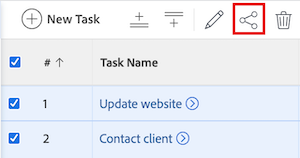

# Condividere un’attività

L’amministratore di Adobe Workfront può concederti l’accesso per visualizzare o modificare le attività quando assegna i livelli di accesso. Per ulteriori informazioni sulla concessione dell&#39;accesso alle attività, vedere [Concedere l&#39;accesso alle attività](../../administration-and-setup/add-users/configure-and-grant-access/grant-access-tasks.md).

Oltre al livello di accesso concesso agli utenti, è possibile concedere loro le autorizzazioni per visualizzare, contribuire o gestire attività specifiche che si dispone dell&#39;accesso per condividere.

Le autorizzazioni sono specifiche per un elemento in Workfront e definiscono quali azioni è possibile eseguire su tale elemento.

## Requisiti di accesso

+++ Espandi per visualizzare i requisiti di accesso per la funzionalità in questo articolo.

Per condividere gli oggetti, è necessario disporre dei seguenti elementi:

<table style="table-layout:auto"> 
 <col> 
 <col> 
 <tbody> 
  <tr> 
   <td role="rowheader">piano Adobe Workfront</td> 
   <td> 
Qualsiasi 
 </td> 
  </tr> 
  <tr> 
   <td role="rowheader">Licenza Adobe Workfront</td> 
   <td> 
Nuovo: Standard
 
   Oppure
   
Corrente: Lavoro o versione successiva

   </td> 
  </tr> 
  <tr> 
   <td role="rowheader">Configurazioni del livello di accesso</td> 
   <td> 
Accesso di visualizzazione o superiore agli oggetti da condividere
 </td> 
  </tr> 
  <tr> 
   <td role="rowheader">Autorizzazioni oggetto</td> 
   <td> 
Visualizzare le autorizzazioni o versioni successive per gli oggetti da condividere
</td> 
  </tr> 
 </tbody> 
</table>

Per ulteriori informazioni, consulta [Requisiti di accesso nella documentazione di Workfront](/help/quicksilver/administration-and-setup/add-users/access-levels-and-object-permissions/access-level-requirements-in-documentation.md).

+++

## Considerazioni durante la condivisione di un’attività

Oltre alle considerazioni riportate di seguito, vedere anche [Panoramica sulle autorizzazioni di condivisione per gli oggetti](../../workfront-basics/grant-and-request-access-to-objects/sharing-permissions-on-objects-overview.md).

* Per impostazione predefinita, il creatore di un’attività dispone delle autorizzazioni di gestione necessarie.
* È possibile condividere le attività singolarmente oppure più attività contemporaneamente in blocco.\
  La condivisione delle attività è identica alla condivisione di altri oggetti. Per ulteriori informazioni sulla condivisione di elementi in Workfront, vedere [Condividere un oggetto](../../workfront-basics/grant-and-request-access-to-objects/share-an-object.md).

* È possibile concedere le seguenti autorizzazioni a un&#39;attività: 

   * Visualizza
   * Gestire
   * Contribuisci
* Quando si condivide un&#39;attività, per impostazione predefinita gli utenti ereditano le stesse autorizzazioni per tutti gli oggetti figlio associati all&#39;attività. Ad esempio, ereditano le stesse autorizzazioni per le attività, i problemi e i documenti secondari allegati all’attività.\
  Per ulteriori informazioni sulla gerarchia degli oggetti in Workfront, consulta  [Informazioni sugli oggetti in Adobe Workfront](../../workfront-basics/navigate-workfront/workfront-navigation/understand-objects.md).

  L&#39;amministratore di Workfront può specificare se i documenti devono ereditare le autorizzazioni da oggetti di livello superiore nel livello di accesso dell&#39;utente. Per ulteriori informazioni sulla limitazione delle autorizzazioni ereditate sui documenti, vedere [Creare o modificare livelli di accesso personalizzati](../../administration-and-setup/add-users/configure-and-grant-access/create-modify-access-levels.md).

* È possibile rimuovere le autorizzazioni ereditate da un&#39;attività.\
  Per ulteriori informazioni sulla rimozione delle autorizzazioni ereditate dagli oggetti, vedere  [Rimuovi le autorizzazioni dagli oggetti](../../workfront-basics/grant-and-request-access-to-objects/remove-permissions-from-objects.md).

## Modalità di condivisione di un&#39;attività

È possibile condividere un&#39;attività nei modi seguenti:

* Manualmente, singolarmente o in blocco.

* Automaticamente, eseguendo le operazioni seguenti:

   * Specificare le autorizzazioni per uno qualsiasi degli oggetti padre dell&#39;attività: progetto, programma o portfolio. Le attività ereditano le autorizzazioni dagli oggetti padre. Per informazioni sulla visualizzazione delle autorizzazioni ereditate sugli oggetti, vedere [Visualizzare le autorizzazioni ereditate sugli oggetti](../../workfront-basics/grant-and-request-access-to-objects/view-inherited-permissions-on-objects.md).
   * Aggiungere entità alla condivisione di progetto in un modello utilizzato per creare il progetto in cui si trova l&#39;attività. Per informazioni sulla condivisione di progetti da modelli, vedere [Condividere un modello](../../workfront-basics/grant-and-request-access-to-objects/share-a-template.md).

   * Specifica le autorizzazioni per tutte le attività di un progetto quando lo modifichi. Per informazioni sulla gestione dell&#39;accesso alle attività del progetto in base alle autorizzazioni di un utente, vedere la sezione  nell&#39;articolo [Modifica progetti](../../manage-work/projects/manage-projects/edit-projects.md).

  >[!TIP]
  >
  >Se non si specifica quali autorizzazioni di attività si desidera assegnare agli utenti quando vengono assegnati alle attività del progetto, per impostazione predefinita questi ricevono le stesse autorizzazioni di cui dispongono sul progetto.

## Condividere un’attività

1. Passare all&#39;attività da condividere.

1. A destra del nome dell&#39;attività, fare clic su **Condividi**. Viene visualizzata la finestra di dialogo **Condividi [Nome attività]**.

   

1. Nel campo **Concedi l&#39;accesso all&#39;attività a**, inizia a digitare il nome dell&#39;utente, del team, della mansione, del gruppo o della società con cui desideri condividere l&#39;attività, quindi fai clic sul nome quando viene visualizzato nell&#39;elenco a discesa.

   >[!TIP]
   >
   >Puoi condividere un’attività solo con utenti attivi, team, ruoli o aziende.

1. (Facoltativo) Seleziona l&#39;elenco a discesa **Chi ha accesso** e il livello di accesso dell&#39;attività:

   * **Solo gli utenti invitati possono accedere a:** Solo gli utenti invitati all&#39;attività possono accedervi (impostazione predefinita).
   * **Tutti gli utenti del sistema possono visualizzare**: tutti gli utenti del sistema possono visualizzare l&#39;attività senza un invito.

1. Fai clic sull’elenco a discesa a destra del nome dell’utente e seleziona il relativo livello di autorizzazione per questa attività:

   * **Visualizza**: l&#39;utente può rivedere e condividere l&#39;attività.
   * **Contributo**: l&#39;utente può apportare aggiornamenti, registrare informazioni, apportare modifiche minori e condividere l&#39;attività (include anche tutte le autorizzazioni di visualizzazione).
   * **Gestisci**: l&#39;utente ha accesso completo all&#39;attività senza diritti amministrativi, concessi a livello di accesso (include anche tutte le autorizzazioni di visualizzazione e di contributo).

1. (Facoltativo) Fai clic sull’icona delle opzioni avanzate accanto al livello di autorizzazione concesso per configurare autorizzazioni specifiche per l’attività.

   

1. (Facoltativo) Per disattivare le autorizzazioni ereditate per gli oggetti figlio dell&#39;attività, fare clic su **Disattiva** in linea con **Autorizzazioni ereditate**.

1. (Facoltativo) Per condividere rapidamente l&#39;attività utilizzando un collegamento, fare clic su **Copia collegamento** e quindi inoltrarlo al destinatario.

1. Fai clic su **Salva**.

## Condivisione di attività in blocco

1. Passare al progetto contenente le attività da condividere.

1. Nella scheda **Attività** della pagina del progetto, seleziona la casella a sinistra di ogni attività da condividere, quindi fai clic sull&#39;icona **Condividi**  nella parte superiore della pagina. Viene visualizzata la finestra modale di condivisione.

   

1. Nel campo **Concedi l&#39;accesso alle attività**, inizia a digitare il nome dell&#39;utente, del team, della mansione, del gruppo o della società con cui desideri condividere le attività, quindi fai clic sul nome quando viene visualizzato nell&#39;elenco a discesa.

   >[!TIP]
   >
   >Puoi condividere le attività solo con utenti attivi, team, ruoli o aziende.

1. (Facoltativo) Seleziona l&#39;elenco a discesa **Chi ha accesso** e il livello di accesso delle attività:

   * **Solo gli utenti invitati possono accedere a:** Solo gli utenti invitati alle attività possono accedervi (impostazione predefinita).
   * **Tutti gli utenti del sistema possono visualizzare**: tutti gli utenti del sistema possono visualizzare le attività senza un invito.

1. Fai clic sull’elenco a discesa a destra del nome dell’utente e seleziona il relativo livello di autorizzazione per le attività:

   * **Visualizza**: l&#39;utente può rivedere e condividere le attività.
   * **Contributo**: l&#39;utente può apportare aggiornamenti, registrare informazioni, apportare modifiche minori e condividere le attività (include anche tutte le autorizzazioni di visualizzazione).
   * **Gestisci**: l&#39;utente dispone dell&#39;accesso completo alle attività senza diritti amministrativi, concessi a livello di accesso (include anche tutte le autorizzazioni di visualizzazione e di contributo).

1. (Facoltativo) Fai clic sull’icona delle opzioni avanzate accanto al livello di autorizzazione concesso per configurare autorizzazioni specifiche per le attività.

   

1. Fai clic su **Salva**.

## Autorizzazioni attività

Nella tabella seguente vengono visualizzate le autorizzazioni che è possibile concedere agli utenti quando si consente loro di visualizzare, contribuire o gestire un&#39;attività:

<table border="2" cellspacing="15" cellpadding="1"> 
 <col> 
 <col> 
 <col> 
 <col> 
 <thead> 
  <tr> 
   <th><strong>Azione</strong> </th> 
   <th><strong>Gestisci</strong> </th> 
   <th><strong>Contribuisci</strong> </th> 
   <th><strong>Visualizza</strong> </th> 
  </tr> 
 </thead> 
 <tbody> 
  <tr> 
   <td scope="row">Aggiungi attività</td> 
   <td>✓</td> 
   <td>✓</td> 
   <td> </td> 
  </tr> 
  <tr> 
   <td scope="row">Aggiungi predecessori</td> 
   <td>✓</td> 
   <td> </td> 
   <td> </td> 
  </tr> 
  <tr> 
   <td scope="row">Aggiungi problemi</td> 
   <td>✓</td> 
   <td>✓</td> 
   <td>✓</td> 
  </tr> 
  <tr> 
   <td scope="row">Cancella l'Attività</td> 
   <td>✓</td> 
   <td> </td> 
   <td> </td> 
  </tr> 
  <tr> 
   <td scope="row"> 
Modifica attività generale 
 </td> 
   <td>✓</td> 
   <td>✓</td> 
   <td> </td> 
  </tr> 
  <tr> 
   <td scope="row">Modifica stato attività</td> 
   <td>✓</td> 
   <td>✓</td> 
   <td> </td> 
  </tr> 
  <tr> 
   <td scope="row">Modifica vincolo attività</td> 
   <td>✓</td> 
   <td> </td> 
   <td> </td> 
  </tr> 
  <tr> 
   <td scope="row">Visualizza l'Attività</td> 
   <td>✓</td> 
   <td>✓</td> 
   <td>✓</td> 
  </tr> 
  <tr> 
   <td scope="row">Aggiungi documenti</td> 
   <td>✓</td> 
   <td>✓</td> 
   <td>✓</td> 
  </tr> 
  <tr> 
   <td scope="row">Copia attività*</td> 
   <td>✓</td> 
   <td>✓</td> 
   <td>✓</td> 
  </tr> 
  <tr> 
   <td scope="row">Sposta attività*</td> 
   <td>✓</td> 
   <td> </td> 
   <td> </td> 
  </tr> 
  <tr> 
   <td scope="row">Registra ore</td> 
   <td>✓</td> 
   <td>✓</td> 
   <td> </td> 
  </tr> 
  <tr> 
   <td scope="row">Modifica date pianificate</td> 
   <td>✓</td> 
   <td> </td> 
   <td> </td> 
  </tr> 
  <tr> 
   <td scope="row">Accetta assegnazione</td> 
   <td>✓</td> 
   <td>✓</td> 
   <td> </td> 
  </tr> 
  <tr> 
   <td scope="row">Crea un'assegnazione</td> 
   <td>✓</td> 
   <td>✓</td> 
   <td> </td> 
  </tr> 
  <tr> 
   <td scope="row">Allega modulo personalizzato</td> 
   <td>✓</td> 
   <td> </td> 
   <td> </td> 
  </tr> 
  <tr> 
   <td scope="row">Modifica campi personalizzati</td> 
   <td>✓</td> 
   <td>✓</td> 
   <td> </td> 
  </tr> 
  <tr> 
   <td scope="row">Creare un processo di approvazione</td> 
   <td>✓</td> 
   <td> </td> 
   <td> </td> 
  </tr> 
  <tr> 
   <td scope="row">Approva Un'Attività</td> 
   <td>✓</td> 
   <td>✓</td> 
   <td>✓</td> 
  </tr> 
  <tr> 
   <td scope="row">Modifica dati finanziari*</td> 
   <td>✓</td> 
   <td> </td> 
   <td> </td> 
  </tr> 
  <tr> 
   <td scope="row">Aggiungi/Modifica spese</td> 
   <td>✓</td> 
   <td>✓</td> 
   <td> </td> 
  </tr> 
  <tr> 
   <td scope="row">Visualizza dati finanziari</td> 
   <td>✓</td> 
   <td>✓</td> 
   <td>✓</td> 
  </tr> 
  <tr> 
   <td scope="row">Aggiornamenti/Commenti</td> 
   <td>✓</td> 
   <td>✓</td> 
   <td>✓</td> 
  </tr> 
  <tr> 
   <td scope="row">Condividi</td> 
   <td>✓</td> 
   <td>✓</td> 
   <td>✓</td> 
  </tr> 
  <tr> 
   <td scope="row">Condividi a livello di sistema</td> 
   <td> </td> 
   <td> </td> 
   <td>✓</td> 
  </tr> 
 </tbody> 
</table>

&#42;Controllato dal livello di accesso e dalle autorizzazioni per il progetto.
