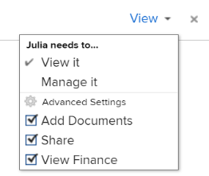
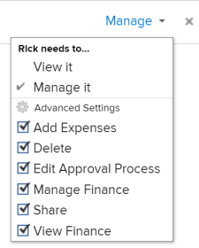

# Condividere un modello

In qualità di amministratore di Adobe Workfront, puoi concedere agli utenti l’accesso per visualizzare o modificare i modelli quando assegni il loro livello di accesso. Per poter accedere ai modelli di modifica, un utente deve disporre di una licenza Plan.

Per ulteriori informazioni sulla concessione dell&#39;accesso ai modelli, consulta [Concedere l’accesso ai modelli](../../administration-and-setup/add-users/configure-and-grant-access/grant-access-templates.md).

Oltre al livello di accesso concesso, un utente può anche ricevere le autorizzazioni per visualizzare o gestire modelli specifici da altri utenti che li condividono .

>[!NOTE]
>
>I livelli di autorizzazione funzionano all&#39;interno dei livelli di Access. Ad esempio, un utente non può ricevere le autorizzazioni per gestire un modello, se il suo livello di accesso consente solo di visualizzare i modelli.

Le autorizzazioni sono specifiche per un elemento in Workfront e definiscono quali azioni è possibile eseguire su tale elemento.

## Considerazioni durante la condivisione di un modello

* Oltre alle considerazioni seguenti, vedi [Panoramica della condivisione delle autorizzazioni sugli oggetti](../../workfront-basics/grant-and-request-access-to-objects/sharing-permissions-on-objects-overview.md).
* Per impostazione predefinita, sia l’autore di un modello, sia il proprietario del modello dispongono delle autorizzazioni di gestione per il modello. Per informazioni sulla designazione di un utente come proprietario del modello, consulta [Modificare i modelli di progetto](../../manage-work/projects/create-and-manage-templates/edit-templates.md).
* Quando condividi un modello, puoi condividere quanto segue:

   * Il modello

      Per ulteriori informazioni su come condividere un modello, vedi [Condividere i modelli di progetto](../../manage-work/projects/create-and-manage-templates/share-project-template.md).

      Puoi concedere le seguenti autorizzazioni a un modello:

      * Visualizza

         

      * Gestisci

         
   * I progetti futuri creati utilizzando il modello. Puoi assegnare agli stessi livelli di autorizzazioni per i progetti creati da un modello come faresti con un singolo progetto. 

      Per informazioni su come condividere un progetto da un modello a livello di modello, consulta [Condividere i modelli di progetto](../../manage-work/projects/create-and-manage-templates/share-project-template.md).

* Quando condividi un modello o un progetto creato dal modello, per impostazione predefinita gli utenti ereditano le stesse autorizzazioni a tutti gli oggetti secondari associati al modello o al progetto.

   Per ulteriori informazioni sulla gerarchia degli oggetti in Workfront, consulta  [Comprendere gli oggetti in Adobe Workfront](../../workfront-basics/navigate-workfront/workfront-navigation/understand-objects.md).

* Quando condividi un modello, tutte le attività e i documenti del modello, così come i problemi relativi al progetto futuro creato dal modello, ereditano le stesse autorizzazioni, se non diversamente specificato.

   Per informazioni sulla gestione dell’accesso alle attività e ai problemi relativi ai modelli in base alle autorizzazioni di un utente per il progetto, consulta la sezione [Accesso](../../manage-work/projects/create-and-manage-templates/edit-templates.md#access) sezione dell&#39;articolo [Modificare i modelli di progetto](../../manage-work/projects/create-and-manage-templates/edit-templates.md).

* L’amministratore di Workfront può specificare se i documenti devono ereditare le autorizzazioni da oggetti superiori nel livello di accesso dell’utente. Per ulteriori informazioni sulla limitazione delle autorizzazioni ereditate ai documenti, vedere [Creare o modificare livelli di accesso personalizzati](../../administration-and-setup/add-users/configure-and-grant-access/create-modify-access-levels.md).

<!--

<h2>Share a template</h2>

(NOTE: drafted because this is also linked above: Share project templates >> which is an article in the Manage Work section>> Templates)&nbsp;

<ol>
<li value="1"> 
Go to the template you want to share with other entities, click <strong>Template Actions</strong>, then <strong>Template Sharing</strong>. Or
 
Navigate to a list of templates, and select multiple templates from the list, then click <strong>Share Template</strong>.
 <note type="note">
If you select multiple templates, you cannot view who already has permissions to the individual templates.
</note> </li>
<li value="2"> 
Start typing the name of a user, group, team, job role, or company that you want to share the template with in the <strong>Give template access to</strong> or <strong>Edit template access for</strong> fields.
 
Select them when they appear in the list.
 <note type="tip">
You can share an object only with active users, teams,
roles, or companies.
</note> </li>
<li value="3">From the drop-down menu, select which level of permissions you want to grant: 
<ul>
<li>
<strong>View it</strong>: Users with these permissions are able to view the template and create a project using it, or attach it to an existing project.

</li>
<li><strong>Manage it</strong>: Users with these permissions are able to edit or delete the template.</li>
</ul></li>
<li value="4">(Optional) Click <strong>Advanced Settings</strong> to fine-tune your settings for each level of permissions.</li>
<li value="5">Click <strong>Save</strong>.</li>
</ol>
<h2>Share a project at the template level</h2>

You can share the future projects that are created using a template with users at the template level.

<ol>
<li value="1"> 
Go to the template whose future projects you want to share with other entities, click <strong>Template Actions</strong>, then <strong>Project Sharing</strong>.
 
Or
 
Navigate to a list of templates, and select multiple templates from the list, then click <strong>Share Project</strong>.
 <note type="note">
If you select multiple templates, you cannot view who already has project permissions to the individual templates.
</note> </li>
<li value="2"> 
Start typing and then select the name of a user, group, team, job role, or company with whom you want to share future projects created from the template in the <strong>Give project access to</strong> or <strong>Edit template access for</strong> fields.
 <note type="tip">
You can share an object only with active users, teams,
roles, or companies.
</note> </li>
<li value="3">From the drop-down menu, select which level of permissions you want to grant. Select from the following: 
<ul>
<li><strong>No access</strong>: You can specify which users will not have any access to the template. This option is available only when bulk sharing projects from templates.&nbsp;</li>
<li><strong>View</strong>: Users with these permissions can view projects created from the template.</li>
<li><strong>Contribute</strong>: Users with these permissions can contribute to projects created from the template&nbsp;</li>
<li><strong>Manage</strong>: Users with these permissions can manage or delete projects created from this template. </li>
</ul></li>
<li value="4">(Optional) Click <strong>Advanced Settings</strong> to fine-tune your settings for each level of permissions. </li>
<li value="5">Click <strong>Save</strong>.</li>
</ol>

-->

## Impostazioni avanzate per la condivisione dei modelli

Nella tabella seguente vengono visualizzate le autorizzazioni che è possibile concedere agli utenti quando questi consentono loro di visualizzare o gestire un modello. Per istruzioni su come condividere un modello, consulta la sezione . [Condividere un modello](../../manage-work/projects/create-and-manage-templates/share-project-template.md#share) nell&#39;articolo [Condividere i modelli di progetto](../../manage-work/projects/create-and-manage-templates/share-project-template.md).

<table style="table-layout:auto"> 
 <col> 
 <col> 
 <col> 
 <thead> 
  <tr> 
   <th>Azioni</th> 
   <th>Gestisci</th> 
   <th>Visualizza</th> 
  </tr> 
 </thead> 
 <tbody> 
  <tr> 
   <td>Copia</td> 
   <td>✓</td> 
   <td> </td> 
  </tr> 
  <tr> 
   <td>Elimina</td> 
   <td>✓</td> 
   <td> </td> 
  </tr> 
  <tr> 
   <td>Modifica dettagli modello</td> 
   <td>✓</td> 
   <td> </td> 
  </tr> 
  <tr> 
   <td>Visualizza Modello</td> 
   <td>✓</td> 
   <td>✓</td> 
  </tr> 
  <tr> 
   <td>Condividi</td> 
   <td>✓</td> 
   <td>✓</td> 
  </tr> 
  <tr> 
   <td>Condividi a livello di sistema</td> 
   <td> </td> 
   <td>✓</td> 
  </tr> 
  <tr data-mc-conditions=""> 
   <td> 
Aggiungi documenti
 
Suggerimento: A volte le persone aggiungono documenti a un modello di progetto pensando di aggiungerli a un progetto. Per evitare questo problema, disattiva questa impostazione per i destinatari.
 </td> 
   <td> </td> 
   <td>✓</td> 
  </tr> 
 </tbody> 
</table>

Per comprendere le autorizzazioni concesse agli utenti per i progetti creati da un modello, vedi [Condivisione di un progetto in Adobe Workfront](../../workfront-basics/grant-and-request-access-to-objects/share-a-project.md).
