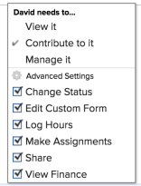

# Condividere un problema

L’amministratore Adobe Workfront consente agli utenti di visualizzare o modificare i problemi quando assegnano i livelli di accesso. Per ulteriori informazioni sulla concessione dell’accesso ai problemi, consulta [Concedere l’accesso ai problemi](../../administration-and-setup/add-users/configure-and-grant-access/grant-access-issues.md).

Oltre al livello di accesso concesso agli utenti, puoi anche concedere loro le autorizzazioni per visualizzare, Contribute o gestire problemi specifici a cui hai accesso per condividere. Per ulteriori informazioni sui livelli di accesso e le autorizzazioni, consulta [Funzionamento congiunto dei livelli di accesso e delle autorizzazioni](../../administration-and-setup/add-users/access-levels-and-object-permissions/how-access-levels-permissions-work-together.md).

Le autorizzazioni sono specifiche per un elemento in Workfront e definiscono quali azioni è possibile eseguire su tale elemento.

## Considerazioni sulla condivisione dei problemi

Oltre alle considerazioni seguenti, vedi [Panoramica della condivisione delle autorizzazioni sugli oggetti](../../workfront-basics/grant-and-request-access-to-objects/sharing-permissions-on-objects-overview.md).

>[!NOTE]
>
>Un amministratore Workfront può aggiungere o rimuovere autorizzazioni per qualsiasi elemento del sistema, per tutti gli utenti, senza esserne il proprietario.

* Per impostazione predefinita, il creatore di un problema dispone delle autorizzazioni Manage (Gestisci).
* Puoi condividere i problemi singolarmente oppure puoi condividerli diversi alla volta. La condivisione di problemi è identica alla condivisione di altri elementi in Workfront. Per ulteriori informazioni sulla condivisione di elementi in Workfront, vedi [Condividere un oggetto](../../workfront-basics/grant-and-request-access-to-objects/share-an-object.md).
* Puoi concedere le seguenti autorizzazioni a un problema: 

   * Visualizza

      

   * Gestisci

      

   * contribuire\
      

* Quando condividi un problema, tutti i documenti allegati al problema ereditano le stesse autorizzazioni.

   L’amministratore di Workfront può specificare se i documenti devono ereditare le autorizzazioni da oggetti superiori nel livello di accesso dell’utente. Per ulteriori informazioni sulla limitazione delle autorizzazioni ereditate ai documenti, vedere [Creare o modificare livelli di accesso personalizzati](../../administration-and-setup/add-users/configure-and-grant-access/create-modify-access-levels.md).

* È possibile rimuovere le autorizzazioni ereditate da un problema. Per ulteriori informazioni, consulta [Rimuovere le autorizzazioni dagli oggetti](../../workfront-basics/grant-and-request-access-to-objects/remove-permissions-from-objects.md).

## Come condividere un problema

* Manualmente, simile alla condivisione di qualsiasi altro oggetto in Workfront. Per ulteriori informazioni sulla condivisione di oggetti in Workfront, consulta [Condividere un oggetto](../../workfront-basics/grant-and-request-access-to-objects/share-an-object.md).
* Automaticamente, eseguendo una delle operazioni seguenti:

   * Specifica le autorizzazioni per uno qualsiasi degli oggetti principali del problema: progetto, programma o portfolio. I problemi ereditano le autorizzazioni dai relativi oggetti principali. Per informazioni sulla visualizzazione delle autorizzazioni ereditate sugli oggetti, vedere [Visualizzare le autorizzazioni ereditate sugli oggetti](../../workfront-basics/grant-and-request-access-to-objects/view-inherited-permissions-on-objects.md).
   * Aggiungi entità alla condivisione di progetti in un modello utilizzato per creare il progetto su cui si verifica il problema. Per informazioni sulla condivisione di progetti da modelli, consulta [Condividere un modello](../../workfront-basics/grant-and-request-access-to-objects/share-a-template.md).

   * Specifica le autorizzazioni per tutti i problemi di un progetto quando modifichi il progetto. Per informazioni sulla gestione dell’accesso ai problemi o alle richieste sul progetto in base alle autorizzazioni di un utente per il progetto, consulta la sezione  sezione dell&#39;articolo [Modifica progetti](../../manage-work/projects/manage-projects/edit-projects.md).

      >[!TIP]
      >
      >Se non si specifica quali autorizzazioni di problema si desidera concedere agli utenti quando vengono assegnati ai problemi del progetto, per impostazione predefinita ricevono le stesse autorizzazioni disponibili per il progetto.

   * Specifica le autorizzazioni che gli utenti ricevono per i problemi che inviano in una coda di richiesta durante la creazione di una coda di richiesta. Per informazioni, consulta [Creare una coda di richiesta](../../manage-work/requests/create-and-manage-request-queues/create-request-queue.md).

      >[!IMPORTANT]
      >
      >Le autorizzazioni vengono concesse in modo diverso a seconda che il progetto venga pubblicato o meno come coda di richiesta:
      >
      >   
      >   
      >   * Quando un utente invia una richiesta a un progetto pubblicato come coda di richiesta, gli utenti Contatto principale e Inserito da ricevono l’autorizzazione specificata.
      >   * Quando un utente invia una richiesta a un progetto non pubblicato come coda di richiesta, al contatto principale (se diverso dall&#39;utente inserito dall&#39;utente) viene concessa l&#39;autorizzazione specificata e all&#39;utente inserito da vengono concesse le autorizzazioni di gestione al problema.

<!--

<h2>Automatically share an issue at the project level</h2>

(NOTE: this info duplicates in Edit projects - linked there instead (above).)&nbsp;

As the Project Owner, you can grant permissions automatically to users as the issues are added to a project.

<ol>
<li value="1">Go to the project whose issues you want to share automatically.</li>
<li value="2"> Click the More menu , then click <strong>Edit</strong>. </li>
<li value="3">In the <strong>Edit Project</strong> box that displays, click <strong>Access</strong>.</li>
<li value="4">In the <strong>When someone is assigned to an ISSUE</strong> field, select from the following permissions levels:
<ul>
<li><strong>View</strong></li>
<li><strong>Contribute</strong></li>
<li><strong>Manage</strong> Now, when someone is assigned to an issue on the selected project, they are granted the specified permissions to the issue.&nbsp;</li>
</ul></li>
<li value="5">(Optional) Select the <strong>Also grant ... access to the project</strong> field to also grant View, Contribute, or Manage permissions to the projects to the user assigned to the issue</li>
<li value="6">In the <strong>When someone submits a REQUEST ...</strong> field, select from the following permissions levels:
<ul>
<li><strong>View</strong></li>
<li><strong>Contribute</strong></li>
<li>
<strong>Manage</strong>
<note type="important">

Permissions are granted differently depending on whether or not the project is published as a request queue:

<ul>
<li>When a user submits a request to a project published as a request queue, the Primary Contact and Entered By users are granted the permission specified.</li>
<li>When a user submits a request to a project not published as a request queue, the Primary Contact (if different from Entered By user) is granted the permission specified, and the Entered By user is granted Manage permissions to the issue.</li>
</ul>
</note></li>
</ul></li>
<li value="7"> 
(Optional) Select the <strong>People from the same company will inherit the same permissions for all requests</strong> field.
 
People from the same company as the user submitting the request are granted the same permissions on the requests as the user.&nbsp;
 </li>
<li value="8">Click <strong>Save Changes</strong>.</li>
</ol>

-->

<!--

<h2>Automatically share an issue in request queues</h2>

(NOTE: drafted because it's duplicated from Create a Request Queue which is linked above)&nbsp;

As the Project Owner, you can grant permissions automatically to users as the issues are submitted to a request queue.

<ol>
<li value="1">Go to the project whose issues you want to share automatically.</li>
<li value="2">Click <strong>Edit Project</strong>.</li>
<li value="3">Click <strong>More</strong> then click <strong>Queue Setup</strong>. </li>
<li value="4"> 
On the <strong>Queue Details</strong> sub-tab, in the drop-down menu under <strong>When someone makes a request, automatically grant</strong>, select from the following permissions levels:

<ul>
<li><strong>View Access</strong> </li>
<li><strong>Contribute Access</strong> </li>
<li> 
<strong>Manage Access</strong> 
 </li>
</ul> 
Now, when someone submits a request to the selected project, they are granted the specified permissions to the request.
 </li>
<li value="5"> 
(Optional) Select the <strong>People from the same company will inherit the same permissions for all requests</strong>.
 
People from the same company as the user submitting the request are granted the same permissions on the requests as the user.&nbsp;
 </li>
<li value="6">Click <strong>Save</strong>.</li>
</ol>

-->

## Autorizzazioni di problema

Nella tabella seguente vengono visualizzate le autorizzazioni concesse agli utenti quando consentono loro di visualizzare, utilizzare Contribute o gestire un problema:

<table style="table-layout:auto"> 
 <col> 
 <col> 
 <col> 
 <col> 
 <tbody> 
  <tr> 
   <td><strong>Azioni</strong> </td> 
   <td><strong>Gestisci</strong> </td> 
   <td><strong>contribuire</strong> </td> 
   <td><strong>Visualizza</strong> </td> 
  </tr> 
  <tr> 
   <td> 
Aggiungi  problemi
 </td> 
   <td>✓</td> 
   <td> </td> 
   <td> </td> 
  </tr> 
  <tr> 
   <td>Elimina </td> 
   <td>✓</td> 
   <td> </td> 
   <td> </td> 
  </tr> 
  <tr> 
   <td>Allega modulo personalizzato</td> 
   <td>✓</td> 
   <td> </td> 
   <td> </td> 
  </tr> 
  <tr> 
   <td>Modifica campi personalizzati</td> 
   <td>✓</td> 
   <td>✓</td> 
   <td> </td> 
  </tr> 
  <tr> 
   <td>Approva problema</td> 
   <td>✓</td> 
   <td>✓</td> 
   <td>✓</td> 
  </tr> 
  <tr> 
   <td>Aggiungi processo di approvazione</td> 
   <td>✓</td> 
   <td> </td> 
   <td> </td> 
  </tr> 
  <tr> 
   <td>Aggiungi documenti</td> 
   <td>✓</td> 
   <td>✓</td> 
   <td>✓</td> 
  </tr> 
  <tr> 
   <td>Copia problema*</td> 
   <td>✓</td> 
   <td>✓</td> 
   <td>✓</td> 
  </tr> 
  <tr> 
   <td>Sposta problema</td> 
   <td>✓</td> 
   <td> </td> 
   <td> </td> 
  </tr> 
  <tr> 
   <td>Registra ore</td> 
   <td>✓</td> 
   <td>✓</td> 
   <td> </td> 
  </tr> 
  <tr> 
   <td>Converti in progetto*</td> 
   <td>✓</td> 
   <td> </td> 
   <td> </td> 
  </tr> 
  <tr> 
   <td>Accetta assegnazione</td> 
   <td>✓</td> 
   <td>✓</td> 
   <td> </td> 
  </tr> 
  <tr> 
   <td>Aggiornamenti/commenti</td> 
   <td>✓</td> 
   <td>✓</td> 
   <td>✓</td> 
  </tr> 
  <tr> 
   <td>Modifica date pianificate</td> 
   <td>✓</td> 
   <td> </td> 
   <td> </td> 
  </tr> 
  <tr> 
   <td>Fai le assegnazioni</td> 
   <td>✓</td> 
   <td>✓</td> 
   <td> </td> 
  </tr> 
  <tr> 
   <td>Condividi</td> 
   <td>✓</td> 
   <td>✓</td> 
   <td>✓</td> 
  </tr> 
  <tr> 
   <td>Condividi a livello di sistema</td> 
   <td> </td> 
   <td> </td> 
   <td>✓</td> 
  </tr> 
 </tbody> 
</table>

&#42;Controllato dai livelli di accesso e dalle autorizzazioni per il progetto.
