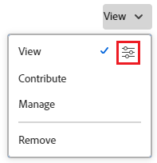

# Condividere un oggetto

<!--Audited: 01/2024-->

L’amministratore di Adobe Workfront consente agli utenti di visualizzare o modificare gli oggetti quando assegnano i livelli di accesso. Per ulteriori informazioni sulla concessione dell&#39;accesso agli oggetti, vedere [Creare o modificare livelli di accesso personalizzati](../../administration-and-setup/add-users/configure-and-grant-access/create-modify-access-levels.md).

Oltre al livello di accesso concesso agli utenti, è possibile concedere loro anche le autorizzazioni per visualizzare o modificare oggetti specifici creati o di cui si dispone dell&#39;accesso alla condivisione. Per ulteriori informazioni sui livelli di accesso e sulle autorizzazioni, consulta [Funzionamento congiunto dei livelli di accesso e delle autorizzazioni](../../administration-and-setup/add-users/access-levels-and-object-permissions/how-access-levels-permissions-work-together.md).

Le autorizzazioni sono specifiche per un elemento in Workfront e definiscono quali azioni è possibile eseguire su tale elemento.

Per informazioni sulla condivisione delle autorizzazioni sugli oggetti, consulta [Panoramica delle autorizzazioni di condivisione sugli oggetti](../../workfront-basics/grant-and-request-access-to-objects/sharing-permissions-on-objects-overview.md).

>[!NOTE]
>
>Un amministratore di Workfront può aggiungere o rimuovere autorizzazioni per qualsiasi elemento del sistema, per tutti gli utenti, senza esserne il proprietario.

Questo articolo descrive come condividere i seguenti oggetti:

* Progetti, attività, problemi
* Portfoli, programmi
* Documenti

Per informazioni su come condividere tutti gli altri oggetti in Workfront, vedere anche i seguenti articoli:

* Per i modelli, consulta [Condividere modelli di progetto](../../manage-work/projects/create-and-manage-templates/share-project-template.md).
* Per le bozze, consulta [Condividere una bozza in Workfront Proof](../../workfront-proof/wp-work-proofsfiles/share-proofs-and-files/share-proof.md).
* Per rapporti, dashboard e calendari, vedi i seguenti articoli:

   * [Condividere un rapporto in Adobe Workfront](../../reports-and-dashboards/reports/creating-and-managing-reports/share-report.md)
   * [Condividere un dashboard](../../reports-and-dashboards/dashboards/creating-and-managing-dashboards/share-dashboard.md)
   * [Condivisione di un report calendario](../../reports-and-dashboards/reports/calendars/share-a-calendar-report.md)

  Inoltre, vedi [Condividere report, dashboard e calendari](../../workfront-basics/grant-and-request-access-to-objects/permissions-reports-dashboards-calendars.md) per informazioni generali sulla condivisione di report, dashboard e calendari.

* Per filtri, viste e raggruppamenti, consulta [Condividere un filtro, una visualizzazione o un raggruppamento](../../reports-and-dashboards/reports/reporting-elements/share-filter-view-grouping.md).
* Per le cartelle di documenti, vedere [Condividere una cartella documenti](../../workfront-basics/grant-and-request-access-to-objects/share-a-document-folder.md).
* Per i piani, vedere [Condividere un piano nella Pianificazione scenario](../../scenario-planner/share-a-plan.md).

  È necessaria una licenza aggiuntiva.

* Per gli obiettivi, vedi [Condividere un obiettivo in Obiettivi di Workfront](../../workfront-goals/workfront-goals-settings/share-a-goal.md). È necessaria una licenza aggiuntiva.

## Requisiti di accesso

Per condividere gli oggetti, è necessario disporre dei seguenti elementi:

<table style="table-layout:auto"> 
 <col> 
 <col> 
 <tbody> 
  <tr> 
   <td role="rowheader">piano Adobe Workfront</td> 
   <td> 
Qualsiasi 
 </td> 
  </tr> 
  <tr> 
   <td role="rowheader">Licenza Adobe Workfront*</td> 
   <td> 
Nuova licenza: Standard
 
   Oppure
   
Licenza corrente: Lavoro o versione successiva

   </td> 
  </tr> 
  <tr> 
   <td role="rowheader">Configurazioni del livello di accesso</td> 
   <td> 
Accesso di visualizzazione o superiore agli oggetti da condividere
 </td> 
  </tr> 
  <tr> 
   <td role="rowheader">Autorizzazioni oggetto</td> 
   <td> 
Visualizzare le autorizzazioni o versioni successive per gli oggetti da condividere
</td> 
  </tr> 
 </tbody> 
</table>

*Per informazioni sulla pianificazione, il tipo di licenza o l&#39;accesso disponibili, contattare l&#39;amministratore Workfront. Per ulteriori informazioni, consulta [Requisiti di accesso nella documentazione di Workfront](/help/quicksilver/administration-and-setup/add-users/access-levels-and-object-permissions/access-level-requirements-in-documentation.md).

## Condividere un progetto, un’attività o un problema dalla relativa pagina

1. Vai alla pagina del progetto, dell’attività o del problema che desideri condividere.

   Per informazioni sugli oggetti che possono essere condivisi, vedi [Panoramica delle autorizzazioni di condivisione sugli oggetti](../../workfront-basics/grant-and-request-access-to-objects/sharing-permissions-on-objects-overview.md).

1. Fai clic su **Condividi** accanto al nome dell&#39;oggetto.

   

1. In **Concedi l’accesso a &lt; nome oggetto >** digitare il nome dell&#39;utente, del team, del ruolo, del gruppo o della società con cui si desidera condividere l&#39;oggetto, quindi fare clic sul nome quando viene visualizzato nell&#39;elenco a discesa.

    {width=&quot;350&quot; }

   >[!TIP]
   >
   >Puoi condividere un oggetto solo con utenti attivi, team, ruoli o aziende.

   >[!TIP]
   >
   >Se disponi di più entità denominate in modo simile, tutte sono elencate nel relativo tipo. I nomi delle entità vengono visualizzati in ordine alfabetico. Tuttavia, l’ordine in cui vengono visualizzati i tipi di entità è casuale.
   >

1. (Facoltativo) Ripetere il passaggio 3 per ogni utente, team, ruolo o gruppo a cui si desidera concedere l&#39;accesso all&#39;oggetto.

1. Specificare le autorizzazioni per ogni utente, team, ruolo, gruppo o società aggiunto al passaggio 3 facendo clic sul menu a discesa a destra del nome, quindi selezionando il livello di autorizzazione che si desidera concedere.

   

   Per rimuovere le autorizzazioni da un oggetto, consulta [Rimuovere le autorizzazioni dagli oggetti](/help/quicksilver/workfront-basics/grant-and-request-access-to-objects/remove-permissions-from-objects.md).

   Sono disponibili le seguenti opzioni:

   * **Visualizza:** Gli utenti possono rivedere e condividere l’elemento.
   * **Contribuisci**: gli utenti possono eseguire aggiornamenti, registrare informazioni, apportare modifiche minori e condividere, oltre a tutte le autorizzazioni di visualizzazione.
   * **Gestisci:** Gli utenti hanno accesso completo all’oggetto senza diritti amministrativi (concessi a livello di accesso). Inoltre, dispongono di tutte le autorizzazioni Visualizza e Contribuisci.

     >[!NOTE]
     >
     >L’amministratore di Workfront o il creatore di oggetti può rimuovere le autorizzazioni da queste entità.

1. (Facoltativo) Fai clic sull’icona delle opzioni avanzate accanto al livello di autorizzazione concesso per configurare autorizzazioni specifiche sull’oggetto.

   

   Le opzioni avanzate di Visualizza, Gestisci e Contribute variano a seconda dell&#39;oggetto selezionato.\
   Per ulteriori informazioni sui livelli di autorizzazione, consulta [Panoramica delle autorizzazioni di condivisione sugli oggetti](../../workfront-basics/grant-and-request-access-to-objects/sharing-permissions-on-objects-overview.md).

1. (Facoltativo) Per rendere questo oggetto disponibile a tutti gli utenti del sistema, fai clic sul menu a discesa sotto **Chi ha accesso**, quindi nel menu a discesa fai clic su **Tutti gli utenti del sistema possono visualizzare**.

   

   Tutti gli utenti possono visualizzare l’oggetto in base alle autorizzazioni impostate.

1. (Facoltativo e condizionale) Quando condividi un progetto, fai clic sul pulsante **Ingranaggio** icona , quindi seleziona la casella accanto a **Imposta come modello di accesso al progetto** per impostare le autorizzazioni come modello.

   Dopo aver definito le autorizzazioni per un progetto, queste vengono applicate automaticamente alla successiva creazione di un progetto da zero.

   >[!NOTE]
   >
   >Il modello di accesso al progetto sostituisce i valori predefiniti di condivisione concessi dall&#39;amministratore di Workfront nel proprio livello di accesso.\
   >Per ulteriori informazioni su come specificare i valori predefiniti di condivisione per i progetti nel Livello d&#39;Accesso, vedere [Concedere l’accesso ai progetti](../../administration-and-setup/add-users/configure-and-grant-access/grant-access-projects.md)

   <!--
   >this note also appears in Understanding Project Permissions-->

   Puoi specificare le autorizzazioni per i progetti che verranno creati da un modello quando condividi il modello. Per ulteriori informazioni, consulta [Condividere modelli di progetto](../../manage-work/projects/create-and-manage-templates/share-project-template.md).

1. (Condizionale) Per condividere l’oggetto con utenti esterni, fai clic su **Copia collegamento**, quindi distribuisci il collegamento a utenti esterni.

   Tutti gli utenti con il collegamento possono visualizzare l&#39;oggetto.

   >[!CAUTION]
   >
   >Si consiglia di usare cautela quando si condivide con utenti esterni un oggetto contenente informazioni riservate. Questo consente loro di visualizzare le informazioni senza essere utenti di Workfront o parte dell’organizzazione.

1. Fai clic su **Salva**.

## Condividere un documento, un portfolio o un programma dalla relativa pagina

1. Passare alla pagina del documento, portfolio o programma che si desidera condividere.

   Per informazioni sugli oggetti che possono essere condivisi, vedi [Panoramica delle autorizzazioni di condivisione sugli oggetti](../../workfront-basics/grant-and-request-access-to-objects/sharing-permissions-on-objects-overview.md).

1. Per portafogli e programmi:

   Fai clic su **Condividi** accanto al nome dell&#39;oggetto.

   

   Oppure

   Per i documenti:

   Fai clic su **Altro** icona  accanto al nome dell&#39;oggetto, quindi fare clic su **Condividi**.

   

1. In **Concedi a &lt; Nome oggetto > l&#39;accesso a** digitare il nome dell&#39;utente, del team, del ruolo, del gruppo o della società con cui si desidera condividere l&#39;oggetto, quindi fare clic sul nome quando viene visualizzato nell&#39;elenco a discesa.

    {width=&quot;350&quot; }

   >[!TIP]
   >
   >Puoi condividere un oggetto solo con utenti attivi, team, ruoli o aziende.

   >[!TIP]
   >
   >Se disponi di più entità denominate in modo simile, tutte sono elencate nel relativo tipo. I nomi delle entità vengono visualizzati in ordine alfabetico. Tuttavia, l’ordine in cui vengono visualizzati i tipi di entità è casuale.
   >

1. (Facoltativo) Ripetere il passaggio 3 per ogni utente, team, ruolo o gruppo a cui si desidera concedere l&#39;accesso all&#39;oggetto.

1. Specificare le autorizzazioni per ogni utente, team, ruolo, gruppo o società aggiunto al passaggio 3 facendo clic sul menu a discesa, quindi selezionando il livello di autorizzazione che si desidera concedere.

   Per rimuovere le autorizzazioni da un oggetto, consulta [Rimuovere le autorizzazioni dagli oggetti](/help/quicksilver/workfront-basics/grant-and-request-access-to-objects/remove-permissions-from-objects.md).

   Sono disponibili le seguenti opzioni:

   * **Visualizza:** Gli utenti possono rivedere e condividere l’elemento.
   * **Gestisci:** Gli utenti hanno accesso completo all’oggetto senza diritti amministrativi (concessi a livello di accesso). Inoltre, dispongono di tutte le autorizzazioni Visualizza e Contribuisci.

     >[!NOTE]
     >
     >L’amministratore di Workfront o il creatore di oggetti può rimuovere le autorizzazioni da queste entità.

     

1. (Facoltativo) Fai clic su **Impostazioni avanzate** per configurare autorizzazioni specifiche per l&#39;oggetto.

   Le opzioni avanzate di Visualizza, Gestisci e Contribute variano a seconda dell&#39;oggetto selezionato.\
   Per ulteriori informazioni sui livelli di autorizzazione, consulta [Panoramica delle autorizzazioni di condivisione sugli oggetti](../../workfront-basics/grant-and-request-access-to-objects/sharing-permissions-on-objects-overview.md).

   

1. (Facoltativo) Per rendere questo oggetto disponibile a tutti gli utenti del sistema, fare clic sul pulsante **Ingranaggio** icona , quindi nel menu a discesa fai clic su **Rendi visibile a livello di sistema**.

   Tutti gli utenti possono visualizzare l’oggetto in base alle autorizzazioni impostate.

1. (Facoltativo) Per rendere l&#39;oggetto pubblico, fare clic su **Rendi pubblico per gli utenti esterni**.

   >[!TIP]
   >
   >Questa opzione non è disponibile per tutti gli oggetti.

    {width=&quot;350&quot; }

1. (Condizionale) Se l&#39;oggetto è stato reso pubblico a utenti esterni, fare clic su **copia collegamento**, quindi distribuisci il collegamento a utenti esterni.

   Tutti gli utenti con il collegamento possono visualizzare l&#39;oggetto.

   >[!CAUTION]
   >
   >Si consiglia di usare cautela quando si condivide con utenti esterni un oggetto contenente informazioni riservate. Questo consente loro di visualizzare le informazioni senza essere utenti di Workfront o parte dell’organizzazione.

1. Fai clic su **Salva**.

## Condividere oggetti singoli o in blocco da un elenco

1. Passare all&#39;elenco contenente gli oggetti da condividere.

   Per informazioni sugli oggetti che possono essere condivisi, vedi [Panoramica delle autorizzazioni di condivisione sugli oggetti](../../workfront-basics/grant-and-request-access-to-objects/sharing-permissions-on-objects-overview.md).

1. Fai clic sulla casella di controllo accanto agli oggetti da condividere, quindi fai clic su **Icona Condividi**  nella parte superiore della pagina.

    {width=&quot;350&quot; }

1. In **&lt; Oggetto > Accesso** viene visualizzata la finestra, inizia a digitare **Modifica accesso &lt; Nome oggetto > per** casella il nome dell&#39;utente, del team, del ruolo, del gruppo o della società con cui si desidera condividere gli oggetti, quindi fare clic sul nome quando viene visualizzato nell&#39;elenco a discesa.

    {width=&quot;350&quot; }

   >[!TIP]
   >
   >Puoi condividere un oggetto solo con utenti attivi, team, ruoli o aziende.

   >[!TIP]
   >
   >Se disponi di più entità denominate in modo simile, tutte sono elencate nel relativo tipo. I nomi delle entità vengono visualizzati in ordine alfabetico. Tuttavia, l’ordine in cui vengono visualizzati i tipi di entità è casuale.
   >

1. (Facoltativo) Ripetere il passaggio 3 per ogni utente, team, ruolo o gruppo a cui si desidera concedere l&#39;accesso agli oggetti.

1. Specificare le autorizzazioni per ogni utente, team, ruolo, gruppo o società aggiunto al passaggio 3 facendo clic sul menu a discesa a destra del nome, quindi selezionando il livello di autorizzazione che si desidera concedere.

   Per rimuovere le autorizzazioni da un oggetto, consulta [Rimuovere le autorizzazioni dagli oggetti](/help/quicksilver/workfront-basics/grant-and-request-access-to-objects/remove-permissions-from-objects.md).

   

   Sono disponibili le seguenti opzioni:

   * **Visualizza:** Gli utenti possono rivedere e condividere l’elemento.
   * **Contribuisci**: gli utenti possono eseguire aggiornamenti, registrare informazioni, apportare modifiche minori e condividere, oltre a tutte le autorizzazioni di visualizzazione.

     >[!TIP]
     >
     >Potete concedere le autorizzazioni Contribute solo ai seguenti oggetti:
     >
     >   * Progetti
     >   * Attività
     >   * Problemi
     >  

   * **Gestisci:** Gli utenti hanno accesso completo all’oggetto senza diritti amministrativi (concessi a livello di accesso). Inoltre, dispongono di tutte le autorizzazioni Visualizza e Contribuisci.

     >[!NOTE]
     >
     >L’amministratore di Workfront o il creatore di oggetti può rimuovere le autorizzazioni da queste entità.

1. (Facoltativo) Fai clic su **Impostazioni avanzate** per configurare autorizzazioni specifiche per l&#39;oggetto.

   Le opzioni avanzate di Visualizza, Gestisci e Contribute variano a seconda dell&#39;oggetto selezionato.\
   Per ulteriori informazioni sui livelli di autorizzazione, consulta [Panoramica delle autorizzazioni di condivisione sugli oggetti](../../workfront-basics/grant-and-request-access-to-objects/sharing-permissions-on-objects-overview.md).

   

1. (Facoltativo) Per rendere questo oggetto disponibile a tutti gli utenti del sistema, fare clic sul pulsante **Ingranaggio** icona  , quindi nel menu a discesa fai clic su **Rendi visibile a livello di sistema**.

   Tutti gli utenti possono visualizzare gli oggetti in base alle autorizzazioni impostate.

1. (Facoltativo e condizionale) Quando condividi un progetto, fai clic sul pulsante **Ingranaggio** icona , quindi nel menu a discesa fai clic su **Imposta come modello di accesso al progetto** per impostare le autorizzazioni come modello.

   Dopo aver definito le autorizzazioni per un progetto, queste vengono applicate automaticamente alla successiva creazione di un progetto da zero.

   >[!NOTE]
   >
   >Il modello di accesso al progetto sostituisce i valori predefiniti di condivisione concessi dall&#39;amministratore di Workfront nel proprio livello di accesso.\
   >Per ulteriori informazioni su come specificare i valori predefiniti di condivisione per i progetti nel Livello d&#39;Accesso, vedere [Concedere l’accesso ai progetti](../../administration-and-setup/add-users/configure-and-grant-access/grant-access-projects.md)

   <!--
   >this note also appears in Understanding Project Permissions-->

   Puoi specificare le autorizzazioni per i progetti che verranno creati da un modello quando condividi il modello. Per ulteriori informazioni, consulta [Condividere modelli di progetto](../../manage-work/projects/create-and-manage-templates/share-project-template.md).

1. (Facoltativo) Per rendere pubblici gli oggetti, fai clic su **Rendi pubblico per gli utenti esterni**.

   >[!TIP]
   >
   >Questa opzione non è disponibile per tutti gli oggetti.

    {width=&quot;350&quot; }

1. (Condizionale) Se gli oggetti sono stati resi pubblici a utenti esterni, fai clic su **copia collegamento**, quindi distribuisci il collegamento a utenti esterni.

   Tutti gli utenti con il collegamento possono visualizzare l&#39;oggetto.

   >[!CAUTION]
   >
   >Si consiglia di usare cautela quando si condivide con utenti esterni un oggetto contenente informazioni riservate. Questo consente loro di visualizzare le informazioni senza essere utenti di Workfront o parte dell’organizzazione.

1. Fai clic su **Salva**.
