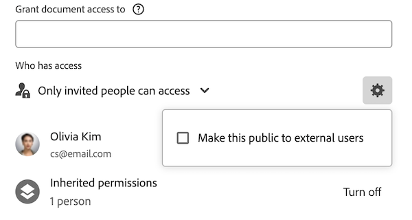

# Condividere un oggetto

<!--Audited: 01/2024-->

L’amministratore di Adobe Workfront consente agli utenti di visualizzare o modificare gli oggetti quando assegnano i livelli di accesso. Per ulteriori informazioni sulla concessione dell&#39;accesso agli oggetti, vedere [Creare o modificare livelli di accesso personalizzati](../../administration-and-setup/add-users/configure-and-grant-access/create-modify-access-levels.md).

Oltre al livello di accesso concesso agli utenti, è possibile concedere loro anche le autorizzazioni per visualizzare o modificare oggetti specifici creati o di cui si dispone dell&#39;accesso alla condivisione. Per ulteriori informazioni sui livelli di accesso e sulle autorizzazioni, consulta [Funzionamento congiunto dei livelli di accesso e delle autorizzazioni](../../administration-and-setup/add-users/access-levels-and-object-permissions/how-access-levels-permissions-work-together.md).

Le autorizzazioni sono specifiche per un elemento in Workfront e definiscono quali azioni è possibile eseguire su tale elemento.

Per informazioni sulla condivisione delle autorizzazioni sugli oggetti, consulta [Panoramica delle autorizzazioni di condivisione sugli oggetti](../../workfront-basics/grant-and-request-access-to-objects/sharing-permissions-on-objects-overview.md).

>[!NOTE]
>
>Un amministratore di Workfront può aggiungere o rimuovere autorizzazioni per qualsiasi elemento del sistema, per tutti gli utenti, senza esserne il proprietario.

Questo articolo descrive come condividere i seguenti oggetti:

* Progetti, attività, problemi
* Portfoli, programmi
* Documenti

Per informazioni su come condividere tutti gli altri oggetti in Workfront, vedere anche i seguenti articoli:

* Per i modelli, consulta [Condividere modelli di progetto](../../manage-work/projects/create-and-manage-templates/share-project-template.md).
* Per le bozze, consulta [Condividere una bozza in Workfront Proof](../../workfront-proof/wp-work-proofsfiles/share-proofs-and-files/share-proof.md).
* Per rapporti, dashboard e calendari, vedi i seguenti articoli:

   * [Condividere un rapporto in Adobe Workfront](../../reports-and-dashboards/reports/creating-and-managing-reports/share-report.md)
   * [Condividere un dashboard](../../reports-and-dashboards/dashboards/creating-and-managing-dashboards/share-dashboard.md)
   * [Condivisione di un report calendario](../../reports-and-dashboards/reports/calendars/share-a-calendar-report.md)

  Inoltre, vedi [Condividere report, dashboard e calendari](../../workfront-basics/grant-and-request-access-to-objects/permissions-reports-dashboards-calendars.md) per informazioni generali sulla condivisione di report, dashboard e calendari.

* Per filtri, viste e raggruppamenti, consulta [Condividere un filtro, una visualizzazione o un raggruppamento](../../reports-and-dashboards/reports/reporting-elements/share-filter-view-grouping.md).
* Per le cartelle di documenti, vedere [Condividere una cartella documenti](../../workfront-basics/grant-and-request-access-to-objects/share-a-document-folder.md).
* Per i piani, vedere [Condividere un piano nella Pianificazione scenario](../../scenario-planner/share-a-plan.md).

  È necessaria una licenza aggiuntiva.

* Per gli obiettivi, vedi [Condividere un obiettivo in Obiettivi di Workfront](../../workfront-goals/workfront-goals-settings/share-a-goal.md). È necessaria una licenza aggiuntiva.

## Requisiti di accesso

Per condividere gli oggetti, è necessario disporre dei seguenti elementi:

<table style="table-layout:auto"> 
 <col> 
 <col> 
 <tbody> 
  <tr> 
   <td role="rowheader">piano Adobe Workfront</td> 
   <td> 
Qualsiasi 
 </td> 
  </tr> 
  <tr> 
   <td role="rowheader">Licenza Adobe Workfront*</td> 
   <td> 
Nuova licenza: Standard
 
   Oppure
   
Licenza corrente: Lavoro o versione successiva

   </td> 
  </tr> 
  <tr> 
   <td role="rowheader">Configurazioni del livello di accesso</td> 
   <td> 
Accesso di visualizzazione o superiore agli oggetti da condividere
 </td> 
  </tr> 
  <tr> 
   <td role="rowheader">Autorizzazioni oggetto</td> 
   <td> 
Visualizzare le autorizzazioni o versioni successive per gli oggetti da condividere
</td> 
  </tr> 
 </tbody> 
</table>

*Per informazioni sulla pianificazione, il tipo di licenza o l&#39;accesso disponibili, contattare l&#39;amministratore Workfront. Per ulteriori informazioni, consulta [Requisiti di accesso nella documentazione di Workfront](/help/quicksilver/administration-and-setup/add-users/access-levels-and-object-permissions/access-level-requirements-in-documentation.md).

## Condivisione di un singolo oggetto {#share-a-single-object}

1. Passare all&#39;oggetto da condividere.

   Per informazioni sugli oggetti che possono essere condivisi, vedi [Panoramica delle autorizzazioni di condivisione sugli oggetti](../../workfront-basics/grant-and-request-access-to-objects/sharing-permissions-on-objects-overview.md).
1. Per progetti, attività e problemi:

   Fai clic su **Condividi** accanto al nome dell&#39;oggetto.

   

   Oppure

   Per documenti, portfolio e programmi:

   Fai clic su **Altro** icona accanto al nome dell&#39;oggetto, quindi fare clic su **Condivisione** o **Condividi.**

   

1. In **Concedi a &lt; Nome oggetto > l&#39;accesso a** (per documenti, portafogli e programmi), oppure **Concedere l’accesso a &lt; Nome oggetto >** (per progetti, attività e problemi) digitare il nome dell&#39;utente, del team, della mansione, del gruppo o della società con cui si desidera condividere l&#39;oggetto, quindi fare clic sul nome quando viene visualizzato nell&#39;elenco a discesa.

   Ad esempio, se condividi un progetto, utilizza **Concedi accesso al progetto a** campo.

   >[!TIP]
   >
   >Puoi condividere un oggetto solo con utenti attivi, team, ruoli o aziende.

   

   >[!TIP]
   >
   >Se disponi di più entità denominate in modo simile, tutte sono elencate nel relativo tipo. I nomi delle entità vengono visualizzati in ordine alfabetico. Tuttavia, l’ordine in cui vengono visualizzati i tipi di entità è casuale.
   >
   >
   >   >
   >

1. (Facoltativo) Ripetere il passaggio 3 per ogni utente, team, ruolo o gruppo a cui si desidera concedere l&#39;accesso all&#39;oggetto.

   <!--
   <MadCap:conditionalText data-mc-conditions="QuicksilverOrClassic.Draft mode">
   (NOTE: esnure this stays accurate; in the editor it looks like step 4 but one step is conditioned entirely for one version or another)
   </MadCap:conditionalText>
   -->

1. Specificare le autorizzazioni per ogni utente, team, ruolo, gruppo o società aggiunto al passaggio 3 facendo clic sul menu a discesa, quindi selezionando il livello di autorizzazione che si desidera concedere.

   Per rimuovere le autorizzazioni da un oggetto, consulta [Rimuovere le autorizzazioni dagli oggetti](/help/quicksilver/workfront-basics/grant-and-request-access-to-objects/remove-permissions-from-objects.md).

   Sono disponibili le seguenti opzioni:

   * **Visualizza:** Gli utenti possono rivedere e condividere l’elemento.
   * **Contribuisci**: gli utenti possono eseguire aggiornamenti, registrare informazioni, apportare modifiche minori e condividere, oltre a tutte le autorizzazioni di visualizzazione.

     >[!TIP]
     >
     >Potete concedere le autorizzazioni Contribute solo ai seguenti oggetti:
     >
     >   
     >   
     >   * Progetti
     >   * Attività
     >   * Problemi
     >   
     >

   * **Gestisci:** Gli utenti hanno accesso completo all’oggetto senza diritti amministrativi (concessi a livello di accesso). Inoltre, dispongono di tutte le autorizzazioni Visualizza e Contribuisci.

     >[!NOTE]
     >
     >L’amministratore di Workfront o il creatore di oggetti può rimuovere le autorizzazioni da queste entità.

     

1. (Facoltativo) Fai clic su **Opzioni avanzate** per configurare autorizzazioni specifiche per l&#39;oggetto.

   Le opzioni avanzate di Visualizza, Gestisci e Contribute variano a seconda dell&#39;oggetto selezionato.\
   Per ulteriori informazioni sui livelli di autorizzazione, consulta [Panoramica delle autorizzazioni di condivisione sugli oggetti](../../workfront-basics/grant-and-request-access-to-objects/sharing-permissions-on-objects-overview.md).

   

1. (Facoltativo) Per rendere questo oggetto disponibile a tutti gli utenti del sistema, fare clic sul pulsante **Ingranaggio** icona  , quindi nel menu a discesa fai clic su **Rendi visibile a livello di sistema**.

   Tutti gli utenti possono visualizzare l’oggetto in base alle autorizzazioni impostate.

1. (Facoltativo e condizionale) Quando condividi un progetto, fai clic sul pulsante **Ingranaggio** icona , quindi nel menu a discesa fai clic su **Imposta come modello di accesso al progetto** per impostare le autorizzazioni come modello.\
   Dopo aver definito le autorizzazioni per un progetto, queste vengono applicate automaticamente alla successiva creazione di un progetto da zero.

   >[!NOTE]
   >
   >Il modello di accesso al progetto sostituisce i valori predefiniti di condivisione concessi dall&#39;amministratore di Workfront nel proprio livello di accesso.\
   >Per ulteriori informazioni su come specificare i valori predefiniti di condivisione per i progetti nel Livello d&#39;Accesso, vedere [Concedere l’accesso ai progetti](../../administration-and-setup/add-users/configure-and-grant-access/grant-access-projects.md)

   <!--
   >this note also appears in Understanding Project Permissions-->

   Puoi specificare le autorizzazioni per i progetti che verranno creati da un modello quando condividi il modello. Per ulteriori informazioni, consulta [Condividere modelli di progetto](../../manage-work/projects/create-and-manage-templates/share-project-template.md).

1. (Facoltativo) Per rendere l&#39;oggetto pubblico, fare clic su **Rendi pubblico per gli utenti esterni**.

   >[!TIP]
   >
   >Questa opzione non è disponibile per tutti gli oggetti.

   

1. (Condizionale) Se l&#39;oggetto è stato reso pubblico a utenti esterni, fare clic su **copia collegamento**, quindi distribuisci il collegamento a utenti esterni.\
   Tutti gli utenti con il collegamento possono visualizzare l&#39;oggetto.

   >[!CAUTION]
   >
   >Si consiglia di usare cautela quando si condivide con utenti esterni un oggetto contenente informazioni riservate. Questo consente loro di visualizzare le informazioni senza essere utenti di Workfront o parte dell’organizzazione.

1. Fai clic su **Salva**.

## Condivisione di oggetti in blocco

Da un elenco di oggetti è possibile condividere più oggetti contemporaneamente con altri utenti, team, gruppi, mansioni o aziende.

>[!IMPORTANT]
>
>Quando si condividono gli oggetti in blocco, i nomi delle entità che dispongono delle autorizzazioni per i singoli oggetti non vengono visualizzati. Quando si condividono oggetti in blocco, le entità aggiunte all&#39;elenco di condivisione vengono aggiunte agli oggetti selezionati. Non eseguono l&#39;override delle entità associate ai singoli oggetti.

Per condividere oggetti in blocco:

1. Passare a un elenco di oggetti.
1. Selezionare due o più oggetti nell&#39;elenco.
1. Fai clic su **Condividi** icona .\
   Gli utenti che hanno già accesso all’oggetto non sono elencati come disponibili durante la condivisione in blocco.

   >[!NOTE]
   >
   >Se non si dispone delle autorizzazioni necessarie per condividere un oggetto selezionato, **Condividi** non è visibile.

1. In **Modifica accesso &lt; Nome oggetto > per** inizia a digitare il nome di un utente, team, gruppo, mansione o società a cui si desidera concedere le autorizzazioni.

   Ad esempio, se condividi un progetto, utilizza **Concedi l’accesso al progetto per** campo.

   

1. Continua a condividere gli oggetti selezionati come descritto nei passaggi 4-9 della sezione [Condivisione di un singolo oggetto](#share-a-single-object) in questo articolo.

   <!--
   <MadCap:conditionalText data-mc-conditions="QuicksilverOrClassic.Draft mode">
   (NOTE: ensure these steps stay accurate; always look at them in the viewer; because of condiitoning, the steps numbers in the editor are different!!!!!!*****)
   </MadCap:conditionalText>
   -->

1. Fai clic su **Salva**.
