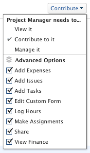

# Condividere le autorizzazioni finanziarie su un oggetto

{{highlighted-preview}}

Il tuo amministratore Adobe Workfront può concederti l’accesso per visualizzare o modificare dati finanziari durante l’assegnazione del livello di accesso. Per ulteriori informazioni, vedere [Concedere l&#39;accesso ai dati finanziari](../../administration-and-setup/add-users/configure-and-grant-access/grant-access-financial.md).

Oltre al livello di accesso concesso agli utenti, è possibile concedere loro le autorizzazioni per visualizzare o gestire dati finanziari per progetti, attività o problemi specifici per i quali si dispone dell&#39;accesso alla condivisione.

Per informazioni sulle operazioni che gli utenti di ogni livello di accesso possono eseguire con i dati finanziari, vedere la sezione [Dati finanziari](../../administration-and-setup/add-users/access-levels-and-object-permissions/functionality-available-for-each-object-type.md#financia) nell&#39;articolo [Funzionalità disponibile per ogni tipo di oggetto](../../administration-and-setup/add-users/access-levels-and-object-permissions/functionality-available-for-each-object-type.md).

## Requisiti di accesso

<!--drafted for P&P:

<table style="table-layout:auto"> 
 <col> 
 <col> 
 <tbody> 
  <tr> 
   <td role="rowheader">Adobe Workfront plan*</td> 
   <td> 
Any 
 </td> 
  </tr> 
  <tr> 
   <td role="rowheader">Adobe Workfront license*</td> 
   <td> 
Current license: Standard 
 
   Or
   
Legacy license: Plan 
</td> 
  </tr> 
  <tr> 
   <td role="rowheader">Access level configurations*</td> 
   <td> 
View or higher access to Projects, Tasks, Issues, and Financial&nbsp;Data
 
<b>NOTE</b>
   
   If you still don't have access, ask your Workfront administrator if they set additional restrictions in your access level. For information on how a Workfront administrator can modify your access level, see <a href="../../administration-and-setup/add-users/configure-and-grant-access/create-modify-access-levels.md" class="MCXref xref">Create or modify custom access levels</a>.
 </td> 
  </tr> 
  <tr> 
   <td role="rowheader">Object permissions</td> 
   <td> 
View permissions or higher to projects, tasks, and issues that include at least View Finance permissions
 
For information on requesting additional access, see <a href="../../workfront-basics/grant-and-request-access-to-objects/request-access.md" class="MCXref xref">Request access to objects </a>.
 </td> 
  </tr> 
 </tbody> 
</table>
-->
Per condividere informazioni finanziarie sugli oggetti, è necessario disporre dei seguenti elementi:

<table style="table-layout:auto"> 
 <col> 
 <col> 
 <tbody> 
  <tr> 
   <td role="rowheader">Piano Adobe Workfront*</td> 
   <td> 
Qualsiasi 
 </td> 
  </tr> 
  <tr> 
   <td role="rowheader">Licenza Adobe Workfront*</td> 
   <td> 
Piano 
 </td> 
  </tr> 
  <tr> 
   <td role="rowheader">Configurazioni del livello di accesso*</td> 
   <td> 
Accesso di visualizzazione o superiore a progetti, attività, problemi e dati finanziari
 
Nota: se non disponi ancora dell’accesso, chiedi all’amministratore di Workfront se ha impostato restrizioni aggiuntive nel tuo livello di accesso. Per informazioni su come un amministratore di Workfront può modificare il tuo livello di accesso, consulta <a href="../../administration-and-setup/add-users/configure-and-grant-access/create-modify-access-levels.md" class="MCXref xref">Creare o modificare livelli di accesso personalizzati</a>.
 </td> 
  </tr> 
  <tr> 
   <td role="rowheader">Autorizzazioni oggetto</td> 
   <td> 
Visualizza autorizzazioni o versioni successive per progetti, attività e problemi che includono almeno le autorizzazioni Visualizza informazioni finanziarie
 
Per informazioni sulla richiesta di accesso aggiuntivo, vedere <a href="../../workfront-basics/grant-and-request-access-to-objects/request-access.md" class="MCXref xref">Richiedere l'accesso agli oggetti </a>.
 </td> 
  </tr> 
 </tbody> 
</table>

&#42;Per conoscere il piano, il tipo di licenza o l&#39;accesso di cui si dispone, contattare l&#39;amministratore di Workfront.

## Condividere un oggetto e concedere autorizzazioni finanziarie

Quando si concedono autorizzazioni finanziarie agli oggetti, tenere presente quanto segue:

* Puoi concedere autorizzazioni finanziarie a progetti, attività, problemi, e schede di tariffa.
* Le autorizzazioni possono essere ereditate: se si dispone delle autorizzazioni Visualizza contabilità per un progetto, si ereditano automaticamente le autorizzazioni Visualizza contabilità per le attività e i problemi del progetto.

Per concedere autorizzazioni finanziarie a un oggetto:

1. Passare a un&#39;attività, un progetto o un problema che si desidera condividere con altri utenti.
1. Accanto al nome dell&#39;oggetto fare clic sul menu Altro , quindi su **Condivisione**.

1. Nel campo **Concedi a `<Object name>` l&#39;accesso a** inizia a digitare il nome di un utente, un team, una mansione, un gruppo o un&#39;azienda con cui desideri condividere l&#39;oggetto.

   >[!TIP]
   >
   >Puoi condividere un oggetto solo con utenti attivi, team, ruoli o aziende.

1. Se viene visualizzato un menu a discesa a destra del nome selezionato, fare clic su una delle opzioni disponibili:

   * **Visualizza**
   * **Contribute**
   * **Gestisci**

            

1. Nello stesso menu a discesa, fare clic su **Impostazioni avanzate**, quindi eseguire una delle operazioni seguenti:

   * Se hai selezionato una delle tre opzioni del passaggio precedente, assicurati che sia selezionato **Visualizza contabilità**.
   * Se hai selezionato **Gestisci contabilità** nel passaggio precedente, assicurati che sia selezionato **Gestisci contabilità**.

1. Fai clic su **Salva**.

## Autorizzazioni finanziarie per tutti i livelli di condivisione

Nella tabella seguente vengono visualizzate le autorizzazioni finanziarie ottenute dagli utenti quando si concedono loro le autorizzazioni Visualizza, Contribute o Gestisci sugli oggetti: 

<table style="table-layout:auto"> 
 <col> 
 <col> 
 <col> 
 <col> 
 <thead> 
  <tr> 
   <th><strong>Azioni</strong> </th> 
   <th><strong>Gestisci</strong> </th> 
   <th><strong>Contribute</strong> </th> 
   <th><strong>Visualizza</strong> </th> 
  </tr> 
 </thead> 
 <tbody> 
  <tr> 
   <td>Gestisci record fatturazione</td> 
   <td>✓</td> 
   <td> 
 
 </td> 
   <td> </td> 
  </tr> 
  <tr> 
   <td>Gestisci/Visualizza fatturazione mansione e tassi di costo</td> 
   <td>✓</td> 
   <td> </td> 
   <td> </td> 
  </tr> 
  <tr> 
   <td>Gestisci/Visualizza fatturazione utente e tassi di costo</td> 
   <td>✓</td> 
   <td> </td> 
   <td> </td> 
  </tr> 
  <tr> 
   <td>Visualizza dati finanziari</td> 
   <td>✓</td> 
   <td>✓</td> 
   <td> ✓</td> 
  </tr> 
  <tr> 
   <td>Gestire le schede delle tariffe</td> 
   <td>✓</td> 
   <td> 
 
 </td> 
   <td> </td> 
  </tr> 
  <tr> 
   <td>Visualizza schede di tariffa</td> 
   <td>✓</td> 
   <td>✓</td> 
   <td> ✓</td> 
  </tr>
  <tr> 
   <td>Visualizzare le informazioni per costo negli strumenti di pianificazione delle risorse</td> 
   <td>✓</td> 
   <td>✓</td> 
   <td>✓</td> 
  </tr> 
  <tr> 
   <td>Risorse preventivate negli strumenti di pianificazione delle risorse*</td> 
   <td>✓</td> 
   <td> </td> 
   <td> </td> 
  </tr> 
  <tr> 
   <td>Visualizzare le risorse negli strumenti di pianificazione delle risorse*</td> 
   <td>✓</td> 
   <td>✓</td> 
   <td> 
✓
 </td> 
  </tr> 
 </tbody> 
</table>

&#42;Richiede l&#39;accesso aggiuntivo a Gestione risorse.

Per informazioni sull&#39;accesso a Gestione risorse, vedere [Concedere l&#39;accesso a Gestione risorse](../../administration-and-setup/add-users/configure-and-grant-access/grant-access-resource-management.md).
