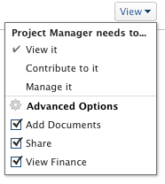

# Condividere le autorizzazioni finanziarie su un oggetto

Il tuo amministratore Adobe Workfront può concederti l’accesso per visualizzare o modificare i dati finanziari quando assegni il tuo livello di accesso. Per ulteriori informazioni, consulta [Concedere l’accesso ai dati finanziari](../../administration-and-setup/add-users/configure-and-grant-access/grant-access-financial.md).

Oltre al livello di accesso concesso agli utenti, puoi anche concedere loro le autorizzazioni per visualizzare o gestire le finanze per progetti, attività o problemi specifici a cui hai accesso per condividere.

Per informazioni sulle operazioni che gli utenti di ciascun livello di accesso possono eseguire con i dati finanziari, consulta la sezione . [Dati finanziari](../../administration-and-setup/add-users/access-levels-and-object-permissions/functionality-available-for-each-object-type.md#financia) nell&#39;articolo [Funzionalità disponibile per ciascun tipo di oggetto](../../administration-and-setup/add-users/access-levels-and-object-permissions/functionality-available-for-each-object-type.md).

## Requisiti di accesso

<!--drafted for P&P:

<table style="table-layout:auto"> 
 <col> 
 <col> 
 <tbody> 
  <tr> 
   <td role="rowheader">Adobe Workfront plan*</td> 
   <td> 
Any 
 </td> 
  </tr> 
  <tr> 
   <td role="rowheader">Adobe Workfront license*</td> 
   <td> 
Current license: Standard 
 
   Or
   
Legacy license: Plan 
</td> 
  </tr> 
  <tr> 
   <td role="rowheader">Access level configurations*</td> 
   <td> 
View or higher access to Projects, Tasks, Issues, and Financial&nbsp;Data
 
<b>NOTE</b>
   
   If you still don't have access, ask your Workfront administrator if they set additional restrictions in your access level. For information on how a Workfront administrator can modify your access level, see <a href="../../administration-and-setup/add-users/configure-and-grant-access/create-modify-access-levels.md" class="MCXref xref">Create or modify custom access levels</a>.
 </td> 
  </tr> 
  <tr> 
   <td role="rowheader">Object permissions</td> 
   <td> 
View permissions or higher to projects, tasks, and issues that include at least View Finance permissions
 
For information on requesting additional access, see <a href="../../workfront-basics/grant-and-request-access-to-objects/request-access.md" class="MCXref xref">Request access to objects </a>.
 </td> 
  </tr> 
 </tbody> 
</table>
-->
Per condividere informazioni sui dati finanziari relativi agli oggetti è necessario disporre dei seguenti elementi:

<table style="table-layout:auto"> 
 <col> 
 <col> 
 <tbody> 
  <tr> 
   <td role="rowheader">piano Adobe Workfront*</td> 
   <td> 
Qualsiasi 
 </td> 
  </tr> 
  <tr> 
   <td role="rowheader">Licenza Adobe Workfront*</td> 
   <td> 
Piano 
 </td> 
  </tr> 
  <tr> 
   <td role="rowheader">Configurazioni a livello di accesso*</td> 
   <td> 
Accesso a progetti, attività, problemi e dati finanziari
 
Nota: Se non disponi ancora dell’accesso, chiedi all’amministratore Workfront se ha impostato ulteriori restrizioni nel livello di accesso. Per informazioni su come un amministratore Workfront può modificare il livello di accesso, consulta <a href="../../administration-and-setup/add-users/configure-and-grant-access/create-modify-access-levels.md" class="MCXref xref">Creare o modificare livelli di accesso personalizzati</a>.
 </td> 
  </tr> 
  <tr> 
   <td role="rowheader">Autorizzazioni oggetto</td> 
   <td> 
Visualizza autorizzazioni o versioni successive a progetti, attività e problemi che includono almeno Visualizza autorizzazioni di finanziamento
 
Per informazioni sulla richiesta di accesso aggiuntivo, vedi <a href="../../workfront-basics/grant-and-request-access-to-objects/request-access.md" class="MCXref xref">Richiedere l’accesso agli oggetti </a>.
 </td> 
  </tr> 
 </tbody> 
</table>

&#42;Per informazioni sul piano, il tipo di licenza o l&#39;accesso, contattare l&#39;amministratore Workfront.

## Condividere un oggetto e concedere autorizzazioni finanziarie

Quando si concedono autorizzazioni finanziarie agli oggetti, tenere presente quanto segue:

* È possibile concedere autorizzazioni finanziarie a progetti, attività e problemi.
* Le autorizzazioni possono essere ereditate: se si dispone delle autorizzazioni di tipo View Finance per un progetto, le autorizzazioni di tipo View Finance vengono automaticamente ereditate alle attività e ai problemi del progetto.

Per concedere autorizzazioni finanziarie a un oggetto:

1. Passa a un&#39;attività, un progetto o un problema che desideri condividere con altri.
1. Fare clic sul menu Altro accanto al nome dell’oggetto , quindi fai clic su **Condivisione**.

1. In **Dare `<Object name>` accesso** inizia a digitare il nome di un utente, team, ruolo, gruppo o società con cui si desidera condividere l’oggetto.

   >[!TIP]
   >
   >È possibile condividere un oggetto solo con utenti attivi, team, ruoli o aziende.

1. Se a destra del nome selezionato viene visualizzato un menu a discesa, fare clic su una delle seguenti opzioni disponibili:

   * **Visualizzare**
   * **Contribuire**
   * **Gestire**

             

1. Nello stesso menu a discesa, fai clic su **Impostazioni avanzate**, quindi effettua una delle seguenti operazioni:

   * Se hai selezionato una delle tre opzioni del passaggio precedente, assicurati di **Visualizza contabilità** è selezionato.
   * Se hai selezionato **Gestire i finanziamenti** nel passaggio precedente, assicurati **Gestire i finanziamenti** è selezionato.

1. Fai clic su **Salva**.

## Autorizzazione finanziaria per tutti i livelli di condivisione

Nella tabella seguente vengono visualizzate le autorizzazioni finanziarie ottenute dagli utenti quando si concedono loro le autorizzazioni Visualizza, Contribuisci o Gestisci per gli oggetti: 

<table style="table-layout:auto"> 
 <col> 
 <col> 
 <col> 
 <col> 
 <thead> 
  <tr> 
   <th><strong>Azioni</strong> </th> 
   <th><strong>Gestisci</strong> </th> 
   <th><strong>contribuire</strong> </th> 
   <th><strong>Visualizza</strong> </th> 
  </tr> 
 </thead> 
 <tbody> 
  <tr> 
   <td>Gestire i record di fatturazione</td> 
   <td>✓</td> 
   <td> 
 
 </td> 
   <td> </td> 
  </tr> 
  <tr> 
   <td>Gestisci/visualizza fatturazione ruolo e tassi di costo</td> 
   <td>✓</td> 
   <td> </td> 
   <td> </td> 
  </tr> 
  <tr> 
   <td>Gestisci/visualizza fatturazione utente e tassi di costo</td> 
   <td>✓</td> 
   <td> </td> 
   <td> </td> 
  </tr> 
  <tr> 
   <td>Visualizza dati finanziari</td> 
   <td>✓</td> 
   <td>✓</td> 
   <td> ✓</td> 
  </tr> 
  <tr> 
   <td>Visualizzare le informazioni in base al costo negli strumenti di pianificazione delle risorse</td> 
   <td>✓</td> 
   <td>✓</td> 
   <td>✓</td> 
  </tr> 
  <tr> 
   <td>Risorse di budget negli strumenti di pianificazione delle risorse*</td> 
   <td>✓</td> 
   <td> </td> 
   <td> </td> 
  </tr> 
  <tr> 
   <td>Visualizzare le risorse negli strumenti di pianificazione delle risorse*</td> 
   <td>✓</td> 
   <td>✓</td> 
   <td> 
✓
 </td> 
  </tr> 
 </tbody> 
</table>

&#42;Richiede un accesso aggiuntivo a Gestione risorse.

Per informazioni sull&#39;accesso a Gestione risorse, vedi [Concedere l’accesso a Gestione risorse](../../administration-and-setup/add-users/configure-and-grant-access/grant-access-resource-management.md).
