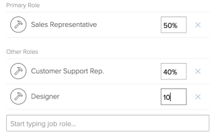

# Configurare le impostazioni personali

<!--

Edit the job role FTE percentage allocation blurbs when more functionality is released: now, it says that the % is that of the user's schedule, but it will be either the user's schedule or the system schedule.

-->

Le [!DNL Adobe Workfront] Il profilo contiene informazioni su di te (ad esempio nome, indirizzo e-mail, indirizzo, numero di telefono, titolo, ecc.). Contiene inoltre informazioni sulle interazioni con [!DNL Workfront] e altri utenti della tua azienda (ad esempio, le impostazioni delle notifiche, le schede in cui desideri visualizzare [!DNL Workfront], o il tuo ruolo, il tuo manager e le iscrizioni al gruppo e al team).

La maggior parte di queste informazioni è già stata impostata dal tuo [!DNL Workfront] amministratore quando [!DNL Workfront] account creato.

A seconda del livello di accesso in [!DNL Workfront], è possibile modificare alcune di queste informazioni configurando il [!UICONTROL Impostazioni personali] area.

## Effetti dei livelli di accesso sulla modifica [!UICONTROL Impostazioni personali] area

A seconda del livello di accesso, è possibile che non sia possibile modificare le sezioni nel [!UICONTROL Impostazioni personali] area.

Alcuni campi contenuti nelle sezioni modificabili non possono essere modificati, a seconda di altre impostazioni che potrebbero essere configurate nel livello di accesso. Per ulteriori informazioni sull’accesso aggiuntivo necessario per modificare alcuni dei campi disponibili in [!UICONTROL Impostazioni personali], vedi le sezioni in [Configurazione della [!UICONTROL Impostazioni personali] area](#configuring-the-my-settings-area).

Per sapere quale livello di accesso hai, contatta il tuo [!DNL Workfront] amministratore.

La griglia seguente mostra quali sezioni del [!UICONTROL Impostazioni personali] l’area è visibile o modificabile a seconda del livello di accesso:

<table style="table-layout:auto"> 
 <col> 
 <col> 
 <col> 
 <col> 
 <col> 
 <col> 
 <col> 
 <thead> 
  <tr> 
   <th><strong>Aree [!UICONTROL My Settings]</strong> </th> 
   <th><strong>Visibile o modificabile</strong> </th> 
   <th><strong>[!UICONTROL System Administrator]</strong> </th> 
   <th><strong>[!UICONTROL Planner]</strong> </th> 
   <th><strong>[!UICONTROL Worker]</strong> </th> 
   <th><strong>[!UICONTROL Reviewer]</strong> </th> 
   <th><strong>[!UICONTROL Requestor]</strong> </th> 
  </tr> 
 </thead> 
 <tbody> 
  <tr> 
   <td rowspan="2">[!UICONTROL Informazioni personali]</td> 
   <td> 
Visibile
 </td> 
   <td> 
↓
 </td> 
   <td> ✔</td> 
   <td>✔ </td> 
   <td>✔ </td> 
   <td> ✔</td> 
  </tr> 
  <tr> 
   <td> 
Modificabile
 </td> 
   <td> 
✔
 </td> 
   <td> ✔</td> 
   <td> ✔</td> 
   <td>✔ </td> 
   <td>✔ </td> 
  </tr> 
  <tr> 
   <td rowspan="2">[!UICONTROL Preferences]</td> 
   <td> 
Visibile
 </td> 
   <td> 
✔
 </td> 
   <td> ✔</td> 
   <td>✔ </td> 
   <td>✔ </td> 
   <td>✔ </td> 
  </tr> 
  <tr> 
   <td> 
Modificabile
 </td> 
   <td> 
✔
 </td> 
   <td>✔ </td> 
   <td>✔ </td> 
   <td>✔ </td> 
   <td>✔ </td> 
  </tr> 
  <tr> 
   <td rowspan="2">Notifiche di [!UICONTROL]</td> 
   <td> 
Visibile
 </td> 
   <td> 
✔
 </td> 
   <td>✔ </td> 
   <td>✔ </td> 
   <td> ✔</td> 
   <td>✔ </td> 
  </tr> 
  <tr> 
   <td> 
Modificabile
 </td> 
   <td> 
✔
 </td> 
   <td>✔ </td> 
   <td>✔ </td> 
   <td> ✔</td> 
   <td> ✔</td> 
  </tr> 
  <tr> 
   <td rowspan="2">[!UICONTROL Access]</td> 
   <td>Visibile</td> 
   <td> ✔</td> 
   <td>✔ </td> 
   <td> </td> 
   <td> </td> 
   <td> </td> 
  </tr> 
  <tr> 
   <td>Modificabile</td> 
   <td> ✔</td> 
   <td> </td> 
   <td> </td> 
   <td> </td> 
   <td> </td> 
  </tr> 
  <tr> 
   <td rowspan="2">[!UICONTROL Organization]</td> 
   <td>Visibile</td> 
   <td>✔</td> 
   <td>✔ </td> 
   <td> </td> 
   <td> </td> 
   <td> </td> 
  </tr> 
  <tr> 
   <td>Modificabile</td> 
   <td>✔</td> 
   <td>✔ </td> 
   <td> </td> 
   <td> </td> 
   <td> </td> 
  </tr> 
  <tr> 
   <td rowspan="2">[!UICONTROL Resource Planning]</td> 
   <td>Visibile</td> 
   <td>✔</td> 
   <td>✔ </td> 
   <td> </td> 
   <td> </td> 
   <td> </td> 
  </tr> 
  <tr> 
   <td>Modificabile</td> 
   <td>✔</td> 
   <td>✔ </td> 
   <td> </td> 
   <td> </td> 
   <td> </td> 
  </tr> 
  <tr> 
   <td rowspan="2">[!UICONTROL Custom Forms]</td> 
   <td>Visibile</td> 
   <td>✔</td> 
   <td>✔ </td> 
   <td>✔</td> 
   <td>✔ </td> 
   <td>✔ </td> 
  </tr> 
  <tr> 
   <td>Modificabile</td> 
   <td>✔ </td> 
   <td>✔ </td> 
   <td> </td> 
   <td> </td> 
   <td> </td> 
  </tr> 
  <tr> 
   <td rowspan="2">[!UICONTROL Commento]</td> 
   <td>Visibile</td> 
   <td>✔</td> 
   <td>✔ </td> 
   <td>✔ </td> 
   <td>✔ </td> 
   <td>✔ </td> 
  </tr> 
  <tr> 
   <td>Modificabile</td> 
   <td>✔ </td> 
   <td>✔ </td> 
   <td>✔ </td> 
   <td>✔ </td> 
   <td>✔ </td> 
  </tr> 
 </tbody> 
</table>

## Configurazione della [!UICONTROL Impostazioni personali] area

1. Fai clic sul pulsante **[!UICONTROL Menu principale]** icona  nell&#39;angolo superiore destro di [!DNL Adobe Workfront], quindi fai clic sul nome utente accanto all’immagine del profilo.

1. Fai clic sul pulsante **[!UICONTROL Altro]** menu , quindi fai clic su **[!UICONTROL Modifica]**.

1. A seconda del livello di accesso, puoi aggiornare le sezioni seguenti:

   * [Informazioni personali](#personal-info)
   * [Preferenze](#preferences)
   * [Notifiche](#notifications)
   * [Accesso](#access)
   * [Organizzazione](#organization)
   * [Pianificazione risorse](#resource-planning)
   * [Modulo personalizzato](#custom-form)
   * [Commento](#comment)

1. Fai clic su **[!UICONTROL Salva]**.

### [!UICONTROL Informazioni personali]

Questa sezione include le seguenti sottosezioni:

* [Informazioni di base](#basic-info)
* [Informazioni sul processo](#job-info)
* [Informazioni di contatto](#contact-info)

#### [!UICONTROL Informazioni di base]

Queste informazioni devono già essere configurate dal tuo [!DNL Workfront] amministratore. Tutti i campi di questa sottosezione sono campi obbligatori.

In questa sottosezione puoi modificare uno dei seguenti elementi:

<table style="table-layout:auto"> 
 <col> 
 <col> 
 <tbody> 
  <tr> 
   <td role="rowheader"><strong>[!UICONTROL Nome]</strong></td> 
   <td>Aggiorna il tuo nome. Questo è un campo obbligatorio.</td> 
  </tr> 
  <tr> 
   <td role="rowheader"><strong>[!UICONTROL Cognome]</strong></td> 
   <td>Aggiorna il cognome. Questo è un campo obbligatorio.</td> 
  </tr> 
  <tr> 
   <td role="rowheader"><strong>[!UICONTROL Email Address]</strong></td> 
   <td> Aggiorna il tuo indirizzo e-mail. Questo campo è obbligatorio. Tieni presente che il tuo indirizzo e-mail è anche il tuo nome utente per [!DNL Workfront].</td> 
  </tr> 
  <tr> 
   <td role="rowheader"><strong>[!UICONTROL Reimposta password]</strong></td> 
   <td>Reimposta la password in questa sezione. Per ulteriori informazioni sul ripristino della password, consulta <a href="../../../workfront-basics/manage-your-account-and-profile/managing-your-workfront-account/reset-your-password.md" class="MCXref xref">Ripristino della password</a>.</td> 
  </tr> 
  <tr> 
   <td role="rowheader"><strong>(Condizionale) &lt;sso configuration=""&gt; [!UICONTROL Username]</strong></td> 
   <td> Se [!DNL Workfront] l'amministratore ha abilitato un'integrazione SSO con [!DNL Workfront], il nome utente SSO viene visualizzato in questo campo. Il tipo di configurazione SSO abilitato per la [!DNL Workfront] L’istanza è visibile in questo campo.</td> 
  </tr> 
  <tr> 
   <td role="rowheader"><strong>(Condizionale) [!UICONTROL Consenti solo &lt;sso configuration=""&gt; Autenticazione]</strong></td> 
   <td> 
 Se [!DNL Workfront] l'amministratore ha abilitato un'integrazione SSO con [!DNL Workfront] e ha aggiornato gli utenti per SSO, questo campo è selezionato per impostazione predefinita. Il tipo di configurazione SSO abilitato per la [!DNL Workfront] L’istanza è visibile in questo campo.
 
Quando questo campo è selezionato, è necessario accedere a [!DNL Workfront] con le tue credenziali SSO. Deselezionando questa opzione, potrai accedere a [!DNL Workfront] con il tuo [!DNL Workfront] credenziali.
 
Per ulteriori informazioni sulla configurazione [!DNL Workfront] con una soluzione SSO, vedi <a href="../../../administration-and-setup/add-users/single-sign-on/single-sign-on.md" class="MCXref xref">Accesso singolo [!DNL Adobe Workfront]</a>. Per ulteriori informazioni sull'aggiornamento degli utenti per SSO, vedi <a href="../../../administration-and-setup/add-users/single-sign-on/update-users-sso.md" class="MCXref xref">Aggiornare gli utenti per il single sign-on</a>.
 </td> 
  </tr> 
 </tbody> 
</table>

#### [!UICONTROL Informazioni sul processo]

In questa sottosezione puoi modificare uno dei seguenti elementi:

<table style="table-layout:auto">
    <tr>
        <td><strong>[!UICONTROL Title]</strong></td>
        <td>Specifica il titolo. Questo non è lo stesso del tuo ruolo. Il titolo non fa parte della pianificazione delle risorse, mentre il ruolo del lavoro è . Il titolo viene visualizzato nella sezione [!DNL Workfront] interfaccia ovunque il tuo nome e la visualizzazione del tuo avatar. È visibile a tutti coloro che hanno accesso per vedere il tuo utente.</td>
    </tr>
    <tr>
        <td><strong>[!UICONTROL Parla con me di</strong></td>
        <td>Specifica i tuoi interessi professionali in questo campo.</td>
    </tr>
</table>

#### [!UICONTROL Informazioni di contatto]

In questa sottosezione puoi modificare uno dei seguenti elementi:

<table style="table-layout:auto">
    <tr>
        <td><strong>[!UICONTROL Numero di telefono]</strong></td>
        <td> </td>
    </tr>
    <tr>
        <td><strong>[!UICONTROL Extension]</strong></td>
        <td> </td>
    </tr>
    <tr>
        <td><strong>[!UICONTROL Mobile Number]</strong></td>
        <td> </td>
    </tr>
    <tr>
        <td><strong>[!UICONTROL Address]</strong></td>
        <td> </td>
    </tr>
    <tr>
        <td><strong>[!UICONTROL City]</strong></td>
        <td> </td>
    </tr>
    <tr>
        <td><strong>[!UICONTROL State]</strong></td>
        <td> </td>
    </tr>
    <tr>
        <td><strong>[!UICONTROL Postal Code]</strong></td>
        <td> </td>
    </tr>
    <tr>
        <td><strong>[!UICONTROL Country]</strong></td>
        <td> </td>
    </tr>
    <tr>
        <td><strong>[!UICONTROL Profilo Immagine]</strong></td>
        <td>La tua immagine del profilo diventa il tuo avatar ed è visibile in tutto il mondo [!DNL Workfront] , ovunque sia visualizzato il tuo nome.</td>
    </tr>
</table>

### [!UICONTROL Preferenze]

Specifica cosa visualizzare nel [!DNL Workfront] in questa sezione.

>[!NOTE]
>
>Utenti con un [!UICONTROL Richiedente] la licenza non dispone di altri elementi del pannello sinistro da aggiungere al proprio [!UICONTROL Menu principale], al di fuori del [!UICONTROL Richieste] area. Come [!DNL Workfront] amministratore, puoi assegnare agli utenti una licenza Richiedente a un modello di layout che include tutte le altre aree nel [!UICONTROL Menu principale]. Dopo di che, possono selezionare le aree da visualizzare nella [!UICONTROL Menu principale] modificando il profilo utente.

In questa sottosezione puoi modificare uno dei seguenti elementi:

<table style="table-layout:auto"> 
 <col> 
 <col> 
 <tbody>
  <tr> 
   <td role="rowheader"><strong>[!UICONTROL Time Zone]</strong> </td> 
   <td>
Specifica il tuo fuso orario. Questo controlla il tempo visualizzato nei messaggi e-mail in uscita.

       
Il fuso orario influisce anche su ciò che viene visualizzato in un rapporto del calendario PTO.
</td>
  </tr> 
  <tr> 
   <td role="rowheader"><strong>[!UICONTROL Impostazioni internazionali e-mail]</strong> </td> 
   <td>Specifica la tua lingua preferita qui. Controlla la lingua, la data e il formato del numero utilizzati nei messaggi e-mail in uscita.</td> 
  </tr> 
  <tr> 
   <td role="rowheader"><strong>[!UICONTROL Mostra percentuale completa allo stato dell'aggiornamento]</strong> </td> 
   <td>Selezionare questa casella di controllo per visualizzare una barra della percentuale nel campo [!UICONTROL update status] delle attività, in modo da poter aggiornare la percentuale di completamento di un'attività durante l'immissione di un aggiornamento delle attività.</td> 
  </tr> 
  <tr> 
   <td role="rowheader"><strong>[!UICONTROL Invia lavoro assegnato a me stesso nella scheda Lavorare su]</strong> </td> 
   <td>Selezionare questo campo per visualizzare il lavoro che si sta assegnando direttamente nella scheda [!UICONTROL Working On] anziché nella scheda [!UICONTROL Work Requests].</td> 
  </tr> 
  <tr> 
   <td role="rowheader"><strong>(Condizionale) Genera automaticamente bozze durante il caricamento dei documenti</strong></td> 
   <td>Selezionare questo campo per iniziare a generare una bozza immediatamente dopo il caricamento del documento in [!DNL Workfront]. Questo campo è disattivato per impostazione predefinita e può essere aggiornato solo da un amministratore Workfront. Questo campo è disponibile solo se l’azienda ha acquistato il componente Workfront Proof per Workfront e se sei abilitato come utente di prova. Per ulteriori informazioni sulla bozza di Workfront, consulta <a href="../../../review-and-approve-work/proofing/managing-proofs-within-workfront/manage-proofs-in-wf.md" class="MCXref xref">Gestione delle bozze in Adobe Workfront</a>.
   
<b>Nota:</b> I documenti caricati su una richiesta non generano automaticamente una bozza. 
</td> 
  </tr> 
 </tbody> 
</table>

### [!UICONTROL Notifiche]

Specificare le notifiche da cui si desidera ricevere [!DNL Workfront]. Per ulteriori informazioni sulla configurazione delle notifiche, vedi [Attivare o disattivare le notifiche degli eventi personali](../../../workfront-basics/using-notifications/activate-or-deactivate-your-own-event-notifications.md).

### [!UICONTROL Accesso]

Il tuo accesso e gli altri componenti associati ad esso sono configurati dal tuo [!DNL Workfront] amministratore, quando il tuo account è configurato.

Solo un [!DNL Workfront] l’amministratore può visualizzare e modificare tutti i campi in questa sezione.

In questa sottosezione puoi modificare uno dei seguenti elementi:

<table style="table-layout:auto"> 
 <col> 
 <col> 
 <tbody> 
  <tr> 
   <td role="rowheader"><strong>[!UICONTROL È Attivo]</strong> </td> 
   <td>Questo campo è visibile solo per un utente che è anche un [!DNL Workfront] amministratore e deve essere selezionato per impostazione predefinita. Ciò significa che l’utente è attivo e può accedere a [!DNL Workfront]</td> 
  </tr> 
  <tr> 
   <td role="rowheader"><strong>[!UICONTROL Livello Di Accesso]</strong> </td> 
   <td>Questo campo è visibile agli utenti con un livello di accesso [!UICONTROL Plan] o [!UICONTROL Workfront Administrator] ed è modificabile solo per [!DNL Workfront] amministratori. Se sei un [!DNL Workfront] amministratore, fai attenzione a non modificare il livello di accesso in modo che sia inferiore a un valore quando modifichi questo campo. </td> 
  </tr> 
  <tr> 
   <td role="rowheader"><strong>[!UICONTROL Layout Template]</strong> </td> 
   <td>Questo campo è visibile agli utenti con un piano o un piano [!DNL Workfront] livello di accesso amministratore] ed è modificabile solo per [!UICONTROL [!DNL Workfront] amministratori] o utenti con una licenza [!UICONTROL Plan] che dispongono anche dell’accesso utente amministrativo. Selezionare un modello di layout qui, per aggiornare l'aspetto e il campo dell'interfaccia Workfront. Per ulteriori informazioni sulla configurazione degli utenti con accesso amministrativo agli utenti, consulta <a href="../../../administration-and-setup/add-users/configure-and-grant-access/grant-access-other-users.md#access-to-edit" class="MCXref xref">Configurare l’accesso degli utenti per modificare gli utenti utilizzando un livello di accesso personalizzato</a> in <a href="../../../administration-and-setup/add-users/configure-and-grant-access/grant-access-other-users.md" class="MCXref xref">Concedere l’accesso agli utenti</a>. Per ulteriori informazioni sui modelli di layout e su come influiscono sull’interfaccia, consulta <a href="../../../administration-and-setup/customize-workfront/use-layout-templates/create-and-manage-layout-templates.md" class="MCXref xref">Creare e gestire modelli di layout</a></td> 
  </tr> <!--
   <tr data-mc-conditions="QuicksilverOrClassic.Draft mode"> 
    <td role="rowheader"><strong>Log in as</strong> </td> 
    <td> 
<strong>Add access</strong> for a Workfront administrator or group administrator (associated with a group you are in) to log in as you. Select an <strong>Access expiration date</strong> for the login. 
 
You can repeat this to grant login access to multiple administrators.
 
The settings you choose in this section are visible only to you.
       <MadCap:conditionalText data-mc-conditions="QuicksilverOrClassic.Draft mode"> 
        Add a note about this being only for the Enterprise package if they decide to do it that way. Functionality that may come in a later sprint: If you want to be notified when the administrator logs in as you, select Receive an email when this user logs in. 
       </MadCap:conditionalText>
      
 </td> 
   </tr>
  --> 
  <tr> 
   <td role="rowheader"><strong>(Condizionale) [!UICONTROL L Utente può generare bozze (... su ... licenze a prova di mano)]</strong></td> 
   <td>Questo campo è disponibile solo se l’azienda utilizza una versione precedente di [!DNL Workfront] pianifica e ha acquistato [!DNL Workfront Proof] componente. Quando è selezionato, è attivato come utente di correzione. Mostra anche il numero di licenze di prova utilizzate nel sistema rispetto al numero totale di licenze di prova acquistate. Questo campo è visibile e modificabile solo per gli utenti che [!DNL Workfront] amministratori. Per ulteriori informazioni sulle opzioni del piano per la correzione in [!DNL Workfront], vedi <a href="/help/quicksilver/administration-and-setup/manage-workfront/configure-proofing/access-to-proofing-functionality.md">Accesso alla funzionalità di correzione in [!DNL Workfront]</a>.</td>
  </tr> 
  <tr> 
   <td role="rowheader"><strong>(Condizionale) [!UICONTROL Permission Profile]</strong></td> 
   <td> 
In questo campo viene visualizzato il livello di accesso disponibile [!DNL Workfront Proof]. È disponibile solo se:
 
    <ul> 
     <li>La tua azienda utilizza una versione precedente di [!DNL Workfront] pianifica e ha acquistato [!DNL Workfront Proof] o disponi di una licenza [!UICONTROL Work] o [!UICONTROL Plan] su una versione più recente [!DNL Workfront] piano.</li> 
     <li>Sei abilitato come utente di prova.</li> 
    </ul> 
[!DNL Workfront] gli amministratori possono modificare il campo per tutti gli utenti tranne se stessi, in modo che tutti gli utenti vedano il campo come di sola visualizzazione sul proprio profilo. Per ulteriori informazioni sul profilo delle autorizzazioni, consulta <a href="../../../review-and-approve-work/proofing/proofing-overview/permission-profiles.md" class="MCXref xref">Panoramica del profilo di autorizzazione della bozza</a>.
 </td> 
  </tr> 
 </tbody> 
</table>

### [!UICONTROL Organizzazione]

Queste informazioni sono in genere configurate dal tuo [!DNL Workfront] quando creano il [!DNL Workfront] conto. In questa sezione è inoltre possibile aggiornare le informazioni sulla struttura dell&#39;organizzazione o dell&#39;organizzazione. Solo gli utenti con un [!UICONTROL Pianificare] o [!UICONTROL Amministratore di sistema] livello di accesso può modificare questa sezione. 

In questa sottosezione puoi modificare uno dei seguenti elementi:

<table style="table-layout:auto"> 
 <col> 
 <col> 
 <tbody> 
  <tr> 
   <td role="rowheader"><strong>[!UICONTROL Company]</strong></td> 
   <td>Seleziona il nome della società a cui appartieni dall’elenco a discesa.</td> 
  </tr> 
  <tr> 
   <td role="rowheader"><strong>(Condizionale) [!UICONTROL Report a]</strong></td> 
   <td>Dopo aver selezionato un <strong>[!UICONTROL Company]</strong> per il tuo profilo, puoi anche specificare il nome del tuo responsabile in questo campo. Puoi specificare un solo nome qui e ti consigliamo di specificarlo. Iniziare a digitare il proprio nome e fare clic per selezionarlo quando viene visualizzato nell'elenco.</td> 
  </tr> 
  <tr> 
   <td role="rowheader"><strong>(Condizionale) Rapporti diretti di [!UICONTROL]</strong></td> 
   <td>Dopo aver selezionato un <strong>[!UICONTROL Company]</strong> per il profilo, puoi anche specificare il nome dei rapporti diretti in questo campo. Puoi specificare il numero di rapporti diretti necessario qui. Iniziare a digitare i loro nomi e fare clic per selezionarli quando vengono visualizzati nell'elenco.</td> 
  </tr> 
  <tr> 
   <td role="rowheader"><strong>[!UICONTROL Home Team]</strong> </td> 
   <td> 
Seleziona una <strong>[!UICONTROL Home Team]</strong> dal menu a discesa. Questo campo è visibile agli utenti con un livello di accesso [!UICONTROL Plan] o [!UICONTROL System Administrator] ed è modificabile solo per [!DNL Workfront] amministratori o utenti con una licenza [!UICONTROL Plan] che dispongono anche dell’accesso per gli utenti amministrativi. Per ulteriori informazioni sulla configurazione degli utenti con accesso amministrativo agli utenti, consulta <a href="../../../administration-and-setup/add-users/configure-and-grant-access/grant-access-other-users.md#access-to-edit" class="MCXref xref">Configurare l’accesso degli utenti per modificare gli utenti utilizzando un livello di accesso personalizzato</a> in <a href="../../../administration-and-setup/add-users/configure-and-grant-access/grant-access-other-users.md" class="MCXref xref">Concedere l’accesso agli utenti</a>. 
 
Le <strong>Team principale</strong> può influenzare l'aspetto e il comportamento del tuo [!DNL Workfront] , se un modello di layout è associato al team. 
 
  Per ulteriori informazioni sui team, vedi <a href="../../../people-teams-and-groups/create-and-manage-teams/teams-overview.md" class="MCXref xref">Panoramica sui team</a>.
 </td> 
  </tr> 
  <tr> 
   <td role="rowheader"><strong>[!UICONTROL Altri team]</strong> </td> 
   <td> 
Puoi appartenere a più di una squadra. Specifica i team aggiuntivi a cui appartieni in questo campo iniziando a digitare il nome di un team, quindi fai clic su per selezionarlo quando viene visualizzato nell’elenco. L’appartenenza a troppi team può creare confusione sul lavoro assegnato ai team. Per ulteriori informazioni sui team, vedi <a href="../../../people-teams-and-groups/create-and-manage-teams/teams-overview.md" class="MCXref xref">Panoramica sui team</a>.
 
Questo campo è visibile agli utenti con una licenza [!UICONTROL Plan] o [!UICONTROL System Administrator] ed è modificabile solo per [!DNL Workfront] amministratori o utenti con una licenza [!UICONTROL Plan] che dispongono anche dell’accesso per gli utenti amministrativi. Per ulteriori informazioni sulla configurazione degli utenti con accesso amministrativo agli utenti, consulta <a href="../../../administration-and-setup/add-users/configure-and-grant-access/grant-access-other-users.md#access-to-edit" class="MCXref xref">Configurare l’accesso degli utenti per modificare gli utenti utilizzando un livello di accesso personalizzato</a> in <a href="../../../administration-and-setup/add-users/configure-and-grant-access/grant-access-other-users.md" class="MCXref xref">Concedere l’accesso agli utenti</a>.
 </td> 
  </tr> 
  <tr> 
   <td role="rowheader"><strong>[!UICONTROL Home Group]</strong> </td> 
   <td> 
Seleziona una <strong>[!UICONTROL Home Group]</strong> dal menu a discesa.
 
Nota: Questo campo è obbligatorio. Non è possibile associare un utente a un gruppo. 
 
Questo campo è visibile agli utenti con un livello [!UICONTROL Plan] o [!UICONTROL System Administrator]. Per ulteriori informazioni su chi può modificare la <strong>[!UICONTROL Home Group]</strong> campo , vedi <a href="../../../administration-and-setup/add-users/create-and-manage-users/add-users.md#prerequisites" class="MCXref xref">Aggiungi utenti</a> sezione <a href="../../../administration-and-setup/add-users/create-and-manage-users/add-users.md" class="MCXref xref">Aggiungi utenti</a>.Your <strong>[!UICONTROL Home Group]</strong> è il gruppo predefinito per tutti i progetti e il valore predefinito <strong>[!UICONTROL Home Group]</strong> per tutti i nuovi utenti creati. Tutti i moduli personalizzati creati vengono condivisi con <strong>[!UICONTROL Home Group]</strong> per impostazione predefinita.
 
Per ulteriori informazioni sui gruppi, consulta <a href="../../../administration-and-setup/manage-groups/groups-overview/groups.md" class="MCXref xref">Panoramica sui gruppi</a>.
 </td> 
  </tr> 
  <tr> 
   <td role="rowheader"><strong>[!UICONTROL Altri gruppi]</strong> </td> 
   <td> 
Puoi appartenere a più gruppi. Specifica i gruppi aggiuntivi a cui appartieni in questo campo, iniziando a digitare il nome di un gruppo. Fai clic su per selezionarlo quando viene visualizzato nell’elenco. Questo campo è visibile agli utenti con un livello di accesso [!UICONTROL Plan] o [!UICONTROL System Administrator]. Per ulteriori informazioni su chi può modificare la <strong>[!UICONTROL Altri gruppi]</strong> , vedere la sezione "Altri gruppi" in <a href="../../../administration-and-setup/add-users/create-and-manage-users/add-users.md" class="MCXref xref">Aggiungi utenti</a>.
 
Per ulteriori informazioni sui gruppi, consulta <a href="../../../administration-and-setup/manage-groups/groups-overview/groups.md" class="MCXref xref">Panoramica sui gruppi</a>.
 </td> 
  </tr> 
 </tbody> 
</table>

### [!UICONTROL Pianificazione risorse]

Le informazioni sulla pianificazione delle risorse influiscono sulla cronologia delle assegnazioni di lavoro, sull&#39;ora di registrazione, sul costo e sui ricavi dei progetti in corso. Di solito, questa area viene aggiornata dal [!DNL Workfront] amministratore, un progetto o un gestore di risorse o dal tuo diretto manager.

Utilizza uno dei seguenti elementi in questa sezione:

<table style="table-layout:auto"> 
 <col> 
 <col> 
 <tbody> 
  <tr> 
   <td role="rowheader"><strong>[!UICONTROL Pianificazione disattivazione]</strong></td> 
   <td>Selezionare questa casella se si desidera pianificare la disattivazione dell'account dopo un periodo di tempo. In 
<strong>[!UICONTROL Pianificazione della data di disattivazione]</strong> viene visualizzata, specifica la data successiva alla quale l’account viene disattivato. Per informazioni sulla disattivazione degli utenti, consulta <a href="../../../administration-and-setup/add-users/create-and-manage-users/deactivate-a-user.md#scheduling-users-for-deactivation" class="MCXref xref">Pianificare gli utenti per la disattivazione</a> in <a href="../../../administration-and-setup/add-users/create-and-manage-users/deactivate-a-user.md" class="MCXref xref">Disattivare o riattivare un utente</a>. 

Puoi modificare i campi di disattivazione del tuo account se disponi di una licenza Plan o se sei il [!DNL Workfront] amministratore. 
</td> 
  </tr> 
  <tr> 
   <td role="rowheader"><strong>[!UICONTROL Ruolo Primario]</strong></td> 
   <td> 
Questo è il ruolo principale che puoi svolgere in Workfront. Per impostazione predefinita, a ogni attività e problema a cui sei assegnato viene assegnato anche questo ruolo di lavoro. I ruoli di lavoro sono essenziali nella gestione delle risorse. Per ulteriori informazioni sui ruoli di lavoro, consulta <a href="../../../administration-and-setup/set-up-workfront/organizational-setup/create-manage-job-roles.md" class="MCXref xref">Creare e gestire ruoli di lavoro</a>.
 
È possibile aggiornare questo campo solo se si dispone di una licenza [!UICONTROL Plan] con accesso amministrativo da parte dell’utente o se si è [!DNL Workfront] amministratore. Per ulteriori informazioni sulla configurazione degli utenti con accesso amministrativo agli utenti, consulta <a href="../../../administration-and-setup/add-users/configure-and-grant-access/grant-access-other-users.md#access-to-edit" class="MCXref xref">Configurare l’accesso degli utenti per modificare gli utenti utilizzando un livello di accesso personalizzato</a> in <a href="../../../administration-and-setup/add-users/configure-and-grant-access/grant-access-other-users.md" class="MCXref xref">Concedere l’accesso agli utenti</a>.
 </td> 
  </tr> 
  <tr> 
   <td role="rowheader"><strong>(Condizionale) Se hai selezionato un [!UICONTROL Ruolo principale], viene visualizzato il campo [!UICONTROL Percentage of FTE Availability] .</strong></td> 
   <td>Specificare la percentuale di tempo pianificato allocata a questo ruolo di processo. Il valore predefinito per la [!UICONTROL Percentage di disponibilità FTE] per il ruolo primario è 100%</td> 
  </tr> 
  <tr> 
   <td role="rowheader"><strong>[!UICONTROL Altri ruoli]</strong> </td> 
   <td> 
È possibile avere più ruoli di lavoro in [!DNL Workfront]. I ruoli di lavoro sono essenziali nella gestione delle risorse. Per ulteriori informazioni sui ruoli di lavoro, consulta <a href="../../../administration-and-setup/set-up-workfront/organizational-setup/create-manage-job-roles.md" class="MCXref xref">Creare e gestire ruoli di lavoro</a>.
 
È possibile aggiornare questo campo solo se si dispone di una licenza [!UICONTROL Plan] con accesso amministrativo da parte dell’utente o se si è [!DNL Workfront] amministratore. Per ulteriori informazioni sulla configurazione degli utenti con accesso amministrativo agli utenti, consulta <a href="../../../administration-and-setup/add-users/configure-and-grant-access/grant-access-other-users.md#access-to-edit" class="MCXref xref">Configurare l’accesso degli utenti per modificare gli utenti utilizzando un livello di accesso personalizzato</a> in <a href="../../../administration-and-setup/add-users/configure-and-grant-access/grant-access-other-users.md" class="MCXref xref">Concedere l’accesso agli utenti</a>.
 </td> 
  </tr> 
  <tr> 
   <td role="rowheader"><strong>(Condizionale) Se hai selezionato uno o più altri ruoli, per ciascun ruolo viene visualizzato il campo [!UICONTROL Percentage of FTE Availability] .</strong></td> 
   <td> 
Specificare la percentuale di tempo pianificato allocata a ogni ruolo di lavoro. Il valore predefinito per la [!UICONTROL Percentage of FTE Availability] per [!UICONTROL Altri ruoli] è 0%.
 
  
 
Nota:  
     <ul> 
      <li>Se la disponibilità di [!UICONTROL Altri ruoli] è pari a 0%, non vengono visualizzati nel [!UICONTROL Resource Planner], a meno che gli utenti non siano assegnati a attività in questi ruoli.</li> 
      <li> 
La somma di tutti <strong>[!UICONTROL Percentuali di disponibilità FTE]</strong> per tutti i ruoli deve essere uguale a 100%. Ogni [!UICONTROL Percentuale di disponibilità FTE] calcola il [!UICONTROL Ore disponibili] per ogni ruolo per utente nel [!UICONTROL Resource Planner]. 
 
Le [!UICONTROL Ore disponibili] per ogni ruolo per utente dipendono dal tempo disponibile per l’utente. Il tempo disponibile per l’utente viene calcolato da [!DNL Workfront] a seconda del metodo selezionato dal [!DNL Workfront] amministratore per calcolare l’ETP in Preferenze di gestione delle risorse. Per ulteriori informazioni sul calcolo della disponibilità per l'utente, consulta <a href="../../../resource-mgmt/resource-planning/calculate-hours-fte-for-users-roles-resource-planner.md" class="MCXref xref">Panoramica del calcolo delle ore e degli FTE per utenti e ruoli nel Planner risorse</a>. Per ulteriori informazioni sulla configurazione delle preferenze di Gestione risorse, consulta <a href="../../../administration-and-setup/set-up-workfront/configure-system-defaults/configure-resource-mgmt-preferences.md" class="MCXref xref">Configurare le preferenze di Gestione risorse</a>.
 </li> 
     </ul> 
 </td> 
  </tr> 
  <tr> 
   <td role="rowheader"><strong>Pianificazione</strong></td> 
   <td> 
Solo [!DNL Workfront] gli amministratori o gli utenti con una licenza [!UICONTROL Plan] che dispongono anche dell’accesso amministrativo per fogli ore e ore possono aggiornare questo campo. Per ulteriori informazioni sull'accesso amministrativo per fogli presenze e ore, consulta la sezione "Tempi e ore" in <a href="../../../administration-and-setup/add-users/configure-and-grant-access/grant-users-admin-access-certain-areas.md" class="MCXref xref">Consentire agli utenti l'accesso amministrativo a determinate aree</a>.
 
Selezionare la scheda attività corretta dal menu a discesa. In questo modo i fogli presenze vengono generati automaticamente, in base alle specifiche impostate dal [!DNL Workfront] amministratore. 
 </td> 
  </tr> 
  <tr> 
   <td role="rowheader"><strong>[!UICONTROL Tipo ora predefinita]</strong> </td> 
   <td>Seleziona il tipo di ora predefinito. Questo è il tipo di ora che il sistema utilizza per impostazione predefinita ogni volta che si registra il tempo in Workfront.</td> 
  </tr> 
  <tr> 
   <td role="rowheader"><strong>[!UICONTROL Tipi Di Ora Disponibili]</strong> </td> 
   <td>Selezionare i tipi di ora da cui è possibile scegliere quando registrare il tempo. I tipi di ora in questo menu a discesa sono resi disponibili dal tuo [!DNL Workfront] amministratore.</td> 
  </tr> 
  <tr> 
   <td role="rowheader"><strong>[!UICONTROL Resource Pool]</strong> </td> 
   <td>Selezionare un pool di risorse a cui appartenere. Questo campo è riservato solo a scopo informativo e di reporting, ma non influisce sulla pianificazione o sulla pianificazione delle risorse.</td> 
  </tr> 
  <tr> 
   <td role="rowheader"><strong>[!UICONTROL FTE]</strong> </td> 
   <td> 
Il numero specificato viene preso in considerazione per calcolare la disponibilità in base alla pianificazione predefinita solo quando le preferenze di gestione delle risorse a livello di sistema sono impostate su <strong>[!UICONTROL La Pianificazione Predefinita]</strong>.
 
Ad esempio, se il valore FTE è 0,5 e la pianificazione predefinita è 40 ore, puoi lavorare 20 ore alla settimana.
 
Se le [!UICONTROL Resource Management Preferences] a livello di sistema sono impostate su <strong>[!UICONTROL La pianificazione dell'utente]</strong>, il valore specificato viene ignorato e puoi lavorare in base a quanto specificato nella pianificazione. In questo caso, l’ETP per [!UICONTROL Resource Planner] viene calcolato dalla seguente formula: 
 
<code style="font-style: normal;">[!UICONTROL User Available FTE] = [!UICONTROL Hours from the Schedule of the User/ Default Schedule Hours]</code> 
 
Per ulteriori informazioni sul calcolo dell’FTE per l’utente, consulta <a href="../../../resource-mgmt/resource-planning/calculate-hours-fte-for-users-roles-resource-planner.md" class="MCXref xref">Panoramica del calcolo delle ore e degli FTE per utenti e ruoli nel Planner risorse</a>.
 
Per ulteriori informazioni sulla creazione di pianificazioni in [!DNL Workfront], vedi <a href="../../../administration-and-setup/set-up-workfront/configure-timesheets-schedules/create-schedules.md" class="MCXref xref">Creare una pianificazione</a>.
 
Per ulteriori informazioni sulla configurazione delle preferenze di gestione delle risorse, consulta <a href="../../../administration-and-setup/set-up-workfront/configure-system-defaults/configure-resource-mgmt-preferences.md" class="MCXref xref">Configurare le preferenze di Gestione risorse</a>.
 </td> 
  </tr> 
  <tr> 
   <td role="rowheader"><strong>[!UICONTROL Costo per ora]</strong> </td> 
   <td>Specifica la quantità di costo all’ora per l’utente. Per ulteriori informazioni sul tracciamento dei costi in [!DNL Workfront], vedi <a href="../../../manage-work/projects/project-finances/track-costs.md" class="MCXref xref">Costi di tracciamento</a>. Non è possibile aggiornare queste informazioni a meno che non si abbia accesso ai dati finanziari dal livello di accesso o se si è un [!DNL Workfront] amministratore. Per ulteriori informazioni sull'accesso finanziario, vedi <a href="../../../administration-and-setup/add-users/configure-and-grant-access/grant-access-financial.md" class="MCXref xref">Concedere l’accesso ai dati finanziari</a>.</td> 
  </tr> 
  <tr> 
   <td role="rowheader"><strong>[!UICONTROL Fatturazione all'ora]</strong> </td> 
   <td>Specifica la quantità di fatturazione all’ora per l’utente. Per ulteriori informazioni sul tracciamento della fatturazione e dei ricavi, vedi <a href="../../../manage-work/projects/project-finances/billing-and-revenue-overview.md" class="MCXref xref">Panoramica di fatturazione e ricavi</a>. Non è possibile aggiornare queste informazioni a meno che non si abbia accesso ai dati finanziari dal livello di accesso o se si è un [!DNL Workfront] amministratore. Per ulteriori informazioni sull'accesso finanziario, vedi <a href="../../../administration-and-setup/add-users/configure-and-grant-access/grant-access-financial.md" class="MCXref xref">Concedere l’accesso ai dati finanziari</a>.</td> 
  </tr> 
 </tbody> 
</table>

### [!UICONTROL Modulo personalizzato]

È possibile associare un modulo personalizzato al profilo utente. Ciò ti consente di memorizzare informazioni aggiuntive per l’utente che altrimenti non possono essere memorizzate nel [!DNL Workfront] campi nativi descritti in precedenza.\
Per allegare un modulo personalizzato all’utente, è necessario disporre di uno dei seguenti diritti di accesso o autorizzazioni:

* Sei un [!DNL Workfront] amministratore.
* Sei un [!UICONTROL Pianificare] l&#39;utente della licenza e il modulo personalizzato dell&#39;utente vengono condivisi con uno dei gruppi.

Tutti gli utenti possono visualizzare i moduli personalizzati associati ai propri utenti.

Le [!DNL Workfront] per poter allegare un modulo personalizzato al profilo utente, l’amministratore deve configurare i moduli personalizzati per l’oggetto utente. Per ulteriori informazioni sulla creazione di moduli personalizzati, vedere [Creare o modificare un modulo personalizzato](../../../administration-and-setup/customize-workfront/create-manage-custom-forms/create-or-edit-a-custom-form.md).

### [!UICONTROL Commento]

Puoi registrare un commento sul tuo profilo utente memorizzato nella [!UICONTROL Aggiornamenti] scheda dell’utente.

Puoi fare clic su [!UICONTROL persone] per includere altri utenti nell&#39;aggiornamento.

Puoi fare clic su [!UICONTROL bloccare] per rendere questo aggiornamento privato per gli utenti della stessa azienda.
