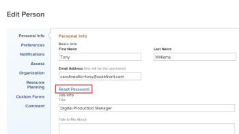

# Reimposta la password

{{important-not-on-aec}}

È possibile reimpostare la password di [!DNL Adobe Workfront]. Come misura di sicurezza importante, ti consigliamo di farlo regolarmente.

>[!NOTE]
>
>Un amministratore di [!DNL Workfront] può configurare le restrizioni delle password personalizzate, come spiegato in [Configurare le preferenze di sicurezza del sistema](../../../administration-and-setup/manage-workfront/security/configure-security-preferences.md) e [Configurare i criteri delle password per l&#39;autenticazione](../../../administration-and-setup/manage-workfront/security/configure-password-policies-authentication.md).
>
><!-- [!DNL Workfront] administrator can also reset your password in an Enhanced Authentication enabled environment. For more information, see [Reset a user's password with Enhanced Authentication](../../../workfront-basics/manage-your-account-and-profile/managing-your-workfront-account/reset-user-password-eauth.md).-->

## Requisiti di accesso

+++ Espandi per visualizzare i requisiti di accesso per la funzionalità in questo articolo.

Devi avere i seguenti:

<table style="table-layout:auto"> 
 <col> 
 </col> 
 <col> 
 </col> 
 <tbody> 
  <tr> 
   <td role="rowheader"><strong>[!DNL Adobe Workfront] piano</strong></td> 
   <td> 
Qualsiasi
 </td> 
  </tr> 
  <tr> 
   <td role="rowheader"><strong>[!DNL Adobe Workfront] licenza</strong></td> 
   <td> 
      
Nuovo:

         <ul>
         <li>
Collaboratore o versione successiva
</li>
         </ul>
      
Corrente:

         <ul>
         <li>
Richiedi o superiore
</li>
         </ul>
   </td>
  </tr> 
 </tbody> 
</table>

Per informazioni, consulta [Requisiti di accesso nella documentazione di Workfront](/help/quicksilver/administration-and-setup/add-users/access-levels-and-object-permissions/access-level-requirements-in-documentation.md).

+++

## Reimposta la password in [!DNL Adobe Workfront]

1. Fai clic sull&#39;icona **[!UICONTROL Main Menu]**  nell&#39;angolo superiore destro di [!DNL Adobe Workfront], quindi fai clic sul tuo nome utente accanto all&#39;immagine del tuo profilo.

   

1. Fai clic sull&#39;icona **[!UICONTROL Altro menu]** , quindi su **[!UICONTROL Modifica]**.

1. Nella casella **[!UICONTROL Modifica persona]** che visualizza, in **[!UICONTROL Informazioni personali]**, fare clic su **[!UICONTROL Reimposta password]**.

   

   Se l&#39;organizzazione ha integrato [!DNL Workfront] con una soluzione SSO, quando si fa clic su **[!UICONTROL Reimposta password]** è possibile che le password vengano reimpostate tramite il sistema SSO. In questo modo viene ripristinata la password SSO che influisce sull&#39;accesso a tutte le altre applicazioni all&#39;interno dell&#39;organizzazione.

1. Digitare la vecchia password, quindi digitare la nuova password due volte.

   La password deve avere almeno 8 caratteri e contenere due dei seguenti tipi di caratteri:

   * Lettere
   * Numeri
   * Caratteri speciali (ad esempio ! @ # $ % ecc.)

   Le regole delle password potrebbero essere più severe di questa, a seconda delle impostazioni di configurazione impostate dall&#39;amministratore [!DNL Workfront].

1. Fai clic su **[!UICONTROL Salva modifiche]**.
