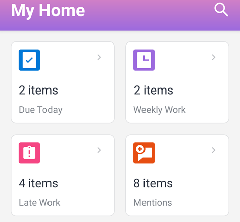

# [!UICONTROL Widget area Home]

I widget dell&#39;area Home sia per [!DNL iOS] che per [!DNL Android] consentono di trovare rapidamente gli elementi di lavoro.

**[!UICONTROL Scadenza oggi]:** mostra il numero di elementi di lavoro in scadenza oggi. Selezionate il widget per visualizzare l&#39;elenco degli elementi.

**[!UICONTROL Lavoro settimanale]:** mostra il numero di elementi di lavoro in scadenza questa settimana. Selezionate il widget per visualizzare l&#39;elenco degli elementi.

**[!UICONTROL Lavoro in ritardo]:** mostra il numero di elementi di lavoro in ritardo (oltre la data di completamento pianificata). Selezionate il widget per visualizzare l&#39;elenco degli elementi.

**[!UICONTROL Menzioni]:** mostra il numero di menzioni non lette. Una menzione è una notifica in cui si riceve un tag o una notifica nella scheda [!UICONTROL Aggiornamenti] per un oggetto in [!DNL Adobe Workfront]. Seleziona il widget per visualizzare l’elenco delle menzioni.
