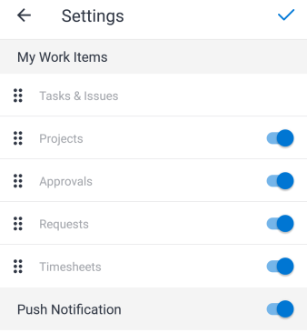

# Sezione [!UICONTROL Il mio lavoro] nell&#39;app mobile

Nella sezione [!UICONTROL Il mio lavoro] dell&#39;area [!UICONTROL Home] sono visualizzate attività, problemi, progetti, approvazioni, richieste e schede orario.

>[!NOTE]
>
>[!UICONTROL Il mio lavoro] nell&#39;app mobile è separato da [!UICONTROL Il mio lavoro] nella versione desktop di [!UICONTROL Adobe Workfront].

## Personalizza la sezione [!UICONTROL Il mio lavoro]

È possibile scegliere le voci di menu da visualizzare in [!UICONTROL Il mio lavoro] e modificare l&#39;ordine delle voci.

1. Nel menu mobile, tocca la foto o le iniziali per accedere al tuo profilo.
1. Scorri fino alla sezione **[!UICONTROL Configurazione]** e tocca **[!UICONTROL Impostazioni]**.
1. Nella pagina **[!UICONTROL Impostazioni]**, selezionare e trascinare le voci di menu in modo che siano nell&#39;ordine corretto per l&#39;area [!UICONTROL Home].
1. Tocca l’icona di attivazione/disattivazione blu per nascondere le voci di menu che non desideri visualizzare. Tocca l’icona di attivazione/disattivazione grigia per visualizzare nuovamente l’elemento.

   >[!NOTE]
   >
   >La voce di menu [!UICONTROL Attività e problemi] è sempre visualizzata e non puoi nasconderla.

   
