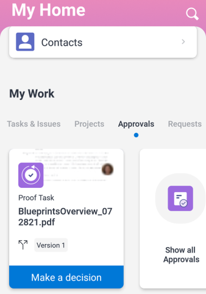

# Riesame e decisione sulle bozze nella [!DNL Adobe Workfront] app mobile

Quando una bozza viene assegnata all’utente per l’approvazione, viene visualizzata nell’elenco delle approvazioni nell’app mobile. Puoi esaminare la bozza direttamente nell’app e prendere una decisione al riguardo. Per informazioni sulla revisione e l&#39;approvazione delle bozze in [!DNL Adobe Workfront], vedi [Rivedi le bozze in [!DNL Adobe Workfront]](../../../review-and-approve-work/proofing/reviewing-proofs-within-workfront/review-proofs-in-wf.md).

È possibile aggiungere commenti alla bozza ed eseguire un processo di revisione prima di prendere una decisione finale. Per informazioni sui commenti, consulta [Commento sulle bozze in [!DNL iOS]](../../../workfront-basics/mobile-apps/using-the-workfront-mobile-app/comment-on-proofs-ios.md) o [Commento sulle bozze in [!DNL Android]](../../../workfront-basics/mobile-apps/using-the-workfront-mobile-app/comment-on-proofs-android.md).

Il tuo accesso alle bozze di revisione e approvazione è lo stesso di in [!DNL Adobe Workfront]. Per informazioni sulle funzionalità di correzione, consulta [Profili delle autorizzazioni di prova in [!DNL Workfront Proof]](../../../workfront-proof/wp-acct-admin/account-settings/proof-perm-profiles-in-wp.md).

## Aprire e rivedere una bozza

1. Apri l&#39;attività di approvazione della bozza:

   * Seleziona l’attività di approvazione della bozza nel [!UICONTROL Approvazioni] area [!UICONTROL Il mio lavoro].

      \
      Oppure

   * Seleziona **[!UICONTROL Mostra tutte le approvazioni]** in [!UICONTROL Approvazioni] area [!UICONTROL Il mio lavoro]. Quindi selezionare l&#39;attività di approvazione della bozza nell&#39;elenco di tutte le approvazioni.

      Per informazioni su [!UICONTROL Il mio lavoro] nell’app mobile, vedi [[!UICONTROL Il mio lavoro] nell’app mobile](../../../workfront-basics/mobile-apps/using-the-workfront-mobile-app/my-work-section-mobile.md).

1. Nella pagina Dettagli, seleziona **[!UICONTROL Vai a prova]**.

   

1. Esamina la bozza del documento.
1. (Facoltativo) Seleziona ![[!UICONTROL Icona a pagina singola]](assets/mobile-proofpagingicon1-25x36.png) in alto a destra del documento per passare dalla visualizzazione a pagina singola alla visualizzazione continua. Seleziona ![[!UICONTROL Icona Pagina continua]](assets/mobile-proofpagingicon2-25x25.png) per tornare alla visualizzazione a pagina singola.

   Nella visualizzazione a pagina singola, scorri a destra e a sinistra per spostarsi tra le pagine del documento. Nella visualizzazione continua, scorri verso l’alto o il basso per spostarsi tra le pagine.

1. (Facoltativo) Passa a una pagina specifica utilizzando l’indicatore di scorrimento a destra:

   1. Toccare l’indicatore di scorrimento.
   1. Digita il numero di pagina nel [!UICONTROL Vai alla pagina] selezionare **[!UICONTROL OK]**.
   1. 

1. Selezionare la freccia in alto a sinistra del documento per tornare al [!UICONTROL Dettagli] pagina.
1. (Facoltativo) Nella [!UICONTROL Dettagli] pagina, seleziona **[!UICONTROL Aggiornamenti]** per visualizzare tutti gli aggiornamenti della bozza, ad esempio quando è stata creata e quando è stata inviata per l’approvazione.

## Bloccare e sbloccare una bozza

Qualsiasi utente assegnato come proprietario, autore o moderatore della bozza può bloccare una bozza per impedire ad altri di commentare o prendere decisioni al riguardo.

### Bloccare una bozza

1. Apri la bozza del documento e seleziona la **[!UICONTROL Altro]** menu  in alto a destra del documento. Quindi, seleziona **[!UICONTROL Altro]**.
1. Seleziona **[!UICONTROL Blocca documento]**.\
   A &quot;[!UICONTROL Bloccato]&quot; viene visualizzato nella parte superiore del documento.

### Sblocca una bozza

1. Apri la bozza del documento e seleziona la **[!UICONTROL Altro]** menu  in alto a destra del documento. Quindi, seleziona **[!UICONTROL Altro]**.
1. Seleziona **[!UICONTROL Sblocca documento]**.
1. Seleziona **[!UICONTROL Sblocca]** nel messaggio di conferma.

## Prendere decisioni a prova

Dopo aver esaminato la bozza del documento, puoi prendere una decisione nella bozza stessa. Se il proprietario della bozza ha bloccato la bozza, non potrai prendere una decisione.

### Prendere una decisione nella prova

1. Apri la bozza del documento.
1. Seleziona l’icona della decisione ![[!UICONTROL Decisione] icona](assets/mobile-proofcheckmarkdecisionicon-30x30.png) in alto a destra del documento.
1. Seleziona una decisione nella [!UICONTROL Prendere una decisione] scatola.

   Di seguito sono mostrate alcune opzioni decisionali comuni. La [!DNL Adobe Workfront] amministratore o [!UICONTROL Prova Workfront] l’amministratore può configurare l’elenco delle opzioni decisionali. Per ulteriori informazioni su come gli amministratori possono configurare le decisioni, consulta [Configurare le opzioni di decisione di approvazione in Workfront Proof](../../../workfront-proof/wp-acct-admin/account-settings/configure-approval-decision-in-wp.md).

   <table style="table-layout:auto"> 
    <col> 
    <col> 
    <tbody> 
     <tr> 
      <td role="rowheader"><strong>[!UICONTROL Approvato]</strong></td> 
      <td>La bozza è pronta per passare alla fase successiva del flusso di lavoro.</td> 
     </tr> 
     <tr> 
      <td role="rowheader"><strong>[!UICONTROL Approvato con modifiche]</strong></td> 
      <td> 
La bozza richiede alcune modifiche, ma non è necessario visualizzare la revisione prima che passi alla fase successiva del flusso di lavoro.
 </td> 
     </tr> 
     <tr> 
      <td role="rowheader"><strong>[!UICONTROL rifiutato]</strong></td> 
      <td>La bozza viene rifiutata e non verrà inoltrata nel flusso di lavoro.</td> 
     </tr> 
    </tbody> 
   </table>

1. (Condizionale) Se il valore [!DNL Adobe Workfront] amministratore o [!DNL Workfront Proof] amministratore ha aggiunto un elenco di [!UICONTROL Motivi], seleziona i motivi della tua decisione.

   Alcune ragioni potrebbero richiedere anche commenti per spiegare perché hai scelto il motivo.

   Per ulteriori informazioni su come gli amministratori possono configurare i motivi, consulta  [Configura le opzioni relative alle decisioni di approvazione in [!DNL Workfront Proof]](../../../workfront-proof/wp-acct-admin/account-settings/configure-approval-decision-in-wp.md).

1. Seleziona **[!UICONTROL Invia]**.

### Cambia la tua decisione nella bozza

1. Apri la bozza del documento.
1. Seleziona l’icona della decisione ![[!UICONTROL Decisione] icona](assets/mobile-proofcheckmarkdecisionicon-30x30.png) in alto a destra del documento.

   La [!UICONTROL Prendere una decisione] mostra la tua decisione corrente.

1. Seleziona una decisione diversa o scegli **[!UICONTROL Cancella selezione]** per rimuovere la decisione.

   Per le decisioni con motivi, è possibile scegliere un motivo diverso o rimuovere il motivo.

1. Seleziona **[!UICONTROL Invia]**.
