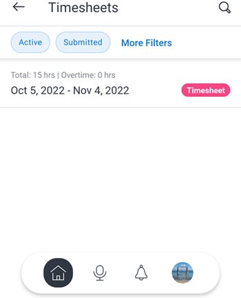

# [!DNL Adobe Workfront] per [!DNL iOS]

La [!DNL Adobe Workfront] l’app ti consente di accedere ai tuoi lavori su qualsiasi [!DNL iOS] dispositivo. È possibile installare e utilizzare il [!DNL Workfront] app mobile su telefoni e tablet con iOS 10 o versione successiva. Un dedicato [!DNL Workfront] l’app mobile è disponibile sia per [!DNL iPhone] e [!DNL iPad].

Per informazioni sull’accesso all’app mobile, consulta la sezione . [Accedi a [!UICONTROL Workfront] app mobile](../../../workfront-basics/manage-your-account-and-profile/managing-your-workfront-account/log-in-to-workfront.md#log) nell&#39;articolo [Accedi a [!DNL Adobe Workfront]](../../../workfront-basics/manage-your-account-and-profile/managing-your-workfront-account/log-in-to-workfront.md).

## [!UICONTROL Home]

La [!UICONTROL Pagina principale] area consente di lavorare direttamente su attività, problemi e approvazioni assegnati all&#39;utente. Da [!UICONTROL Pagina principale] nell’area dell’app, puoi:

<table style="table-layout:auto"> 
 <col> 
 <col> 
 <tbody> 
  <tr> 
   <td> 
    <ul> 
     <li>Inizia a lavorare su attività e problemi</li> 
     <li>Contrassegna attività e problemi come [!UICONTROL Fine]</li> 
     <li>Riassegnazione di attività e problemi</li> 
     <li>Modificare la data del commit</li> 
    </ul> </td> 
   <td> 
    <ul> 
     <li>Aggiornare gli stati delle attività e dei problemi</li> 
     <li>Pubblica nell’area Aggiornamenti</li> 
     <li>Visualizza documenti</li> 
     <li>Allega foto</li> 
     <li> 
Creare una richiesta o un’attività rapida
 
Nota: Le attività rapide create in home sono attività personali, a meno che non si scelga di assegnare un progetto.
 </li> 
    </ul> </td> 
  </tr> 
 </tbody> 
</table>

Per ulteriori informazioni, consulta [[!UICONTROL Pagina principale] widget area](../../../workfront-basics/mobile-apps/using-the-workfront-mobile-app/home-area-widgets-mobile.md) e [[!UICONTROL Il mio lavoro] nell’app mobile](../../../workfront-basics/mobile-apps/using-the-workfront-mobile-app/my-work-section-mobile.md).

## [!UICONTROL Bacheche]

La [!UICONTROL Schede] area consente di accedere alle [!DNL Workfront] bacheche.

Per ulteriori informazioni, consulta [[!DNL Adobe Workfront] [!UICONTROL Boards] per dispositivi mobili](/help/quicksilver/workfront-basics/mobile-apps/using-the-workfront-mobile-app/mobile-boards.md).

## [!UICONTROL Progetti]

La [!UICONTROL Progetti] area consente di interagire con e gestire [!UICONTROL progetti] possiedi e progetti su cui sei. Dall’area progetti dell’app, puoi:

<table style="table-layout:auto"> 
 <col> 
 <col> 
 <tbody> 
  <tr> 
   <td> 
    <ul> 
     <li>Aggiorna stato del progetto</li> 
     <li>Visualizzare i dettagli importanti del progetto</li> 
     <li>Pubblica nell’area [!UICONTROL Updates]</li> 
     <li>Conversione di attività, problemi e richieste in progetti</li> 
    </ul> </td> 
   <td> 
    <ul> 
     <li>Interagire con attività e problemi del progetto</li> 
     <li>Visualizza documenti</li> 
     <li>Allega foto</li> 
     <li> 
Creare un’attività rapida
 
Nota: Le attività create in un progetto vengono assegnate automaticamente al progetto in cui ci si trova. 
 </li> 
    </ul> </td> 
  </tr> 
 </tbody> 
</table>

## Approvazioni

La [!UICONTROL Approvazioni] area consente di visualizzare e approvare [!UICONTROL approvazioni] assegnati o delegati a te. Dall&#39;area approvazioni è possibile approvare:

<table style="table-layout:auto">
 <col>
 <col>
 <tbody>
  <tr>
   <td>
    <ul>
     <li>Lavoro (attività e problemi)</li>
     <li>Documenti</li>
     <li>Bozze </li>
    </ul> </td>
   <td>
    <ul>
     <li>Schede orario</li>
     <li>Richieste di accesso</li>
    </ul> </td>
  </tr>
 </tbody>
</table>

Per ulteriori informazioni sulle approvazioni, consulta [Approvazioni in [!DNL Adobe Workfront] app mobile](../../../workfront-basics/mobile-apps/using-the-workfront-mobile-app/approvals-in-mobile-app.md).

Per informazioni sulla revisione e l&#39;approvazione delle bozze, vedi [Riesame e decisione sulle bozze nella [!DNL Adobe Workfront] app mobile](../../../workfront-basics/mobile-apps/using-the-workfront-mobile-app/work-with-proofs-in-mobile-app.md).

## [!UICONTROL Notifiche]

La [!UICONTROL Notifiche] Area ti consente di visualizzare e rispondere alle notifiche in-app per il tuo lavoro.

>[!NOTE]
>I collegamenti ipertestuali non sono disponibili nelle notifiche di aggiornamento a meno che l’intero contenuto di una nota non sia un collegamento ipertestuale senza testo di visualizzazione.

## [!UICONTROL Richieste]

La [!UICONTROL Richieste] area consente di visualizzare i dettagli sulle richieste. Da [!UICONTROL Richieste] nell’area dell’app, puoi:

<table style="table-layout:auto">
 <col>
 <col>
 <tbody>
  <tr>
   <td>
    <ul>
     <li>Riassegna la richiesta</li>
     <li>Aggiorna lo stato</li>
     <li>Regolare la priorità</li>
    </ul> </td>
   <td>
    <ul>
     <li>Pubblica nell’area [!UICONTROL Updates]</li>
     <li>Visualizza documenti</li>
     <li>Allega foto</li>
     <li>Salvare una richiesta come bozza</li>
    </ul> </td>
  </tr>
 </tbody>
</table>

## Schede orario

La [!UICONTROL fogli presenze] area consente di visualizzare i dettagli dei fogli presenze. In [!UICONTROL Schede temporali] nell’area dell’app, puoi:

* Pubblica nel [!UICONTROL Aggiornamenti] area
* Regolare i tipi di ora
* Modifica l&#39;ora di registrazione
* Inserire commenti nella scheda attività
* Chiudi la scheda attività

## [!UICONTROL Preferiti]

È possibile accedere a elementi esistenti dal menu Preferiti e aggiungere nuovi elementi al [!UICONTROL Preferiti] menu.

## [!UICONTROL Conttati]

La [!UICONTROL Contatti] area ti consente di visualizzare le informazioni di contatto per tutti gli utenti della tua azienda.

## [!UICONTROL Configurazione]

La [!UICONTROL Configurazione] area consente di:

* Gestione delle impostazioni
* Visualizza team assegnati
* Impostare le preferenze di protezione
* Invia feedback
* Accedere al contenuto della Guida
* Disconnetti

## Assistente virtuale

L&#39;assistente virtuale consente di eseguire le seguenti attività tramite il comando vocale:

* [!UICONTROL Mostra]
* [!UICONTROL Elimina]
* [!UICONTROL Cerca]
* [!UICONTROL Aiutami con i comandi]

Per ulteriori informazioni sull&#39;assistente virtuale, vedi [[!DNL Adobe Workfront] assistente virtuale per app mobili](../../../workfront-basics/mobile-apps/using-the-workfront-mobile-app/wf-mobile-virtual-assistant.md).

## [!UICONTROL Pin]

La [!UICONTROL Pin] area consente di accedere ai comandi dell&#39;assistente virtuale salvati e ai pin dal browser Web.

Per ulteriori informazioni sull&#39;assistente virtuale, vedi [Assistente virtuale per app mobile Adobe Workfront](../../../workfront-basics/mobile-apps/using-the-workfront-mobile-app/wf-mobile-virtual-assistant.md).
