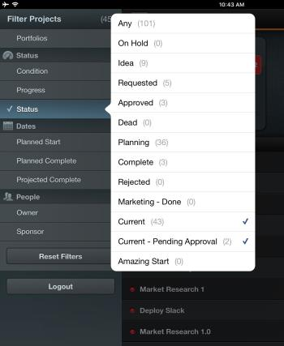

# Filtra elenchi progetti in [!DNL Adobe Workfront View]

Per impostazione predefinita, [!DNL Adobe Workfront View] visualizza l&#39;elenco [!UICONTROL Tutti i progetti] in [!DNL Workfront], quindi vengono elencati tutti i progetti a cui hai accesso, indipendentemente dal loro stato.

È possibile filtrare l&#39;elenco dei progetti in [!DNL Workfront View] per visualizzare solo i progetti rilevanti. Dopo aver applicato i filtri, l’elenco dei progetti rimane filtrato fino al successivo accesso o fino a quando non vengono modificati.

## Requisiti di accesso

+++ Espandi per visualizzare i requisiti di accesso per la funzionalità descritta in questo articolo.

<table style="table-layout:auto"> 
 <col> 
 </col> 
 <col> 
 </col> 
 <tbody> 
  <tr> 
   <td role="rowheader"><strong>Pacchetto Adobe Workfront</strong></td> 
   <td> 
Qualsiasi
 </td> 
  </tr> 
  <tr> 
   <td role="rowheader"><strong>Licenza di Adobe Workfront</strong></td> 
   <td> 
   
Collaboratore o successiva

   
Revisione o successiva
 </td> 
  </tr> 
 </tbody> 
</table>

Per informazioni, consulta [Requisiti di accesso nella documentazione di Workfront](/help/quicksilver/administration-and-setup/add-users/access-levels-and-object-permissions/access-level-requirements-in-documentation.md).

+++

## Filtra l&#39;elenco di [!UICONTROL progetti] in [!UICONTROL Visualizzazione Workfront]

1. Passa all&#39;elenco dei progetti nell&#39;app mobile [!DNL Workfront] View.
1. Tocca l’icona dell’elenco in alto a sinistra.\
   Viene visualizzato l’elenco dei filtri disponibili.\
   

1. Seleziona uno dei seguenti filtri:

   * [!UICONTROL Portfolio]: seleziona portfolio specifici di cui vuoi visualizzare i progetti.
   * [!UICONTROL Condizione]: selezionare per visualizzare solo i progetti con una [!UICONTROL Condizione] specifica.
   * [!UICONTROL Avanzamento]: selezionare questa opzione per visualizzare solo i progetti con un [!UICONTROL Stato di avanzamento] specifico.
   * Stato: selezionare questa opzione per visualizzare solo i progetti con [!UICONTROL Stati] specifici.
   * [!UICONTROL Inizio pianificato]: selezionare questa opzione per visualizzare solo i progetti con [!UICONTROL Data inizio pianificata] nei seguenti intervalli di tempo:

      * Ultimi 3 mesi
      * Ultimi 2 mesi
      * Mese scorso
      * Ultime due settimane
   * [!UICONTROL Pianificato completato]: selezionare questa opzione per visualizzare solo i progetti con [!UICONTROL Pianificato completato] nei seguenti intervalli di tempo:

      * Due settimane
      * Un mese
      * Due mesi
      * Tre mesi
   * [!UICONTROL Progetto completato]: selezionare questa opzione per visualizzare solo i progetti con [!UICONTROL Data di completamento prevista] nei seguenti intervalli di tempo:

      * Due settimane
      * Un mese
      * Due mesi
      * Tre mesi
   * [!UICONTROL Proprietario]: selezionare per visualizzare i progetti assegnati a proprietari specifici.
   * [!UICONTROL Sponsor]: selezionare per visualizzare i progetti assegnati a un [!UICONTROL Sponsor] specifico.

1. Per chiudere l’icona dell’elenco, tocca un punto qualsiasi dell’elenco dei progetti.
