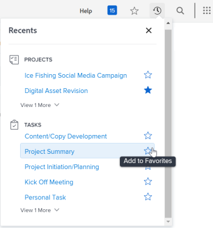

# Visualizzare e gestire i preferiti

Il menu [!UICONTROL Preferiti] consente di accedere rapidamente agli elementi. Gli elementi rimangono nel menu [!UICONTROL Preferiti] fino a quando non vengono rimossi. È possibile avere fino a 40 voci nel menu Preferiti.

## Requisiti di accesso

Per eseguire i passaggi descritti in questo articolo, è necessario disporre dei seguenti diritti di accesso:

<table style="table-layout:auto"> 
 <col> 
 </col> 
 <col> 
 </col> 
 <tbody> 
  <tr> 
   <td role="rowheader"><strong>[!DNL Adobe Workfront] piano*</strong></td> 
   <td> 
Qualsiasi
 </td> 
  </tr> 
  <tr> 
   <td role="rowheader"><strong>[!DNL Adobe Workfront] licenza*</strong></td> 
   <td> 
[!UICONTROL Request] o versione successiva
 </td> 
  </tr> 
 </tbody> 
</table>

&#42;Per conoscere il piano o il tipo di licenza disponibile, contattare l&#39;amministratore [!DNL Workfront].

## Visualizza un preferito

Per visualizzare un elemento aggiunto in precedenza come preferito:

1. Fai clic sull&#39;icona **[!UICONTROL Preferiti]**  nell&#39;angolo superiore destro di qualsiasi pagina [!DNL Adobe Workfront].

1. Nell&#39;elenco [!UICONTROL Preferiti] fare clic sull&#39;elemento che si desidera visualizzare.

## Aggiungere un elemento come preferito

Puoi aggiungere elementi recenti o la pagina corrente al menu [!UICONTROL Preferiti].

* [Aggiungi elementi recenti come preferiti](#add-recent-items-as-a-favorite)
* [Aggiungi l&#39;elemento corrente come preferito](#add-the-current-item-as-a-favorite)

### Aggiungi elementi recenti come preferiti

1. Fai clic sull&#39;icona **[!UICONTROL Recenti]** ![[!UICONTROL Recenti]](assets/recents-icon-40x43.png) nell&#39;angolo superiore destro di qualsiasi pagina nella nuova esperienza [!DNL Adobe Workfront].
1. Passa il cursore del mouse sull’elemento recente che desideri salvare come preferito, quindi fai clic sulla stella.

   L&#39;elemento recente viene visualizzato nel menu [!UICONTROL Preferiti].

   Fai clic sulla X in alto a destra per chiudere l’elenco.

   

### Aggiungi l&#39;elemento corrente come preferito

1. Passare alla pagina che si desidera aggiungere come preferita.
1. Fai clic sull&#39;icona **[!DNL Favorites]**  nell&#39;angolo superiore destro di qualsiasi pagina [!DNL Workfront], quindi fai clic su **[!UICONTROL Aggiungi pagina corrente]**.

   

   Fai clic sulla X in alto a destra per chiudere l’elenco.

   Oppure

   Fai clic sull&#39;icona **[!UICONTROL Preferiti]**  a destra del nome dell&#39;oggetto.

   >[!NOTE]
   >
   >Se si fa clic sull&#39;icona **[!UICONTROL Preferiti]** su un oggetto già aggiunto come preferito, l&#39;oggetto verrà rimosso dal menu [!UICONTROL Preferiti].\
   >

## Rimuovi un elemento dal menu [!UICONTROL Preferiti]

1. Fai clic sull&#39;icona **[!UICONTROL Preferiti]**  nell&#39;angolo superiore destro di qualsiasi pagina [!DNL Workfront].

1. Passa il puntatore del mouse sull&#39;elemento da rimuovere come preferito, quindi fai clic su **X** accanto a esso.

   Oppure

   Se ti trovi nella pagina che desideri rimuovere come preferito, fai clic sull&#39;icona **[!UICONTROL Preferiti]**  accanto al nome dell&#39;oggetto per rimuoverlo dal menu Preferiti.
