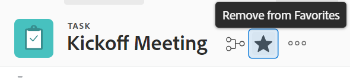

# Visualizzare e gestire i preferiti

<!-- Audited: 5/2025 -->

Il menu [!UICONTROL Preferiti] consente di accedere rapidamente agli elementi. Gli elementi rimangono nel menu [!UICONTROL Preferiti] fino a quando non vengono rimossi. È possibile avere fino a 40 voci nel menu Preferiti.

## Requisiti di accesso

+++ Espandi per visualizzare i requisiti di accesso per la funzionalità descritta in questo articolo.

<table style="table-layout:auto"> 
 <col> 
 </col> 
 <col> 
 </col> 
 <tbody> 
  <tr> 
   <td role="rowheader">Pacchetto Adobe Workfront</td> 
   <td> 
Qualsiasi
 </td> 
  </tr> 
  <tr> 
   <td role="rowheader">Licenza di Adobe Workfront</td> 
   <td> 

      
Collaboratore o successiva

      
Richiedente o successiva</td> 
  </tr> 
 </tbody> 
</table>

Per ulteriori dettagli sulle informazioni contenute in questa tabella, consulta [Requisiti di accesso nella documentazione Workfront](/help/quicksilver/administration-and-setup/add-users/access-levels-and-object-permissions/access-level-requirements-in-documentation.md).

+++

## Visualizza un preferito

Per visualizzare un elemento aggiunto in precedenza come preferito:

1. Fare clic sull&#39;icona **[!UICONTROL Preferiti]**  nell&#39;angolo superiore destro di qualsiasi pagina [!DNL Adobe Workfront].

1. Nell&#39;elenco **Preferiti** fare clic sull&#39;elemento che si desidera visualizzare.

## Aggiungere un elemento come preferito

Puoi aggiungere elementi recenti o la pagina corrente al menu [!UICONTROL Preferiti].

* [Aggiungi elementi recenti come preferiti](#add-recent-items-as-a-favorite)
* [Aggiungi l&#39;elemento corrente come preferito](#add-the-current-item-as-a-favorite)

### Aggiungi elementi recenti come preferiti

1. Fai clic sull&#39;icona **[!UICONTROL Recenti]**  nell&#39;angolo superiore destro di qualsiasi pagina nella nuova esperienza [!DNL Adobe Workfront].
1. Fare clic sulla stella in linea con l&#39;elemento che si desidera salvare come preferito. L&#39;elemento recente viene visualizzato nel menu **Preferiti**.

   

### Aggiungi l&#39;elemento corrente come preferito

1. Passare alla pagina che si desidera aggiungere come preferita.
1. Fai clic sull&#39;icona **[!DNL Favorites]**  nell&#39;angolo superiore destro della pagina, quindi fai clic su **[!UICONTROL Aggiungi pagina corrente]**.

   

   >[!NOTE]
   >
   >Se si fa clic sull&#39;icona **[!UICONTROL Preferiti]** su un oggetto già aggiunto come preferito, l&#39;oggetto verrà rimosso dal menu [!UICONTROL Preferiti].\
   >

## Rimuovi un elemento dal menu [!UICONTROL Preferiti]

1. Fare clic sull&#39;icona **[!UICONTROL Preferiti]**  nell&#39;angolo superiore destro di qualsiasi pagina [!DNL Workfront].

1. Passa il puntatore del mouse sull&#39;elemento da rimuovere come preferito, quindi fai clic su **X** accanto a esso.

   Oppure

   Se ti trovi nella pagina da rimuovere come preferito, fai clic sull&#39;icona **[!UICONTROL Preferiti]**  accanto al nome dell&#39;oggetto per rimuoverlo dal menu **Preferiti**.
