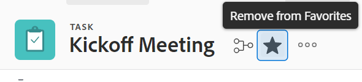

# Visualizzare e gestire i preferiti

La [!UICONTROL Preferiti] consente di accedere rapidamente agli elementi. Gli elementi rimangono sul [!UICONTROL Preferiti] finché non vengono rimosse. È possibile visualizzare fino a 40 elementi nel menu Preferiti.

## Requisiti di accesso

Per eseguire i passaggi descritti in questo articolo, è necessario disporre dei seguenti diritti di accesso:

<table style="table-layout:auto"> 
 <col> 
 </col> 
 <col> 
 </col> 
 <tbody> 
  <tr> 
   <td role="rowheader"><strong>[!DNL Adobe Workfront] piano*</strong></td> 
   <td> 
Qualsiasi
 </td> 
  </tr> 
  <tr> 
   <td role="rowheader"><strong>[!DNL Adobe Workfront] licenza*</strong></td> 
   <td> 
[!UICONTROL Request] o superiore
 </td> 
  </tr> 
 </tbody> 
</table>

&#42;Per sapere quale piano o tipo di licenza hai, contatta il tuo [!DNL Workfront] amministratore.

## Visualizza un preferito

Per visualizzare un elemento precedentemente aggiunto come preferito:

1. Fai clic sul pulsante **[!UICONTROL Preferiti]** icona  nell&#39;angolo superiore destro di qualsiasi [!DNL Adobe Workfront] pagina.

1. In [!UICONTROL Preferiti] fare clic sull&#39;elemento che si desidera visualizzare.

## Aggiungi un elemento come preferito

Puoi aggiungere elementi recenti o la pagina corrente al [!UICONTROL Preferiti] menu.

* [Aggiungi articoli recenti come preferiti](#add-recent-items-as-a-favorite)
* [Aggiungi l&#39;elemento corrente come preferito](#add-the-current-item-as-a-favorite)

### Aggiungi articoli recenti come preferiti

1. Fai clic sul pulsante **[!UICONTROL Recenti]** icona ![[!UICONTROL Recenti]](assets/recents-icon-40x43.png) nell’angolo in alto a destra di qualsiasi pagina nel nuovo [!DNL Adobe Workfront] esperienza.
1. Passa il puntatore del mouse sull&#39;elemento recente da salvare come preferito, quindi fai clic sulla stella.

   L’elemento recente viene visualizzato nel [!UICONTROL Preferiti] menu.

   Fai clic sulla X in alto a destra per chiudere l’elenco.

   

### Aggiungi l&#39;elemento corrente come preferito

1. Passa alla pagina che desideri aggiungere come preferito.
1. Fai clic sul pulsante **[!DNL Favorites]** icona  nell&#39;angolo superiore destro di qualsiasi [!DNL Workfront] , quindi fai clic su **[!UICONTROL Aggiungi pagina corrente]**.

   

   Fai clic sulla X in alto a destra per chiudere l’elenco.

   Oppure

   Fai clic sul pulsante **[!UICONTROL Preferiti]** icona  a destra del nome dell&#39;oggetto.

   >[!NOTE]
   >
   >Se fai clic sul pulsante **[!UICONTROL Preferiti]** su un oggetto già aggiunto come preferito, l’oggetto verrà rimosso dalla [!UICONTROL Preferiti] menu.\
   >

## Rimuovi un elemento dal [!UICONTROL Preferiti] menu

1. Fai clic sul pulsante **[!UICONTROL Preferiti]** icona  nell&#39;angolo superiore destro di qualsiasi [!DNL Workfront] pagina.

1. Passa il puntatore del mouse sull&#39;elemento da rimuovere come preferito, quindi fai clic sul pulsante **X** accanto.

   Oppure

   Se ti trovi nella pagina da rimuovere come preferito, fai clic sul pulsante **[!UICONTROL Preferiti]** icona  accanto al nome dell&#39;oggetto per rimuoverlo dal menu Preferiti.
