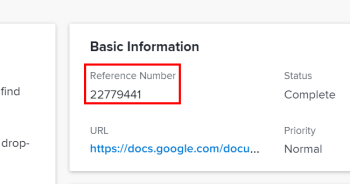

# Utilizzare il numero di riferimento degli oggetti

In [!DNL Adobe Workfront], gli elementi sono identificati come oggetti. Gli oggetti corrispondono al database e vengono utilizzati per correlare i dati con un elemento.

Quando viene creato l’oggetto, Workfront assegna automaticamente a ciascuno dei seguenti oggetti un numero di riferimento univoco:

* Progetti
* Attività
* Problemi
* Documenti

I numeri di riferimento sono utili per distinguere tra due oggetti altrimenti simili (ad esempio, attività con lo stesso nome). Puoi cercare i numeri di riferimento e includerli nei rapporti.

>[!IMPORTANT]
>
>* [!DNL Workfront] assegna continuamente i numeri di riferimento a tutti i clienti e a tutti gli oggetti. Ad esempio, quando crei un’attività, [!DNL Workfront] potrebbe assegnarle un numero di riferimento di 00005. Se un altro cliente crea un progetto successivo, potrebbe ricevere il successivo numero di riferimento disponibile, ad esempio 00006. Se crei un problema successivamente, il problema potrebbe ricevere il numero di riferimento 00007 e così via.
>* Non è possibile controllare la sequenza di numeri di riferimento per qualsiasi oggetto in [!DNL Workfront]. La sequenza è sempre controllata dal nostro database.
>

## Visualizza il numero di riferimento di un oggetto

I numeri di riferimento vengono visualizzati per impostazione predefinita per le attività e i problemi. Puoi anche configurare facilmente [!DNL Workfront] per visualizzare i numeri di riferimento per altri tipi di oggetti.

* [Visualizza i numeri di riferimento per attività e problemi](#view-reference-numbers-for-tasks-and-issues)
* [Visualizzare i numeri di riferimento per altri oggetti](#view-reference-numbers-for-other-objects)
* [Visualizzare i numeri di riferimento nei rapporti](#view-reference-numbers-in-reports)

### Visualizza i numeri di riferimento per attività e problemi

I numeri di riferimento vengono visualizzati per impostazione predefinita quando si visualizza un&#39;attività o un problema.  Per visualizzare il numero di riferimento, fai clic su **[!UICONTROL Dettagli attività]** o **[!UICONTROL Dettagli del problema]** nel pannello a sinistra, quindi individua la **[!UICONTROL Informazioni di base]** nella sezione Panoramica .

### Visualizzare i numeri di riferimento per altri oggetti

Per visualizzare i numeri di riferimento per gli oggetti, è possibile creare una visualizzazione personalizzata o modificare una visualizzazione esistente e aggiungere la [!UICONTROL Numero di riferimento] a una colonna della visualizzazione. Ad esempio, puoi modificare il [!UICONTROL Progetti] visualizza il numero di riferimento per tutti i progetti.

Per informazioni su come creare o modificare una visualizzazione, consulta [Panoramica delle visualizzazioni in [!DNL Adobe Workfront]](../../../reports-and-dashboards/reports/reporting-elements/views-overview.md).

### Visualizzare i numeri di riferimento nei rapporti

È possibile visualizzare il numero di riferimento per gli oggetti nei rapporti aggiungendo il [!UICONTROL Numero di riferimento] al report.

Per informazioni su come aggiungere una colonna a un rapporto, consulta [Creare un rapporto personalizzato](../../../reports-and-dashboards/reports/creating-and-managing-reports/create-custom-report.md).

## Ricerca di un oggetto per numero di riferimento

[!DNL Workfront] consente di cercare un oggetto in base al numero di riferimento.

Digitare il numero di riferimento di un oggetto nel campo **[!UICONTROL Ricerca]** campo, quindi premere **[!UICONTROL Invio]**.

Per ulteriori informazioni sulla ricerca in Workfront, vedi [Ricerca [!DNL Adobe Workfront]](../../../workfront-basics/navigate-workfront/search/search-workfront.md).
