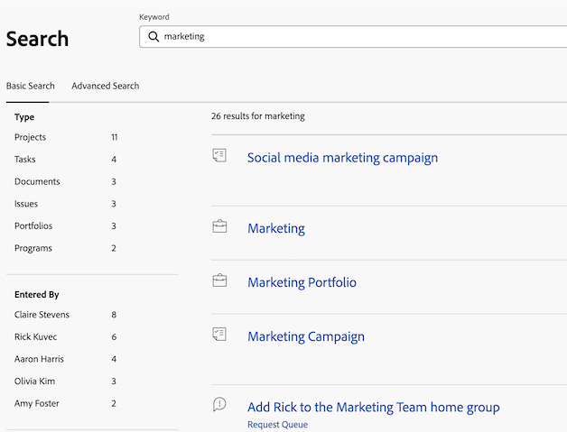

# Ricerca [!DNL Adobe Workfront]

È possibile individuare facilmente gli elementi in [!DNL Adobe Workfront] effettuandone la ricerca quando non si ricorda la loro esatta posizione.

Puoi visualizzare la casella [!UICONTROL Cerca] nell&#39;angolo superiore destro di qualsiasi pagina in [!DNL Workfront].

È necessario disporre delle autorizzazioni per visualizzare un oggetto prima di trovarlo in una ricerca. Per questo motivo, i risultati della ricerca variano da utente a utente.

## Requisiti di accesso

+++ Espandi questa sezione per visualizzare l’accesso necessario per eseguire i passaggi descritti in questo articolo.

<table style="table-layout:auto"> 
 <col> 
 <col> 
 <tbody> 
  <tr> 
   <td role="rowheader"><strong>[!DNL Adobe Workfront] piano*</strong></td> 
   <td> 
Qualsiasi
 </td> 
  </tr> 
  <tr> 
   <td role="rowheader"><strong>[!DNL Adobe Workfront] licenza*</strong></td> 
   <td> 
Richiedi o superiore
 </td> 
  </tr> 
  <tr> 
   <td role="rowheader"><strong>Configurazioni del livello di accesso*</strong></td> 
   <td> 
Accesso [!UICONTROL View] al tipo di oggetto 
 
Nota: se non disponi ancora dell'accesso, chiedi all'amministratore [!DNL Workfront] se ha impostato restrizioni aggiuntive nel tuo livello di accesso. Per informazioni su come un amministratore di [!DNL Workfront] può modificare il tuo livello di accesso, vedi <a href="../../../administration-and-setup/add-users/configure-and-grant-access/create-modify-access-levels.md" class="MCXref xref">Creare o modificare livelli di accesso personalizzati</a>.
</td> 
  </tr> 
  <tr> 
   <td role="rowheader"><strong>Autorizzazioni oggetto</strong></td> 
   <td> 
È necessario disporre delle autorizzazioni per visualizzare un oggetto prima di trovarlo in una ricerca.
 
Per informazioni sulla richiesta di accesso aggiuntivo, vedere <a href="../../../workfront-basics/grant-and-request-access-to-objects/request-access.md" class="MCXref xref">Richiedere l'accesso agli oggetti </a>.
 </td> 
  </tr> 
 </tbody> 
</table>

&#42;Per conoscere il piano, il tipo di licenza o l&#39;accesso di cui si dispone, contattare l&#39;amministratore [!DNL Workfront].

+++

## Comprendere la ricerca

* [[!UICONTROL Oggetti disponibili per la ricerca]](#objects-available-for-search)
* [[!UICONTROL Campi disponibili per la ricerca]](#fields-available-for-search)

### Oggetti disponibili per la ricerca

È possibile cercare i seguenti oggetti in Workfront:

* Progetti
* Attività
* Problemi
* Report
* Utenti
* Modelli
* Documenti
* Portfolio
* Programmi
* Dashboard
* Aziende
* Note

### Campi disponibili per la ricerca

I campi disponibili per la ricerca si basano sul tipo di ricerca: Base o [!UICONTROL Ricerca avanzata].

* **Ricerca di base**: durante la ricerca di oggetti in una ricerca di base, [!DNL Workfront] cerca il testo che potrebbe contenere le parole chiave nei campi seguenti:

   * Nomi di oggetto
   * Descrizione
   * Campi dati personalizzati
   * Aggiornamenti
   * Nomi di documenti (in ricerche di documenti specifiche e in una ricerca di base)

  Per ulteriori informazioni sulla ricerca di base in [!DNL Workfront], vedere [Ricerca di base](#basic-search) in questo articolo.

* **[!UICONTROL Ricerca avanzata]**: in una [!UICONTROL Ricerca avanzata], è possibile impostare filtri per la ricerca di campi non disponibili in Ricerca di base. Pertanto, [!UICONTROL Ricerca avanzata] consente di eseguire ricerche in qualsiasi campo dell&#39;oggetto.

  Per ulteriori informazioni su [!UICONTROL Ricerca avanzata], vedere [Ricerca avanzata](#advanced-search) in questo articolo.

>[!NOTE]
>
>Per eseguire una [!UICONTROL Ricerca avanzata], seleziona l&#39;opzione [!UICONTROL Ricerca avanzata] all&#39;inizio della ricerca. Non è possibile perfezionare una ricerca di base in una [!UICONTROL ricerca avanzata].

## Comprendere le limitazioni di [!DNL Workfront] ricerche

Considera le seguenti limitazioni quando utilizzi [!UICONTROL Ricerca] in [!DNL Workfront]:

* Le ricerche non distinguono tra maiuscole e minuscole
* [!DNL Workfront] non corregge o non comprende gli errori di battitura
* La ricerca in [!DNL Workfront] non supporta i caratteri jolly
* La ricerca in [!DNL Workfront] supporta ricerche parziali di parole, ma non ricerche di sottostringhe.\
   Ad esempio, la parola chiave di ricerca &quot;stand&quot; restituirebbe risultati che includono la parola &quot;standard&quot;, ma non risultati che includono la parola &quot;comprendi&quot;.

## Ricerca di più parole

Se si includono più parole in una ricerca e si desidera trovare solo gli oggetti che corrispondono a tutte le parole della casella Cerca, è possibile digitare le parole in qualsiasi ordine.

Ad esempio, la ricerca di &quot;Demo di marketing&quot; (senza virgolette) trova oggetti con i seguenti nomi:

* Demo di marketing
* Marketing dimostrativo
* Demo sull&#39;analisi di mercato di gennaio

Trova anche oggetti che potrebbero avere &quot;Marketing&quot; nel nome e &quot;Demo&quot; nella descrizione.

Tuttavia, è possibile eseguire le operazioni seguenti nella casella [!UICONTROL Ricerca] per modificare i risultati della ricerca visualizzati:

<table style="table-layout:auto"> 
 <col> 
 <col> 
 <tbody> 
  <tr> 
   <td>Includi virgolette</td> 
   <td> 
L'inserimento di parole nell'ordine corretto all'interno delle virgolette doppie consente di trovare solo gli oggetti che corrispondono esattamente. Ad esempio, la ricerca di "Dimostrazione di marketing" (tra virgolette) consente di trovare oggetti con i seguenti nomi:
 
    <ul> 
     <li> Demo di marketing</li> 
     <li> Demo di marketing di gennaio</li> 
     <li>Piano dimostrativo di marketing</li> 
    </ul> 
Tuttavia, questa ricerca non troverebbe un oggetto denominato "Demo Marketing".
 </td> 
  </tr> 
  <tr> 
   <td>Includi OR</td> 
   <td> 
La connessione delle parole con "OR" (senza virgolette) consente di trovare solo gli oggetti che corrispondono ad almeno una delle parole nella casella [!UICONTROL Search]. Queste parole possono essere immesse in qualsiasi ordine. Ad esempio, la ricerca di "Marketing OR Demo" (senza virgolette) consente di trovare oggetti con i seguenti nomi:
 
    <ul> 
     <li> Demo sull'analisi di mercato</li> 
     <li>Demo sull'analisi di mercato di gennaio</li> 
     <li>Demo</li> 
     <li>Analisi di mercato</li> 
    </ul> 
Nota: "OR" deve essere in maiuscolo. In caso contrario, viene interpretata come un'altra parola nell'espressione che si sta cercando.
 </td> 
  </tr> 
  <tr> 
   <td>Includi E</td> 
   <td> 
La connessione di parole con "AND" (senza virgolette) consente di trovare solo gli oggetti che corrispondono a tutte le parole nella casella [!UICONTROL Search]. Queste parole possono essere immesse in qualsiasi ordine. Ad esempio, la ricerca di "Marketing AND Demo" (senza virgolette) consente di trovare oggetti con i seguenti nomi:
 
    <ul> 
     <li>Demo di marketing</li> 
     <li>Marketing dimostrativo</li> 
     <li>Demo sull'analisi di mercato di gennaio</li> 
    </ul> 
Nota: "AND" deve essere in maiuscolo. In caso contrario, viene interpretata come un'altra parola nell'espressione che si sta cercando. Analogamente, includendo "&amp;" (senza virgolette) si esegue la ricerca solo di oggetti che includono il carattere e commerciale.
 </td> 
  </tr> 
 </tbody> 
</table>

## Usa ricerca in [!DNL Workfront]

[!DNL Workfront] dispone di due tipi di ricerche: di base e avanzate. Utilizzare la ricerca di base se si desidera trovare parole chiave nei campi oggetto comuni, ad esempio nome o descrizione. Utilizzare [!UICONTROL Ricerca avanzata] se si desidera utilizzare i filtri per eseguire ricerche in altri campi oggetto.

* [Ricerca di base](#basic-search)
* [Ricerca avanzata](#advanced-search)

### Ricerca di base

Una ricerca di base consente di cercare parole chiave in tutti gli oggetti del sistema o su un solo oggetto alla volta (ad esempio i progetti). [!DNL Workfront] cerca quindi tali parole chiave in alcuni campi specifici. È quindi possibile perfezionare i risultati della ricerca in base ad altri campi specifici dell&#39;oggetto selezionati da [!DNL Workfront].

Per un elenco dei campi specifici cercati nella ricerca di base, vedere [Campi disponibili per la ricerca](#fields-available-for-search) in questo articolo.

>[!NOTE]
>
>Per eseguire una [!UICONTROL Ricerca avanzata], seleziona l&#39;opzione [!UICONTROL Ricerca avanzata] all&#39;inizio della ricerca. Non è possibile perfezionare una ricerca di base in una [!UICONTROL ricerca avanzata].

* [Eseguire una ricerca di base](#perform-a-basic-search)
* [Perfezionare una ricerca di base](#refine-a-basic-search)

#### Eseguire una ricerca di base

È possibile eseguire una ricerca di base in uno dei modi seguenti:

* In tutti gli oggetti del sistema (ricerca generale).
* Su un solo oggetto alla volta (ricerca specifica per oggetto).

Per eseguire una ricerca di base:

1. Fare clic sull&#39;icona di ingrandimento  nell&#39;angolo superiore destro della pagina. È inoltre possibile digitare **[!UICONTROL ALT + /]** o **[!UICONTROL Opzione + /]** per aprire il menu [!UICONTROL Ricerca].

1. (Facoltativo) Per cercare un oggetto specifico, fare clic sul menu a discesa **[!UICONTROL Tutti]** e selezionare l&#39;oggetto che si desidera cercare.

   

1. Nella casella **[!UICONTROL Cerca]**, inizia a digitare le informazioni che stai cercando.
Per informazioni sui campi in cui eseguire la ricerca in [!DNL Workfront], vedere [Comprendere la ricerca](#understand-search).
   

   Quando si inizia a digitare nella barra di ricerca, [!DNL Workfront] formula raccomandazioni in base alla cronologia di visualizzazione ed evidenzia in blu la parola chiave che si sta cercando.

1. Se l&#39;elemento che si sta cercando viene visualizzato nel menu [!UICONTROL typeahead], fare clic su di esso.

   Oppure

   Premi **[!UICONTROL Invio]** per eseguire una ricerca completa. Questa ricerca esegue query sull&#39;intero database anziché sugli elementi visualizzati più di recente.

   La pagina [!UICONTROL Risultati ricerca] si apre da sinistra e copre la maggior parte della pagina precedente.

   Se si esegue una ricerca generale, [!DNL Workfront] restituisce i risultati per qualsiasi oggetto che corrisponde al termine di ricerca in uno dei campi cercati, come descritto in [Comprendere la ricerca](#understand-search). Gli oggetti corrispondenti alla ricerca vengono visualizzati in un elenco.

   >[!NOTE]
   >
   >A volte, le varianti di una parola vengono visualizzate nell’elenco degli elementi trovati.\
   >Ad esempio, la ricerca di &quot;marketing&quot; mostra oggetti che contengono &quot;marketing&quot; o &quot;mercato&quot; nel nome.

1. (Facoltativo) Se la ricerca ha generato troppi risultati, perfeziona la ricerca come descritto in [Perfeziona una ricerca di base](#refine-a-basic-search).
1. (Facoltativo) Per tornare alla pagina precedente alla ricerca, fai clic su **[!UICONTROL Chiudi]** in alto a destra.

>[!NOTE]
>
>La pagina [!UICONTROL Risultati ricerca] rimane aperta solo quando è attiva. Se si fa clic all&#39;esterno della pagina o si apre un&#39;altra pagina, la pagina [!UICONTROL Risultati ricerca] verrà chiusa.

#### Perfezionare una ricerca di base

Dopo aver eseguito una ricerca di base, come descritto in [[!UICONTROL Eseguire una ricerca di base]](#perform-a-basic-search), è possibile perfezionare la ricerca.

Utilizzare la barra degli strumenti a sinistra dei risultati di ricerca per limitare le informazioni che si stanno cercando.

Per perfezionare una ricerca:

1. (Condizionale) Se hai eseguito una ricerca generale, seleziona l’oggetto che stavi cercando nell’elenco degli oggetti in alto a sinistra dei risultati.
1. Individua i campi disponibili per gli oggetti visualizzati nella ricerca nella barra degli strumenti a sinistra dei risultati.
Vengono visualizzati i valori di ogni campo, ordinati per conteggio, fino a 10 valori per ogni campo.
1. Fai clic all’interno di uno dei campi disponibili per ridurre l’elenco dei risultati.
Le selezioni effettuate sono evidenziate in blu e i valori dei campi non selezionati sono nascosti.
Dopo aver selezionato ogni nuovo valore, i risultati vengono aggiornati dinamicamente.

   

1. (Facoltativo) Fai clic sui valori selezionati per deselezionarli e visualizzare nuovamente tutti i valori per ciascun campo.

### [!UICONTROL Ricerca avanzata]

[!UICONTROL Ricerca avanzata] consente di eseguire ricerche utilizzando campi e filtri non disponibili per la ricerca di base. Ad esempio, puoi cercare progetti con una priorità specifica o il nome del proprietario del documento.

>[!NOTE]
>
>Per eseguire una [!UICONTROL Ricerca avanzata], seleziona l&#39;opzione [!UICONTROL Ricerca avanzata] all&#39;inizio della ricerca. Non è possibile perfezionare una ricerca di base in una [!UICONTROL ricerca avanzata].

* [Usa [!UICONTROL Ricerca avanzata]](#use-advanced-search)

#### Usa [!UICONTROL Ricerca avanzata]

Puoi usare [!UICONTROL Ricerca avanzata] per filtrare la ricerca in base a criteri specifici.\
Questo tipo di ricerca è utile quando non si ricorda una parola chiave associata a un oggetto ma si conoscono alcune informazioni specifiche su tale oggetto (ad esempio, Priorità progetto, Nome proprietario documento, ecc.).

Per eseguire una ricerca avanzata:

1. Nell&#39;angolo superiore destro di qualsiasi pagina in [!DNL Workfront], fare clic sull&#39;icona **[!UICONTROL Cerca]** . Viene visualizzato il menu [!DNL Search].

1. Nella parte inferiore del menu [!UICONTROL Ricerca], fare clic su **[!UICONTROL Ricerca avanzata]**.\
   \
   La pagina [!UICONTROL Ricerca avanzata] si apre da destra e copre la maggior parte della pagina precedente.

1. Selezionare il tipo di oggetto che si sta cercando.\
   **[!UICONTROL Attività]** è selezionato per impostazione predefinita.

   

1. (Facoltativo) Digita una parola chiave nel campo nella parte superiore dell’elenco.
1. (Facoltativo) Attiva **[!UICONTROL Filtra i risultati]** per creare un filtro per perfezionare la ricerca. Al termine, fai clic su **Applica**.

1. Fare clic su **[!UICONTROL Cerca]**.\
   Un elenco di elementi corrispondenti alla ricerca viene visualizzato a destra della barra degli strumenti [!UICONTROL Ricerca avanzata].

1. (Facoltativo) Per tornare alla pagina precedente alla ricerca, fai clic su **[!UICONTROL Chiudi]** nell&#39;angolo in alto a destra.

>[!NOTE]
>
>La pagina [!UICONTROL Risultati ricerca] rimane aperta solo quando è attiva. Se si fa clic all&#39;esterno della pagina o si apre un&#39;altra pagina, la pagina [!UICONTROL Risultati ricerca] verrà chiusa.
