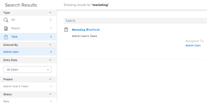

# Ricerca [!DNL Adobe Workfront]

È possibile individuare facilmente gli elementi in [!DNL Adobe Workfront] ricercandoli quando non riesci a ricordare la loro esatta posizione.

È possibile visualizzare le [!UICONTROL Ricerca] nell’angolo superiore destro di qualsiasi pagina all’interno di [!DNL Workfront].

È necessario disporre delle autorizzazioni per visualizzare un oggetto prima di poterlo trovare in una ricerca. Per questo motivo, i risultati della ricerca variano da utente a utente.

## Requisiti di accesso

+++ Espandi questa sezione per visualizzare l’accesso necessario per eseguire i passaggi descritti in questo articolo.

<table style="table-layout:auto"> 
 <col> 
 <col> 
 <tbody> 
  <tr> 
   <td role="rowheader"><strong>[!DNL Adobe Workfront] piano*</strong></td> 
   <td> 
Qualsiasi
 </td> 
  </tr> 
  <tr> 
   <td role="rowheader"><strong>[!DNL Adobe Workfront] licenza*</strong></td> 
   <td> 
Richiesta o superiore
 </td> 
  </tr> 
  <tr> 
   <td role="rowheader"><strong>Configurazioni a livello di accesso*</strong></td> 
   <td> 
Accesso al tipo di oggetto tramite [!UICONTROL View] 
 
Nota: Se non hai ancora accesso, chiedi [!DNL Workfront] amministratore se imposta ulteriori restrizioni nel livello di accesso. Per informazioni su come [!DNL Workfront] l'amministratore può modificare il livello di accesso, vedi <a href="../../../administration-and-setup/add-users/configure-and-grant-access/create-modify-access-levels.md" class="MCXref xref">Creare o modificare livelli di accesso personalizzati</a>.
</td> 
  </tr> 
  <tr> 
   <td role="rowheader"><strong>Autorizzazioni oggetto</strong></td> 
   <td> 
È necessario disporre delle autorizzazioni per visualizzare un oggetto prima di poterlo trovare in una ricerca.
 
Per informazioni sulla richiesta di accesso aggiuntivo, vedi <a href="../../../workfront-basics/grant-and-request-access-to-objects/request-access.md" class="MCXref xref">Richiedere l’accesso agli oggetti </a>.
 </td> 
  </tr> 
 </tbody> 
</table>

&#42;Per sapere quale piano, tipo di licenza o accesso hai, contatta il tuo [!DNL Workfront] amministratore.

+++

## Comprendere la ricerca

* [[!UICONTROL Oggetti disponibili per la ricerca]](#objects-available-for-search)
* [[!UICONTROL Campi disponibili per la ricerca]](#fields-available-for-search)

### Oggetti disponibili per la ricerca

In Workfront è possibile cercare i seguenti oggetti:

* Progetti
* Attività
* Problemi
* Report
* Utenti
* Modelli
* Documenti
* Portfolio
* Programmi
* Dashboard
* Aziende
* Note

### Campi disponibili per la ricerca

I campi disponibili per la ricerca si basano sul tipo di ricerca: Base o [!UICONTROL Ricerca avanzata].

* **Ricerca di base**: Durante la ricerca di oggetti in una ricerca di base, [!DNL Workfront] cerca il testo che potrebbe contenere le parole chiave nei campi seguenti:

   * Nomi di oggetto
   * Descrizioni
   * Campi dati personalizzati
   * Aggiornamenti
   * Nomi dei documenti (in ricerche di documenti specifiche e in una ricerca di base)

   Per ulteriori informazioni sulla ricerca di base in [!DNL Workfront], vedi [Ricerca di base](#basic-search) in questo articolo.

* **[!UICONTROL Ricerca avanzata]**: In un [!UICONTROL Ricerca avanzata], è possibile impostare i filtri per i campi di ricerca non disponibili nella ricerca di base. Pertanto, [!UICONTROL Ricerca avanzata] consente di cercare qualsiasi campo dell’oggetto.

   Per ulteriori informazioni [!UICONTROL Ricerca avanzata], vedi [Ricerca avanzata](#advanced-search) in questo articolo.

>[!NOTE]
>
>Per eseguire un [!UICONTROL Ricerca avanzata], devi selezionare la [!UICONTROL Ricerca avanzata] quando si avvia la ricerca. Non è possibile perfezionare una ricerca di base in un [!UICONTROL Ricerca avanzata].

## Comprendere le limitazioni di [!DNL Workfront] ricerche

Quando utilizzi [!UICONTROL Ricerca] in [!DNL Workfront]:

* Le ricerche non sono sensibili all’uso di maiuscole e minuscole
* [!DNL Workfront] non corregge o non comprende gli errori di battitura
* Ricerca in [!DNL Workfront] non supporta caratteri jolly
* Ricerca in [!DNL Workfront] supporta ricerche parziali di parole, ma non supporta le ricerche di sottostringhe.\
   Ad esempio, la parola chiave di ricerca &quot;stand&quot; restituirebbe risultati comprensivi della parola &quot;standard&quot; ma non restituirebbe risultati, inclusa la parola &quot;comprensibile&quot;.

## Ricerca di più parole

Quando si includono più parole in una ricerca e si desidera trovare solo oggetti che corrispondono a tutte le parole della casella di ricerca, è possibile digitare le parole in qualsiasi ordine.

Ad esempio, la ricerca di &quot;Demo di marketing&quot; (senza virgolette) trova oggetti con i seguenti nomi:

* Demo di marketing
* Demo marketing
* Demo di gennaio sull&#39;analisi di mercato

Trova anche oggetti che potrebbero avere &quot;Marketing&quot; nel nome e &quot;Demo&quot; nella descrizione.

Tuttavia, puoi effettuare le seguenti operazioni nella [!UICONTROL Ricerca] per regolare i risultati della ricerca visualizzati:

<table style="table-layout:auto"> 
 <col> 
 <col> 
 <tbody> 
  <tr> 
   <td>Includi virgolette</td> 
   <td> 
L’inserimento delle parole nell’ordine corretto all’interno delle virgolette doppie consente di trovare solo oggetti che corrispondono esattamente. Ad esempio, la ricerca di "Demo di marketing" (con virgolette) trova oggetti con i seguenti nomi:
 
    <ul> 
     <li> Demo di marketing</li> 
     <li> Demo di marketing di gennaio</li> 
     <li>Piano dimostrativo di marketing</li> 
    </ul> 
Tuttavia, questa ricerca non avrebbe trovato un oggetto denominato "Demo Marketing".
 </td> 
  </tr> 
  <tr> 
   <td>Includi OR</td> 
   <td> 
La connessione di parole tramite "OR" (senza virgolette) consente di trovare solo oggetti che corrispondono ad almeno una delle parole nella casella di ricerca. Queste parole possono essere inserite in qualsiasi ordine. Ad esempio, la ricerca di "Marketing OR Demo" (senza virgolette) trova oggetti con i seguenti nomi:
 
    <ul> 
     <li> Demo di analisi di mercato</li> 
     <li>Demo di gennaio sull'analisi di mercato</li> 
     <li>Demo</li> 
     <li>Analisi di mercato</li> 
    </ul> 
Nota: "OR" deve essere in maiuscolo. In caso contrario, viene interpretata come un'altra parola nella frase che si sta cercando.
 </td> 
  </tr> 
  <tr> 
   <td>Include AND</td> 
   <td> 
La connessione di parole con "AND" (senza virgolette) consente di trovare solo oggetti che corrispondono a tutte le parole nella casella Ricerca. Queste parole possono essere inserite in qualsiasi ordine. Ad esempio, la ricerca di "Marketing AND Demo" (senza virgolette) trova oggetti con i seguenti nomi:
 
    <ul> 
     <li>Demo di marketing</li> 
     <li>Demo marketing</li> 
     <li>Demo di gennaio sull'analisi di mercato</li> 
    </ul> 
Nota: "AND" deve essere in tutti i tappi. In caso contrario, viene interpretata come un'altra parola nella frase che si sta cercando. Allo stesso modo, includendo "&amp;" (senza virgolette) cerca solo gli oggetti che includono il carattere e commerciale.
 </td> 
  </tr> 
 </tbody> 
</table>

## Usa ricerca in [!DNL Workfront]

[!DNL Workfront] presenta due tipi di ricerche: Base e avanzata. Utilizzare la ricerca di base se si desidera trovare le parole chiave nei campi oggetto comuni, ad esempio nome o descrizione. Utilizzo [!UICONTROL Ricerca avanzata] se si desidera utilizzare i filtri per cercare altri campi oggetto.

* [Ricerca Base](#basic-search)
* [Ricerca avanzata](#advanced-search)

### Ricerca Base

Una ricerca di base consente di cercare parole chiave in tutti gli oggetti del sistema o in un solo oggetto alla volta (ad esempio i progetti). [!DNL Workfront] cerca quindi queste parole chiave in alcuni campi specifici. È quindi possibile perfezionare i risultati della ricerca in base ad altri campi specifici dell’oggetto selezionati da [!DNL Workfront].

Per un elenco dei campi specifici ricercati nella ricerca di base, vedi [Campi disponibili per la ricerca](#fields-available-for-search) in questo articolo.

>[!NOTE]
>
>Per eseguire un [!UICONTROL Ricerca avanzata], devi selezionare la [!UICONTROL Ricerca avanzata] quando si avvia la ricerca. Non è possibile perfezionare una ricerca di base in un [!UICONTROL Ricerca avanzata].

* [Eseguire una ricerca di base](#perform-a-basic-search)
* [Definire una ricerca di base](#refine-a-basic-search)

#### Eseguire una ricerca di base

Puoi eseguire una ricerca di base in uno dei seguenti modi:

* In tutti gli oggetti del sistema (ricerca generale).
* Su un solo oggetto alla volta (ricerca specifica per l’oggetto).

Per eseguire una ricerca di base:

1. Fai clic sulla lente di ingrandimento  nell’angolo superiore destro della pagina. È inoltre possibile digitare **[!UICONTROL ALT + /]** o **[!UICONTROL Opzione + /]** per aprire [!UICONTROL Ricerca] menu.

1. (Facoltativo) Per cercare un oggetto specifico, fai clic sul pulsante **[!UICONTROL Tutto]** menu a discesa e selezionare l’oggetto da cercare.

   

1. In **[!UICONTROL Ricerca]** inizia a digitare le informazioni che stai cercando.\
   Per informazioni sui campi in cui viene eseguita la ricerca [!DNL Workfront], vedi [Comprendere la ricerca](#understand-search).\
   \
   Quando inizi a digitare nella barra di ricerca, [!DNL Workfront] crea consigli in base alla cronologia di visualizzazione ed evidenzia la parola chiave che stai cercando in blu.

1. Se l’elemento che stai cercando viene visualizzato nel [!UICONTROL timone] fare clic su di esso.

   Oppure

   Press **[!UICONTROL Invio]** per eseguire una ricerca completa. Questa ricerca esegue una query sull&#39;intero database anziché sugli elementi visualizzati più di recente.

   La [!UICONTROL Risultati ricerca] le diapositive di pagina si aprono da sinistra e ricoprono la maggior parte della pagina precedente.

   Se hai eseguito una ricerca generale, [!DNL Workfront] restituisce i risultati di qualsiasi oggetto che corrisponde al termine di ricerca in uno qualsiasi dei campi ricercati, come descritto in [Comprendere la ricerca](#understand-search). Gli oggetti che corrispondono alla ricerca vengono visualizzati in un elenco.

   >[!NOTE]
   >
   >Talvolta, le varianti di una parola vengono visualizzate nell’elenco degli elementi trovati.\
   >Ad esempio, la ricerca di &quot;marketing&quot; visualizza gli oggetti che contengono il nome &quot;marketing&quot; o &quot;market&quot;.

1. (Facoltativo) Se la ricerca ha generato troppi risultati, perfeziona la ricerca come descritto in [Definire una ricerca di base](#refine-a-basic-search).
1. (Facoltativo) Per tornare alla pagina precedente alla ricerca, fai clic su **[!UICONTROL Chiudi]** nell&#39;angolo in alto a destra.

>[!NOTE]
>
>La [!UICONTROL Risultati ricerca] rimane aperta solo quando è attiva. Se fai clic lontano dalla pagina o apri un’altra pagina, la [!UICONTROL Risultati ricerca] pagina.

#### Definire una ricerca di base

Dopo aver eseguito una ricerca di base, come descritto in [[!UICONTROL Eseguire una ricerca di base]](#perform-a-basic-search)- è possibile perfezionare la ricerca.

Utilizza la barra degli strumenti a sinistra dei risultati della ricerca per limitare le informazioni che stai cercando.

Per perfezionare una ricerca:

1. (Condizionale) Se si esegue una ricerca generale, selezionare l’oggetto che si stava cercando nell’elenco degli oggetti in alto a sinistra dei risultati.
1. Individua i campi disponibili per gli oggetti visualizzati nella ricerca nella barra degli strumenti a sinistra dei risultati.\
   I valori di ciascun campo vengono visualizzati, ordinati per conteggio, fino a 10 valori per ogni campo.
1. Fai clic all’interno di uno dei campi disponibili per ridurre l’elenco dei risultati.\
   Le selezioni effettuate sono evidenziate in blu e i valori dei campi non selezionati sono nascosti.\
   Dopo aver selezionato ogni nuovo valore, i risultati vengono aggiornati dinamicamente a destra.\
   

1. (Facoltativo) Fai clic sui valori selezionati per deselezionarli e visualizzare di nuovo tutti i valori per ciascun campo.

### [!UICONTROL Ricerca avanzata]

[!UICONTROL Ricerca avanzata] consente di eseguire ricerche utilizzando campi e filtri non disponibili per la ricerca di base. Ad esempio, è possibile cercare progetti con una priorità o un nome proprietario del documento specifici.

>[!NOTE]
>
>Per eseguire un [!UICONTROL Ricerca avanzata], devi selezionare la [!UICONTROL Ricerca avanzata] quando si avvia la ricerca. Non è possibile perfezionare una ricerca di base in un [!UICONTROL Ricerca avanzata].

* [Utilizza la [!UICONTROL Ricerca avanzata]](#use-advanced-search)

#### Utilizza la [!UICONTROL Ricerca avanzata]

È possibile utilizzare [!UICONTROL Ricerca avanzata] per filtrare la ricerca in base a criteri specifici.\
Questo tipo di ricerca è utile quando non è possibile ricordare una parola chiave associata a un oggetto, ma si conoscono alcune informazioni specifiche sull&#39;oggetto (esempio: Priorità del progetto, nome del proprietario del documento, ecc.).

Per eseguire una ricerca avanzata:

1. Nell’angolo in alto a destra di qualsiasi pagina in [!DNL Workfront], fai clic su **[!UICONTROL Ricerca]** icona . La [!DNL Search] viene visualizzato il menu .

1. Nella parte inferiore del [!UICONTROL Ricerca] menu, fai clic su **[!UICONTROL Ricerca avanzata]**.\
   \
   La [!UICONTROL Ricerca avanzata] le diapositive di pagina si aprono a destra e coprono la maggior parte della pagina precedente.

1. Selezionare il tipo di oggetto che si sta cercando.\
   **[!UICONTROL Progetti]** è selezionato per impostazione predefinita.

   

1. (Facoltativo) Digita una parola chiave nel campo nella parte superiore dell’elenco.
1. (Facoltativo) Fai clic su **[!UICONTROL Filtrare i risultati]** per filtrare i risultati della ricerca in base a tipi di campi specifici, seleziona un campo dall’elenco. Se necessario, selezionare anche un valore per il campo.\
   Oppure\
   Aggiungi un nuovo filtro.

1. Fai clic su **[!UICONTROL Ricerca]**.\
   Viene visualizzato un elenco di elementi corrispondenti alla ricerca a destra della [!UICONTROL Ricerca avanzata] barra degli strumenti.

1. (Facoltativo) Per tornare alla pagina precedente alla ricerca, fai clic su **[!UICONTROL Chiudi]** nell&#39;angolo in alto a destra.

>[!NOTE]
>
>La [!UICONTROL Risultati ricerca] rimane aperta solo quando è attiva. Se fai clic lontano dalla pagina o apri un’altra pagina, la [!UICONTROL Risultati ricerca] pagina.
