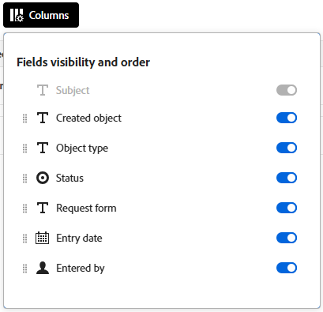

# Usa elenchi avanzati

In alcune aree di Adobe Workfront sono disponibili elenchi avanzati. Questi elenchi utilizzano un formato tabella per la visualizzazione delle voci di elenco e hanno un aspetto diverso rispetto agli elenchi standard. È stata migliorata anche la gestione delle viste, inclusi filtri, raggruppamenti, gestione delle colonne e ricerca.

Per informazioni sugli elenchi standard, vedere [Introduzione agli elenchi in Adobe Workfront](/help/quicksilver/workfront-basics/navigate-workfront/use-lists/view-items-in-a-list.md).

>[!NOTE]
>
>Ogni elenco avanzato può essere configurato in modo diverso per aiutarti a visualizzare i dati necessari. Ogni elenco non utilizzerà tutte le funzioni descritte in questo articolo e alcuni elenchi potrebbero avere funzioni specializzate che si applicano solo a tale elenco.

## Requisiti di accesso

+++ Espandi per visualizzare i requisiti di accesso per la funzionalità in questo articolo.

<table style="table-layout:auto">
 <col> 
 <col>
 <tbody> 
  <tr> 
   <td>Pacchetto Adobe Workfront</td> 
   <td>
Qualsiasi
</td> 
  </tr> 
  <tr> 
   <td>Licenza Adobe Workfront</td> 
   <td>
   
Collaboratore o versione successiva

   
Richiedi o superiore
</td>
  </tr>
 </tbody> 
</table>

Per informazioni, consulta [Requisiti di accesso nella documentazione di Workfront](/help/quicksilver/administration-and-setup/add-users/access-levels-and-object-permissions/access-level-requirements-in-documentation.md).

+++

## Oggetti che utilizzano elenchi avanzati

Di seguito sono riportati alcuni tipi di elenchi di oggetti di Workfront che utilizzano il formato elenco avanzato e alcune delle aree in cui vengono visualizzati per impostazione predefinita quando si dispone dei diritti per visualizzare l&#39;oggetto.

>[!NOTE]
>
>Questo elenco non è completo. Ciascuno di questi elenchi di oggetti può essere visualizzato anche in un report o in un dashboard. Ad esempio, un report di progetto o un dashboard contenente un report di progetto visualizza anche un elenco di progetti.

| Elenco Workfront | Posizione dell&#39;elenco di oggetti |
|--- |--- |
| Priorità | <ul><li>Home > seleziona l’icona Priorità nel menu a sinistra</li><li>Menu principale > Priorità</li></ul> |
| Elenco delle richieste | <ul><li>Richieste (solo nuova esperienza)</li><li>Widget Richieste personali sulla Home</li></ul> |
| Elenchi di stati, priorità, gravità e tassi di cambio in Configurazione | <ul><li>Configurazione > Preferenze progetto > Stati</li><li>Configurazione > Preferenze progetto > Priorità</li><li>Configurazione > Preferenze progetto > Gravità</li><li>Imposta > Preferenze progetto > Tassi di cambio</li></ul> |

## Aggiungere e modificare elementi in un elenco avanzato

A seconda della configurazione dell’elenco avanzato, ci possono essere due modi per aggiungere un elemento all’elenco:

* Fai clic su un pulsante sopra l’elenco. Questa opzione consente di aprire una finestra di dialogo in cui immettere le informazioni e salvarle.
* Fai clic su **Nuova riga** in fondo all&#39;elenco. Questa opzione consente di aggiungere una nuova riga alla tabella e di immettere le informazioni in ogni cella.

  Gli elenchi avanzati supportano i seguenti tipi di campi:

   * Testo
   * Numero
   * Valuta
   * Data
   * Data e ora
   * Menu a discesa a selezione singola/multipla
   * Automatico
   * Paragrafo
   * Assegnatario (uno o più)
   * Selettore colore

  Quando si modifica una cella, ogni tipo di campo ha le proprie opzioni di modifica.

Per modificare un elemento nell&#39;elenco, fare doppio clic nella cella che si desidera modificare e digitare le informazioni. Alcune celle possono essere di sola lettura.

## Utilizzare la barra delle azioni e il menu Altro in un elenco avanzato

Quando si seleziona la casella di controllo accanto a un elemento nell&#39;elenco avanzato, la barra delle azioni viene visualizzata nella parte inferiore dello schermo e mostra le azioni che è possibile eseguire sull&#39;elemento. Alcune azioni possono essere specifiche per tale elenco e non vengono visualizzate in nessun altro elenco.

>[!NOTE]
>
>Elenchi avanzati diversi possono consentire la selezione di un singolo elemento, la modifica in serie (selezione di più elementi) o la selezione di nessun elemento.

Fare clic su un pulsante sulla barra delle azioni per eseguire tale azione, ad esempio visualizzare la voce di elenco, eliminare la voce o modificarla.

Se non è disponibile alcuna azione per l&#39;elemento selezionato, la barra delle azioni indica &quot;Nessuna azione disponibile&quot;.

Il menu **Altro** è il menu a tre punti visualizzato accanto a un campo primario in una voce di elenco quando lo si passa con il mouse. Il campo principale è la colonna più a sinistra della tabella.

Fai clic sul menu per visualizzare le azioni aggiuntive per l’elemento. Alcune azioni possono essere specifiche per tale elenco e non vengono visualizzate in nessun altro elenco.

## Personalizzare le colonne in un elenco avanzato

Alcuni elenchi avanzati consentono di nascondere e visualizzare le colonne e di riordinarle.

1. Fai clic su **Colonne** sopra l&#39;elenco.

   

1. Utilizza i pulsanti per visualizzare o nascondere le colonne nell’elenco.
1. Per riordinare le colonne, fare clic sull&#39;icona **Trascina** e spostare una colonna nella posizione desiderata. Lo spostamento delle colonne determina la modifica automatica dell&#39;elenco.

   >[!NOTE]
   >
   >Il campo principale è la colonna più a sinistra della tabella. È fisso nella prima posizione e non è possibile modificarne la colonna. Se il numero di colonne è elevato, il campo principale viene bloccato a sinistra e quando scorri orizzontalmente lo visualizzerai sempre.
   >
   >L&#39;icona accanto al nome di un campo mostra il tipo di campo, ad esempio testo o campo data.

   Un indicatore viene visualizzato sul pulsante **Colonne** quando le colonne sono nascoste. L&#39;indicatore non viene visualizzato quando si riordinano le colonne.

   

## Applicare una visualizzazione a un elenco avanzato

Una vista è un set personalizzato di disposizioni e filtri di colonna che puoi applicare a un elenco. Potete creare nuove viste e modificare quelle esistenti.

Per applicare una visualizzazione, fare clic sul menu a discesa **Visualizzazioni** e selezionare la visualizzazione da applicare all&#39;elenco.

Per creare una nuova vista:

1. Fai clic sul menu a discesa **Visualizzazioni** e seleziona **Nuova visualizzazione**.
1. Immettere un nome per la visualizzazione e fare clic su **Crea**.
1. (Facoltativo) Nascondi, mostra o ridisponi le colonne. Per ulteriori informazioni, vedere [Personalizzare le colonne in un elenco avanzato](#customize-columns-in-an-enhanced-list).
1. (Facoltativo) Filtra e raggruppa le voci di elenco. Per ulteriori informazioni, vedere [Filtrare e raggruppare gli elementi in un elenco avanzato](#filter-and-group-items-in-an-enhanced-list).

   Le modifiche apportate alle viste vengono salvate automaticamente e sono visibili a tutti gli utenti della vista.

   Alla successiva applicazione di questa visualizzazione, le impostazioni delle colonne e dei filtri rimangono invariate.

## Filtrare e raggruppare gli elementi in un elenco avanzato

I filtri consentono di ridurre la quantità di informazioni visualizzate nell’elenco. I raggruppamenti separano gli oggetti dell&#39;elenco in aree basate su criteri specifici.

### Utilizzare i filtri

1. Fai clic su **Filtro** sopra l&#39;elenco.
1. Nella casella Filtro fare clic su **Aggiungi condizione**.
1. Seleziona un campo in base al quale filtrare.
1. Seleziona un modificatore di filtro, ad esempio &quot;Ha uno di&quot;, &quot;Non ha nessuno di&quot;, &quot;È prima&quot; o &quot;È dopo&quot;. Le opzioni del modificatore variano a seconda del tipo di campo in base al quale si sta filtrando.
1. Seleziona il valore o i valori del campo. A seconda del tipo di campo in base al quale si sta filtrando, è possibile che venga richiesto di selezionare l&#39;elemento da un elenco, cercarlo o utilizzare un calendario per selezionare un intervallo di date.

   

   Il filtro viene applicato automaticamente all’elenco.

1. Fare clic su **Aggiungi condizione** per aggiungere un&#39;altra condizione al filtro come istruzione OR.
1. Quando il filtro viene applicato, è possibile aprire nuovamente le opzioni **Filtro** per modificare le opzioni del filtro o cancellare tutti i filtri.

   Un indicatore viene visualizzato sul pulsante **Filtro** quando si applica un filtro all&#39;elenco.

   

### Utilizzare i raggruppamenti

1. Fai clic su **Gruppo** sopra l&#39;elenco.
1. Seleziona un raggruppamento per organizzare l’elenco.

   

1. Quando si applica il raggruppamento, è possibile aprire nuovamente le opzioni Raggruppa per comprimere o espandere tutti i raggruppamenti contemporaneamente, modificare il raggruppamento in base a un campo diverso o cancellare tutti i raggruppamenti.

   

   Un indicatore viene visualizzato sul pulsante **Gruppo** quando si applica un raggruppamento all&#39;elenco.

   

## Ordinare e cercare in un elenco avanzato

Per ordinare le singole colonne, passare alla colonna e fare clic sulla freccia giù. Un&#39;icona accanto al nome di una colonna indica che l&#39;elenco è ordinato in base ai valori della colonna e alla direzione dell&#39;ordinamento.

>[!NOTE]
>
>Alcune colonne potrebbero non essere ordinabili.

Per ordinare il lavoro all&#39;interno di un raggruppamento, apri **Gruppo** e seleziona se desideri ordinare in ordine crescente o decrescente.

Per eseguire la ricerca, digita il termine nel campo di ricerca sopra l’elenco. I risultati vengono evidenziati nell&#39;elenco durante la digitazione.

