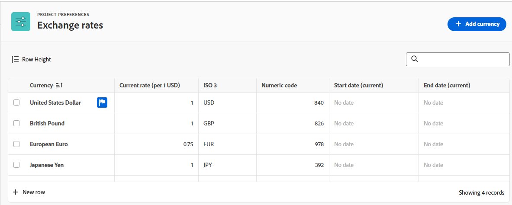

# Utilizzare gli elenchi avanzati

In alcune aree di Adobe Workfront sono disponibili elenchi avanzati. Questi elenchi utilizzano un formato tabella per la visualizzazione delle voci di elenco e hanno un aspetto diverso rispetto agli elenchi standard. È stata migliorata anche la gestione delle viste, inclusi filtri, raggruppamenti, gestione delle colonne e ricerca.

Per informazioni sugli elenchi standard, vedere [Introduzione agli elenchi in Adobe Workfront](/help/quicksilver/workfront-basics/navigate-workfront/use-lists/view-items-in-a-list.md).

>[!NOTE]
>
>Ogni elenco avanzato può essere configurato in modo diverso per aiutarti a visualizzare i dati necessari. Ogni elenco non utilizzerà tutte le funzioni descritte in questo articolo e alcuni elenchi potrebbero avere funzioni specializzate che si applicano solo a tale elenco.

## Requisiti di accesso

+++ Espandi per visualizzare i requisiti di accesso per la funzionalità descritta in questo articolo.

<table style="table-layout:auto">
 <col> 
 <col>
 <tbody> 
  <tr> 
   <td>Pacchetto Adobe Workfront</td> 
   <td>
Qualsiasi
</td> 
  </tr> 
  <tr> 
   <td>Licenza di Adobe Workfront</td> 
   <td>
   
Collaboratore o successiva

   
Richiedente o successiva
</td>
  </tr>
 </tbody> 
</table>

Per informazioni, consulta [Requisiti di accesso nella documentazione di Workfront](/help/quicksilver/administration-and-setup/add-users/access-levels-and-object-permissions/access-level-requirements-in-documentation.md).

+++

## Oggetti che utilizzano elenchi avanzati

Di seguito sono riportati alcuni tipi di elenchi di oggetti di Workfront che utilizzano il formato elenco avanzato e alcune delle aree in cui vengono visualizzati per impostazione predefinita quando si dispone dei diritti per visualizzare l&#39;oggetto.

>[!NOTE]
>
>Questo elenco non è completo. Ciascuno di questi elenchi di oggetti può essere visualizzato anche in un report o in un dashboard. Ad esempio, un rapporto Richieste o un dashboard che contiene un rapporto Richieste visualizza anche un elenco di richieste.

| Elenco Workfront | Posizione dell&#39;elenco di oggetti |
| --- | --- |
| Priorità | <ul><li>Home > seleziona l’icona Priorità nel menu a sinistra</li><li>Menu principale > Priorità</li></ul> |
| Elenco delle richieste | <ul><li>Richieste (solo nuova esperienza)</li><li>Widget Richieste personali sulla Home</li></ul> |
| Elenchi di stati, priorità, gravità e tassi di cambio in Configurazione | <ul><li>Configurazione > Preferenze progetto > Stati</li><li>Configurazione > Preferenze progetto > Priorità</li><li>Configurazione > Preferenze progetto > Gravità</li><li>Imposta > Preferenze progetto > Tassi di cambio</li></ul> |
| Elenco dei rapporti | I report (**Utilizza cartelle condivisibili** devono essere attivati) |
| List of job roles and rates on a rate card | Setup > Rate Cards > select a rate card > Job Roles and Rates |
| Elenco delle traduzioni | Configurazione > Localizzazione |
| List of snapshots | Progetto > Snapshot |
| Elenco delle risorse per la fatturazione | Project > Resource for Billing |
| New Advanced Assignments on a task | Task > Assignments > Advanced |
| Documenti sullo storage aziendale Adobe | Progetto, attività, problema, portfolio, modello di programma > Documenti |

## Aggiungere elementi a un elenco avanzato

Depending on which enhanced list you are viewing, do one of the following:

1. Click the blue button on the upper right of the list. Questa opzione consente di aprire una finestra di dialogo in cui è possibile immettere informazioni. I dati vengono salvati come nuova riga nella tabella.

   O

1. Click **New row** at the bottom of the list. Questa opzione aggiunge una nuova riga alla tabella. Fare doppio clic in una cella per immettere le informazioni in essa contenute. Ogni cella rappresenta un campo per la voce di elenco. I campi devono esistere prima che vengano visualizzati nell&#39;elenco.

   Enhanced lists support these field types:

   * Testo
   * Numero
   * Valuta
   * Data
   * Data e ora
   * Menu a discesa a selezione singola/multipla
   * Automatico
   * Paragrafo
   * Assegnatario (uno o più)
   * Selettore colore

   >[!NOTE]
   >
   >Ogni tipo di campo ha le proprie opzioni di modifica. Alcuni campi potrebbero essere di sola lettura.

## Modificare gli elementi utilizzando la barra delle azioni

È possibile utilizzare la barra delle azioni di un elenco avanzato per modificare gli elementi dell&#39;elenco. Non tutte le barre delle azioni includono le stesse opzioni. Inoltre, alcuni elenchi potrebbero non consentirti di selezionare elementi e la barra delle azioni non è disponibile.

1. Selezionare la casella di controllo accanto a un elemento in un elenco avanzato.

   La barra delle azioni viene visualizzata nella parte inferiore dello schermo.

   >[!NOTE]
   >
   >A seconda dell&#39;elenco che si modifica, è possibile selezionare uno o più elementi per utilizzare la barra delle azioni.

1. Fai clic su un’azione sulla barra per modificare gli elementi. Di seguito sono riportati alcuni esempi di azioni che è possibile scegliere:

   * Visualizzazione
   * Modifica
   * Elimina
   * Copia
   * Sposta nella cartella
   * Condividi

   Se non è disponibile alcuna azione per l&#39;elemento selezionato, sulla barra delle azioni viene visualizzato &quot;Nessuna azione disponibile&quot;.

   

1. Passa il puntatore del mouse sul campo principale di una voce di elenco, quindi fai clic sul menu **Altro**  per visualizzare ulteriori azioni. Alcune azioni possono essere specifiche per tale elenco.

   >[!TIP]
   >
   >Il campo principale viene visualizzato nella prima colonna dell’elenco.

   

## Personalizza colonne

A seconda degli oggetti visualizzati in un elenco avanzato, è possibile nascondere, visualizzare o riordinare le colonne dell&#39;elenco.

1. Fai clic su **Colonne** sopra l&#39;elenco.

   

1. Utilizza i pulsanti per visualizzare o nascondere le colonne nell’elenco.
1. Per riordinare le colonne, fare clic sull&#39;icona **Trascina**  e spostare una colonna nella posizione desiderata. Moving columns changes the list automatically.

   >[!NOTE]
   >
   >The primary field is the first column in the list. It is fixed in the first position, and you cannot change its column. If the number of columns is large, then the primary field is frozen to the left, and when you scroll horizontally you will always see it.
   >
   >The icon next to a field name shows the field type, such as text or date field.

   An indicator appears on the **Columns** button when columns are hidden. The indicator does not appear when you reorder columns.

   

### Rename columns

Some columns allow you to save a customized name for the column title.

1. Hover over the column, then click the down arrow and select **Rename**.

   

1. On the **Rename** dialog, type the name for the column in the **Custom label** field, and click **Save**.

   The new column name appears on the list.

### Add and remove columns with the Column manager

You can use the **Column manager** in some enhanced lists to easily add and remove columns on the list. You can add or remove both system and custom fields that already exist in Workfront as columns to an enhanced list.

To add and remove columns:

1. Click the + icon on the upper-right corner of the table to open the **Column manager** box.
1. Search for an existing object field in the **Available** column, then click + to the right of the field name it to add it to the **Selected** column.
1. Click - to the right of a field in the **Selected** column to remove it from the list.

   >[!NOTE]
   >
   >Some fields might be fixed and cannot be removed.

   <!-- Add info about Properties and KPIs when something gets released with those options -->

1. Fai clic su **Salva**.

   

   The list updates the columns according to the choices you made.

### Change the row height in a view

>[!NOTE]
>
>Not all enhanced lists have all the elements described in this section.

1. Click the **Row height** icon  in an enhanced list.

   This updates the vertical length of a row. Scegli una tra le opzioni seguenti:
   * Piccola
   * Standard. This is the default choice.
   * Canale
   * Alta

## Update enhanced list elements

The following elements are components of an enhanced list:

* **View**: Defines the columns, filters, and groupings in the list with preset settings
* **Filters**: Limits the amount of information displayed in the list
* **Groupings**: Organize the list items according to common fields
* **Sort**: Arranges the items in a list according to the order you identify for a given field
* **Search**: Quickly finds an item using a search keyword

### Apply and create views

>[!NOTE]
>
>Not all enhanced lists have all the elements described in this section.

To apply or create a view:

1. Click the **Views** dropdown and select an existing view to apply it to the list

   O

   Click **New view** to create one.

1. (Conditional) For adding a new view, enter a name for the view, then click **Create**.
1. (Optional) Hide, show, or rearrange the columns. For more information, see [Customize columns in an enhanced list](#customize-columns-in-an-enhanced-list).
1. (Optional) Filter the list. For more information, see [Filter items in an enhanced list](#filter-items-in-an-enhanced-list).
1. (Optional) Group the items in the list. For more information, see [Group items in an enhanced list](#group-items-in-an-enhanced-list).

   Le modifiche alle viste vengono salvate automaticamente. The next time you apply this view, the column and filter settings remain the way you set them.

### Condividere una visualizzazione

>[!NOTE]
>
>Not all enhanced lists have all the elements described in this section.

In the **Views** dropdown, you may see three categories of views:

* **System Views**: Views that the system administrator assigned to you. You cannot share System views.
* **Shared Views**: Views that have been shared with you by other users.
* **My Views**: Views that you created and can share with others. You can share views with other users, teams, or groups.

When you share a view, all of the view elements (columns, filters, and groupings) are included.

To share a view:

1. In the **Views** dropdown, hover over the view in **My Views** that you want to share, click the **More** menu , and click **Share**.
1. In the Share dialog, enter the names of the users, teams, groups, companies, or job roles that you want to share the view with, then select them from the list when they appear.

   You can give the following permissions to the recipients:

   * **View**: Users can apply the view to the list but not share it.

     When View access users update the view, those changes are saved to the user&#39;s personal preferences. A blue dot on the view name (in the user&#39;s **Shared Views**) shows that personal updates are applied to the view.

   * **Manage**: Users can rename, share, or delete the view, and edit the view&#39;s elements.

     When Manage access users make changes to the view, all users who have the view shared with them will see those updates when the view is applied to the list.

1. Fai clic su **Salva**.

   If you share a view with a user and then remove that access, the view is removed from the user&#39;s **Shared Views**. If the user had the shared view applied to the list when their access is removed, then the system default view is applied.

### Copy a view

>[!NOTE]
>
>Not all enhanced lists have all the elements described in this section.

When a view is shared with you to which you do not have permission to edit, you can copy the view and save it with a new name. You must first make changes to the view before you can copy it.

1. Nel menu a discesa Visualizzazioni, passa il puntatore del mouse sulla visualizzazione in **Visualizzazioni condivise** che hai modificato le impostazioni di e che desideri copiare, fai clic sul menu **Altro**  e fai clic su **Copia con preferenze**.

   Viene creata automaticamente una nuova vista. Il nome della visualizzazione copiata segue il seguente pattern: `Original view name (copy)`e viene visualizzato nella sezione **Visualizzazioni personali** delle visualizzazioni.

   L&#39;utente è il proprietario di questa visualizzazione e può rinominarla, modificarla, condividerla o eliminarla. Se il proprietario della visualizzazione originale rimuove l&#39;accesso condiviso a tale visualizzazione, sarà comunque possibile accedere alla visualizzazione creata copiando l&#39;originale condiviso.

   >[!NOTE]
   >
   >L&#39;opzione **Copia con preferenze** è disponibile solo se sono state apportate modifiche a una visualizzazione condivisa con l&#39;utente.

### Reimpostare una visualizzazione

>[!NOTE]
>
>Non tutti gli elenchi avanzati dispongono di tutti gli elementi descritti in questa sezione.

Quando una visualizzazione condivisa con l&#39;utente non dispone dell&#39;autorizzazione per la modifica e la si aggiorna, è possibile ripristinarla alla visualizzazione originale.

1. Nel menu a discesa **Visualizzazioni**, passa il puntatore del mouse sulla visualizzazione in **Visualizzazioni condivise** che desideri reimpostare, fai clic sul menu **Altro**  e fai clic su **Ripristina impostazioni predefinite**.

   Gli elementi di visualizzazione (colonne, filtri e raggruppamenti) vengono ripristinati alle impostazioni originali condivise con l’utente.

   >[!NOTE]
   >
   >L&#39;opzione **Ripristina impostazioni predefinite** è disponibile solo se sono state apportate modifiche a una visualizzazione condivisa con l&#39;utente corrente.

   

### Applicare la formattazione condizionale a una visualizzazione

>[!NOTE]
>
>Non tutti gli elenchi avanzati dispongono di tutti gli elementi descritti in questa sezione.

La formattazione condizionale consente di evidenziare informazioni importanti nella visualizzazione in base a criteri comuni.

1. Fare clic sull&#39;icona **Formatta celle** . Viene visualizzata la casella **Formato**.

1. Fai clic su **Aggiungi condizione**.
1. Nella riga **If**, selezionare un campo, scegliere un valore di campo e aggiungere un modificatore. I modificatori cambiano a seconda del tipo di campo scelto.

   >[!TIP]
   >
   >Solo i campi visibili nell’elenco avanzato sono disponibili per la formattazione condizionale.

1. (Facoltativo) Anziché aggiungere un valore di campo, fare clic sull&#39;icona **Confronta con un altro campo**  e scegliere un campo di cui si desidera confrontare il valore con il valore del campo selezionato. Ad esempio, è possibile confrontare i campi Oggetto e Descrizione negli elementi della richiesta.

   >[!TIP]
   >
   >Solo i campi visibili nella vista a elenco sono disponibili per la formattazione condizionale. I campi da confrontare devono essere dello stesso tipo.

1. (Facoltativo) Fai clic su **Aggiungi condizione** nella riga **If** per aggiungere altre condizioni alla stessa regola.

   >[!TIP]
   >
   >È possibile aggiungere fino a 10 condizioni in una regola di condizionamento e disporre di un massimo di 20 regole per un campo.

1. Fare clic sul connettore **Or** tra le condizioni per passare a **And** e indicare che è necessario soddisfare più condizioni contemporaneamente. **Or** è il connettore predefinito.
1. Nella riga **Formato** selezionare un campo per indicare la colonna da formattare.
1. (Facoltativo) Fai clic sull&#39;icona **cerchio colore**  accanto al campo selezionato, per espanderlo e scegliere un altro colore nell&#39;area **Riempimento cella** per modificare il colore dello sfondo in una cella o scegliere un colore dall&#39;area **Colore testo** per modificare il colore del testo in una cella.
1. Fai clic sull&#39;icona **Formato testo**  e seleziona una delle seguenti opzioni per formattare il testo in una cella:
   * Grassetto
   * Corsivo

1. Attivare l&#39;impostazione **Applica a riga** per applicare la formattazione all&#39;intera riga del campo che soddisfa le condizioni.

1. (Facoltativo) Fai clic su **Aggiungi condizione** nella casella **Formato** per aggiungere un&#39;altra regola per un altro campo e ripetere i passaggi precedenti.
1. (Facoltativo) Fai clic su **Cancella tutto** per rimuovere tutta la formattazione.
1. Fare clic all&#39;esterno della casella **Formato** per chiuderla.

   In questo modo si ritorna alla vista elenco.
La formattazione viene applicata immediatamente alla visualizzazione elenco.
Accanto all&#39;icona **Formatta celle** è presente un punto blu per indicare che alla visualizzazione è applicata una formattazione speciale.

### Filtrare gli elementi in un elenco avanzato

>[!NOTE]
>
>Non tutti gli elenchi avanzati dispongono di tutti gli elementi descritti in questa sezione.

I filtri consentono di ridurre la quantità di informazioni visualizzate nell’elenco.

1. Fai clic su **Filtro** sopra l&#39;elenco.
1. Nella casella Filtro fare clic su **Aggiungi condizione**.
1. Seleziona un campo in base al quale filtrare.
1. Seleziona un modificatore di filtro, ad esempio &quot;Ha uno di&quot;, &quot;Non ha nessuno di&quot;, &quot;È prima&quot; o &quot;È dopo&quot;. Le opzioni del modificatore variano a seconda del tipo di campo in base al quale si sta filtrando.
1. Seleziona il valore o i valori del campo. A seconda del tipo di campo in base al quale si sta filtrando, è possibile che venga richiesto di selezionare l&#39;elemento da un elenco, cercarlo o utilizzare un calendario per selezionare un intervallo di date.

   

   The filter is applied to the list automatically.

   >[!TIP]
   >
   >To apply a personalized filter, select one of the following options for a field value:
   >
   >* **Me (logged in user)** to refer to the logged in user in fields referring to users.
   >
   >* **My teams** or **My home team** to refer to your teams in fields referring to teams.
   >
   >* **My groups** or **My home group** to refer to your groups in fields referring to groups.
   >
   >* **My company** to refer to your company in fields referring to companies.
   > 
   >* **My roles** or **My primary role** to refer to your job roles in fields referring to roles.

1. Click **Add condition** to add another condition to the filter.

   You can join multiple filters by an AND or an OR connector.

1. When the filter is applied, you can open the **Filter** options again to change the filter options or clear all of the filters.

   An indicator appears on the **Filter** button when a filter is applied to the list.

   

### Group items in an enhanced list

>[!NOTE]
>
>Non tutti gli elenchi avanzati dispongono di tutti gli elementi descritti in questa sezione.

Groupings separate the objects on the list into areas based on specific criteria.

Workfront provides a limited number of predefined groupings and you cannot modify them.

1. Click **Grouping** above the list.
1. Select a grouping to organize your list.

   

1. Click **Collapse all** to display the list with all the groupings collapsed. The default option is to display the list with all groupings expanded.
1. When the grouping is applied, you can open the Group options again to collapse or expand all of the groupings at once, change the grouping to group by a different field, or clear all of the groupings.

   

   An indicator appears on the **Grouping** button when a grouping is applied to the list.

   

### Sort in an enhanced list

>[!NOTE]
>
>Non tutti gli elenchi avanzati dispongono di tutti gli elementi descritti in questa sezione.

To sort individual columns:

1. Hover over the column, then click the down arrow and select **Sort**.

   An icon next to a column name indicates that the list is sorted by the values in that column, and the direction of the sort.

   >[!NOTE]
   >
   >Some columns might not be sortable, depending on the list.

   

1. (Optional) To sort your work within a grouping, click **Grouping**, go to the line of the applied grouping, click on the sorter dropdown, and select an ascending or descending order.

   

   >[!TIP]
   >
   >The sorting order differs based on the field type you sort by.

### Search in an enhanced list

>[!NOTE]
>
>Non tutti gli elenchi avanzati dispongono di tutti gli elementi descritti in questa sezione.

1. Type a keyword you want search by in the Search box in the upper-right corner of the list. The results are highlighted in the list as you type.

   

   >[!NOTE]
   >
   >The search looks at all columns in all list items. If the list is long, the search includes items that you may need to scroll to see. When the list is filtered, the search only looks at what is currently displayed.

