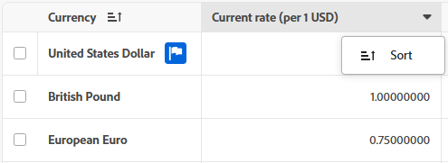

# Utilizzare gli elenchi avanzati

{{preview-fast-release-general}}

In alcune aree di Adobe Workfront sono disponibili elenchi avanzati. Questi elenchi utilizzano un formato tabella per la visualizzazione delle voci di elenco e hanno un aspetto diverso rispetto agli elenchi standard. È stata migliorata anche la gestione delle viste, inclusi filtri, raggruppamenti, gestione delle colonne e ricerca.

Per informazioni sugli elenchi standard, vedere [Introduzione agli elenchi in Adobe Workfront](/help/quicksilver/workfront-basics/navigate-workfront/use-lists/view-items-in-a-list.md).

>[!NOTE]
>
>Ogni elenco avanzato può essere configurato in modo diverso per aiutarti a visualizzare i dati necessari. Ogni elenco non utilizzerà tutte le funzioni descritte in questo articolo e alcuni elenchi potrebbero avere funzioni specializzate che si applicano solo a tale elenco.

## Requisiti di accesso

+++ Espandi per visualizzare i requisiti di accesso per la funzionalità descritta in questo articolo.

<table style="table-layout:auto">
 <col> 
 <col>
 <tbody> 
  <tr> 
   <td>Pacchetto Adobe Workfront</td> 
   <td>
Qualsiasi
</td> 
  </tr> 
  <tr> 
   <td>Licenza di Adobe Workfront</td> 
   <td>
   
Collaboratore o successiva

   
Richiedente o successiva
</td>
  </tr>
 </tbody> 
</table>

Per informazioni, consulta [Requisiti di accesso nella documentazione di Workfront](/help/quicksilver/administration-and-setup/add-users/access-levels-and-object-permissions/access-level-requirements-in-documentation.md).

+++

## Oggetti che utilizzano elenchi avanzati

Di seguito sono riportati alcuni tipi di elenchi di oggetti di Workfront che utilizzano il formato elenco avanzato e alcune delle aree in cui vengono visualizzati per impostazione predefinita quando si dispone dei diritti per visualizzare l&#39;oggetto.

>[!NOTE]
>
>Questo elenco non è completo. Ciascuno di questi elenchi di oggetti può essere visualizzato anche in un report o in un dashboard. Ad esempio, un rapporto Richieste o un dashboard che contiene un rapporto Richieste visualizza anche un elenco di richieste.

| Elenco Workfront | Posizione dell&#39;elenco di oggetti |
| --- | --- |
| Priorità | <ul><li>Home > seleziona l’icona Priorità nel menu a sinistra</li><li>Menu principale > Priorità</li></ul> |
| Elenco delle richieste | <ul><li>Richieste (solo nuova esperienza)</li><li>Widget Richieste personali sulla Home</li></ul> |
| Elenchi di stati, priorità, gravità e tassi di cambio in Configurazione | <ul><li>Configurazione > Preferenze progetto > Stati</li><li>Configurazione > Preferenze progetto > Priorità</li><li>Configurazione > Preferenze progetto > Gravità</li><li>Imposta > Preferenze progetto > Tassi di cambio</li></ul> |
| Elenco dei report | Menu principale > Rapporti 
Il formato elenco avanzato viene applicato solo quando è attivato **Usa cartelle condivisibili**. Per informazioni, vedere [Utilizzare cartelle di report condivisibili](/help/quicksilver/reports-and-dashboards/reports/report-usage/use-sharable-report-folders.md). |

## Aggiungere elementi a un elenco avanzato

A seconda dell’elenco avanzato che stai visualizzando, effettua una delle seguenti operazioni:

1. Fai clic sul pulsante blu in alto a destra dell’elenco. Questa opzione consente di aprire una finestra di dialogo in cui è possibile immettere informazioni. I dati vengono salvati come nuova riga nella tabella.

   O

1. Fai clic su **Nuova riga** in fondo all&#39;elenco. Questa opzione aggiunge una nuova riga alla tabella. Fare doppio clic in una cella per immettere le informazioni in essa contenute. Ogni cella rappresenta un campo per la voce di elenco. I campi devono esistere prima che vengano visualizzati nell&#39;elenco.

   Gli elenchi avanzati supportano i seguenti tipi di campi:

   * Testo
   * Numero
   * Valuta
   * Data
   * Data e ora
   * Menu a discesa a selezione singola/multipla
   * Automatico
   * Paragrafo
   * Assegnatario (uno o più)
   * Selettore colore

   >[!NOTE]
   >
   >Ogni tipo di campo ha le proprie opzioni di modifica. Alcuni campi potrebbero essere di sola lettura.

## Modificare gli elementi utilizzando la barra delle azioni

È possibile utilizzare la barra delle azioni di un elenco avanzato per modificare gli elementi dell&#39;elenco. Non tutte le barre delle azioni includono le stesse opzioni. Inoltre, alcuni elenchi potrebbero non consentirti di selezionare elementi e la barra delle azioni non è disponibile.

1. Selezionare la casella di controllo accanto a un elemento in un elenco avanzato.

   La barra delle azioni viene visualizzata nella parte inferiore dello schermo.

   >[!NOTE]
   >
   >A seconda dell&#39;elenco che si modifica, è possibile selezionare uno o più elementi per utilizzare la barra delle azioni.

1. Fai clic su un’azione sulla barra per modificare gli elementi. Di seguito sono riportati alcuni esempi di azioni che è possibile scegliere:

   * Visualizzazione
   * Modifica
   * Elimina

   Se non è disponibile alcuna azione per l&#39;elemento selezionato, sulla barra delle azioni viene visualizzato &quot;Nessuna azione disponibile&quot;.

   

1. Passa il puntatore del mouse sul campo principale di una voce di elenco, quindi fai clic sul menu **Altro**  per visualizzare ulteriori azioni. Alcune azioni possono essere specifiche per tale elenco.

   >[!TIP]
   >
   >Il campo principale viene visualizzato nella prima colonna dell’elenco.

   

## Personalizza colonne

A seconda degli oggetti visualizzati in un elenco avanzato, è possibile nascondere, visualizzare o riordinare le colonne dell&#39;elenco.

1. Fai clic su **Colonne** sopra l&#39;elenco.

   

1. Utilizza i pulsanti per visualizzare o nascondere le colonne nell’elenco.
1. Per riordinare le colonne, fare clic sull&#39;icona **Trascina**  e spostare una colonna nella posizione desiderata. Lo spostamento delle colonne determina la modifica automatica dell&#39;elenco.

   >[!NOTE]
   >
   >Il campo principale è la prima colonna dell&#39;elenco. È fisso nella prima posizione e non è possibile modificarne la colonna. Se il numero di colonne è elevato, il campo principale viene bloccato a sinistra e quando scorri orizzontalmente lo visualizzerai sempre.
   >
   >L&#39;icona accanto al nome di un campo mostra il tipo di campo, ad esempio testo o campo data.

   Un indicatore viene visualizzato sul pulsante **Colonne** quando le colonne sono nascoste. L&#39;indicatore non viene visualizzato quando si riordinano le colonne.

   

### Rinomina colonne

Alcune colonne consentono di salvare un nome personalizzato per il titolo della colonna.

1. Passa il puntatore del mouse sulla colonna, quindi fai clic sulla freccia giù e seleziona **Rinomina**.

   

1. Nella finestra di dialogo **Rinomina** digitare il nome della colonna nel campo **Etichetta personalizzata** e fare clic su **Salva**.

   Il nome della nuova colonna viene visualizzato nell&#39;elenco.

## Aggiungere e rimuovere colonne con Gestione colonne

È possibile utilizzare **Gestione colonne** in alcuni elenchi avanzati per aggiungere e rimuovere facilmente colonne nell&#39;elenco. È possibile aggiungere o rimuovere come colonne in un elenco avanzato sia i campi di sistema che quelli personalizzati già esistenti in Workfront.

Per aggiungere e rimuovere colonne:

1. Fai clic sull&#39;icona + nell&#39;angolo superiore destro della tabella per aprire la casella **Gestione colonne**.
1. Cerca un campo oggetto esistente nella colonna **Available**, quindi fai clic su + a destra del nome del campo per aggiungerlo alla colonna **Selected**.
1. Fare clic su - a destra di un campo nella colonna **Selezionato** per rimuoverlo dall&#39;elenco.

   >[!NOTE]
   >
   >Alcuni campi potrebbero essere corretti e non possono essere rimossi.

   <!-- Add info about Properties and KPIs when something gets released with those options -->

1. Fai clic su **Salva**.

   

   L’elenco aggiorna le colonne in base alle scelte effettuate.

## Aggiornare gli elementi dell’elenco avanzati

I seguenti elementi sono componenti di un elenco avanzato:

* Visualizza: definisce le colonne, i filtri e i raggruppamenti nell’elenco con le impostazioni predefinite
* Filtri: limita la quantità di informazioni visualizzate nell’elenco
* Raggruppamenti: organizza le voci di elenco in base ai campi comuni
* Ordina: dispone gli elementi di un elenco in base all&#39;ordine identificato per un determinato campo
* Ricerca: trova rapidamente un elemento utilizzando una parola chiave di ricerca

### Applicare e creare viste

>[!NOTE]
>
>Non tutti gli elenchi avanzati dispongono di tutti gli elementi descritti in questa sezione.

Per applicare o creare una vista:

1. Fai clic sul menu a discesa **Viste** e seleziona una vista esistente da applicare all&#39;elenco

   O

   Fai clic su **Nuova visualizzazione** per crearne una.

1. (Condizionale) Per aggiungere una nuova visualizzazione, immettere un nome per la visualizzazione, quindi fare clic su **Crea**.
1. (Facoltativo) Nascondi, mostra o ridisponi le colonne. Per ulteriori informazioni, vedere [Personalizzare le colonne in un elenco avanzato](#customize-columns-in-an-enhanced-list).
1. (Facoltativo) Filtra l’elenco. Per ulteriori informazioni, vedere [Filtrare gli elementi in un elenco avanzato](#filter-items-in-an-enhanced-list).
1. (Facoltativo) Raggruppa gli elementi nell’elenco. Per ulteriori informazioni, vedere [Raggruppare gli elementi in un elenco avanzato](#group-items-in-an-enhanced-list).

   Le modifiche alle viste vengono salvate automaticamente. Alla successiva applicazione di questa visualizzazione, le impostazioni delle colonne e dei filtri rimangono invariate.

### Filtrare gli elementi in un elenco avanzato

>[!NOTE]
>
>Non tutti gli elenchi avanzati dispongono di tutti gli elementi descritti in questa sezione.

I filtri consentono di ridurre la quantità di informazioni visualizzate nell’elenco.

1. Fai clic su **Filtro** sopra l&#39;elenco.
1. Nella casella Filtro fare clic su **Aggiungi condizione**.
1. Seleziona un campo in base al quale filtrare.
1. Seleziona un modificatore di filtro, ad esempio &quot;Ha uno di&quot;, &quot;Non ha nessuno di&quot;, &quot;È prima&quot; o &quot;È dopo&quot;. Le opzioni del modificatore variano a seconda del tipo di campo in base al quale si sta filtrando.
1. Seleziona il valore o i valori del campo. A seconda del tipo di campo in base al quale si sta filtrando, è possibile che venga richiesto di selezionare l&#39;elemento da un elenco, cercarlo o utilizzare un calendario per selezionare un intervallo di date.

   

   Il filtro viene applicato automaticamente all’elenco.

   >[!TIP]
   >
   >Per applicare un carattere jolly utente corrente, selezionare **Utente connesso** come valore del campo. Il filtro verrà quindi applicato all’utente che sta visualizzando l’elenco. Questo carattere jolly è disponibile nei campi in cui il valore è un utente.

1. Fare clic su **Aggiungi condizione** per aggiungere un&#39;altra condizione al filtro.

   È possibile unire più filtri tramite un connettore AND o OR.

1. Quando il filtro viene applicato, è possibile aprire nuovamente le opzioni **Filtro** per modificare le opzioni del filtro o cancellare tutti i filtri.

   Un indicatore viene visualizzato sul pulsante **Filtro** quando si applica un filtro all&#39;elenco.

   

### Raggruppa elementi in un elenco avanzato

>[!NOTE]
>
>Non tutti gli elenchi avanzati dispongono di tutti gli elementi descritti in questa sezione.

I raggruppamenti separano gli oggetti dell&#39;elenco in aree basate su criteri specifici.

Workfront fornisce un numero limitato di raggruppamenti predefiniti e non è possibile modificarli.

1. Fai clic su **Gruppo** sopra l&#39;elenco.
1. Seleziona un raggruppamento per organizzare l’elenco.

   

1. Fare clic su **Comprimi tutto** per visualizzare l&#39;elenco con tutti i raggruppamenti compressi. L’opzione predefinita consiste nel visualizzare l’elenco con tutti i raggruppamenti espansi.
1. Quando si applica il raggruppamento, è possibile aprire nuovamente le opzioni Raggruppa per comprimere o espandere tutti i raggruppamenti contemporaneamente, modificare il raggruppamento in base a un campo diverso o cancellare tutti i raggruppamenti.

   

   Un indicatore viene visualizzato sul pulsante **Gruppo** quando si applica un raggruppamento all&#39;elenco.

   

### Ordinare in un elenco avanzato

>[!NOTE]
>
>Non tutti gli elenchi avanzati dispongono di tutti gli elementi descritti in questa sezione.

Per ordinare le singole colonne:

1. Passa il puntatore del mouse sulla colonna, quindi fai clic sulla freccia giù e seleziona **Ordina**.

   Un&#39;icona accanto al nome di una colonna indica che l&#39;elenco è ordinato in base ai valori della colonna e alla direzione dell&#39;ordinamento.

   >[!NOTE]
   >
   >Alcune colonne potrebbero non essere ordinabili, a seconda dell’elenco.

   

Per ordinare il lavoro in un raggruppamento:

1. Fai clic su **Gruppo**, vai alla riga del raggruppamento applicato, fai clic sul menu a discesa dell&#39;ordinatore e seleziona un ordine crescente o decrescente.

   

### Cerca in un elenco avanzato

>[!NOTE]
>
>Non tutti gli elenchi avanzati dispongono di tutti gli elementi descritti in questa sezione.

1. digitare una parola chiave in base alla quale si desidera eseguire la ricerca nella casella Cerca nell&#39;angolo superiore destro dell&#39;elenco. I risultati vengono evidenziati nell&#39;elenco durante la digitazione.

   

   >[!NOTE]
   >
   >La ricerca esamina tutte le colonne di tutte le voci di elenco. Se l&#39;elenco è lungo, la ricerca include elementi che potrebbero essere necessari per scorrere. Quando l’elenco viene filtrato, la ricerca esamina solo ciò che è attualmente visualizzato.

### Condividere una visualizzazione

>[!NOTE]
>
>Non tutti gli elenchi avanzati dispongono di tutti gli elementi descritti in questa sezione.

Nel menu a discesa **Visualizzazioni**, è possibile visualizzare tre categorie di visualizzazioni:

* **Visualizzazioni di sistema**: visualizzazioni assegnate dall&#39;amministratore di sistema. Non è possibile condividere le visualizzazioni di sistema.
* **Visualizzazioni condivise**: visualizzazioni condivise con te da altri utenti.
* **Visualizzazioni personali**: visualizzazioni create e condivisibili con altri utenti. Puoi condividere le visualizzazioni con altri utenti, team o gruppi.

Quando si condivide una visualizzazione, vengono inclusi tutti gli elementi della visualizzazione (colonne, filtri e raggruppamenti).

Per condividere una visualizzazione:

1. Nel menu a discesa **Visualizzazioni**, passa il puntatore del mouse sulla visualizzazione in **Visualizzazioni personali** che desideri condividere, fai clic sul menu **Altro**  e fai clic su **Condividi**.
1. Nella finestra di dialogo Condividi, inserisci i nomi degli utenti, dei team, dei gruppi, delle aziende o dei ruoli con cui vuoi condividere la visualizzazione, quindi selezionali dall’elenco quando vengono visualizzati.

   Puoi assegnare le seguenti autorizzazioni ai destinatari:

   * **Visualizzazione**: gli utenti possono applicare la visualizzazione all&#39;elenco ma non condividerlo.

     Quando gli utenti con accesso in visualizzazione aggiornano la visualizzazione, le modifiche vengono salvate nelle preferenze personali dell&#39;utente. Un punto blu sul nome della visualizzazione (nelle **Viste condivise** dell&#39;utente) indica che alla visualizzazione sono applicati aggiornamenti personali.

   * **Gestisci**: gli utenti possono rinominare, condividere o eliminare la visualizzazione e modificarne gli elementi.

     Quando gli utenti di Gestione accesso apportano modifiche alla visualizzazione, tutti gli utenti che hanno la visualizzazione condivisa con loro visualizzeranno tali aggiornamenti quando la visualizzazione viene applicata all&#39;elenco.

1. Fai clic su **Salva**.

   Se si condivide una visualizzazione con un utente e quindi si rimuove tale accesso, la visualizzazione verrà rimossa dalle **visualizzazioni condivise** dell&#39;utente. Se all&#39;utente è stata applicata la visualizzazione condivisa quando viene rimosso il relativo accesso, viene applicata la visualizzazione predefinita di sistema.

### Copiare una visualizzazione

>[!NOTE]
>
>Non tutti gli elenchi avanzati dispongono di tutti gli elementi descritti in questa sezione.

Quando una visualizzazione condivisa con l&#39;utente non dispone dell&#39;autorizzazione per la modifica, è possibile copiarla e salvarla con un nuovo nome. È necessario apportare modifiche alla vista prima di poterla copiare.

1. Nel menu a discesa Visualizzazioni, passa il cursore sulla visualizzazione in **Visualizzazioni condivise** che desideri copiare, fai clic sul menu **Altro**  e fai clic su **Copia con preferenze**.

   Viene creata automaticamente una nuova vista. Utilizza il nome della visualizzazione originale con (copia) alla fine e viene visualizzato nella sezione **Visualizzazioni personali**.

   L&#39;utente è il proprietario di questa visualizzazione e può rinominarla, modificarla, condividerla o eliminarla. Se il proprietario della visualizzazione originale rimuove l&#39;accesso condiviso a tale visualizzazione, si dispone comunque dell&#39;accesso alla visualizzazione creata.

   >[!NOTE]
   >
   >L&#39;opzione **Copia con preferenze** è disponibile solo se sono state apportate modifiche a una visualizzazione condivisa con l&#39;utente.

### Reimpostare una visualizzazione

>[!NOTE]
>
>Non tutti gli elenchi avanzati dispongono di tutti gli elementi descritti in questa sezione.

Quando una visualizzazione condivisa con l&#39;utente non dispone dell&#39;autorizzazione per la modifica e la si aggiorna, è possibile ripristinarla alla visualizzazione originale.

1. Nel menu a discesa **Visualizzazioni**, passa il puntatore del mouse sulla visualizzazione in **Visualizzazioni condivise** che desideri reimpostare, fai clic sul menu **Altro**  e fai clic su **Ripristina impostazioni predefinite**.

   Gli elementi di visualizzazione (colonne, filtri e raggruppamenti) vengono ripristinati alle impostazioni originali condivise con l’utente.

   >[!NOTE]
   >
   >L&#39;opzione **Ripristina impostazioni predefinite** è disponibile solo se sono state apportate modifiche a una visualizzazione condivisa con l&#39;utente corrente.

   

