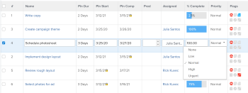

# Elementi di modifica in linea in un elenco in [!DNL Adobe Workfront]

È possibile modificare gli oggetti in linea quando vengono visualizzati in un elenco o in un rapporto. Quando si modificano le informazioni sugli oggetti visualizzati in un elenco o in un rapporto, l’oggetto viene aggiornato immediatamente.

Quando si modifica in linea un campo contenuto in un modulo personalizzato non associato all’oggetto, il modulo personalizzato viene aggiunto automaticamente all’oggetto. Se il campo esiste in più moduli personalizzati, all’oggetto viene associato il modulo personalizzato aggiornato più di recente.

Per ulteriori informazioni sugli elenchi, consulta [Guida introduttiva agli elenchi in [!DNL Adobe Workfront]](../../../workfront-basics/navigate-workfront/use-lists/view-items-in-a-list.md).

Mentre la maggior parte degli oggetti visualizzati in elenchi o rapporti è modificabile in linea in [!DNL Adobe Workfront], esistono alcune limitazioni, tra cui:

* Non è possibile modificare i campi calcolati o [!DNL Workfront] campi incorporati che sono calcoli.
* È possibile modificare solo i campi associati direttamente agli oggetti dell’elenco. Non è possibile modificare i campi che appartengono agli oggetti associati agli oggetti dell’elenco.\
   Ad esempio, è possibile modificare lo stato di un&#39;attività in un rapporto di attività, ma non è possibile modificare il nome del progetto a cui è associata l&#39;attività nello stesso rapporto. Puoi modificare il nome del progetto solo in un rapporto Progetto .
* Non è possibile inserire campi di modifica in linea quando la visualizzazione di un elenco non visualizza la valuta predefinita.\
   Per informazioni sulla visualizzazione della valuta predefinita, vedere la sezione [Modificare rapporti con valute univoche](../../../reports-and-dashboards/reports/creating-and-managing-reports/create-financial-data-reports-unique-exchange-rates.md#editing-reports-with-unique-currencies) nell&#39;articolo [Creare rapporti di dati finanziari con tassi di cambio univoci](../../../reports-and-dashboards/reports/creating-and-managing-reports/create-financial-data-reports-unique-exchange-rates.md).

* Non è possibile modificare i flag e le icone visualizzate in un elenco.

## Requisiti di accesso

Per eseguire i passaggi descritti in questo articolo, è necessario disporre dei seguenti diritti di accesso:

<table style="table-layout:auto"> 
 <col> 
 <col> 
 <tbody> 
  <tr> 
   <td role="rowheader"><strong>[!DNL Adobe Workfront] piano*</strong></td> 
   <td> 
Qualsiasi
 </td> 
  </tr> 
  <tr> 
   <td role="rowheader"><strong>[!DNL Adobe Workfront] licenza*</strong></td> 
   <td> 
[!UICONTROL Review] o versione successiva
 </td> 
  </tr> 
  <tr> 
   <td role="rowheader"><strong>Configurazioni a livello di accesso*</strong></td> 
   <td> 
Accesso all'area in cui si trova l'elenco
 
Ad esempio, per eseguire attività di modifica inline in un progetto, è necessario disporre dell’accesso [!UICONTROL Edit] (Modifica) a Progetti.
 
Nota: Se non hai ancora accesso, chiedi [!DNL Workfront] amministratore se imposta ulteriori restrizioni nel livello di accesso. Per informazioni su come [!DNL Workfront] l'amministratore può modificare il livello di accesso, vedi <a href="../../../administration-and-setup/add-users/configure-and-grant-access/create-modify-access-levels.md" class="MCXref xref">Creare o modificare livelli di accesso personalizzati</a>.
 </td> 
  </tr> 
  <tr> 
   <td role="rowheader"><strong>Autorizzazioni oggetto</strong></td> 
   <td> 
[!UICONTROL Manage]
 
È inoltre necessario disporre delle autorizzazioni per modificare alcuni campi, ad esempio campi personalizzati, stato e così via.
 
Per informazioni sulla richiesta di accesso aggiuntivo, vedi <a href="../../../workfront-basics/grant-and-request-access-to-objects/request-access.md" class="MCXref xref">Richiedere l’accesso agli oggetti </a>.
 </td> 
  </tr> 
 </tbody> 
</table>

&#42;Per sapere quale piano, tipo di licenza o accesso hai, contatta il tuo [!DNL Workfront] amministratore.

## Modifica oggetti in linea

1. Passare a un elenco di oggetti da modificare in linea.

   Nell’elenco devono essere visualizzati i campi che appartengono agli oggetti o ai campi che appartengono agli oggetti associati agli oggetti dell’elenco.

1. Individua l’oggetto da modificare, quindi fai clic all’interno di qualsiasi campo dell’elenco.

   >[!TIP]
   >
   >Se si dispone di più pagine, è possibile individuare un oggetto utilizzando:
   >
   >   
   >   
   >   * **Impaginazione**: Fai clic sulle frecce indietro e avanti per navigare tra le pagine.\
      >     Nell’angolo in basso a destra dell’elenco, il [!UICONTROL impaginazione] mentre scorri l’elenco, l’area rimane bloccata.
   >   * **Filtro rapido**: Fai clic sull’icona del filtro o digita Alt+F per aprire il filtro rapido, quindi immetti il testo per visualizzare solo gli elementi che contengono il testo inserito.\
      >     Il filtro rapido si trova nella barra degli strumenti dell’elenco. Per ulteriori informazioni, consulta [Applicare il filtro rapido a un elenco](../../../workfront-basics/navigate-workfront/use-lists/apply-quick-filter-list.md).

   Se è possibile modificare il campo, il campo e tutti gli altri campi visualizzati nell’elenco vengono trasformati in celle modificabili.

   

1. Modifica le informazioni all&#39;interno della cella, quindi premi [!UICONTROL Invio].

   >[!NOTE]
   >
   >Se è stato configurato un campo personalizzato per consentire la formattazione, è possibile applicare il grassetto, il corsivo o sottolineare al testo durante la modifica in linea del campo in un elenco aggiornato.\
   >Per informazioni sulla configurazione della formattazione per un campo personalizzato, vedere [Creare o modificare un modulo personalizzato](../../../administration-and-setup/customize-workfront/create-manage-custom-forms/create-or-edit-a-custom-form.md).\
   >Per informazioni sugli elenchi aggiornati, consulta la sezione &quot;La differenza tra gli elenchi aggiornati e quelli legacy&quot; nell’articolo [Guida introduttiva agli elenchi in [!DNL Adobe Workfront]](../../../workfront-basics/navigate-workfront/use-lists/view-items-in-a-list.md).

1. Press [!UICONTROL Scheda] per passare alla cella modificabile successiva.
1. (Condizionale) Se non riesci a salvare le modifiche e la cella è evidenziata in rosso, fai clic all’interno del campo per visualizzare il messaggio di convalida visualizzato accanto alla cella e apportare gli aggiornamenti necessari.

   Nella maggior parte dei casi, ciò si verifica quando si utilizza il formato errato o quando un campo obbligatorio viene lasciato vuoto.

1. Dopo aver modificato tutte le celle, premere [!UICONTROL Invio] per salvare le modifiche.
