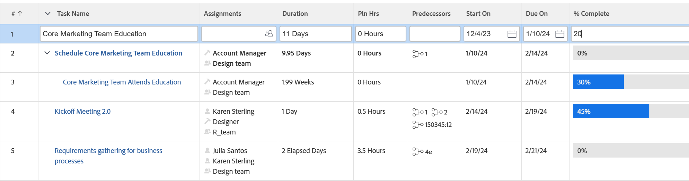

# Modifica in linea di elementi in un elenco in [!DNL Adobe Workfront]

È possibile modificare gli oggetti in linea quando vengono visualizzati in un elenco o in un report. Quando si modificano le informazioni sugli oggetti visualizzati in un elenco o in un report, l&#39;oggetto viene aggiornato immediatamente.

Quando si modifica in linea un campo contenuto in un modulo personalizzato non associato all’oggetto, il modulo personalizzato viene aggiunto automaticamente all’oggetto. Se il campo è presente in più moduli personalizzati, il modulo personalizzato aggiornato più di recente viene allegato all’oggetto.

Per ulteriori informazioni sugli elenchi, vedere [Introduzione agli elenchi in [!DNL Adobe Workfront]](../../../workfront-basics/navigate-workfront/use-lists/view-items-in-a-list.md).

Sebbene la maggior parte degli oggetti visualizzati negli elenchi o nei report sia modificabile in linea in [!DNL Adobe Workfront], esistono alcune limitazioni, tra cui:

* Non è possibile modificare i campi calcolati o [!DNL Workfront] campi incorporati che sono calcoli.
* È possibile modificare solo i campi associati direttamente agli oggetti dell&#39;elenco. Non è possibile modificare i campi che appartengono a oggetti associati agli oggetti dell&#39;elenco.\
   È ad esempio possibile modificare lo stato di un&#39;attività in un report attività, ma non il nome del progetto a cui l&#39;attività è associata nello stesso report. Puoi modificare il nome del progetto solo in un report di progetto.
* Non è possibile modificare i campi in linea quando nella visualizzazione di un elenco non è visualizzata la valuta predefinita.\
   Per informazioni sulla visualizzazione della valuta predefinita, vedere la sezione [Modificare i report con valute univoche](../../../reports-and-dashboards/reports/creating-and-managing-reports/create-financial-data-reports-unique-exchange-rates.md#editing-reports-with-unique-currencies) nell&#39;articolo [Creare report di dati finanziari con tassi di cambio univoci](../../../reports-and-dashboards/reports/creating-and-managing-reports/create-financial-data-reports-unique-exchange-rates.md).
* Non è possibile modificare i contrassegni e le icone visualizzate in un elenco.
* Non è possibile modificare in linea i campi del rapporto originati da altri rapporti.

## Requisiti di accesso

Per eseguire i passaggi descritti in questo articolo, è necessario disporre dei seguenti diritti di accesso:

<table style="table-layout:auto"> 
 <col> 
 <col> 
 <tbody> 
  <tr> 
   <td role="rowheader"><strong>[!DNL Adobe Workfront] piano*</strong></td> 
   <td> 
Qualsiasi
 </td> 
  </tr> 
  <tr> 
   <td role="rowheader"><strong>[!DNL Adobe Workfront] licenza*</strong></td> 
   <td> 
[!UICONTROL Review] o versione successiva
 </td> 
  </tr> 
  <tr> 
   <td role="rowheader"><strong>Configurazioni del livello di accesso*</strong></td> 
   <td> 
Accesso di [!UICONTROL Edit] all'area in cui si trova l'elenco
 
Ad esempio, per modificare le attività in linea in un progetto, è necessario l'accesso [!UICONTROL Edit] ai progetti.
 
Nota: se non disponi ancora dell'accesso, chiedi all'amministratore [!DNL Workfront] se ha impostato restrizioni aggiuntive nel tuo livello di accesso. Per informazioni su come un amministratore di [!DNL Workfront] può modificare il tuo livello di accesso, vedi <a href="../../../administration-and-setup/add-users/configure-and-grant-access/create-modify-access-levels.md" class="MCXref xref">Creare o modificare livelli di accesso personalizzati</a>.
 </td> 
  </tr> 
  <tr> 
   <td role="rowheader"><strong>Autorizzazioni oggetto</strong></td> 
   <td> 
[!UICONTROL Gestisci]
 
È inoltre necessario disporre delle autorizzazioni per modificare alcuni campi, ad esempio campi personalizzati, stato e così via.
 
Per informazioni sulla richiesta di accesso aggiuntivo, vedere <a href="../../../workfront-basics/grant-and-request-access-to-objects/request-access.md" class="MCXref xref">Richiedere l'accesso agli oggetti </a>.
 </td> 
  </tr> 
 </tbody> 
</table>

&#42;Per conoscere il piano, il tipo di licenza o l&#39;accesso di cui si dispone, contattare l&#39;amministratore [!DNL Workfront].

## Modifica oggetti in linea

1. Consente di passare a un elenco di oggetti che si desidera modificare in linea.

   Nell&#39;elenco devono essere visualizzati i campi che appartengono agli oggetti o i campi che appartengono agli oggetti associati agli oggetti dell&#39;elenco.

1. Individuare l&#39;oggetto che si desidera modificare, quindi fare clic all&#39;interno di qualsiasi campo dell&#39;elenco.

   >[!TIP]
   >
   >Se si dispone di più pagine, è possibile individuare un oggetto utilizzando:
   >
   >   
   >   
   >   * **Paginazione**: fare clic sulle frecce indietro e avanti per spostarsi tra le pagine.\
   >     Nell&#39;angolo in basso a destra dell&#39;elenco, l&#39;area [!UICONTROL pagination] rimane fissa durante lo scorrimento dell&#39;elenco.
   >   * **Filtro rapido**: fare clic sull&#39;icona del filtro o digitare Alt+F per aprire il filtro rapido, quindi immettere il testo per visualizzare solo gli elementi che contengono il testo immesso.\
   >     Il filtro rapido si trova nella barra degli strumenti elenco. Per ulteriori informazioni, vedere [Applicare il filtro rapido a un elenco](../../../workfront-basics/navigate-workfront/use-lists/apply-quick-filter-list.md).

   Se il campo può essere modificato, il campo e tutti gli altri campi visualizzati nell’elenco diventano celle modificabili.

   

1. Modificare le informazioni all&#39;interno della cella, quindi premere [!UICONTROL Invio].

   >[!NOTE]
   >
   >Se un campo personalizzato è stato configurato per consentire la formattazione, è possibile applicare il grassetto, il corsivo o il testo sottolineato quando si modifica il campo in linea in un elenco aggiornato.
   >Per informazioni sulla configurazione della formattazione per un campo personalizzato, vedere [Creare un modulo personalizzato](/help/quicksilver/administration-and-setup/customize-workfront/create-manage-custom-forms/form-designer/design-a-form/design-a-form.md).
   >Per informazioni sugli elenchi aggiornati, vedere la sezione &quot;Differenza tra gli elenchi aggiornati e quelli legacy&quot; nell&#39;articolo [Introduzione agli elenchi in [!DNL Adobe Workfront]](../../../workfront-basics/navigate-workfront/use-lists/view-items-in-a-list.md).

1. Premi [!UICONTROL Tab] per passare alla cella modificabile successiva.
1. (Condizionale) Se non riesci a salvare le modifiche e la cella è evidenziata in rosso, fai clic all’interno del campo per rivedere il messaggio di convalida visualizzato accanto alla cella e apportare gli aggiornamenti appropriati.

   Nella maggior parte dei casi, questo accade quando si utilizza il formato errato o un campo obbligatorio viene lasciato vuoto.

1. Dopo aver modificato tutte le celle, premi [!UICONTROL Invio] per salvare le modifiche.
