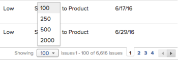

# Modificare la modalità di visualizzazione di un elenco

<!--Audited: 11/2024-->

In [!DNL Adobe Workfront] è possibile personalizzare la visualizzazione di un elenco. Gli altri utenti che visualizzano l&#39;elenco non visualizzano le modifiche.

Puoi effettuare le seguenti personalizzazioni:

* Numero di elementi visualizzati
* Larghezza o ordine delle colonne
* Se i raggruppamenti sono espansi o compressi

>[!NOTE]
>
>Le modifiche apportate alla visualizzazione di cui sopra vengono ripristinate quando si esce da [!DNL Workfront] o si chiude il browser. Queste modifiche possono anche essere ripristinate dopo un periodo di 8 ore.

Oltre alle personalizzazioni temporanee di cui sopra, è anche possibile regolare in base a quali colonne l&#39;elenco viene ordinato, che [!DNL Workfront] mantiene anche dopo la disconnessione o la chiusura del browser. Tuttavia, se qualcuno modifica le opzioni di ordinamento nella vista di un elenco, la selezione di ordinamento precedente non viene mantenuta.

Per informazioni sulla modifica delle informazioni visualizzate nell&#39;elenco, vedere [Elementi di reporting: filtri, visualizzazioni e raggruppamenti](../../../reports-and-dashboards/reports/reporting-elements/reporting-elements-filters-views-groupings.md).

## Requisiti di accesso

+++ Espandi per visualizzare i requisiti di accesso per la funzionalità in questo articolo. 

<table style="table-layout:auto"> 
 <col> 
 <col> 
 <tbody> 
  <tr> 
   <td role="rowheader">Pacchetto Adobe Workfront</td> 
   <td> 
Qualsiasi
 </td> 
  </tr> 
  <tr> 
   <td role="rowheader">Licenza Adobe Workfront</td> 
   <td> 
   
Collaboratore o versione successiva 

   
Richiedi o superiore

   </td> 
  </tr> 
  <tr> 
   <td role="rowheader">Configurazioni del livello di accesso</td> 
   <td> 
Accesso [!UICONTROL View] all'area in cui si trova l'elenco
 
Ad esempio, per modificare la visualizzazione di un progetto, è necessario accedere alla visualizzazione [!UICONTROL] dei progetti.
</td> 
  </tr> 
  <tr> 
   <td role="rowheader">Autorizzazioni oggetto</td> 
   <td> 
Autorizzazioni di [!UICONTROL View] o superiori per la visualizzazione applicata all'elenco
  </td> 
  </tr> 
 </tbody> 
</table>

Per informazioni, consulta [Requisiti di accesso nella documentazione di Workfront](/help/quicksilver/administration-and-setup/add-users/access-levels-and-object-permissions/access-level-requirements-in-documentation.md).

+++

## Modificare un elenco

1. Passare all&#39;elenco in [!DNL Workfront] che si desidera modificare.

   <!--
   
 
   <MadCap:conditionalText data-mc-conditions="QuicksilverOrClassic.Draft mode">
   By default, groupings are collapsed.
   </MadCap:conditionalText>
     

   -->

1. (Facoltativo e condizionale) Se i raggruppamenti nell’elenco sono compressi e si desidera visualizzare ulteriori informazioni, fare clic sul raggruppamento desiderato per espandere l’elenco e visualizzare le informazioni in esso elencate.

   Oppure

   Per espandere tutti i raggruppamenti, fare clic sulla freccia a destra della casella di controllo nell&#39;intestazione di colonna.

   

1. (Facoltativo e condizionale) Se desideri visualizzare un numero specifico di elementi sullo schermo, fai clic sul menu a discesa **[!UICONTROL Visualizzazione]** nell&#39;angolo inferiore destro dello schermo, quindi seleziona per visualizzare **100**, **250**, **500**, **[!UICONTROL Tutti]** o **2000** elementi.

   

   >[!TIP]
   >
   >Per impostazione predefinita, vengono visualizzati 2.000 elementi per gli elenchi aggiornati e 100 elementi per gli elenchi legacy. Se l&#39;elenco contiene più di 2.000 elementi, non è possibile visualizzare tutti gli elementi in una sola pagina.
   >
   >
   >Per ottenere prestazioni ottimali in elenchi di grandi dimensioni in cui gli oggetti contengono campi di testo formattato, si consiglia di limitare questo numero a 250.
   >
   >
   >Per ulteriori informazioni sui 2 tipi di elenchi, vedere la sezione [Differenza tra gli elenchi aggiornati e quelli legacy](../../../workfront-basics/navigate-workfront/use-lists/view-items-in-a-list.md#updated) nell&#39;articolo [Introduzione agli elenchi in [!DNL Adobe Workfront]](../../../workfront-basics/navigate-workfront/use-lists/view-items-in-a-list.md).

   I risultati dell’elenco sono impaginati in modo da mostrare il numero di elementi selezionati per pagina. È possibile accedere ai risultati su altre pagine facendo clic sulle frecce indietro e avanti oppure selezionando una pagina specifica.

1. Per ridimensionare la larghezza di una colonna, posizionare il mouse sulla linea che separa 2 colonne, quindi fare clic per trascinarla fino alla larghezza desiderata.

   La colonna viene ridimensionata finché non cancelli la cache nel browser o finché non la ridimensioni manualmente di nuovo.

1. Per riordinare le colonne di un elenco, posizionare il mouse su un&#39;intestazione di colonna per visualizzare lo strumento mano, quindi fare clic per trascinare la colonna nel punto in cui si desidera visualizzarla.

   La posizione della colonna viene salvata fino all’aggiornamento della pagina.

   Per ulteriori informazioni sulla personalizzazione della larghezza e dell&#39;ordine delle colonne in un elenco, vedere l&#39;articolo [Modificare la larghezza e l&#39;ordine delle colonne](../../../reports-and-dashboards/reports/reporting-elements/modify-column-width-order.md).

1. Per modificare l&#39;ordinamento di un elenco, fare clic su un&#39;intestazione di colonna per selezionarla, quindi premere e tenere premuto il tasto CMD (su [!DNL Mac]) o CTRL (su [!DNL Windows]) sulla tastiera e selezionare fino a 2 intestazioni di colonna aggiuntive in base alle quali eseguire l&#39;ordinamento.

   L&#39;elenco viene ordinato in base a ciascuna delle colonne selezionate nell&#39;ordine della selezione.

   Tutte le modifiche apportate all&#39;elenco vengono salvate immediatamente.

   >[!NOTE]
   >
   >Se si ordinano i gruppi nell&#39;area [!UICONTROL Gruppi] in [!UICONTROL Configurazione], la visualizzazione gerarchica dei gruppi e dei relativi sottogruppi non viene interrotta quando si modifica l&#39;ordinamento dell&#39;elenco. I sottogruppi rimangono con i gruppi padre. L’elenco viene ordinato prima in base ai gruppi di primo livello. Quindi, sotto ogni gruppo principale, l’elenco dei sottogruppi che si trovano sullo stesso livello viene ordinato insieme.
