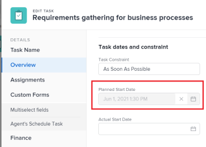

# Panoramica delle date del progetto, dell’attività e del problema in [!DNL Adobe Workfront]

<!--

(NOTE: consider expanding on this article with ALL dates for PTIs - Hand off dates, Approval Dates, etc) 

-->

Questo articolo fornisce definizioni delle date più comuni associate a progetti, attività e problemi in [!DNL Adobe Workfront]. Le immagini qui incluse sono esempi di luoghi in cui le date vengono visualizzate in Workfront e non sono esaustive. Ci sono altre aree che mostrano le date. Tutte le date sono visibili anche in progetti, attività, rapporti ed elenchi di problemi.

Per informazioni sui rapporti e gli elenchi, consulta i seguenti articoli:

* [Guida introduttiva agli elenchi in [!DNL Adobe Workfront]](../../../workfront-basics/navigate-workfront/use-lists/view-items-in-a-list.md)
* [Guida introduttiva ai rapporti in [!DNL Adobe Workfront]](../../../reports-and-dashboards/reports/reporting/get-started-reports-workfront.md)

Per ulteriori informazioni sui campi del progetto, delle attività e dei problemi, consulta [Glossario di [!DNL Adobe Workfront] terminologia](../../../workfront-basics/navigate-workfront/workfront-navigation/workfront-terminology-glossary.md).

## [!UICONTROL Data di inizio pianificata]

La [!UICONTROL Data di inizio prevista] è la data in cui è pianificato l&#39;avvio di un progetto, un&#39;attività o un problema.

A seconda del [!UICONTROL Vincolo attività], potrebbe non essere possibile modificare il [!UICONTROL Data di inizio prevista] di un&#39;attività. A seconda del [!UICONTROL Modalità di pianificazione] del progetto, potrebbe non essere possibile modificare il [!UICONTROL Data di inizio prevista] di un progetto.

Per ulteriori informazioni, consulta [Panoramica del progetto [!UICONTROL Data di inizio prevista]](../../../manage-work/projects/planning-a-project/project-planned-start-date.md).

## [!UICONTROL Data di completamento Pianificata]

La [!UICONTROL Data completamento pianificata] o [!UICONTROL Data di scadenza] data è la data in cui un progetto, un&#39;attività o un problema è pianificato per il completamento.

A seconda del [!UICONTROL Vincolo attività], potrebbe non essere possibile modificare il [!UICONTROL Data completamento pianificata] di un&#39;attività. A seconda del [!UICONTROL Modalità di pianificazione] del progetto, potrebbe non essere possibile modificare il [!UICONTROL Data completamento pianificata] di un progetto.

La [!UICONTROL Data completamento pianificata] viene visualizzato come Data di scadenza in alcune aree di [!DNL Workfront].

Per ulteriori informazioni, consulta i seguenti articoli:

* [Panoramica dell’attività [!UICONTROL Data completamento pianificata]](../../../manage-work/tasks/task-information/task-planned-completion-date.md)
* [Imposta il progetto [!UICONTROL Data completamento pianificata]](../../../manage-work/projects/planning-a-project/project-planned-completion-date.md)
* [Panoramica del problema [!UICONTROL Data completamento pianificata]](../../../manage-work/issues/issue-information/issue-planned-completion-date.md)

## [!UICONTROL Data inserimento]

La [!UICONTROL Data di ingresso] è la data in cui è stato creato un progetto, un&#39;attività o un problema in Workfront.

La [!UICONTROL Data di ingresso] non influenza la cronologia di progetti, attività o problemi, ma è importante a scopo di tracciamento e reporting. [!DNL Workfront] genera automaticamente il [!UICONTROL Data di ingresso] quando l’oggetto viene creato e non è possibile modificarlo manualmente.

## [!UICONTROL Data di inizio effettiva]

La [!UICONTROL Data di inizio effettiva] è la data in cui un utente inizia effettivamente a lavorare su un progetto, un&#39;attività o un problema. La [!UICONTROL Data di inizio effettiva] è vuoto quando viene creato il progetto, l&#39;attività o il problema.

È possibile indicare manualmente quando è stato avviato un lavoro su un&#39;attività o un problema, oppure [!UICONTROL Data di inizio effettiva] viene compilato automaticamente quando lo stato dell&#39;attività o del problema cambia da [!UICONTROL Nuovo] a [!UICONTROL In corso] o [!UICONTROL Completa]. La [!UICONTROL Data di inizio effettiva] di un progetto coincide con la data di inizio della prima attività del progetto.

>[!TIP]
>
>La [!UICONTROL Data di inizio effettiva] potrebbero non corrispondere a [!UICONTROL Data di inizio prevista] di un progetto, un&#39;attività o un problema perché l&#39;utente può iniziare a lavorare in un secondo momento o prima della data prevista.

Per ulteriori informazioni, consulta [Panoramica del progetto [!UICONTROL Data di inizio effettiva]](../../../manage-work/projects/planning-a-project/project-actual-start-date.md).

>[!NOTE]
>
>La [!UICONTROL Deve iniziare] o i vincoli di date fisse influiscono sul [!UICONTROL Data di inizio prevista] di un&#39;attività, non il [!UICONTROL Data di inizio effettiva]. Questo aggiorna la [!UICONTROL Data di inizio prevista] a una data specificata. La [!UICONTROL Data di inizio effettiva] viene aggiornato indipendentemente dal [!UICONTROL Data di inizio prevista], come descritto in precedenza.

## [!UICONTROL Data di completamento effettiva]

La [!UICONTROL Data completamento effettivo] è la data in cui un utente completa effettivamente un progetto, un&#39;attività o un problema. La [!UICONTROL Data completamento effettivo] è vuoto quando viene creato il progetto, l&#39;attività o il problema.

È possibile indicare manualmente quando il lavoro viene completato su un&#39;attività o su un problema, oppure [!UICONTROL Data effettiva di completamento] viene compilato automaticamente quando si verifica una delle situazioni seguenti:

* Lo stato del progetto, dell&#39;attività o del problema viene modificato in [!UICONTROL Completa], [!UICONTROL Chiuso]oppure [!UICONTROL Risolto].
* La percentuale di completamento dell’attività o del progetto è del 100%.

La [!UICONTROL Data completamento effettivo] di un progetto coincide con la data di completamento della prima attività del progetto.

>[!TIP]
>
>La [!UICONTROL Data completamento effettivo] potrebbero non corrispondere al [!UICONTROL Data completamento pianificata].

Per ulteriori informazioni, consulta [Panoramica del progetto [!UICONTROL Data completamento effettivo]](../../../manage-work/projects/planning-a-project/project-actual-completion-date.md).

## [!UICONTROL Conferma data]

La [!UICONTROL Data impegno] è la data in cui un utente assegnato a un&#39;attività o a un problema si impegna a completare l&#39;attività o il problema. È diverso dal [!UICONTROL Data completamento pianificata], in quanto si tratta di una stima più realistica della data di completamento fornita solo dall&#39;utente responsabile dell&#39;opera. Per ulteriori informazioni, consulta [[!UICONTROL Data impegno] panoramica](../../../manage-work/projects/updating-work-in-a-project/overview-of-commit-dates.md).

>[!NOTE]
>
>Modifica della [!UICONTROL Data impegno] influenza [!UICONTROL Data di completamento prevista] ma non [!UICONTROL Data completamento pianificata] di un&#39;attività o di un problema. Il project manager può utilizzare le modifiche apportate da un assegnatario al [!UICONTROL Data impegno] per aggiornare [!UICONTROL Data completamento pianificata] di un&#39;attività o di un problema.

## [!UICONTROL Data di inizio prevista]

La [!UICONTROL Data di inizio prevista] è una data in tempo reale in cui il progetto, l’attività o il problema vengono generati e tiene conto di tutti i ritardi. Si tratta di una data di inizio più precisa per il progetto, l&#39;attività o il problema rispetto alla [!UICONTROL Data di inizio prevista]. La [!UICONTROL Data di inizio prevista] non tiene conto dei ritardi o delle date passate.

Quando pianifichi un progetto per la prima volta, la [!UICONTROL Data di inizio prevista] e [!UICONTROL Data di inizio prevista] dei compiti e del progetto sono identici. Poiché potrebbero verificarsi ritardi o potrebbero essere completati prima i compiti, la [!UICONTROL Data di inizio prevista] può diventare diverso da [!UICONTROL Data di inizio prevista].

Per un’attività, un [!UICONTROL Data di inizio prevista] può anche differire da [!UICONTROL Data di inizio prevista] quando uno dei suoi predecessori è in ritardo.

>[!TIP]
>
>È possibile visualizzare [!UICONTROL Data di inizio prevista] di un problema solo in un elenco o report.

Per ulteriori informazioni, consulta [Panoramica del progetto [!UICONTROL Data di inizio prevista]](../../../manage-work/projects/planning-a-project/project-projected-start-date.md).

## P[!UICONTROL data di completamento proiettata]

La [!UICONTROL Data di completamento prevista] è un indicatore calcolato in tempo reale che indica quando il progetto, l’attività o il problema verrà completato. Quando il progetto, l&#39;attività o il problema sono contrassegnati come Completato, il [!UICONTROL Data di completamento prevista] modifiche alla data del [!UICONTROL Data completamento effettivo].

Se tutto va liscio e come pianificato il [!UICONTROL Data di completamento prevista] deve corrispondere a [!UICONTROL Data completamento pianificata]. In caso contrario, a causa dei ritardi sui compiti predecessori, [!UICONTROL Data di completamento prevista] potrebbe diventare diverso da [!UICONTROL Data completamento pianificata].

Per ulteriori informazioni, consulta [Panoramica [!UICONTROL Data di completamento prevista] per progetti, attività e problemi](../../../manage-work/projects/planning-a-project/project-projected-completion-date.md).

## [!UICONTROL Data ingresso ora]

Quando si registra il tempo per progetti, attività e problemi per indicare il tempo effettivo (in ore) impiegato per lavorare sul progetto, sull&#39;attività o sul problema, il tempo di log diventa il [!UICONTROL Ore effettive] del progetto, dell&#39;attività o del problema.

La data di registrazione dell&#39;ora è la [!UICONTROL Data ingresso ora] campo sulla voce dell&#39;ora.

>[!TIP]
>
>La [!UICONTROL Data ingresso ora] è diverso da [!UICONTROL Data di ingresso] in quanto non si tratta della data di creazione del registro ore, ma piuttosto della data a cui si desidera associare le ore.

È possibile registrare l&#39;ora nel [!UICONTROL progetto], [!UICONTROL compito]oppure [!UICONTROL Aggiornamenti dei problemi] o nella sezione [!UICONTROL Ore] sezione . Quando si registra il tempo in [!UICONTROL Ore] sezione , puoi specificare manualmente la data di immissione ora e l’utente a cui appartengono le ore.

Per ulteriori informazioni, consulta [Tempo di log](../../../timesheets/create-and-manage-timesheets/log-time.md).

>[!TIP]
>
>È consigliabile impostare il tempo di accesso sulle attività e sui problemi di lavoro, anziché sulle attività o sui progetti padre. Il tempo connesso alle attività di lavoro viene eseguito fino alle attività principali e il progetto viene eseguito come [!UICONTROL Ore effettive] per le attività principali e il progetto. Il tempo di accesso ai problemi viene eseguito fino al progetto come [!UICONTROL Ore effettive] per il progetto.

È possibile visualizzare [!UICONTROL Date di ingresso ore] rapporti e elenchi in ore.

