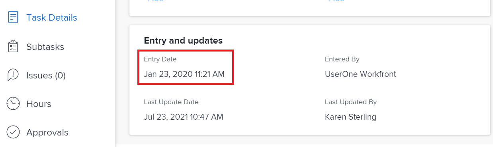
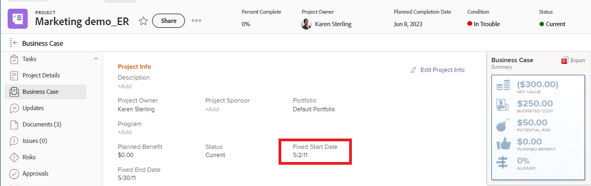

# Panoramica delle date di Progetto, Attività e Problema in [!DNL Workfront]

<!-- Audited: 05/2024 -->

<!--consider expanding on this article with ALL dates for PTIs - Hand off dates, Approval Dates, etc-->

<!-- there are dates below that need definition - ask Product-->

In questo articolo vengono fornite le definizioni delle date più comuni associate ai progetti, alle attività e ai problemi in [!DNL Adobe Workfront]. Le immagini qui incluse sono esempi di date non esaustive visualizzate in Workfront. Altre aree visualizzano le date. Tutte le date sono visibili anche nei report ed elenchi di progetti, attività e problemi.

Per informazioni sui report e gli elenchi, vedere i seguenti articoli:

* [Introduzione agli elenchi in [!DNL Adobe Workfront]](../../../workfront-basics/navigate-workfront/use-lists/view-items-in-a-list.md)
* [Introduzione ai rapporti](../../../reports-and-dashboards/reports/reporting/get-started-reports-workfront.md)

Per ulteriori informazioni sui campi relativi a progetti, attività e problemi, vedere [Glossario della [!DNL Adobe Workfront] terminologia](../../../workfront-basics/navigate-workfront/workfront-navigation/workfront-terminology-glossary.md).

## [!UICONTROL Data di inizio effettiva]

La [!UICONTROL data di inizio effettiva] è la data in cui un utente inizia effettivamente a lavorare su un progetto, un&#39;attività o un problema. La [!UICONTROL data di inizio effettiva] è vuota al momento della creazione del progetto, dell&#39;attività o del problema.

Puoi indicare manualmente quando il lavoro è iniziato per un&#39;attività o per un problema, oppure la [!UICONTROL Data di inizio effettiva] si popola automaticamente quando lo stato dell&#39;attività o del problema cambia da [!UICONTROL Nuovo] a [!UICONTROL In corso] o [!UICONTROL Completo]. La [!UICONTROL data di inizio effettiva] di un progetto coincide con la data di inizio della prima attività del progetto.

>[!TIP]
>
>La [!UICONTROL data di inizio effettiva] potrebbe non corrispondere a una [!UICONTROL data di inizio pianificata] di un progetto, attività o problema perché l&#39;utente potrebbe iniziare a lavorare più tardi o prima della data pianificata.

Per ulteriori informazioni, vedere [Panoramica del progetto [!UICONTROL Data di inizio effettiva]](../../../manage-work/projects/planning-a-project/project-actual-start-date.md).

>[!NOTE]
>
>L&#39;attività [!UICONTROL Deve iniziare il] o i vincoli di Date fisse influiscono sulla [!UICONTROL Data inizio pianificata] di un&#39;attività, non sulla [!UICONTROL Data inizio effettiva]. La [!UICONTROL Data inizio pianificata] viene aggiornata a una data specificata. La [!UICONTROL Data inizio effettiva] è aggiornata indipendentemente dalla [!UICONTROL Data inizio pianificata], come descritto in precedenza.

## [!UICONTROL Data di completamento Effettiva]

La [!UICONTROL data di completamento effettiva] è la data in cui un utente completa effettivamente un progetto, un&#39;attività o un problema. La [!UICONTROL Data di completamento effettiva] è vuota al momento della creazione del progetto, dell&#39;attività o del problema.

Puoi indicare manualmente quando il lavoro viene completato per un&#39;attività o un problema, oppure la [!UICONTROL Data di completamento effettiva] si popola automaticamente quando si verifica una delle seguenti situazioni:

* Lo stato del progetto, dell&#39;attività o del problema cambia in [!UICONTROL Completo], [!UICONTROL Chiuso] o [!UICONTROL Risolto].
* La percentuale di completamento dell&#39;attività o del progetto è 100%.

La [!UICONTROL data di completamento effettiva] di un progetto coincide con la data in cui è stata completata l&#39;ultima attività del progetto.

>[!TIP]
>
>La [!UICONTROL data di completamento effettiva] potrebbe non corrispondere alla [!UICONTROL data di completamento pianificata].

Per ulteriori informazioni, vedere [Panoramica del progetto [!UICONTROL Data di completamento effettiva]](../../../manage-work/projects/planning-a-project/project-actual-completion-date.md).

## Data di completamento percorso di approvazione

La data di completamento del percorso di approvazione è la data in cui è stata concessa l&#39;approvazione di un progetto, attività o problema e lo stato dell&#39;elemento è stato modificato.

La data di completamento del percorso di approvazione è visibile negli elenchi e nei rapporti relativi a progetti, attività e problemi.

## Data di inizio percorso di approvazione

La data di inizio del percorso di approvazione è la data in cui lo stato del progetto, dell&#39;attività o del problema è cambiato in &quot;In attesa di approvazione&quot; e la richiesta di approvazione del progetto è stata inviata agli approvatori.

La data di inizio del percorso di approvazione è visibile negli elenchi e nei rapporti relativi a progetti, attività e problemi.

<!--## Auto Closure Date -->

## Data di completamento preventivata

Campo obsoleto per i progetti. Tutte le informazioni che questo campo può visualizzare in un elenco o in un report sono correlate a una funzionalità rimossa da Workfront. Impossibile aggiornare questo campo.

Il campo è visibile nei report e negli elenchi del progetto.

## Data di Inizio preventivata

Campo obsoleto per i progetti. Qualsiasi informazione visualizzata in questo campo è relativa a una funzione rimossa da Workfront. Impossibile aggiornare questo campo.

Il campo è visibile nei report e negli elenchi del progetto.

## [!UICONTROL Data commit]

La [!UICONTROL Data commit] è la data entro la quale un utente assegnato a un&#39;attività o a un problema si impegna a completare l&#39;attività o il problema. Questa è diversa dalla [!UICONTROL Data di completamento pianificata], in quanto è una stima più realistica della data di completamento fornita solo dall&#39;utente responsabile del lavoro. Per ulteriori informazioni, vedere [[!UICONTROL Panoramica sulla data di conferma]](../../../manage-work/projects/updating-work-in-a-project/overview-of-commit-dates.md).

>[!NOTE]
>
>La modifica della [!UICONTROL Data di completamento] influisce sulla [!UICONTROL Data di completamento prevista] ma non sulla [!UICONTROL Data di completamento pianificata] di un&#39;attività o di un problema. Il project manager può utilizzare le modifiche apportate dall&#39;assegnatario alla [!UICONTROL Data commit] per aggiornare la [!UICONTROL Data completamento pianificata] di un&#39;attività o di un problema.

<!--## Completion Pending Date-->

## Data Vincolata

Se si utilizza un vincolo attività associato a una data specifica, tale data diventa la data vincolo dell&#39;attività.

I seguenti vincoli di attività aggiornano il campo Data vincolo:

* Deve ininziare al
* Deve Finire al
* Iniziare non Dopo di
* Iniziare non Prima di

>[!TIP]
>
>Un&#39;attività con un vincolo di date fisse non ha una data vincolo.
>

La Data vincolo è visibile in un elenco di attività o in un report.

## Data voce problema convertito

La data in cui è stato creato il problema convertito nel progetto o nell’attività.

La Data di inserimento problema convertita è visibile negli elenchi e nei rapporti dei progetti e delle attività.

## Data di scadenza

La data in cui un’attività o un problema deve essere completato. La data di scadenza di un&#39;attività o di un problema corrisponde alla data di completamento pianificata.

La data di scadenza dell’attività e del problema è visibile negli elenchi e nei rapporti delle attività e dei problemi.

Per informazioni, consulta la sezione [Data di completamento pianificata](#planned-completion-date) in questo articolo.

## Scade il

La data in cui il progetto deve essere completato. La data di scadenza di un progetto corrisponde alla data di completamento pianificata del progetto.

La data di scadenza del progetto è visibile negli elenchi e nei rapporti dei progetti.

Per informazioni, consulta la sezione [Data di completamento pianificata](#planned-completion-date) in questo articolo.

## [!UICONTROL Data di ingresso]

La [!UICONTROL Data di ingresso] è la data di creazione di un progetto, un&#39;attività o un problema in [!DNL Workfront].

La [!UICONTROL Data di ingresso] non influenza la sequenza temporale di progetti, attività o problemi, ma è importante a scopo di tracciamento e reporting. [!DNL Workfront] genera automaticamente la [!UICONTROL Data immissione] quando l&#39;oggetto viene creato e non è possibile modificarlo manualmente.

## Data di Consegna Stimato

La Data di scadenza prevista per l&#39;attività e il progetto mostra una data più realistica di completamento del progetto o dell&#39;attività.

Le date stimate sono più in linea con la realtà del progetto e dell&#39;attività, in quanto tengono conto di ciò che influenza il completamento effettivo del progetto o dell&#39;attività. Le date di scadenza stimate sono simili alle date di completamento previste.

Per ulteriori informazioni, vedere [Panoramica sulle date previste e stimate](/help/quicksilver/manage-work/tasks/task-information/differentiate-projected-estimated-dates.md).

Le Date di scadenza stimate per il progetto e l&#39;attività sono visibili negli elenchi e nei rapporti relativi al progetto e alle attività.

## Data di Inizio Stimato

La data di inizio prevista dell&#39;attività e del progetto mostra una data più realistica di inizio del progetto o dell&#39;attività.

Le date stimate sono più in linea con la realtà del progetto e dell&#39;attività, in quanto tengono conto di ciò che influenza l&#39;inizio effettivo del progetto o dell&#39;attività. Le date di inizio stimate sono simili alle date di inizio previste.

Per ulteriori informazioni, vedere [Panoramica sulle date previste e stimate](/help/quicksilver/manage-work/tasks/task-information/differentiate-projected-estimated-dates.md).

Le Date di Inizio previste per il progetto e l&#39;attività sono visibili negli elenchi e nei report dei progetti e delle attività.

<!--## Exchange Rate Date-->

## Data di Fine Fisso

Il richiedente o il proprietario del progetto identifica la data di fine fissa di un progetto al completamento del Business Case. Si tratta della data entro la quale consigliano di completare il progetto.

Si tratta di una stima manuale che non tiene conto dell&#39;avanzamento effettivo delle attività del progetto.

La Data di fine fissata di un progetto è visibile nella sezione Caso di business del progetto, nonché negli elenchi e nei rapporti dei progetti.

## Data di Inizio Fisso

Il richiedente o il proprietario del progetto identifica la data di inizio fissa di un progetto al completamento del Business Case. Si tratta della data entro la quale consigliano di avviare il progetto.

Si tratta di una stima manuale che non tiene conto dell&#39;avanzamento effettivo delle attività del progetto.

La data di inizio fissa di un progetto è visibile nella sezione Caso di business del progetto, nonché negli elenchi e nei rapporti dei progetti.

## Data del Handoff

Data in cui un&#39;attività diventa disponibile per il lavoro. Ciò significa che tutti i vincoli, le approvazioni e le dipendenze sono stati completati e che gli utenti possono iniziare a lavorare sull&#39;attività.

La data di handoff è un calcolo e non può essere impostata manualmente.

Per ulteriori informazioni sulla data di handoff, vedere [Panoramica sulla data di handoff dell&#39;attività](/help/quicksilver/manage-work/tasks/task-information/handoff-task-date.md).

La data di handoff di un&#39;attività è visibile negli elenchi delle attività e nei report.

## Data ultimo aggiornamento finanza

La data in cui una qualsiasi delle informazioni finanziarie su un progetto è stata aggiornata. Ciò include l&#39;aggiornamento dei campi finanziari nella sezione Finanza o nella sezione Caso di business del progetto.

La Data ultimo aggiornamento finanza è visibile negli elenchi e nei report dei progetti.

## Data ultimo aggiornamento

Data dell’ultimo aggiornamento del progetto, dell’attività o del problema. Per aggiornamento si intende qualsiasi modifica che attiva il salvataggio di un progetto, un’attività o un problema. Ciò include modifiche di stato, condizione, cronologia, dati finanziari o qualsiasi altro campo.

La data dell’ultimo aggiornamento è visibile negli elenchi e nei rapporti relativi a progetti, attività e problemi.

## [!UICONTROL Data immissione ore]

Quando si registra tempo per progetti, attività e problemi per indicare il tempo effettivo (in ore) dedicato al progetto, all&#39;attività o al problema, il tempo registrato diventa [!UICONTROL Ore effettive] del progetto, dell&#39;attività o del problema.

La data per la quale si registra l&#39;ora è il campo [!UICONTROL Hour Entry Date] (Data immissione ore) nella voce dell&#39;ora.

La data di immissione ore è visibile negli elenchi e nei rapporti delle ore.

>[!TIP]
>
>La [!UICONTROL Data di ingresso] di un&#39;ora è diversa dalla [!UICONTROL Data di ingresso] di un altro oggetto Workfront, in quanto non corrisponde alla data di creazione del registro ore, ma alla data a cui si desidera associare le ore.
>
>Ad esempio, è possibile registrare le ore per un&#39;attività il 5 settembre, ma associarle al 1 settembre. La data di immissione dell&#39;ora è il 1° settembre.

Per informazioni su come registrare l&#39;ora in Workfront, vedere [Registra ora](../../../timesheets/create-and-manage-timesheets/log-time.md).

>[!TIP]
>
>È consigliabile registrare il tempo dedicato alle attività e ai problemi di lavoro anziché alle attività o ai progetti principali. Il tempo registrato per le attività in corso viene aggregato alle attività padre e al progetto come [!UICONTROL Ore effettive] per le attività padre e il progetto. L&#39;ora registrata per i problemi viene riportata al progetto come [!UICONTROL Ore effettive] per il progetto.

## [!UICONTROL Data di completamento Pianificata]

La [!UICONTROL data di completamento pianificata] o la [!UICONTROL data di scadenza] è la data in cui è pianificato il completamento di un progetto, un&#39;attività o un problema.

A seconda del [!UICONTROL Vincolo attività], potrebbe non essere possibile modificare la [!UICONTROL Data di completamento pianificata] di un&#39;attività. A seconda della [!UICONTROL Modalità pianificazione] del progetto, potrebbe non essere possibile modificare la [!UICONTROL Data completamento Pianificata] di un progetto.

La [!UICONTROL Data di completamento pianificata] viene visualizzata come data di scadenza in alcune aree di [!DNL Workfront].

Per ulteriori informazioni, consulta i seguenti articoli:

* [Panoramica dell&#39;attività [!UICONTROL Data di completamento pianificata]](../../../manage-work/tasks/task-information/task-planned-completion-date.md)
* [Imposta il progetto [!UICONTROL Data di completamento pianificata]](../../../manage-work/projects/planning-a-project/project-planned-completion-date.md)
* [Panoramica del problema [!UICONTROL Data di completamento pianificata]](../../../manage-work/issues/issue-information/issue-planned-completion-date.md)

## Allineamento date pianificate

Questo è un indicatore automatico che Workfront assegna progetti, attività e problemi per mostrare quando un elemento verrà completato in relazione alla sua Data di completamento pianificata.

Di seguito sono riportati i valori possibili per l&#39;indicatore Allineamento data pianificata:

* Verrà eseguito il giorno della data di completamento pianificata
* Verrà eseguito prima della data di completamento pianificata
* Verrà eseguito dopo la data di completamento pianificata

L’Allineamento data pianificata è visibile negli elenchi e nei rapporti relativi a progetti, attività e problemi.

## [!UICONTROL Data inizio pianificata]

La [!UICONTROL Data inizio pianificata] è la data pianificata per l&#39;inizio di un progetto, un&#39;attività o un problema.

A seconda del [!UICONTROL Vincolo attività], potrebbe non essere possibile modificare la [!UICONTROL Data inizio pianificata] di un&#39;attività. A seconda della [!UICONTROL Modalità pianificazione] del progetto, potrebbe non essere possibile modificare la [!UICONTROL Data inizio pianificata] di un progetto.

Per ulteriori informazioni, vedere [Panoramica del progetto [!UICONTROL Data inizio pianificata]](../../../manage-work/projects/planning-a-project/project-planned-start-date.md).

## [!UICONTROL Data di completamento Prevista]

La [!UICONTROL Data di completamento prevista] è un indicatore calcolato in tempo reale di quando il progetto, l&#39;attività o il problema verrà completato. Quando il progetto, l&#39;attività o il problema è contrassegnato come Completato, la [!UICONTROL Data di completamento prevista] cambia alla data della [!UICONTROL Data di completamento effettiva].

Se tutto procede come previsto, la [!UICONTROL data di completamento prevista] deve corrispondere alla [!UICONTROL data di completamento pianificata]. In caso contrario, a causa dei ritardi sulle attività predecessore, la [!UICONTROL Data di completamento prevista] potrebbe diventare diversa dalla [!UICONTROL Data di completamento pianificata].

Per ulteriori informazioni, vedere [Panoramica della [!UICONTROL Data di completamento prevista] per progetti, attività e problemi](../../../manage-work/projects/planning-a-project/project-projected-completion-date.md).

## [!UICONTROL Data Inizio Prevista]

La [!UICONTROL Data inizio prevista] è una data in tempo reale di inizio del progetto, dell&#39;attività o del problema e tiene conto di tutti i ritardi. Questa è una data di inizio più precisa per il progetto, l&#39;attività o il problema rispetto alla [!UICONTROL data di inizio pianificata]. La [!UICONTROL Data inizio pianificata] non tiene conto dei ritardi o delle date passate.

Quando pianifichi un progetto per la prima volta, la [!UICONTROL Data inizio pianificata] e la [!UICONTROL Data inizio prevista] delle attività e del progetto sono identiche. Poiché potrebbero verificarsi ritardi o il completamento delle attività potrebbe essere anticipato, la [!UICONTROL Data inizio prevista] può diventare diversa dalla [!UICONTROL Data inizio pianificata].

Per un&#39;attività, anche una [!UICONTROL Data inizio prevista] può differire dalla [!UICONTROL Data inizio pianificata] quando uno dei suoi predecessori è in ritardo rispetto alla pianificazione.

>[!TIP]
>
>Puoi visualizzare la [!UICONTROL Data di inizio prevista] di un problema solo in un elenco o in un report.

Per ulteriori informazioni, vedere [Panoramica del progetto [!UICONTROL Data di inizio prevista]](../../../manage-work/projects/planning-a-project/project-projected-start-date.md).

<!--## Rejection Date-->

## Slack Date

A volte le attività possono iniziare e completare in ritardo senza influire sulla data di completamento del progetto.

In Data Slack viene visualizzata la data esatta in cui un&#39;attività potrebbe effettivamente influire sulla Data di completamento del progetto.

Per informazioni sulla data di Slack di un&#39;attività, vedere [Panoramica sulla data di Slack attività](/help/quicksilver/manage-work/tasks/task-information/task-slack-date.md).

Le date di Slack delle attività sono visibili negli elenchi delle attività e nei report.

## Inizia il

Data pianificata di inizio del progetto. La data di inizio di un progetto corrisponde alla data di inizio pianificata del progetto.

Questo campo è visibile negli elenchi e nei report dei progetti.

Per informazioni, consulta la sezione [Data inizio pianificata](#planned-start-date) in questo articolo.

