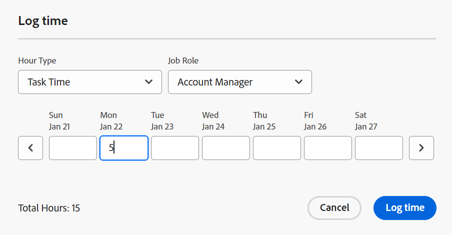

# Panoramica delle date di Progetto, Attività e Problema in [!DNL Workfront]

<!-- Audited: 05/2024 -->

<!--

(NOTE: consider expanding on this article with ALL dates for PTIs - Hand off dates, Approval Dates, etc) 

-->

Questo articolo fornisce le definizioni delle date più comuni associate ai progetti, alle attività e ai problemi in [!DNL Adobe Workfront]. Le immagini qui incluse sono esempi di date non esaustive visualizzate in Workfront. Altre aree visualizzano le date. Tutte le date sono visibili anche nei report ed elenchi di progetti, attività e problemi.

Per informazioni sui report e gli elenchi, vedere i seguenti articoli:

* [Introduzione agli elenchi in [!DNL Adobe Workfront]](../../../workfront-basics/navigate-workfront/use-lists/view-items-in-a-list.md)
* [Introduzione ai rapporti](../../../reports-and-dashboards/reports/reporting/get-started-reports-workfront.md)

Per ulteriori informazioni sui campi relativi a progetti, attività e problemi, consulta [Glossario di [!DNL Adobe Workfront] terminologia](../../../workfront-basics/navigate-workfront/workfront-navigation/workfront-terminology-glossary.md).

## [!UICONTROL Data Inizio Pianificata]

Il [!UICONTROL Data Inizio Pianificata] è la data pianificata per l’inizio di un progetto, un’attività o un problema.

A seconda della [!UICONTROL Vincolo attività], potrebbe non essere possibile modificare [!UICONTROL Data Inizio Pianificata] di un&#39;attività. A seconda della [!UICONTROL Modalità Schedule] del progetto, potrebbe non essere possibile modificare i [!UICONTROL Data Inizio Pianificata] di un progetto

Per ulteriori informazioni, consulta [Panoramica del progetto [!UICONTROL Data Inizio Pianificata]](../../../manage-work/projects/planning-a-project/project-planned-start-date.md).

## [!UICONTROL Data di completamento Pianificata]

Il [!UICONTROL Data di completamento Pianificata] o [!UICONTROL Scade il] data è la data pianificata per il completamento di un progetto, un&#39;attività o un problema.

A seconda della [!UICONTROL Vincolo attività], potrebbe non essere possibile modificare [!UICONTROL Data di completamento Pianificata] di un&#39;attività. A seconda della [!UICONTROL Modalità Schedule] del progetto, potrebbe non essere possibile modificare i [!UICONTROL Data di completamento Pianificata] di un progetto

Il [!UICONTROL Data di completamento Pianificata] viene visualizzato come data di scadenza in alcune aree di [!DNL Workfront].

Per ulteriori informazioni, consulta i seguenti articoli:

* [Panoramica dell’attività [!UICONTROL Data di completamento Pianificata]](../../../manage-work/tasks/task-information/task-planned-completion-date.md)
* [Imposta il progetto [!UICONTROL Data di completamento Pianificata]](../../../manage-work/projects/planning-a-project/project-planned-completion-date.md)
* [Panoramica del problema [!UICONTROL Data di completamento Pianificata]](../../../manage-work/issues/issue-information/issue-planned-completion-date.md)

## [!UICONTROL Data immissione]

Il [!UICONTROL Data immissione] è la data di creazione di un progetto, un’attività o un problema in Workfront.

Il [!UICONTROL Data immissione] non influenza la tempistica di progetti, attività o problemi, ma è importante a scopo di tracciamento e reporting. [!DNL Workfront] genera automaticamente il [!UICONTROL Data immissione] quando l&#39;oggetto viene creato e non è possibile modificarlo manualmente.

## [!UICONTROL Data d&#39;Inizio Reale]

Il [!UICONTROL Data d&#39;Inizio Reale] è la data in cui un utente inizia effettivamente a lavorare su un progetto, un’attività o un problema. Il [!UICONTROL Data d&#39;Inizio Reale] è vuoto quando si crea il progetto, l’attività o il problema.

È possibile indicare manualmente quando si inizia a lavorare su un’attività o un problema, oppure [!UICONTROL Data d&#39;Inizio Reale] si popola automaticamente quando lo stato dell’attività o del problema cambia da [!UICONTROL Nuovo] a [!UICONTROL In corso] o [!UICONTROL Completa]. Il [!UICONTROL Data d&#39;Inizio Reale] di un progetto coincide con la data di inizio della prima attività.

>[!TIP]
>
>Il [!UICONTROL Data d&#39;Inizio Reale] potrebbe non corrispondere a un [!UICONTROL Data Inizio Pianificata] di un progetto, attività o problema, perché l’utente potrebbe iniziare a lavorare in un momento successivo o precedente alla data pianificata.

Per ulteriori informazioni, consulta [Panoramica del progetto [!UICONTROL Data d&#39;Inizio Reale]](../../../manage-work/projects/planning-a-project/project-actual-start-date.md).

>[!NOTE]
>
>Il [!UICONTROL Deve iniziare il] o i vincoli di Date Fisse influiscono sulla [!UICONTROL Data Inizio Pianificata] di un&#39;attività, non il [!UICONTROL Data d&#39;Inizio Reale]. Questo aggiorna il [!UICONTROL Data Inizio Pianificata] a una data specificata. Il [!UICONTROL Data d&#39;Inizio Reale] viene aggiornato indipendentemente dal [!UICONTROL Data Inizio Pianificata], come descritto in precedenza.

## [!UICONTROL Data di completamento effettiva]

Il [!UICONTROL Data di completamento effettiva] è la data in cui un utente completa effettivamente un progetto, un’attività o un problema. Il [!UICONTROL Data di completamento effettiva] è vuoto quando si crea il progetto, l’attività o il problema.

Puoi indicare manualmente quando viene completato il lavoro su un’attività o un problema, oppure [!UICONTROL Data di completamento effettiva] compila automaticamente quando si verifica una delle seguenti situazioni:

* Lo stato di progetto, attività o problema cambia in [!UICONTROL Completa], [!UICONTROL Chiuso], o [!UICONTROL Risolto].
* La percentuale di completamento dell&#39;attività o del progetto è 100%.

Il [!UICONTROL Data di completamento effettiva] di un progetto coincide con la data di completamento dell&#39;ultima attività del progetto.

>[!TIP]
>
>Il [!UICONTROL Data di completamento effettiva] potrebbe non corrispondere al [!UICONTROL Data di completamento Pianificata].

Per ulteriori informazioni, consulta [Panoramica del progetto [!UICONTROL Data di completamento effettiva]](../../../manage-work/projects/planning-a-project/project-actual-completion-date.md).

## [!UICONTROL Conferma data]

Il [!UICONTROL Conferma data] è la data entro la quale un utente assegnato a un’attività o a un problema si impegna a completare l’attività o il problema. Questo è diverso dal [!UICONTROL Data di completamento Pianificata], in quanto si tratta di una stima più realistica della data di completamento fornita solo dall&#39;utente responsabile del lavoro. Per ulteriori informazioni, consulta [[!UICONTROL Conferma data] panoramica](../../../manage-work/projects/updating-work-in-a-project/overview-of-commit-dates.md).

>[!NOTE]
>
>Modifica del [!UICONTROL Conferma data] influisce sulla [!UICONTROL Data di completamento Prevista] ma non il [!UICONTROL Data di completamento Pianificata] di un’attività o di un problema. Il project manager può utilizzare le modifiche apportate dall&#39;assegnatario al [!UICONTROL Conferma data] per aggiornare [!UICONTROL Data di completamento Pianificata] di un’attività o di un problema.

## [!UICONTROL Data Inizio Previsto]

Il [!UICONTROL Data Inizio Previsto] è una data in tempo reale di inizio del progetto, dell’attività o del problema e tiene conto di tutti i ritardi. Questa è una data di inizio più precisa per il progetto, l&#39;attività o il problema rispetto alla [!UICONTROL Data Inizio Pianificata]. Il [!UICONTROL Data Inizio Pianificata] non tiene conto dei ritardi o delle date passate.

Quando pianifichi un progetto per la prima volta, il [!UICONTROL Data Inizio Pianificata] e [!UICONTROL Data Inizio Previsto] delle attività e del progetto sono identici. Poiché si possono verificare ritardi o è possibile che le attività vengano completate prima, il [!UICONTROL Data Inizio Previsto] può diventare diverso da [!UICONTROL Data Inizio Pianificata].

Per un&#39;attività, [!UICONTROL Data Inizio Previsto] può anche differire dal suo [!UICONTROL Data Inizio Pianificata] quando uno dei suoi predecessori è in ritardo rispetto alla pianificazione.

>[!TIP]
>
>È possibile visualizzare [!UICONTROL Data Inizio Previsto] di un problema solo in un elenco o in un rapporto.

Per ulteriori informazioni, consulta [Panoramica del progetto [!UICONTROL Data Inizio Previsto]](../../../manage-work/projects/planning-a-project/project-projected-start-date.md).

## [!UICONTROL Data di completamento Prevista]

Il [!UICONTROL Data di completamento Prevista] è un indicatore calcolato in tempo reale di quando il progetto, l’attività o il problema verrà completato. Quando il progetto, l’attività o il problema è contrassegnato come Completato, il [!UICONTROL Data di completamento Prevista] modifiche alla data del [!UICONTROL Data di completamento effettiva].

Se tutto procede senza intoppi e come previsto, il [!UICONTROL Data di completamento prevista] deve corrispondere al [!UICONTROL Data di completamento Pianificata]. In caso contrario, a causa dei ritardi sulle attività predecessore, [!UICONTROL Data di completamento Prevista] potrebbe diventare diverso da [!UICONTROL Data di completamento Pianificata].

Per ulteriori informazioni, consulta [Panoramica di [!UICONTROL Data di completamento Prevista] per progetti, attività e problemi](../../../manage-work/projects/planning-a-project/project-projected-completion-date.md).

## [!UICONTROL Data immissione ore]

Quando si registra il tempo dedicato a progetti, attività e problemi per indicare la quantità di tempo effettivo (in ore) dedicata al progetto, all&#39;attività o al problema, il tempo registrato diventa [!UICONTROL Ore effettive] del progetto, dell’attività o del problema.

La data di registrazione dell’ora è la [!UICONTROL Data immissione ore] campo nella voce ore. In alcuni rapporti ed elenchi di ore la data di immissione ore viene visualizzata come Data.

>[!TIP]
>
>Il [!UICONTROL Data immissione ore] è diverso da [!UICONTROL Data immissione] in quanto non è la data di creazione del registro ore, ma la data a cui si desidera associare le ore.

Puoi registrare e visualizzare il tempo nelle seguenti aree di Workfront:

* Registra e visualizza il tempo in [!UICONTROL progetto], [!UICONTROL attività], o [!UICONTROL Problema Aggiornamenti] o nella sezione [!UICONTROL Ore] sezione. Quando si registra il tempo in [!UICONTROL Ore] , puoi specificare manualmente la Data di immissione ore e l’utente a cui appartengono le ore.

  

  Per ulteriori informazioni, consulta [Tempo di connessione](../../../timesheets/create-and-manage-timesheets/log-time.md).

  >[!TIP]
  >
  >È consigliabile registrare il tempo dedicato alle attività e ai problemi di lavoro anziché alle attività o ai progetti principali. Il tempo di connessione delle attività di lavoro viene aggregato alle attività padre e al progetto come [!UICONTROL Ore effettive] per le attività padre e il progetto. Il tempo di connessione dei problemi si aggrega al progetto come [!UICONTROL Ore effettive] per il progetto.

* Registra il tempo nel flusso di aggiornamento di un’attività o di un problema.

  

* Visualizza [!UICONTROL Date di immissione ore] in report ed elenchi ore.

  
