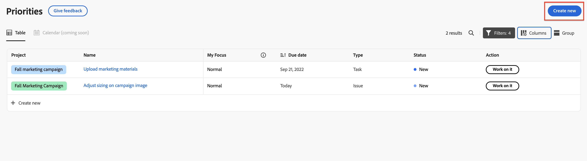

# Creare una nuova attività o un nuovo problema in Priorità

Puoi creare nuove attività e problemi direttamente da Priorità:

## Requisiti di accesso

+++ Espandi per visualizzare i requisiti di accesso per la funzionalità in questo articolo.

Per eseguire i passaggi descritti in questo articolo, è necessario disporre dei seguenti diritti di accesso:

<table style="table-layout:auto"> 
 <col> 
 </col> 
 <col> 
 </col> 
 <tbody> 
  <tr> 
   <td role="rowheader"><strong>piano Adobe Workfront</strong></td> 
   <td> 
Qualsiasi
 </td> 
  </tr> 
  <tr> 
   <td role="rowheader"><strong>Licenza Adobe Workfront*</strong></td> 
   <td> 
   
Corrente: richiesta o superiore per richieste; revisione o superiore per problemi; lavoro o superiore per attività

   
Nuovo: Collaboratore o versione successiva per le richieste; Light o versione successiva per i problemi <!--and documents-->: attività standard o successive
 
   </td> 
  </tr> 
  <tr> 
   <td role="rowheader"><strong>Configurazioni del livello di accesso</strong></td> 
   <td> 
Accesso di visualizzazione o modifica per l'oggetto su cui si trova l'aggiornamento
</td> 
  </tr> 
  <tr> 
   <td role="rowheader"><strong>Autorizzazioni oggetto</strong></td> 
   <td> 
Accesso di visualizzazione all'oggetto
</td> 
  </tr> 
 </tbody> 
</table>

*Per ulteriori informazioni, consulta [Requisiti di accesso nella documentazione di Workfront](/help/quicksilver/administration-and-setup/add-users/access-levels-and-object-permissions/access-level-requirements-in-documentation.md).

+++

## Creare attività o problemi in Priorità

Puoi creare un’attività o un problema in un progetto.

>[!NOTE]
>
>Se si dispone di una licenza Richiesta o Collaboratore, è possibile creare una richiesta direttamente in Priorità.

Per creare un&#39;attività o un problema in un progetto:

{{step1-to-priorities}}

1. Fai clic su **Crea nuovo** nell&#39;angolo superiore destro.
   
1. Specifica le seguenti informazioni:

   | Campo | Istruzioni |
   |---------------|-------------|
   | Tipo di elemento di lavoro (facoltativo) | Scegli se vuoi creare una **attività** o **problema**. |
   | Nome | Inserire un nome. |
   | Descrizione (facoltativa) | Immetti una descrizione. |
   | Progetto | Inizia a digitare il nome di un progetto, quindi selezionalo dall’elenco a discesa. |
   | Assegnatari (facoltativo) | Assegna persone all&#39;elemento di lavoro. |
   | Data di scadenza (facoltativo) | Scegli una data di scadenza. |

1. Fai clic su **Crea**.

