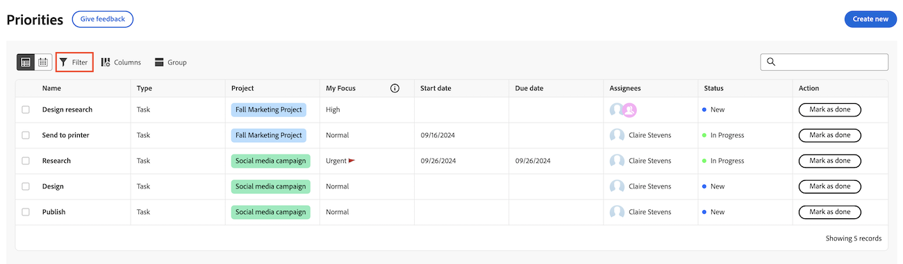
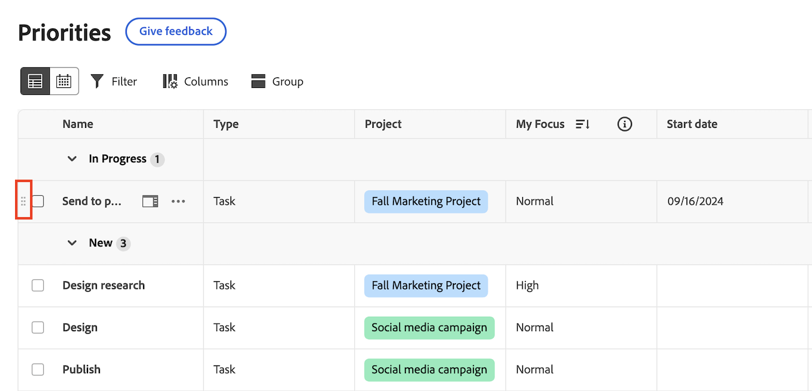

# Filtrare e raggruppare il lavoro con priorità

È possibile utilizzare i filtri per trovare il lavoro che si sta cercando e quindi applicare un raggruppamento per mantenerlo organizzato.

In Priorità vengono visualizzati gli elementi di lavoro assegnati all&#39;utente. Non è possibile visualizzare gli elementi di lavoro assegnati al team nell&#39;elenco Priorità.

## Requisiti di accesso

+++ Espandi per visualizzare i requisiti di accesso per la funzionalità in questo articolo.

Per eseguire i passaggi descritti in questo articolo, è necessario disporre dei seguenti diritti di accesso:

<table style="table-layout:auto"> 
 <col> 
 </col> 
 <col> 
 </col> 
 <tbody> 
  <tr> 
   <td role="rowheader"><strong>piano Adobe Workfront</strong></td> 
   <td> 
Qualsiasi
 </td> 
  </tr> 
  <tr> 
   <td role="rowheader"><strong>Licenza Adobe Workfront*</strong></td> 
   <td> 
   
Corrente: richiesta o successiva

   
Nuovo: Collaboratore o versione successiva
 
   </td> 
  </tr> 
  <tr> 
   <td role="rowheader"><strong>Configurazioni del livello di accesso</strong></td> 
   <td> 
Accesso di visualizzazione o modifica per l'oggetto su cui si trova l'aggiornamento
</td> 
  </tr> 
  <tr> 
   <td role="rowheader"><strong>Autorizzazioni oggetto</strong></td> 
   <td> 
Accesso di visualizzazione all'oggetto
</td> 
  </tr> 
 </tbody> 
</table>

*Per ulteriori informazioni, consulta [Requisiti di accesso nella documentazione di Workfront](/help/quicksilver/administration-and-setup/add-users/access-levels-and-object-permissions/access-level-requirements-in-documentation.md).

+++

## Filtrare il lavoro con filtri standard

Puoi filtrare le attività e i problemi assegnati.

{{step1-to-priorities}}

1. Fai clic su **Filtri** in alto a sinistra nell&#39;elenco lavori.
1. Nella sezione **Filtri standard**, seleziona uno o più filtri per limitare gli elementi di lavoro.
   

+++Espandi per visualizzare informazioni dettagliate sui filtri disponibili
<table>
  <tbody>
   <tr>
   <th>Filtro</th>
   <th>Descrizione</th>
   </tr>
    <tr>
      <td>Ci sto lavorando</td>
      <td>Visualizza gli elementi su cui si sta lavorando</td>
    </tr>
    <tr>
      <td>È il momento di iniziare?</td>
      <td>Visualizza gli elementi con 
      <ul>
      <li>Nessun predecessore o vincolo di attività incompleto</li>
      
e

      <li>La data di inizio pianificata è nel passato o è prevista entro due settimane</li>
      </ul>
      </td>
    </tr>
    <tr>
      <td>Non pronto</td>
      <td>Visualizza gli elementi con
       <ul>
      <li>Predecessori incompleti o vincoli di attività che impediscono la lavorazione dell'elemento</li></ul>
      
oppure

      <ul>
      <li>La data di inizio pianificata nel futuro è tra più di due settimane</li>
      </ul>
       </td>
    </tr>
    <tr>
      <td>Richiesto il</td>
      <td>Visualizza i problemi per i quali non hai iniziato a lavorare</td>
    </tr>
      <td>Terminato</td>
      <td>Visualizza il lavoro completato nelle ultime due settimane. Questa opzione di filtro non include le approvazioni.</td>
    </tr>
    <tr>
    <td>Progetto</td>
    <td>Visualizza i progetti che contengono le attività o i problemi assegnati</td>
    </tr>
    <tr>
    <td>Data di scadenza</td>
    <td>Visualizza il lavoro per data di completamento pianificata</td>
    </tr>
    <tr>
    <td>Il mio focus</td>
    <td>Visualizza le attività o i problemi a cui sono stati assegnati livelli di attivazione. I livelli di attivazione vengono assegnati e gestiti dal singolo utente.</td>
    </tr>
    <tr>
    <td>Stato</td>
    <td>Visualizza le attività o i problemi in stato Nuovo, In corso e Completato.</td>
    </tr>
  </tbody>
</table>

+++

1. (Facoltativo) Fai clic su **Torna al valore predefinito** per ripristinare la selezione.

## Filtrare il lavoro con filtri avanzati

Utilizza il linguaggio naturale per filtrare rapidamente il lavoro.

>[!NOTE]
>
>Questa funzione è disponibile solo per i clienti dell’esperienza Unified Adobe che utilizzano l’Assistente all’intelligenza artificiale. Per ulteriori informazioni sull&#39;Assistente di IA, vedere [Panoramica dell&#39;Assistente di IA](/help/quicksilver/workfront-basics/ai-assistant/ai-assistant-overview.md).

{{step1-to-priorities}}

1. Fai clic su **Filtri** in alto a sinistra nell&#39;elenco lavori.
1. Fare clic su **Filtri avanzati**.
1. Digitare come si desidera filtrare il lavoro.

   Puoi digitare:

   * *Mostra attività in ritardo*
   * *Mostra le mie priorità principali*
   * *Mostra lavoro in scadenza oggi*

## Raggruppare il lavoro

{{step1-to-priorities}}

1. Fai clic su **Gruppi** in alto a sinistra nell&#39;elenco lavori.
1. Selezionare un gruppo per organizzare l&#39;elenco lavori.
   

+++Espandi per visualizzare informazioni dettagliate sui gruppi disponibili

| Gruppo | Descrizione |
|-----------|-------------|
| Progetto | Raggruppa gli elementi per progetto. |
| Data di scadenza | In questo modo gli elementi vengono raggruppati in base alla data di scadenza. Le date di scadenza sono determinate dalla data di completamento pianificata. |
| Il mio focus | Raggruppa gli elementi in base al livello di attivazione assegnato. |
| Stato | Gli elementi vengono raggruppati in base ai seguenti stati: Nuovo, In corso, Completo.  <b>Nota</b>: al momento non è possibile utilizzare gli stati personalizzati nelle priorità. |

+++

### Trascina gli elementi di lavoro quando si raggruppano per Mia priorità o Stato

È possibile trascinare singoli elementi di lavoro da una categoria all&#39;altra quando si esegue il raggruppamento in base a Mia priorità o Stato.

1. Raggruppa il tuo lavoro per **Stato** o **Mia priorità**.
2. Passa il puntatore del mouse sull&#39;elemento di lavoro per fare clic sull&#39;icona **Trascina** e spostarlo nella categoria desiderata.
   

## Ordinare il lavoro

### Ordina in gruppi

Per ordinare il lavoro all&#39;interno di un gruppo, apri **Gruppo** e seleziona se desideri ordinare in ordine crescente o decrescente.

### Ordinare le colonne

Per ordinare le singole colonne, passare alla colonna e fare clic sulla freccia giù.

### Espandere o comprimere tutte le sezioni del gruppo

Per espandere o comprimere tutte le sezioni del gruppo, aprire **Gruppo** e fare clic su **Espandi tutto** o **Comprimi tutto**.

