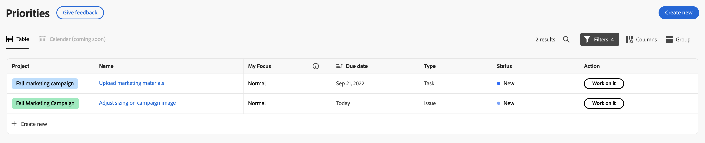

# Filtrare e raggruppare il lavoro con priorità

Le informazioni evidenziate in questa pagina si riferiscono a funzionalità non ancora generalmente disponibili. È disponibile solo nell&#39;ambiente Sandbox di anteprima.

È possibile utilizzare i filtri per trovare il lavoro che si sta cercando e quindi applicare un raggruppamento per mantenerlo organizzato.

## Requisiti di accesso

+++ Espandi per visualizzare i requisiti di accesso per la funzionalità in questo articolo.

Per eseguire i passaggi descritti in questo articolo, è necessario disporre dei seguenti diritti di accesso:

<table style="table-layout:auto"> 
 <col> 
 </col> 
 <col> 
 </col> 
 <tbody> 
  <tr> 
   <td role="rowheader"><strong>piano Adobe Workfront</strong></td> 
   <td> 
Qualsiasi
 </td> 
  </tr> 
  <tr> 
   <td role="rowheader"><strong>Licenza Adobe Workfront*</strong></td> 
   <td> 
   
Corrente: richiesta o successiva

   
Nuovo: Collaboratore o versione successiva
 
   </td> 
  </tr> 
  <tr> 
   <td role="rowheader"><strong>Configurazioni del livello di accesso</strong></td> 
   <td> 
Accesso di visualizzazione o modifica per l'oggetto su cui si trova l'aggiornamento
</td> 
  </tr> 
  <tr> 
   <td role="rowheader"><strong>Autorizzazioni oggetto</strong></td> 
   <td> 
Accesso di visualizzazione all'oggetto
</td> 
  </tr> 
 </tbody> 
</table>

*Per ulteriori informazioni, consulta [Requisiti di accesso nella documentazione di Workfront](/help/quicksilver/administration-and-setup/add-users/access-levels-and-object-permissions/access-level-requirements-in-documentation.md).

+++

## Filtrare e raggruppare il lavoro con Priorità in Produzione

### Filtrare il lavoro

Puoi filtrare le attività e i problemi assegnati.

{{step1-to-priorities}}

1. Fai clic su **Filtri** in alto a destra nell&#39;elenco lavori.
1. Selezionare uno o più filtri per limitare gli elementi di lavoro.
   

+++Espandi per visualizzare informazioni dettagliate sui filtri disponibili
<table>
  <tbody>
   <tr>
   <th>Filtro</th>
   <th>Descrizione</th>
   </tr>
    <tr>
      <td>Ci sto lavorando</td>
      <td>Visualizza gli elementi su cui si sta lavorando</td>
    </tr>
    <tr>
      <td>È il momento di iniziare?</td>
      <td>Visualizza gli elementi con 
      <ul>
      <li>Nessun predecessore o vincolo di attività incompleto</li>
      
e

      <li>La data di inizio pianificata è nel passato o è prevista entro due settimane</li>
      </ul>
      </td>
    </tr>
    <tr>
      <td>Non pronto</td>
      <td>Visualizza gli elementi con
       <ul>
      <li>Predecessori incompleti o vincoli di attività che impediscono la lavorazione dell'elemento</li>
      
oppure

      <li>La data di inizio pianificata nel futuro è tra più di due settimane</li>
      </ul>
       </td>
    </tr>
    <tr>
      <td>Richiesto il</td>
      <td>Visualizza i problemi per i quali non hai iniziato a lavorare</td>
    </tr>
      <td>Terminato</td>
      <td>Visualizza il lavoro completato nelle ultime due settimane. Questa opzione di filtro non include le approvazioni.</td>
    </tr>
    <tr>
    <td>Progetto</td>
    <td>Visualizza i progetti che contengono le attività o i problemi assegnati</td>
    </tr>
    <tr>
    <td>Data di scadenza</td>
    <td>Visualizza il lavoro per data di completamento pianificata</td>
    </tr>
    <tr>
    <td>Stato</td>
    <td>Visualizza le attività o i problemi in stato Nuovo, In corso e Completato</td>
    </tr>
    <tr>
    <td>Il mio focus</td>
    <td>Visualizza le attività o i problemi in cui sono stati assegnati livelli di attivazione. I livelli di attivazione vengono assegnati e gestiti dal singolo utente.</td>
    </tr>
  </tbody>
</table>

+++

1. (Facoltativo) Fai clic su **Torna al valore predefinito** per ripristinare la selezione.

### Raggruppare il lavoro

{{step1-to-priorities}}

1. Fai clic su **Gruppi** in alto a destra nell&#39;elenco lavori.
1. Selezionare un gruppo per organizzare l&#39;elenco di lavoro
   

+++Espandi per visualizzare informazioni dettagliate sui gruppi disponibili

| Gruppo | Descrizione |
|-----------|-------------|
| Nessuno | I raggruppamenti verranno rimossi dall&#39;elenco lavori. |
| Il mio focus | Raggruppa gli elementi in base al livello di attivazione assegnato. |
| Settimana di scadenza | Raggruppa le voci in base alla settimana di scadenza. Le date di scadenza sono determinate dalla data di completamento pianificata. |
| Stato | Gli elementi vengono raggruppati in base ai seguenti stati: Nuovo, In corso, Completo.  Nota: al momento non è possibile utilizzare gli stati personalizzati nelle priorità. |
| Progetto | Raggruppa gli elementi per progetto. |

+++

### Ordinare il lavoro

Per ordinare il lavoro, apri **Gruppo** e fai clic su **Ordine crescente** o **Ordine decrescente**.

>[!IMPORTANT]
>
>L’opzione di ordinamento non è al momento disponibile se è stato applicato un gruppo.

### Espandere o comprimere tutte le sezioni

Per espandere o comprimere tutte le sezioni, aprire **Gruppo** e fare clic su **Espandi tutto** o **Comprimi tutto**.

## Filtrare e raggruppare il lavoro con priorità in Anteprima

### Filtrare il lavoro con filtri standard

Puoi filtrare le attività e i problemi assegnati.

{{step1-to-priorities}}

1. Fai clic su **Filtri** in alto a sinistra nell&#39;elenco lavori.
1. fare clic su **Filtri standard**.
1. Selezionare uno o più filtri per limitare gli elementi di lavoro.
   

+++Espandi per visualizzare informazioni dettagliate sui filtri disponibili
<table>
  <tbody>
   <tr>
   <th>Filtro</th>
   <th>Descrizione</th>
   </tr>
    <tr>
      <td>Ci sto lavorando</td>
      <td>Visualizza gli elementi su cui si sta lavorando</td>
    </tr>
    <tr>
      <td>È il momento di iniziare?</td>
      <td>Visualizza gli elementi con 
      <ul>
      <li>Nessun predecessore o vincolo di attività incompleto</li>
      
e

      <li>La data di inizio pianificata è nel passato o è prevista entro due settimane</li>
      </ul>
      </td>
    </tr>
    <tr>
      <td>Non pronto</td>
      <td>Visualizza gli elementi con
       <ul>
      <li>Predecessori incompleti o vincoli di attività che impediscono la lavorazione dell'elemento</li>
      
oppure

      <li>La data di inizio pianificata nel futuro è tra più di due settimane</li>
      </ul>
       </td>
    </tr>
    <tr>
      <td>Richiesto il</td>
      <td>Visualizza i problemi per i quali non hai iniziato a lavorare</td>
    </tr>
      <td>Terminato</td>
      <td>Visualizza il lavoro completato nelle ultime due settimane. Questa opzione di filtro non include le approvazioni.</td>
    </tr>
    <tr>
    <td>Progetto</td>
    <td>Visualizza i progetti che contengono le attività o i problemi assegnati</td>
    </tr>
    <tr>
    <td>Data di scadenza</td>
    <td>Visualizza il lavoro per data di completamento pianificata</td>
    </tr>
    <tr>
    <td>Stato</td>
    <td>Visualizza le attività o i problemi in stato Nuovo, In corso e Completato</td>
    </tr>
    <tr>
    <td>Il mio focus</td>
    <td>Visualizza le attività o i problemi in cui sono stati assegnati livelli di attivazione. I livelli di attivazione vengono assegnati e gestiti dal singolo utente.</td>
    </tr>
  </tbody>
</table>

+++

1. (Facoltativo) Fai clic su **Torna al valore predefinito** per ripristinare la selezione.

<!--### Filter your work with Smart filters

Use natural language to filter quickly filter work.

{{step1-to-priorities}}

1. Click **Filters** in the top left of the worklist.
1. Click **Smart filters**. 
1. Type how you want to filter your work. 

    You can type things like

    * Show me late tasks
    * Show my top priorities
    * Show work due today

-->

### Raggruppare il lavoro

{{step1-to-priorities}}

1. Fai clic su **Gruppi** in alto a sinistra nell&#39;elenco lavori.
1. Selezionare un gruppo per organizzare l&#39;elenco di lavoro
   

+++Espandi per visualizzare informazioni dettagliate sui gruppi disponibili

| Gruppo | Descrizione |
|-----------|-------------|
| Progetto | Raggruppa gli elementi per progetto. |
| Il mio focus | Raggruppa gli elementi in base al livello di attivazione assegnato. |
| Settimana di scadenza | Raggruppa le voci in base alla settimana di scadenza. Le date di scadenza sono determinate dalla data di completamento pianificata. |
| Stato | Gli elementi vengono raggruppati in base ai seguenti stati: Nuovo, In corso, Completo.  Nota: al momento non è possibile utilizzare gli stati personalizzati nelle priorità. |

+++

### Ordinare il lavoro

**Ordina in gruppi**

Per ordinare il lavoro all&#39;interno di un gruppo, apri **Gruppo** e fai clic su **Ordine crescente** o **Ordine decrescente**.

**Ordina colonne**

Per ordinare le singole colonne, passare alla colonna e fare clic sulla freccia giù.

### Espandere o comprimere tutte le sezioni del gruppo

Per espandere o comprimere tutte le sezioni del gruppo, aprire **Gruppo** e fare clic su **Espandi tutto** o **Comprimi tutto**.

