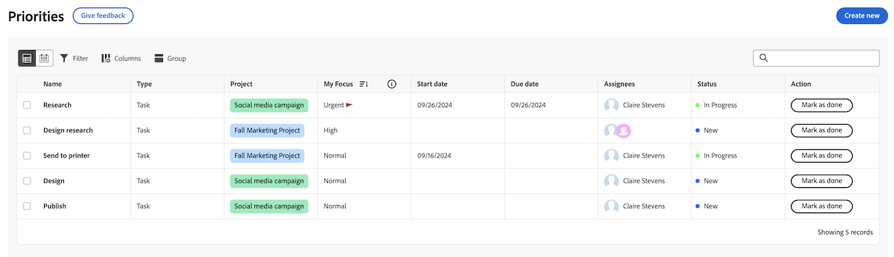

# Introduzione a [!DNL Priorities]

Priorities è un’esperienza semplice e intuitiva, personalizzata per i titolari delle attività. Le priorità verranno implementate in fasi, a partire dall’elenco di lavoro.

Con Priorities, puoi godere

* Gestione e assegnazione di priorità alle attività quotidiane: organizza il tuo giorno o la tua settimana con una navigazione consolidata per una maggiore chiarezza
* Maggiore produttività: accedere al contesto del progetto ed eseguire le attività più rapidamente con meno clic
* Funzioni personalizzate: usufruisci di funzionalità progettate in modo univoco per i proprietari delle attività

## Trovare e organizzare il lavoro

In Priorità puoi filtrare e raggruppare il lavoro per aiutarti a gestire le scadenze e assegnare la priorità a ciò che ti interessa. Puoi anche identificare rapidamente il lavoro urgente con la colonna Il mio focus.

### Trovare il lavoro con i filtri

Trova il tuo lavoro più importante con i filtri. È possibile utilizzare un linguaggio naturale per trovare lavoro con il filtro Smart, oppure
Puoi utilizzare il filtro Standard per trovare le attività e i problemi assegnati:

<table>
  <tbody>
   <tr>
   <th>Filtro</th>
   <th>Descrizione</th>
   </tr>
    <tr>
      <td>Lavori</td>
      <td>Visualizza gli elementi su cui si sta lavorando</td>
    </tr>
    <tr>
      <td>È il momento di iniziare?</td>
      <td>Visualizza gli elementi con 
      <ul>
      <li>Nessun predecessore o vincolo di attività incompleto</li>
      
e

      <li>La data di inizio pianificata è nel passato o è prevista entro due settimane</li>
      </ul>
      </td>
    </tr>
    <tr>
      <td>Non pronto</td>
      <td>Visualizza gli elementi con
       <ul>
      <li>Predecessori incompleti o vincoli di attività che impediscono la lavorazione dell'elemento</li>
      
oppure

      <li>La data di inizio pianificata nel futuro è tra più di due settimane</li>
      </ul>
       </td>
    </tr>
    <tr>
      <td>Richiesto il</td>
      <td>Visualizza i problemi per i quali non hai iniziato a lavorare</td>
    </tr>
      <td>Terminato</td>
      <td>Visualizza il lavoro completato nelle ultime due settimane. Questa opzione di filtro non include le approvazioni.</td>
    </tr>
    <tr>
    <td>Progetto</td>
    <td>Visualizza i progetti che contengono le attività o i problemi assegnati</td>
    </tr>
    <tr>
    <td>Data di scadenza</td>
    <td>Visualizza il lavoro per data di completamento pianificata</td>
    </tr>
    <tr>
    <td>Stato</td>
    <td>Visualizza le attività o i problemi in stato Nuovo, In corso e Completato</td>
    </tr>
     <tr>
    <td>Il mio focus</td>
    <td>Visualizza le attività o i problemi in cui sono stati assegnati livelli di attivazione. I livelli di attivazione vengono assegnati e gestiti dal singolo utente.</td>
    </tr>
  </tbody>
</table>

### Organizzare il lavoro con i gruppi

Dopo aver filtrato il lavoro, puoi raggruppare gli elementi in base a

* Il mio focus
* Settimana di scadenza
* Stato
* Progetto

Per ulteriori informazioni, consulta [Filtrare e raggruppare il lavoro in Priorità](/help/quicksilver/workfront-basics/priorities/filter-group-work-priorities.md).

### Assegna priorità agli elementi di lavoro importanti con Il mio focus

Il mio focus è una colonna nell’elenco di lavoro che ti aiuta a dare la priorità al tuo lavoro. Il valore Il mio focus è personale e non influisce sui dati del progetto, dell’attività o del problema. Puoi utilizzare i seguenti livelli di attivazione:

* Urgente
* Alta
* Normale (impostazione predefinita)
* Basso

Dopo aver assegnato i livelli di attivazione agli elementi di lavoro, è possibile ordinare la colonna in modo da far emergere gli elementi urgenti nella parte superiore dell&#39;elenco lavori.

Per ulteriori informazioni, vedere [Assegnare la priorità agli elementi di lavoro importanti](/help/quicksilver/workfront-basics/priorities/prioritize-work-items.md).

### Utilizzare la vista Calendario

La visualizzazione Calendario fornisce una rappresentazione visiva delle attività e dei problemi. Puoi scegliere tra la visualizzazione per giorno, per settimana o per mese. Sarà inoltre possibile filtrare gli elementi in modo simile all’elenco lavori.

## Lavori su attività e problemi

In Priorità puoi aggiornare gli elementi di lavoro per mantenere aggiornati i dettagli degli elementi di lavoro, registrare il tempo per tenere traccia con precisione delle ore lavorative, caricare le risorse senza dover passare a un progetto e aggiungere collegamenti rapidi per un facile accesso alle risorse utilizzate di frequente.

>[!NOTE]
>
>Le licenze Light, Review, Contributor e Requestor hanno accesso limitato alle priorità. Per ulteriori informazioni su come questi tipi di licenza possono interagire con attività e problemi, vedi
>
>* [Accesso a oggetti e aree da per le nuove licenze](/help/quicksilver/administration-and-setup/add-users/how-access-levels-work/access-to-objects-areas-license-types.md)
>* [Funzionalità disponibile per ogni tipo di oggetto per i nuovi livelli di accesso](/help/quicksilver/administration-and-setup/add-users/how-access-levels-work/functionality-available-for-objects.md)
>* [Accesso a oggetti e aree per tipo di licenza](/help/quicksilver/administration-and-setup/add-users/access-levels-and-object-permissions/access-to-objects-and-areas-by-license-type.md)
>* [Funzionalità disponibile per ogni tipo di oggetto](/help/quicksilver/administration-and-setup/add-users/access-levels-and-object-permissions/functionality-available-for-each-object-type.md)

### Aggiungi e visualizza aggiornamenti

Aggiungi un aggiornamento su un&#39;attività o un problema per comunicare l&#39;avanzamento ad altri.

La sezione Aggiornamenti mostra gli aggiornamenti di sistema e fino a 200 degli aggiornamenti più recenti effettuati dagli utenti negli ultimi 90 giorni.

Per ulteriori informazioni, vedere [Aggiungere e visualizzare commenti in Priorità](/help/quicksilver/workfront-basics/priorities/add-view-updates-priorities.md).

### Registra ore

È possibile registrare il tempo necessario per gli elementi di lavoro per indicare il numero di ore di lavoro dedicate. È inoltre possibile registrare il tempo non correlato al lavoro, ad esempio ferie, malattia o riunioni. L&#39;ora registrata viene visualizzata nella scheda orario.

Per ulteriori informazioni, consulta [Registra tempo in Priorità](/help/quicksilver/workfront-basics/priorities/log-time-priorities.md).

### Carica file

Caricare i file direttamente nell’area Documenti dell’attività o del problema senza dover passare a un progetto. Quando carichi un file da Priorità, puoi:

* Seleziona una cartella esistente
* Carica il file con un commento del flusso di aggiornamento
* Aggiungi altri file
* Importa file da integrazioni documenti connesse

Per ulteriori informazioni, consulta [Caricare i file in Priorities](/help/quicksilver/workfront-basics/priorities/upload-files-in-priorities.md).

### Aggiungi collegamenti rapidi

Puoi incorporare i collegamenti utilizzati di frequente nella pagina dei dettagli dell’elemento di lavoro. I collegamenti rapidi consentono di visitare o copiare rapidamente il collegamento.

Per ulteriori informazioni, consulta [Aggiungere e gestire collegamenti rapidi in Priorità](/help/quicksilver/workfront-basics/priorities/quick-links-priorities.md).

### Visualizza documenti

La scheda Documenti consente di visualizzare tutti i file relativi a un elemento di lavoro. Sarà possibile filtrare i documenti in base al nome, al tipo di file o alla persona, nonché ordinare i documenti in base al nome e alla data di caricamento.

Sarà inoltre possibile aprire il documento o la bozza.

### Rivedere e approvare le risorse

Dalla scheda Documenti relativa a un’attività o a un problema, puoi

* Creare bozze semplici o avanzate
* Avvia il visualizzatore di verifica per lasciare commenti e prendere decisioni

## Usa [!DNL Catch me up] per vedere cosa ti sei perso

Utilizza la funzione [!DNL Catch me up] per vedere cosa ti sei perso. Il comando Recupera riepiloga aggiornamenti, documenti caricati, approvazioni e altre modifiche di rilievo apportate ai progetti entro i seguenti intervalli di tempo: 24 ore, 3 giorni, 7 giorni.

Per ulteriori informazioni, consulta [Recuperare il lavoro in Priorità](/help/quicksilver/workfront-basics/priorities/catch-me-up.md).

<!--need new screen for prod-->

## Visualizzare gli aggiornamenti in tempo reale nella pagina Dettagli

Puoi visualizzare gli aggiornamenti in tempo reale nella pagina Dettagli di un’attività o di un problema. Puoi anche verificare se altri utenti visualizzano la pagina contemporaneamente a te con gli indicatori di presenza in tempo reale.

## Considerazioni

* Al momento gli amministratori di Workfront non possono personalizzare le priorità tramite il modello di layout.
* L’accesso alle attività in Priorità è suddiviso tra schede. In futuro è prevista l’aggiunta di ulteriori schede, ad esempio Documenti, Sottoattività, Approvazioni e così via. Comunicaci che hai bisogno di questi elementi inviando un feedback utilizzando il pulsante **Invia feedback**.
