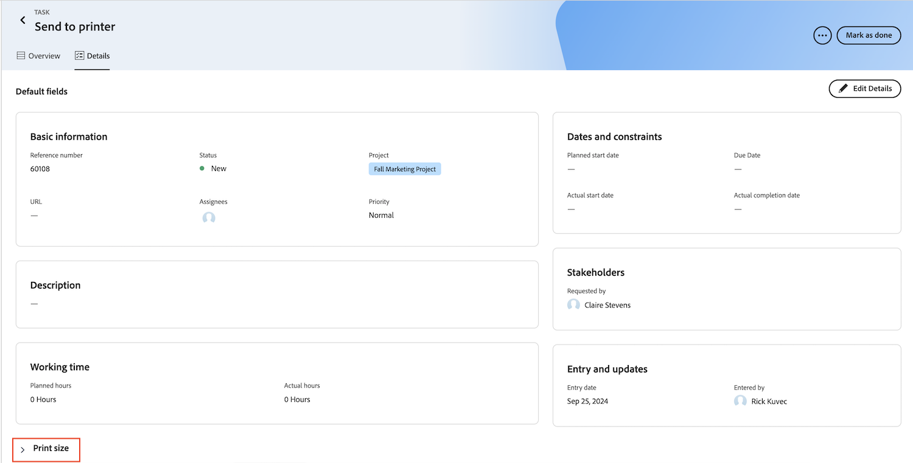

# Passa dalla home page legacy alle priorità

La pagina Home legacy verrà rimossa da Workfront il 10/17 con la versione Q4. Questo articolo fornisce informazioni sulle funzionalità che saranno disponibili in Priorità e consigli per gli amministratori di Workfront che spostano gli utenti in Priorità.

Per ulteriori informazioni sul deprecamento della home legacy, vedere la [Guida deprecazione della home legacy](/help/quicksilver/product-announcements/announcements/legacy-home-deprecation.md).

## Comprendere cosa cambia da Legacy Home a Priorità

### Elenco lavori

#### Organizzazione del lavoro

Nella vista della tabella Priorità vengono visualizzate le attività e i problemi assegnati a te o al tuo team. Puoi filtrare e raggruppare il lavoro utilizzando i seguenti elementi:

| **Filtro** | **Raggruppamento** |
|------------|-----------|
| - Lavoro in corso su   - Pronto per iniziare   - Non pronto   - Richiesto   - Completato   - Progetto   - Scadenza   - Stato | - Nessuno   - Settimana Scadenza   - Stato   - Progetto |

**Opzioni di raggruppamento e filtro home legacy non disponibili in Priorità**

Filtri

* Completato: rinominato in Fine in Priorità

Raggruppamenti

* Data di completamento pianificata - rinominata in Data di scadenza in Priorità
* Inizio pianificato
* Conferma data
* La mia priorità

#### Delega lavoro

Al momento gli utenti non possono delegare o visualizzare il lavoro delegato nelle priorità. Tuttavia, gli utenti possono comunque delegare il lavoro dalla Nuova Home nei seguenti widget:

* Il mio lavoro
* Le mie attività
* I miei problemi
* In attesa delle mie approvazioni

Gli utenti possono visualizzare il lavoro delegato dalla Nuova Home nei seguenti widget

* Il mio widget Lavoro utilizzando il filtro Delegato a me
* In attesa delle mie approvazioni tramite il filtro Approvazioni delegate

#### Utilizzare la vista calendario

Al momento non è disponibile una visualizzazione sostitutiva del calendario, ma è inclusa nella roadmap per Priorità.

#### Crea un&#39;attività personale

Gli utenti non possono creare attività personali o cose da fare in Priorità.

#### Aggiungi elementi a Mia priorità

Gli utenti possono assegnare priorità al lavoro con la nuova colonna My Focus. La colonna Il mio focus è univoca per ogni utente e non influisce sui dati di attività, problemi o prodotti.

Gli utenti possono contrassegnare il lavoro ad alta priorità con le seguenti opzioni:

* Urgente
* Princp
* Secondario
* Normale (impostazione predefinita)

#### Visualizza le approvazioni che ho inviato

Gli utenti non possono visualizzare le approvazioni inviate in Priorità. Come soluzione alternativa, gli utenti possono visualizzare queste informazioni nel widget Approvazioni personali nella Home utilizzando l’opzione di filtro Approvazioni inviate.

### Visualizzare approvazioni e richieste del team

Gli utenti non possono interagire con le approvazioni e le richieste dei team in Priorità. Tuttavia, possono gestire le richieste di approvazione e di team in Nuova Home utilizzando i seguenti widget:

* La mia approvazione
* Tutte le approvazioni
* Richieste team

### Aggiorna elementi di lavoro

#### Aggiornare i moduli personalizzati

Gli utenti possono aggiornare i moduli personalizzati all’interno della visualizzazione attività facendo clic sul nome dell’attività, spostandosi sulla scheda Dettagli e scorrendo verso il fondo della pagina.

#### Utilizzare il pannello Riepilogo

Il pannello Riepilogo viene visualizzato per le attività e i problemi. Nel Riepilogo, gli utenti possono

* Registra ore
* Carica un file
* Passare alla scheda Dettagli in Priorità
* Aggiornare le informazioni su attività e problemi

<!--Can admins customize this? It looks different from the task/issue summary in other areas. -->

#### Aprire il pannello Riepilogo

Nella scheda **Tabella** fare clic nella cella del nome dell&#39;elemento di lavoro. Facendo clic sul nome dell’elemento di lavoro si accede alla pagina Dettagli e non si apre il pannello Riepilogo.

## Prepararsi per l’obsolescenza

* Condividi l&#39;articolo [Introduzione alle priorità](/help/quicksilver/workfront-basics/priorities/get-started-with-priorities.md) con gli utenti finali.
* Le priorità saranno abilitate per impostazione predefinita. Gli amministratori di Workfront possono disattivare Priorità in Configurazione > Sistema > Preferenze.
* Al momento gli amministratori di Workfront non possono personalizzare le priorità tramite il modello di layout.

### Articoli della Guida per gli utenti finali

* [Introduzione alle priorità](/help/quicksilver/workfront-basics/priorities/get-started-with-priorities.md)