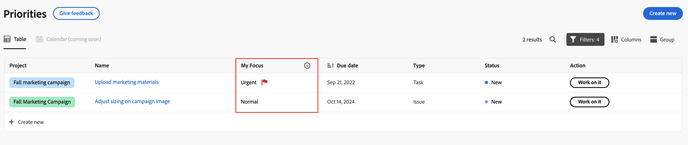

# Assegna priorità agli elementi di lavoro importanti

È possibile utilizzare la colonna Il mio stato attivo per assegnare la priorità al lavoro. La colonna My Focus è un valore personale e non influisce sulla priorità impostata per l’attività o il problema.

## Assegna le priorità al lavoro con la colonna Il mio focus

{{step1-to-priorities}}

1. Individuare l&#39;elemento di lavoro su cui si desidera concentrarsi.
1. Nella colonna **Stato attivo** scegliere uno dei seguenti livelli di stato attivo:

   | Fuoco | Descrizione |
   |-----------|-------------|
   | **Urgente** | Urgente per gli elementi di lavoro che richiedono attenzione immediata. Gli elementi di lavoro urgenti dovrebbero essere prioritari rispetto a tutti gli altri e affrontati il prima possibile. |
   | **Alta** | Alta è per gli elementi di lavoro importanti che intendi risolvere dopo il completamento del lavoro urgente. |
   | **Normale** | Normale è per gli elementi di lavoro di routine su cui lavorerai dopo il completamento degli elementi Urgenti e ad alta priorità. Questa è l&#39;impostazione predefinita per le attività e i problemi. |
   | **Basso** | Basso è per gli elementi di lavoro che non richiedono attenzione immediata e che possono essere differiti fino al completamento di tutti gli elementi di lavoro con priorità più alta. |

   

   >[!TIP]
   >
   >Puoi filtrare e raggruppare il lavoro in base ai livelli di attenzione.
