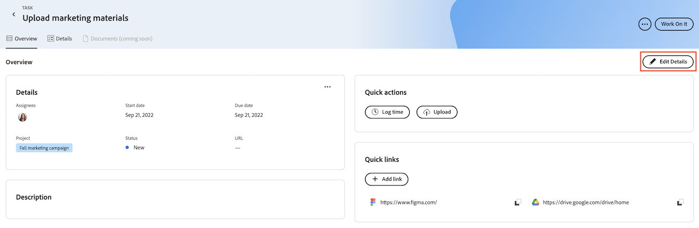

# Aggiungere e gestire collegamenti rapidi in Priorità

Puoi salvare i collegamenti che visiti spesso in un’attività o in un problema e accedere alla scheda Panoramica in Priorità.

In Priorità vengono visualizzati gli elementi di lavoro assegnati all&#39;utente. Non è possibile visualizzare gli elementi di lavoro assegnati al team.

## Requisiti di accesso

+++ Espandi per visualizzare i requisiti di accesso per la funzionalità in questo articolo.

<table style="table-layout:auto"> 
 <col> 
 </col> 
 <col> 
 </col> 
 <tbody> 
  <tr> 
   <td role="rowheader"><strong>Pacchetto Adobe Workfront</strong></td> 
   <td> 
Qualsiasi
 </td> 
  </tr> 
  <tr> 
   <td role="rowheader"><strong>Licenza Adobe Workfront</strong></td> 
   <td> 
   
Richiedi o superiore per i problemi; lavoro o superiore per le attività

   
Collaboratore o superiore o problemi; chiaro o superiore per le attività
 
   </td> 
  </tr> 
  <tr> 
   <td role="rowheader"><strong>Configurazioni del livello di accesso</strong></td> 
   <td> 
Accesso di visualizzazione o modifica per l'oggetto su cui si trova l'aggiornamento
</td> 
  </tr> 
  <tr> 
   <td role="rowheader"><strong>Autorizzazioni oggetto</strong></td> 
   <td> 
Accesso di visualizzazione all'oggetto
</td> 
  </tr> 
 </tbody> 
</table>

Per ulteriori informazioni, consulta [Requisiti di accesso nella documentazione di Workfront](/help/quicksilver/administration-and-setup/add-users/access-levels-and-object-permissions/access-level-requirements-in-documentation.md).

+++

## Aggiungere collegamenti rapidi in Priorità

{{step1-to-priorities}}

1. Fare clic sul nome di un elemento di lavoro per aprire la pagina **Panoramica**.
1. Nella sezione **Collegamenti rapidi**, fare clic su **Aggiungi collegamento**.
1. Incolla l&#39;URL nella casella **Aggiungi collegamento**.
1. Fai clic su **Salva**.
   

## Copiare un collegamento rapido negli Appunti

{{step1-to-priorities}}

1. Fare clic sul nome di un elemento di lavoro per aprire la pagina **Panoramica**.
1. Nella sezione **Collegamenti rapidi**, individua il collegamento da copiare.
1. Fai clic sull&#39;icona **Copia**.
   

## Aprire un collegamento rapido

{{step1-to-priorities}}

1. Fare clic sul nome di un elemento di lavoro per aprire la pagina **Panoramica**.
1. Nella sezione **Collegamenti rapidi** trovare il collegamento che si desidera aprire.
1. Fai clic sul collegamento. Il collegamento viene aperto in una nuova scheda.
   

## Elimina collegamenti rapidi

{{step1-to-priorities}}

1. Fare clic sul nome di un elemento di lavoro per aprire la pagina **Panoramica**.
1. Fai clic su **Modifica dettagli** nell&#39;angolo superiore destro della schermata.
   
1. Trova il collegamento da rimuovere, quindi fai clic sull&#39;icona **Elimina** .
