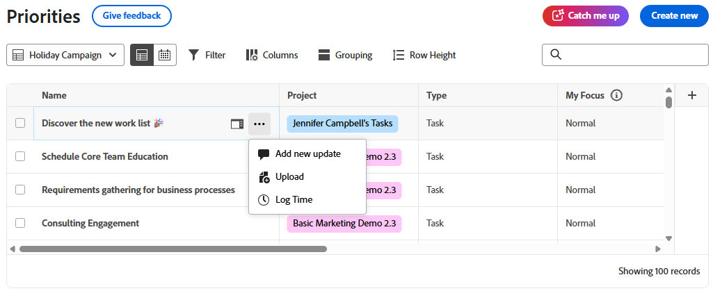

# Caricare file in Priorità

È possibile caricare i file dall&#39;elenco delle priorità o dai singoli elementi di lavoro. I file caricati da Priorità vengono visualizzati nella scheda Documenti dell’elemento di lavoro.

In Priorità vengono visualizzati gli elementi di lavoro assegnati all&#39;utente. Non è possibile visualizzare gli elementi di lavoro assegnati al team.

## Requisiti di accesso

+++ Espandi per visualizzare i requisiti di accesso per la funzionalità descritta in questo articolo.

<table style="table-layout:auto"> 
 <col> 
 <col> 
 <tbody> 
  <tr> 
   <td role="rowheader">Pacchetto Adobe Workfront</td> 
   <td> 
Qualsiasi
 </td> 
  </tr> 
  <tr> 
   <td role="rowheader">Licenze Adobe Workfront*</td> 
   <td> 
   
Collaboratore o successiva
 
   
Richiedente o successiva
 </td> 
  </tr> 
  <tr> 
   <td role="rowheader">Configurazioni del livello di accesso*</td> 
   <td> 
Accesso in modifica ai documenti
 
Nota: se non disponi ancora dell’accesso, chiedi all’amministratore di Workfront se ha impostato restrizioni aggiuntive nel tuo livello di accesso. Per informazioni su come un amministratore di Workfront può modificare il tuo livello di accesso, consulta <a href="../../administration-and-setup/add-users/configure-and-grant-access/create-modify-access-levels.md" class="MCXref xref">Creare o modificare livelli di accesso personalizzati</a>.
 </td> 
  </tr> 
 </tbody> 
</table>

Per ulteriori informazioni, consulta [Requisiti di accesso nella documentazione di Workfront](/help/quicksilver/administration-and-setup/add-users/access-levels-and-object-permissions/access-level-requirements-in-documentation.md).

+++

## Caricare un file dall’elenco lavori

{{step1-to-priorities}}

1. Passa il puntatore del mouse sul nome, quindi fai clic sull&#39;icona **Altro** .
1. Fai clic su **Carica**.
   
1. (Facoltativo) Nella casella **Carica file** selezionare una cartella.
1. Trascina e rilascia il file o usa Cmd/Ctrl + V per incollarlo dagli Appunti
o
Fai clic su **Aggiungi file** per sfogliare i file o importarli da un provider Document Cloud.
   
1. Aggiungi un commento (facoltativo).
1. Aggiungi altri file (facoltativo).

   >[!NOTE]
   >
   >I file aggiuntivi vengono caricati come documenti separati.
1. Fai clic su **Carica**.

## Caricare un file in un elemento di lavoro

{{step1-to-priorities}}

1. Fare clic sul nome di un elemento di lavoro per aprire la pagina **Panoramica**.
1. Nella sezione **Azioni rapide**, fai clic su **Carica**, quindi seleziona **Documento**.
1. (Facoltativo) Nella casella **Carica file** selezionare una cartella.
1. Trascina e rilascia il tuo file o usa Cmd/Ctrl + V per incollarlo dagli appunti

   oppure

   Fai clic su **Aggiungi file** per sfogliare i file o importarli da un provider Document Cloud.

   

1. Aggiungi un commento (facoltativo).
1. Aggiungi altri file (facoltativo).

   >[!NOTE]
   >
   >I file aggiuntivi vengono caricati come documenti separati.

1. Fai clic su **Carica**.
