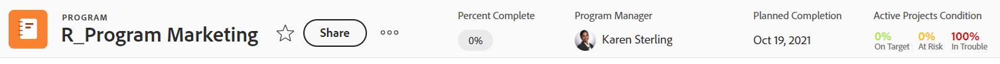

# Panoramica delle intestazioni degli oggetti

È possibile visualizzare informazioni sugli oggetti in [!DNL Adobe Workfront] quando ne rivedi l’intestazione.

Oltre al nome dell&#39;oggetto, l&#39;intestazione può includere il proprietario dell&#39;oggetto, lo stato o la percentuale di completamento.

[!DNL Workfront] assegna priorità al nome dell&#39;oggetto, allocandovi il maggior spazio possibile nell&#39;intestazione. Quando il nome di un oggetto è troppo lungo, viene troncato. Per visualizzare il nome completo di un oggetto, puoi passare il cursore sopra di esso.

## Accedere all&#39;intestazione di un oggetto

Accesso all’intestazione di un oggetto in [!DNL Workfront] è identico per tutti gli oggetti che lo contengono.

Ad esempio, per accedere all’intestazione di un progetto:

1. Vai a un progetto.\
   L’intestazione viene visualizzata nella parte superiore della pagina e contiene il nome del progetto.

   

## [!UICONTROL Home] panoramica intestazione

Le seguenti intestazioni sono disponibili in Home:

* Attività: per ulteriori informazioni su come utilizzare questa intestazione, vedi [Panoramica intestazione attività](#task-header-overview) in questo articolo.
* Problema: per ulteriori informazioni su come utilizzare questa intestazione, consulta [Panoramica intestazione problema](#issue-header-overview) in questo articolo.

## Intestazioni personalizzabili

Il tuo [!DNL Workfront]  L’amministratore del gruppo o può personalizzare l’intestazione di progetti, attività e problemi utilizzando un modello di layout.

Questo articolo descrive le intestazioni predefinite per tutti gli oggetti, inclusi i progetti, le attività e i problemi.

Per informazioni sulla personalizzazione delle informazioni sull&#39;intestazione di un oggetto, vedere [Personalizzare le intestazioni degli oggetti utilizzando un modello di layout](../../administration-and-setup/customize-workfront/use-layout-templates/customize-object-headers.md).

## Panoramica dell’intestazione del progetto

Per impostazione predefinita, nell’intestazione del progetto vengono visualizzate le seguenti informazioni:

<table style="table-layout:auto"> 
 <col> 
 <col> 
 <thead> 
  <tr> 
   <th>Informazioni intestazione</th> 
   <th>Note</th> 
  </tr> 
 </thead> 
 <tbody> 
  <tr> 
   <td role="rowheader">Breadcrumb con oggetti padre</td> 
   <td>Se il progetto è associato a un programma o a un portfolio, viene visualizzato nella breadcrumb nell’angolo superiore sinistro dell’intestazione. Facendo clic sul nome dell'oggetto padre viene aperto l'oggetto padre.</td> 
  </tr> 
  <tr data-mc-conditions=""> 
   <td role="rowheader">Icona oggetto </td> 
   <td> 
L'icona viola [!UICONTROL Project]  viene visualizzato a sinistra del nome del progetto.
 </td> 
  </tr> 
  <tr> 
   <td role="rowheader">Nome del progetto</td> 
   <td>Puoi modificare il nome del progetto nell’intestazione.</td> 
  </tr> 
  <tr> 
   <td role="rowheader">Nome del tipo di oggetto</td> 
   <td> 
Il testo "[!UICONTROL PROJECT]" viene visualizzato sopra il nome del progetto nell'intestazione.
 </td> 
  </tr> 
  <tr> 
   <td role="rowheader">Area azioni dell'attività</td> 
   <td> 
Accanto al nome del progetto viene visualizzata l’area delle azioni.
 
  
  </td> 
  </tr> 
  <tr> 
   <td role="rowheader">[!UICONTROL Percent Complete]</td> 
   <td>Non puoi modificare la percentuale di completamento del progetto nell’intestazione.</td> 
  </tr> 
  <tr> 
   <td role="rowheader">[!UICONTROL Proprietario Progetto]</td> 
   <td> 
È possibile modificare [!UICONTROL Project Owner] (Proprietario progetto) nell'intestazione.
 </td> 
  </tr> 
  <tr> 
   <td role="rowheader">[!UICONTROL Data di completamento Pianificata] </td> 
   <td> 
Puoi modificare il progetto [!UICONTROL Planned Completion Date] (Data di completamento pianificata) e l’ora nell’intestazione se il progetto è pianificato a partire da [!UICONTROL Completion Date] (Data di completamento pianificata). Se il progetto è pianificato a partire da [!UICONTROL Start Date], queste informazioni vengono aggiornate dalle attività del progetto.
 </td> 
  </tr> 
  <tr> 
   <td role="rowheader">Condizione [!UICONTROL] </td> 
   <td> 
Quando si imposta il tipo di condizione [!UICONTROL] del progetto su Manual, è possibile aggiornare il progetto [!UICONTROL Condition] nell'intestazione.
</td> 
  </tr> 
  <tr> 
   <td role="rowheader">[!UICONTROL Stato]</td> 
   <td>È possibile modificare il progetto [!UICONTROL Status] nell'intestazione.</td> 
  </tr> 
  <tr> 
   <td role="rowheader">Area [!UICONTROL Approvals]</td> 
   <td> 
Se sei uno degli approvatori, utilizza le icone seguenti per gestire le approvazioni per il progetto:
 
  </img> [!UICONTROL Approva]
 
  </img> [!UICONTROL rifiuta]
 
  </img> [!UICONTROL Recall]
 
Se non si è un approvatore, fare clic sull'icona [!UICONTROL Altro]  per visualizzare informazioni sul passaggio di approvazione corrente.
 
Per ulteriori informazioni sulle approvazioni, consulta <a href="../../review-and-approve-work/manage-approvals/approval-process-in-workfront.md" class="MCXref xref">Panoramica del processo di approvazione</a>.
 </td> 
  </tr> 
 </tbody> 
</table>

## Panoramica intestazione attività

Per impostazione predefinita, l&#39;intestazione dell&#39;attività include le seguenti informazioni:

<table style="table-layout:auto"> 
 <col> 
 <col> 
 <thead> 
  <tr> 
   <th>Informazioni intestazione</th> 
   <th>Note</th> 
  </tr> 
 </thead> 
 <tbody> 
  <tr> 
   <td role="rowheader">Breadcrumb con oggetti padre</td> 
   <td> 
Gli oggetti padre dell’attività vengono visualizzati nella breadcrumb. Facendo clic sul nome dell'oggetto padre viene aperto l'oggetto padre.
 
Per ulteriori informazioni, consulta <a href="../../workfront-basics/the-new-workfront-experience/breadcrumb-overview.md" class="MCXref xref">Panoramica delle breadcrumb</a>.
 </td> 
  </tr> 
  <tr data-mc-conditions=""> 
   <td role="rowheader">Icona oggetto </td> 
   <td> 
L'icona verde [!UICONTROL Task]  viene visualizzato a sinistra del nome dell'attività.
 </td> 
  </tr> 
  <tr> 
   <td role="rowheader">Nome dell’attività</td> 
   <td>Puoi modificare il nome dell’attività nell’intestazione.</td> 
  </tr> 
  <tr> 
   <td role="rowheader">Nome del tipo di oggetto</td> 
   <td> 
Il testo "[!UICONTROL TASK]" viene visualizzato sopra il nome dell'attività nell'intestazione.
 </td> 
  </tr> 
  <tr> 
   <td role="rowheader">Area azioni dell'attività</td> 
   <td> 
Accanto al nome dell'attività viene visualizzata l'area [!UICONTROL actions].
 
  
 
Se viene visualizzata l'icona Dipendenza, è possibile fare clic su di essa per visualizzare eventuali predecessori o successori dell'attività.
 </td> 
  </tr> 
  <tr> 
   <td role="rowheader">[!UICONTROL Percent Complete]</td> 
   <td>È possibile modificare la percentuale di completamento dell'attività nell'intestazione.</td> 
  </tr> 
  <tr> 
   <td role="rowheader">[!UICONTROL Assegnazioni]</td> 
   <td>È possibile modificare gli assegnatari di un'attività dall'intestazione.</td> 
  </tr> 
  <tr> 
   <td role="rowheader"> 
[!UICONTROL Lavoraci], [!UICONTROL Fine] o pulsante [!UICONTROL Avvia attività]
 </td> 
   <td> 
Se l'attività è assegnata a te, puoi fare clic sul [!UICONTROL Lavoraci] o [!UICONTROL Avvia attività] per indicare che si sta lavorando sull'attività oppure il pulsante [!UICONTROL Done] per indicare che l'attività è stata completata.
 
Per informazioni sulla sostituzione del pulsante [!UICONTROL Lavoraci] con un pulsante [!UICONTROL Avvia attività], vedere <a href="../../people-teams-and-groups/create-and-manage-teams/work-on-it-button-to-start-button.md" class="MCXref xref">Sostituisci il pulsante [!UICONTROL Lavoraci] con un pulsante [!UICONTROL Avvia]</a>.
 </td> 
  </tr> 
  <tr> 
   <td role="rowheader">[!UICONTROL Data di completamento Pianificata]</td> 
   <td> 
È possibile modificare l'attività [!UICONTROL Data di completamento pianificata] e ora nell’intestazione.
 
Suggerimento: si noti che [!UICONTROL Commit Date] non è visibile nell'intestazione. È possibile visualizzarlo nella pagina [!UICONTROL Details].
 </td> 
  </tr> 
  <tr> 
   <td role="rowheader">[!UICONTROL Stato]</td> 
   <td>È possibile modificare l'attività [!UICONTROL Status] nell'intestazione.</td> 
  </tr> 
  <tr> 
   <td role="rowheader">Area [!UICONTROL Approvals]</td> 
   <td> 
Quando si è uno degli approvatori, utilizzare le icone seguenti per gestire le approvazioni per l'attività:
 
  </img> [!UICONTROL Approva]
 
  </img> [!UICONTROL rifiuta]
 
  </img> [!UICONTROL Recall]
 
Se non si è un approvatore, fare clic sull'icona [!UICONTROL Altro]  per visualizzare informazioni sul passaggio di approvazione corrente.
 
Per ulteriori informazioni sulle approvazioni, consulta <a href="../../review-and-approve-work/manage-approvals/approval-process-in-workfront.md" class="MCXref xref">Panoramica del processo di approvazione</a>.
 </td> 
  </tr> 
 </tbody> 
</table>

## Panoramica intestazione problema

Per impostazione predefinita, l’intestazione del problema include le seguenti informazioni:

<table style="table-layout:auto"> 
 <col> 
 <col> 
 <thead> 
  <tr> 
   <th>Informazioni intestazione</th> 
   <th>Note</th> 
  </tr> 
 </thead> 
 <tbody> 
  <tr> 
   <td role="rowheader">Breadcrumb con oggetti padre</td> 
   <td> 
Gli oggetti principali del problema vengono visualizzati nella breadcrumb. Facendo clic sul nome dell'oggetto padre viene aperto l'oggetto padre.
 
Per ulteriori informazioni, consulta <a href="../../workfront-basics/the-new-workfront-experience/breadcrumb-overview.md" class="MCXref xref">Panoramica delle breadcrumb</a>.
 </td> 
  </tr> 
  <tr> 
   <td role="rowheader">Icona oggetto </td> 
   <td> 
L'icona rosa [!UICONTROL Issue]  viene visualizzato a sinistra del nome del problema.
 </td> 
  </tr> 
  <tr> 
   <td role="rowheader">Nome del problema</td> 
   <td>Puoi modificare il nome del problema nell’intestazione.</td> 
  </tr> 
  <tr> 
   <td role="rowheader">Nome del tipo di oggetto</td> 
   <td> 
Il testo "[!UICONTROL ISSUE]" viene visualizzato sopra il nome del problema nell’intestazione.
 </td> 
  </tr> 
  <tr> 
   <td role="rowheader">Area azioni del problema</td> 
   <td> 
Accanto al nome del problema viene visualizzata l’area [!UICONTROL actions].
 
  
 
Se viene visualizzata l'icona [!UICONTROL Dependency], è possibile fare clic su di essa per visualizzare eventuali predecessori o successori del problema.
  </td> 
  </tr> 
  <tr> 
   <td role="rowheader">[!UICONTROL Percent Complete]</td> 
   <td> 
Puoi modificare la percentuale di completamento del problema dall’intestazione.
 </td> 
  </tr> 
  <tr> 
   <td role="rowheader">[!UICONTROL Assegnazioni]</td> 
   <td>Puoi modificare gli assegnatari di un problema dall’intestazione.</td> 
  </tr> 
  <tr> 
   <td role="rowheader">[!UICONTROL Lavoraci], [!UICONTROL Fatto], o pulsante [!UICONTROL Avvia problema]</td> 
   <td>Se il problema è assegnato a te, puoi fare clic su [!UICONTROL Lavoraci] o [!UICONTROL Start Issue] per indicare che stai lavorando sul problema, oppure il pulsante [!UICONTROL Done] per indicare che il problema è stato completato.Per informazioni sulla sostituzione del pulsante [!UICONTROL Lavoraci] con un pulsante [!UICONTROL Avvia attività], vedere <a href="../../people-teams-and-groups/create-and-manage-teams/work-on-it-button-to-start-button.md" class="MCXref xref">Sostituisci il pulsante [!UICONTROL Lavoraci] con un pulsante [!UICONTROL Avvia]</a>.</td> 
  </tr> 
  <tr> 
   <td role="rowheader">[!UICONTROL Data di completamento Pianificata]</td> 
   <td> 
È possibile modificare il problema [!UICONTROL Data di completamento pianificata] e ora nell’intestazione.
 
Suggerimento: si noti che [!UICONTROL Commit Date] non è visibile nell'intestazione. È possibile visualizzarlo nella pagina [!UICONTROL Details].
 </td> 
  </tr> 
  <tr> 
   <td role="rowheader">[!UICONTROL Stato]</td> 
   <td>Puoi modificare il problema [!UICONTROL Status] nell’intestazione.</td> 
  </tr> 
  <tr> 
   <td role="rowheader">Area [!UICONTROL Approvals]</td> 
   <td> 
Se sei uno degli approvatori, utilizza le icone seguenti per gestire le approvazioni per il problema:
 
  [!UICONTROL Approva]
 
  [!UICONTROL rifiuta]
 
  [!UICONTROL Recall]
 
Se non si è un approvatore, fare clic sull'icona [!UICONTROL Altro]  per visualizzare informazioni sul passaggio di approvazione corrente.
 
Per ulteriori informazioni sulle approvazioni, consulta <a href="../../review-and-approve-work/manage-approvals/approval-process-in-workfront.md" class="MCXref xref">Panoramica del processo di approvazione</a>.
 </td> 
  </tr> 
 </tbody> 
</table>

## Panoramica dell’intestazione del programma

L’intestazione del programma visualizza le seguenti informazioni:

<table style="table-layout:auto"> 
 <col> 
 <col> 
 <thead> 
  <tr> 
   <th>Informazioni intestazione</th> 
   <th>Note</th> 
  </tr> 
 </thead> 
 <tbody> 
  <tr> 
   <td role="rowheader">Breadcrumb con il nome del Portfolio</td> 
   <td> 
È possibile accedere al Portfolio [!UICONTROL] dall'intestazione del programma [!UICONTROL]. Facendo clic sul nome dell'oggetto padre viene aperto l'oggetto padre.
 
Per ulteriori informazioni, consulta <a href="../../workfront-basics/the-new-workfront-experience/breadcrumb-overview.md" class="MCXref xref">Panoramica delle breadcrumb</a>.
 </td> 
  </tr> 
  <tr> 
   <td role="rowheader">Icona oggetto </td> 
   <td> 
Icona arancione [!UICONTROL Program]  viene visualizzato a sinistra del nome del programma.
 </td> 
  </tr> 
  <tr> 
   <td role="rowheader">Nome del programma</td> 
   <td>Puoi modificare il nome del programma nell’intestazione.</td> 
  </tr> 
  <tr> 
   <td role="rowheader">Nome del tipo di oggetto</td> 
   <td> 
Se il programma è contrassegnato come [!UICONTROL Attivo], il testo "[!UICONTROL PROGRAMMA]" viene visualizzato sopra il nome del programma nell'intestazione.
 </td> 
  </tr> 
  <tr> 
   <td role="rowheader">Stato attivazione</td> 
   <td> 
Se il programma è disattivato, il testo "[!UICONTROL PROGRAM DEACTIVATED]" viene visualizzato sopra il nome del programma nell’intestazione.
 </td> 
  </tr> 
  <tr> 
   <td role="rowheader">Il settore d'azione del programma</td> 
   <td> 
Accanto al nome del programma, viene visualizzata l'area [!UICONTROL actions].
 
  
 </td> 
  </tr> 
  <tr> 
   <td role="rowheader">[!UICONTROL Percent Complete]</td> 
   <td> 
Impossibile modificare il [!UICONTROL Percent Complete] del programma nell'intestazione. Queste informazioni vengono aggiornate dai progetti nel programma.
 
Suggerimento: per impostazione predefinita, la percentuale di completamento del programma corrisponde alla media dei valori di completamento dei progetti in un [!UICONTROL Current] o [!UICONTROL Approved Status] appartenente al programma.
 </td> 
  </tr> 
  <tr> 
   <td role="rowheader">[!UICONTROL Program Manager]</td> 
   <td> 
È possibile modificare [!UICONTROL Program Manager] nell'intestazione. È lo stesso del [!UICONTROL Proprietario del programma].
 </td> 
  </tr> 
  <tr> 
   <td role="rowheader">[!UICONTROL Data di completamento Pianificata]</td> 
   <td>Non è possibile modificare il programma [!UICONTROL Planned Completion Date] (Data di completamento pianificata) nell'intestazione. Queste informazioni vengono aggiornate dalla [!UICONTROL Planned Completion Date] (Data di completamento pianificata) dei progetti nel programma.</td> 
  </tr> 
  <tr> 
   <td role="rowheader">Condizione progetti attivi [!UICONTROL]</td> 
   <td>Questo è un calcolo della percentuale di progetti attivi nel programma per cui la condizione [!UICONTROL] è impostata come [!UICONTROL On Target], [!UICONTROL At Risk] o [!UICONTROL In Trouble].</td> 
  </tr> 
 </tbody> 
</table>

## Panoramica intestazione Portfolio {#portfolio-header-overview}

L’intestazione del portfolio include le seguenti informazioni:

<table style="table-layout:auto"> 
 <col> 
 <col> 
 <thead> 
  <tr> 
   <th>Informazioni intestazione</th> 
   <th>Note</th> 
  </tr> 
 </thead> 
 <tbody> 
  <tr> 
   <td role="rowheader">Icona oggetto </td> 
   <td> 
L'icona blu [!UICONTROL Portfoli] viene visualizzato a sinistra del nome del portfolio.
 </td> 
  </tr> 
  <tr> 
   <td role="rowheader">Nome del portfolio</td> 
   <td>Puoi modificare il nome del portfolio nell’intestazione.</td> 
  </tr> 
  <tr> 
   <td role="rowheader">Nome del tipo di oggetto</td> 
   <td> 
Se il portfolio è contrassegnato come attivo, il testo "[!UICONTROL PORTFOLIO]" viene visualizzato sopra il nome del portfolio nell’intestazione.
 </td> 
  </tr> 
  <tr> 
   <td role="rowheader">Stato attivazione</td> 
   <td> 
Se il portfolio è disattivato, il testo "[!UICONTROL PORTFOLIO DISATTIVATO]" viene visualizzato sopra il nome del portfolio nell’intestazione.
 </td> 
  </tr> 
  <tr> 
   <td role="rowheader">L'area [!UICONTROL actions] del portfolio</td> 
   <td> 
Accanto al nome del portfolio viene visualizzata l'area [!UICONTROL actions].
 
  
</td> 
  </tr> 
  <tr> 
   <td role="rowheader">[!UICONTROL Gestione Portfoli]</td> 
   <td>È possibile modificare [!UICONTROL Portfoli Manager] nell'intestazione. Corrisponde al proprietario del Portfolio [!UICONTROL].</td> 
  </tr> 
  <tr> 
   <td role="rowheader">[!UICONTROL On Time]</td> 
   <td>Questo è un calcolo della percentuale di progetti nel portfolio che sono attualmente in tempo.</td> 
  </tr> 
  <tr> 
   <td role="rowheader">[!UICONTROL Nel Budget]</td> 
   <td>Si tratta di un calcolo della percentuale di progetti inclusi nel portfolio attualmente nel budget.</td> 
  </tr> 
  <tr> 
   <td role="rowheader">[!UICONTROL Allineato]</td> 
   <td>Si tratta di un calcolo della percentuale di progetti nel portfolio allineati con il portfolio.</td> 
  </tr> 
  <tr> 
   <td role="rowheader">[!UICONTROL ROI]</td> 
   <td>Calcolo del [!UICONTROL Return on Investment] per tutti i progetti del portfolio.</td> 
  </tr> 
  <tr> 
   <td role="rowheader">[!UICONTROL Valore Netto]</td> 
   <td>Calcolo del valore netto di [!UICONTROL] per tutti i progetti nel portfolio.</td> 
  </tr> 
 </tbody> 
</table>

## Panoramica dell’intestazione del modello {#template-header-overview}

L’intestazione del modello visualizza le seguenti informazioni:

<table style="table-layout:auto"> 
 <col> 
 <col> 
 <thead> 
  <tr> 
   <th>Informazioni intestazione</th> 
   <th>Note</th> 
  </tr> 
 </thead> 
 <tbody> 
  <tr> 
   <td role="rowheader">Icona oggetto </td> 
   <td> 
L'icona verde [!UICONTROL Template] viene visualizzato a sinistra del nome del modello.
 </td> 
  </tr> 
  <tr> 
   <td role="rowheader">Nome del modello</td> 
   <td>Puoi modificare il nome del modello nell’intestazione.</td> 
  </tr> 
  <tr> 
   <td role="rowheader">Nome del tipo di oggetto</td> 
   <td> 
Se il modello è contrassegnato come attivo, il testo "[!UICONTROL TEMPLATE]" viene visualizzato sopra il nome del modello nell'intestazione.
 </td> 
  </tr> 
  <tr> 
   <td role="rowheader">Stato attivazione</td> 
   <td> 
Se il modello è disattivato, il testo "[!UICONTROL TEMPLATE DEACTIVATED]" viene visualizzato sopra il nome del modello nell’intestazione.
 </td> 
  </tr> 
  <tr> 
   <td role="rowheader">Area azioni del modello</td> 
   <td> 
Accanto al nome del modello viene visualizzata l’area delle azioni.
 
  
 </td> 
  </tr> 
  <tr> 
   <td role="rowheader">Proprietario del modello [!UICONTROL]</td> 
   <td>È possibile modificare il campo [!UICONTROL Proprietario modello] nell'intestazione.</td> 
  </tr> 
  <tr> 
   <td role="rowheader">[!UICONTROL Duration]</td> 
   <td>La durata del modello. Non puoi modificare questo campo nell’intestazione.</td> 
  </tr> 
 </tbody> 
</table>

## Panoramica dell’intestazione dell’attività modello

Nell&#39;intestazione dell&#39;attività modello vengono visualizzate le seguenti informazioni:

<table style="table-layout:auto"> 
 <col> 
 <col> 
 <thead> 
  <tr> 
   <th>Informazioni intestazione</th> 
   <th>Note</th> 
  </tr> 
 </thead> 
 <tbody> 
  <tr> 
   <td role="rowheader">Breadcrumb per oggetti padre</td> 
   <td> 
Gli oggetti padre dell’attività modello vengono visualizzati nella breadcrumb. Facendo clic sul nome di un oggetto padre, questo viene aperto.
 
Per ulteriori informazioni, consulta <a href="../../workfront-basics/the-new-workfront-experience/breadcrumb-overview.md" class="MCXref xref">Panoramica delle breadcrumb</a>.
 </td> 
  </tr> 
  <tr> 
   <td role="rowheader">Icona oggetto </td> 
   <td> 
L'icona verde [!UICONTROL Task] viene visualizzato a sinistra del nome dell'attività modello.
 </td> 
  </tr> 
  <tr> 
   <td role="rowheader">Nome dell’attività modello</td> 
   <td>Puoi modificare il nome dell’attività modello nell’intestazione.</td> 
  </tr> 
  <tr> 
   <td role="rowheader">Nome del tipo di oggetto</td> 
   <td> 
Il testo "[!UICONTROL TEMPLATE TASK]" viene visualizzato sopra il nome dell'attività modello nell'intestazione.
 </td> 
  </tr> 
  <tr> 
   <td role="rowheader">Area azioni dell'attività modello</td> 
   <td> 
Accanto al nome dell’attività modello viene visualizzata l’area delle azioni.
 
  
 </td> 
  </tr> 
  <tr> 
   <td role="rowheader">[!UICONTROL Assegnazioni]</td> 
   <td>È possibile modificare le [!UICONTROL Assignments] dell'attività modello nell'intestazione.</td> 
  </tr> 
  <tr> 
   <td role="rowheader">[!UICONTROL Completion Day]</td> 
   <td>Questo è il giorno in cui l’attività modello deve essere completata, nella durata del modello.</td> 
  </tr> 
 </tbody> 
</table>

## Panoramica intestazione record fatturazione

Nell&#39;intestazione del record fatturazione vengono visualizzate le seguenti informazioni:

<table style="table-layout:auto"> 
 <col> 
 <col> 
 <thead> 
  <tr> 
   <th>Informazioni intestazione</th> 
   <th>Note</th> 
  </tr> 
 </thead> 
 <tbody> 
  <tr> 
   <td role="rowheader">Breadcrumb per oggetti padre</td> 
   <td> 
Gli oggetti padre del record fatturazione vengono visualizzati nella breadcrumb. Facendo clic sul nome di un oggetto padre, questo viene aperto.
 
Per ulteriori informazioni, consulta <a href="../../workfront-basics/the-new-workfront-experience/breadcrumb-overview.md" class="MCXref xref">Panoramica delle breadcrumb</a>.
 </td> 
  </tr> 
  <tr> 
   <td role="rowheader">Icona oggetto </td> 
   <td> 
Icona blu [!UICONTROL Billing Record] (Fatturazione)  viene visualizzato a sinistra del nome del record fatturazione.
 </td> 
  </tr> 
  <tr> 
   <td role="rowheader">Nome del record fatturazione</td> 
   <td>Puoi modificare il nome del record di fatturazione nell’intestazione.</td> 
  </tr> 
  <tr> 
   <td role="rowheader">Nome del tipo di oggetto</td> 
   <td> 
Il testo "[!UICONTROL BILLING RECORD]" viene visualizzato sopra il nome del record di fatturazione nell’intestazione.
 </td> 
  </tr> 
  <tr> 
   <td role="rowheader">Area azioni del record fatturazione</td> 
   <td> 
Accanto al nome del record fatturazione, il menu [!UICONTROL Altro]  , che consente di selezionare le seguenti opzioni:
 
    <ul> 
     <li> 
[!UICONTROL Modifica]
 </li> 
     <li> 
 
 </li> 
    </ul> </td> 
  </tr> 
  <tr> 
   <td role="rowheader">[!UICONTROL Totale record fatturazione]</td> 
   <td>Questo è l'importo totale del record fatturazione. Impossibile modificare questo campo.</td> 
  </tr> 
  <tr> 
   <td role="rowheader">[!UICONTROL Data Fatturazione]</td> 
   <td>Si tratta della data di creazione del record di fatturazione, a meno che non sia stato modificato manualmente al momento della creazione del record di fatturazione. Puoi modificare [!UICONTROL Billing Date] (Data di fatturazione) nell’intestazione.</td> 
  </tr> 
  <tr> 
   <td role="rowheader">[!UICONTROL Stato]</td> 
   <td> 
Quando il record fatturazione ha lo stato [!UICONTROL Fatturato], non è più possibile modificarlo.
 
Puoi modificare lo Stato del record di fatturazione nell’intestazione.
 </td> 
  </tr> 
 </tbody> 
</table>

## Panoramica dell’intestazione utente

L’intestazione utente mostra le seguenti informazioni:

<table style="table-layout:auto"> 
 <col> 
 <col> 
 <thead> 
  <tr> 
   <th>Informazioni intestazione</th> 
   <th>Note</th> 
  </tr> 
 </thead> 
 <tbody> 
  <tr> 
   <td role="rowheader">Immagine del profilo utente</td> 
   <td>Non è possibile aggiornare l’immagine del profilo nell’intestazione.</td> 
  </tr> 
  <tr> 
   <td role="rowheader">Nome dell’utente e titolo</td> 
   <td> 
 Il titolo dell’utente viene visualizzato in lettere maiuscole sopra il nome. Non è possibile modificare il nome dell’utente nell’intestazione.
 </td> 
  </tr> <!--
   <tr> 
    <td role="rowheader">Name of the object type</td> 
    <td> 
The name of the object type does not display.
 </td> 
   </tr>
  --> 
  <tr> 
   <td role="rowheader">Stato attivazione</td> 
   <td> 
Se l’utente è stato disattivato, tutto il testo e l’immagine del profilo nell’intestazione vengono oscurati.
 </td> 
  </tr> 
  <tr> 
   <td role="rowheader">Area azioni dell'utente</td> 
   <td> 
Accanto al nome dell’utente viene visualizzata l’area delle azioni.
 
  
</td> 
  </tr> 
  <tr> 
   <td role="rowheader">Indirizzo e-mail</td> 
   <td>Non puoi modificare l’indirizzo e-mail nell’intestazione. Di solito si tratta anche del nome utente.</td> 
  </tr> 
  <tr> 
   <td role="rowheader">Numero di telefono</td> 
   <td>Non puoi modificare il numero di telefono nell’intestazione.</td> 
  </tr> 
  <tr> 
   <td role="rowheader">Team</td> 
   <td> 
Puoi visualizzare i team a cui appartiene l’utente. Passa il puntatore del mouse su un avatar del team per visualizzarne il nome. Non puoi modificare i team nell’intestazione.
 </td> 
  </tr> 
 </tbody> 
</table>

## Panoramica dell’intestazione del team

L’intestazione del team mostra le seguenti informazioni:

<table style="table-layout:auto"> 
 <col> 
 <col> 
 <thead> 
  <tr> 
   <th>Informazioni intestazione</th> 
   <th>Note</th> 
  </tr> 
 </thead> 
 <tbody> 
  <tr> 
   <td role="rowheader">Icona oggetto </td> 
   <td> 
Icona viola [!UICONTROL Team]  viene visualizzato a sinistra del nome del team.
 </td> 
  </tr> 
  <tr> 
   <td role="rowheader">Nome del team</td> 
   <td>Puoi modificare il nome del team nell’intestazione.</td> 
  </tr> 
  <tr> 
   <td role="rowheader">Nome del tipo di oggetto</td> 
   <td> 
Il testo "[!UICONTROL TEAM]" viene visualizzato sopra il nome del team nell'intestazione.
 </td> 
  </tr> 
  <tr> 
   <td role="rowheader">L’area Azioni del team</td> 
   <td> 
Accanto al nome del team viene visualizzata l'area [!UICONTROL actions].
 
  
</td> 
  </tr> 
  <tr> 
   <td role="rowheader">Immagini del profilo del membro del team</td> 
   <td>Le immagini del profilo dei membri del team. Passa il puntatore del mouse sopra un'immagine per visualizzarne il nome.</td> 
  </tr> 
  <tr> 
   <td role="rowheader">Descrizione</td> 
   <td>Breve descrizione dei membri del team. Non puoi modificare la descrizione del team nell’intestazione.</td> 
  </tr> 
 </tbody> 
</table>

## Panoramica dell’intestazione dell’iterazione

Nell&#39;intestazione dell&#39;iterazione vengono visualizzate le seguenti informazioni:

<table style="table-layout:auto"> 
 <col> 
 <col> 
 <thead> 
  <tr> 
   <th>Informazioni intestazione</th> 
   <th>Note</th> 
  </tr> 
 </thead> 
 <tbody> 
  <tr> 
   <td role="rowheader">Icona oggetto </td> 
   <td> 
Icona arancione [!UICONTROL Iteration]  viene visualizzato a sinistra del nome dell'iterazione.
 </td> 
  </tr> 
  <tr> 
   <td role="rowheader">Nome dell'iterazione</td> 
   <td>Puoi modificare il nome dell’iterazione nell’intestazione.</td> 
  </tr> 
  <tr> 
   <td role="rowheader">Nome del tipo di oggetto</td> 
   <td> 
Il testo "[!UICONTROL ITERATION]" viene visualizzato sopra il nome dell'iterazione nell'intestazione.
 </td> 
  </tr> 
  <tr> 
   <td role="rowheader">Area azioni dell'iterazione</td> 
   <td> 
Nell’angolo superiore destro dell’intestazione viene visualizzata l’area delle azioni.
 
  
</td> 
  </tr> 
  <tr> 
   <td role="rowheader">Proprietario</td> 
   <td>Proprietario [!UICONTROL] dell'iterazione. Impossibile modificare [!UICONTROL Owner] nell'intestazione.</td> 
  </tr> 
  <tr> 
   <td role="rowheader">[!UICONTROL Timeline]</td> 
   <td>La sequenza temporale di [!UICONTROL] mostra le date di inizio e di fine dell'iterazione. Impossibile modificare la sequenza temporale [!UICONTROL] nell'intestazione.</td> 
  </tr> 
  <tr> 
   <td role="rowheader">[!UICONTROL Team]</td> 
   <td>Non è possibile modificare il team dell’iterazione nell’intestazione. Facendo clic sul nome del team viene visualizzata la pagina del team.</td> 
  </tr> 
 </tbody> 
</table>

## Panoramica dell’intestazione del gruppo

Nell&#39;intestazione del gruppo vengono visualizzate le seguenti informazioni:

<table style="table-layout:auto"> 
 <col> 
 <col> 
 <thead> 
  <tr> 
   <th>Informazioni intestazione</th> 
   <th>Note</th> 
  </tr> 
 </thead> 
 <tbody> 
  <tr> 
   <td role="rowheader">Icona oggetto </td> 
   <td> 
Icona arancione di [!UICONTROL Group]  viene visualizzato a sinistra del nome del gruppo.
 </td> 
  </tr> 
  <tr> 
   <td role="rowheader">Nome del gruppo</td> 
   <td>Puoi modificare il nome del gruppo nell’intestazione.</td> 
  </tr> 
  <tr> 
   <td role="rowheader">Nome del tipo di oggetto</td> 
   <td> 
Il testo "[!UICONTROL GROUP]" viene visualizzato sopra il nome del gruppo nell'intestazione.
 </td> 
  </tr> 
  <tr> 
   <td role="rowheader">Area [!UICONTROL actions] del gruppo</td> 
   <td> 
Accanto al nome del gruppo, viene visualizzato il menu [!UICONTROL Altro]  , che consente di selezionare le seguenti opzioni:
 
    <ul> 
     <li> 
[!UICONTROL Modifica]
 </li> 
     <li> 
[!UICONTROL Copy]
 </li> 
     <li> 
[!UICONTROL Elimina]
 </li> 
    </ul> </td> 
  </tr> 
  <tr> 
   <td role="rowheader">[!UICONTROL Business Leader]</td> 
   <td>È possibile modificare [!UICONTROL Business Leader] nell'intestazione.</td> 
  </tr> 
  <tr> 
   <td role="rowheader">[!UICONTROL Licenses in uso] </td> 
   <td> 
Nella casella [!UICONTROL Licenses in use] viene visualizzato il numero di utenti di licenze [!UICONTROL Plan] e [!UICONTROL Work] nel gruppo e nei relativi sottogruppi. È possibile fare clic sui numeri per visualizzare queste informazioni per tutti e 5 i tipi di licenza.
 
Per ulteriori informazioni, consulta <a href="../../administration-and-setup/manage-groups/create-and-manage-groups/view-number-licenses-allocated-used-group.md" class="MCXref xref">Visualizza il numero di licenze allocate e utilizzate in un gruppo nel nuovo [!DNL Adobe Workfront] esperienza</a>.
 </td> 
  </tr> 
  <tr> 
   <td role="rowheader">[!UICONTROL Group Administrators]</td> 
   <td>Puoi modificare gli amministratori di gruppi nell’intestazione.</td> 
  </tr> 
 </tbody> 
</table>

## Panoramica dell’intestazione del documento

Nell&#39;intestazione del documento vengono visualizzate le seguenti informazioni:

<table style="table-layout:auto"> 
 <col> 
 <col> 
 <thead> 
  <tr> 
   <th>Informazioni intestazione</th> 
   <th>Note</th> 
  </tr> 
 </thead> 
 <tbody> 
  <tr> 
   <td role="rowheader">Breadcrumb con oggetti padre</td> 
   <td> 
Gli oggetti padre del documento vengono visualizzati nel breadcrumb. Facendo clic sul nome di un oggetto padre, questo viene aperto.
 
Per ulteriori informazioni, consulta <a href="../../workfront-basics/the-new-workfront-experience/breadcrumb-overview.md" class="MCXref xref">Panoramica delle breadcrumb</a>.
 </td> 
  </tr> 
  <tr> 
   <td role="rowheader">Icona oggetto </td> 
   <td> 
L'icona blu [!UICONTROL Document]  viene visualizzato a sinistra del nome del documento.
 </td> 
  </tr> 
  <tr> 
   <td role="rowheader">Nome del documento</td> 
   <td>È possibile modificare il nome del documento nell'intestazione.</td> 
  </tr> 
  <tr> 
   <td role="rowheader">Nome del tipo di oggetto</td> 
   <td> 
Il testo "[!UICONTROL DOCUMENT]" viene visualizzato sopra il nome del documento nell'intestazione.
 </td> 
  </tr> 
  <tr> 
   <td role="rowheader">Area azioni del documento</td> 
   <td> 
Accanto al nome del documento viene visualizzata l'area delle azioni.
 
  
</td> 
  </tr> 
  <tr> 
   <td role="rowheader">Area [!UICONTROL Decision] di approvazione</td> 
   <td> L'area [!UICONTROL Decisions] viene visualizzata nell'angolo superiore destro dell'intestazione del documento. Questa area varia in base alla fase di approvazione e al fatto che si sia un approvatore, un revisore o nessuno dei due. <ul><li> 
Se si è un approvatore, è possibile utilizzare le icone seguenti per gestire le approvazioni del documento:
 
  [!UICONTROL Approva]
 
  [!UICONTROL Recall]
 
  [!UICONTROL rifiuta]
 
Per ulteriori informazioni sulle decisioni di approvazione, consulta <a href="../../review-and-approve-work/manage-approvals/approving-work.md" class="MCXref xref">Approvazione del lavoro</a>.</li><li>
Se si è un revisore, è possibile fare clic sul pulsante Completa revisione personale per indicare che è stato rivisto il documento.

Per ulteriori informazioni sulla revisione di un documento, vedere <a href="../../review-and-approve-work/document-reviews-and-approvals/review-and-approve-documents/review-a-document.md" class="MCXref xref">Rivedere un documento</a>.
</li><li>In caso contrario, quest'area mostra lo stato di revisione e approvazione corrente del documento.</li><ul>
 </td> 
  </tr> 
 </tbody> 
</table>

## Panoramica intestazione società {#company-header-overview}

L’intestazione dell’azienda mostra le seguenti informazioni:

<table style="table-layout:auto"> 
 <col> 
 <col> 
 <thead> 
  <tr> 
   <th>Informazioni intestazione</th> 
   <th>Note</th> 
  </tr> 
 </thead> 
 <tbody> 
  <tr> 
   <td role="rowheader">Icona oggetto </td> 
   <td> 
L'icona blu [!UICONTROL Company]  viene visualizzato a sinistra del nome della società.
 </td> 
  </tr> 
  <tr> 
   <td role="rowheader">Nome della società</td> 
   <td>Puoi modificare il nome della società nell’intestazione.</td> 
  </tr> 
  <tr> 
   <td role="rowheader">Nome del tipo di oggetto</td> 
   <td> 
Il testo "[!UICONTROL COMPANY]" viene visualizzato sopra il nome della società nell'intestazione.
 </td> 
  </tr> 
  <tr> 
   <td role="rowheader">L’area delle azioni dell’azienda</td> 
   <td> 
Accanto al nome della società, viene visualizzato il menu [!UICONTROL Altro]  , che consente di selezionare le seguenti opzioni:
 
    <ul> 
     <li> 
[!UICONTROL Modifica]
 </li> 
     <li> 
[!UICONTROL Elimina società]
 </li> 
    </ul> </td> 
  </tr> 
 </tbody> 
</table>

## Panoramica dell’intestazione del piano

I piani sono gli oggetti [!DNL Workfront Scenario Planner]. Per informazioni su [!DNL Scenario Planner], vedi [Il [!DNL Scenario Planner] panoramica](../../scenario-planner/scenario-planner-overview.md).

Nell&#39;intestazione del piano vengono visualizzate le seguenti informazioni:

<table style="table-layout:auto"> 
 <col> 
 <col> 
 <thead> 
  <tr> 
   <th>Informazioni intestazione</th> 
   <th>Note</th> 
  </tr> 
 </thead> 
 <tbody> 
  <tr> 
   <td role="rowheader">Torna ai piani</td> 
   <td>Facendo clic su questo collegamento si accede all'elenco [!UICONTROL Plans].</td> 
  </tr> 
  <tr> 
   <td role="rowheader">Icona oggetto </td> 
   <td> 
Icona blu [!UICONTROL Plan] viene visualizzato a sinistra del nome del piano.
 </td> 
  </tr> 
  <tr> 
   <td role="rowheader">Nome del piano</td> 
   <td>Puoi modificare il nome del piano nell’intestazione.</td> 
  </tr> 
  <tr> 
   <td role="rowheader">Nome del tipo di oggetto</td> 
   <td> 
Il testo "[!UICONTROL PLAN]" viene visualizzato sopra il nome del piano nell'intestazione.
 </td> 
  </tr> 
  <tr> 
   <td role="rowheader">L'area delle azioni del piano</td> 
   <td> 
Accanto al nome del piano viene visualizzata l'area delle azioni.
 
  
</td> 
  </tr> 
  <tr> 
   <td role="rowheader">Azioni del piano aggiuntive</td> 
   <td> 
Sotto il nome del piano e l'area delle azioni, è possibile completare le azioni riportate di seguito.
 
    <ul> 
     <li> 
<strong>[!UICONTROL Mostra conflitti]</strong>: facendo clic su questa opzione, si mostrano o si nascondono i conflitti nelle iniziative.
 </li> 
     <li> 
<strong>[!UICONTROL Confronta scenari]</strong>: facendo clic su questo collegamento viene visualizzato un confronto affiancato degli scenari creati.
 </li> 
     <li> 
<strong>[!UICONTROL Selezione scenario]</strong>: in questo menu a discesa puoi copiare uno scenario o selezionarlo per visualizzarne uno diverso.
 </li> 
    </ul> </td> 
  </tr> 
  <tr> 
   <td role="rowheader">Informazioni ruolo</td> 
   <td>Nella casella [!UICONTROL Ruolo] è possibile visualizzare il numero di ruoli disponibili per il piano rispetto al numero di ruoli richiesti. Facendo clic sulla casella è possibile regolare i ruoli disponibili.</td> 
  </tr> 
  <tr> 
   <td role="rowheader">Informazioni finanziarie di [!UICONTROL]</td> 
   <td>Nella casella [!UICONTROL Financial] è possibile visualizzare il budget, il costo e la percentuale di utilizzo per il piano. Facendo clic sulla casella è possibile adeguare l'importo del budget e determinare se i costi delle persone sono inclusi nel piano.</td> 
  </tr> 
  <tr> 
   <td role="rowheader">[!UICONTROL Valore Netto]</td> 
   <td>Nella casella [!UICONTROL Valore netto] è possibile visualizzare il valore netto del piano in base al budget e ai costi inseriti per il piano.</td> 
  </tr> 
  <tr> 
   <td role="rowheader">Informazioni su [!UICONTROL condiviso con]</td> 
   <td>Gli utenti che possono visualizzare o gestire il piano vengono visualizzati nell’angolo superiore destro dell’intestazione. Passando il puntatore del mouse sulle immagini del profilo vengono visualizzati i relativi nomi.</td> 
  </tr> 
  <tr> 
   <td role="rowheader">[!UICONTROL Vai alla pubblicazione]</td> 
   <td>Quando fai clic su [!UICONTROL Vai a pubblicazione], puoi creare o aggiornare un progetto collegato a un'iniziativa nello scenario che stai visualizzando.</td> 
  </tr> 
 </tbody> 
</table>

## Panoramica intestazione obiettivo

Puoi creare obiettivi strategici quando la tua azienda ha accesso agli Obiettivi di Workfront. Per ulteriori informazioni su [!DNL Workfront Goals], vedi [Introduzione a [!DNL Adobe Workfront Goals]](../../workfront-goals/goal-management/getting-started-with-wf-goals.md).

L’intestazione dell’obiettivo mostra le seguenti informazioni:

<table style="table-layout:auto"> 
 <col> 
 <col> 
 <thead> 
  <tr> 
   <th>Informazioni intestazione</th> 
   <th>Note</th> 
  </tr> 
 </thead> 
 <tbody> 
  <tr> 
   <td role="rowheader">Icona oggetto </td> 
   <td> 
L'icona viola [!UICONTROL Goal]  viene visualizzato a sinistra del nome dell’obiettivo.
 </td> 
  </tr> 
  <tr> 
   <td role="rowheader">Nome dell’obiettivo</td> 
   <td>Puoi modificare il nome dell’obiettivo nell’intestazione.</td> 
  </tr> 
  <tr> 
   <td role="rowheader">Nome del tipo di oggetto</td> 
   <td> 
Il testo "[!UICONTROL GOAL]" viene visualizzato sopra il nome dell'obiettivo nell'intestazione.
 </td> 
  </tr> 
  <tr> 
   <td role="rowheader">Area azioni dell’obiettivo</td> 
   <td> 
Accanto al nome dell’obiettivo viene visualizzata l’area delle azioni.
 
  

   Dall’area delle azioni dell’obiettivo puoi eseguire le azioni seguenti:
   <ul><li>[!UICONTROL Modifica]</li>
   <li>[!UICONTROL Copia obiettivo]</li>
   <li>[!UICONTROL Elimina obiettivo]</li>
   <li>[!UICONTROL Share]</li>
   <li>[!UICONTROL Attiva] o [!UICONTROL Disattiva]</li>
   <li>[!UICONTROL Chiudi] o [!UICONTROL Riapri]</li>
   </td> 
  </tr> 
  <tr> 
   <td role="rowheader">[!UICONTROL Avanzamento]</td> 
   <td>Percentuale dell’obiettivo di avanzamento, che indica la parte dell’obiettivo completata. Non è possibile aggiornare l’avanzamento dell’obiettivo. Workfront lo calcola in base all’avanzamento di ogni indicatore di avanzamento sull’obiettivo.</td> 
  </tr> 
  <tr> 
   <td role="rowheader">[!UICONTROL Proprietario]</td> 
   <td>Questo è il proprietario dell'obiettivo. Puoi aggiornare manualmente il proprietario dell’obiettivo. Utenti, team, gruppi o la tua organizzazione possono essere proprietari di obiettivi.</td> 
  </tr> 
  <tr> 
   <td role="rowheader">[!UICONTROL Period]</td> 
   <td>Intervallo di tempo durante il quale l’obiettivo deve essere completato. </td> 
  </tr> 
  <tr> 
   <td role="rowheader">Condizione [!UICONTROL]</td> 
   <td>La condizione dell’obiettivo indica se l’obiettivo è sul target da completare in tempo o se è in ritardo </td> 
  </tr> 
  <tr> 
   <td role="rowheader">[!UICONTROL Stato]</td> 
   <td>Indica se l’obiettivo è attivo, nuovo o chiuso. Non è possibile aggiornare manualmente lo stato dell’obiettivo. Per ulteriori informazioni, consulta <a href="../../workfront-goals/goal-management/goal-status-overview.md" class="MCXref xref">Panoramica sullo stato degli obiettivi in [!DNL Adobe Workfront Goals]</a></td> 
  </tr> 
 </tbody> 
</table>