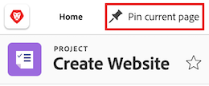

# Fissare le pagine per personalizzare l’area di lavoro

{{highlighted-preview}}

<!-- Audited: 4/2025 -->

È possibile fissare il lavoro più importante in [!DNL Adobe Workfront] per aumentare la visibilità, migliorare l&#39;organizzazione e velocizzare l&#39;accesso. Le pagine bloccate sono sempre accessibili dalla parte superiore di qualsiasi pagina in Workfront.

È possibile che tu sia assegnato a un modello di layout con pagine già bloccate (come descritto in [Personalizzare le pagine bloccate utilizzando un modello di layout](../../administration-and-setup/customize-workfront/use-layout-templates/customize-pinned-pages.md)). Questi pin predefiniti non possono essere rinominati o rimossi. Tutte le pagine fissate vengono visualizzate a destra dei pin predefiniti.

## Requisiti di accesso

+++ Espandi per visualizzare i requisiti di accesso per la funzionalità descritta in questo articolo.

<table style="table-layout:auto"> 
 <col> 
 </col> 
 <col> 
 </col> 
 <tbody> 
  <tr> 
   <td role="rowheader"><strong>[!DNL Adobe Workfront] pacchetto</strong></td> 
   <td> 
Qualsiasi
 </td> 
  </tr> 
  <tr> 
   <td role="rowheader"><strong>[!DNL Adobe Workfront] licenza</strong></td> 
   <td> 
Collaboratore
 
     
Richiesta

   </td> 
  </tr> 
 </tbody> 
</table>

Per informazioni, consulta [Requisiti di accesso nella documentazione di Workfront](/help/quicksilver/administration-and-setup/add-users/access-levels-and-object-permissions/access-level-requirements-in-documentation.md).

+++

## Inserisci puntina su una pagina

1. Passare alla pagina che si desidera fissare. Può trattarsi di qualsiasi elemento di lavoro, ad esempio un progetto, un’attività, una coda di richieste e così via.

1. Nell&#39;angolo superiore sinistro della pagina fare clic su **[!UICONTROL Aggiungi pagina corrente]**. La pagina bloccata è ora accessibile dalla parte superiore di qualsiasi pagina in [!DNL Workfront].

   Immagine di esempio nell&#39;ambiente di anteprima:
   

   Immagine di esempio nell’ambiente di produzione:
   

## Accedere a una pagina bloccata

1. Nella parte superiore di qualsiasi pagina, fare clic sulla pagina bloccata che si desidera visualizzare.

   >[!TIP]
   >
   >Passa il puntatore del mouse su una pagina bloccata per visualizzare il nome completo e la descrizione.

   Oppure

   Se hai fissato molte pagine, fai clic sull&#39;icona **[!UICONTROL Altro]**  per visualizzare altre pagine fissate.

   Immagine di esempio nell&#39;ambiente di anteprima:
   

   Immagine di esempio nell’ambiente di produzione:
   

   Viene visualizzata la pagina bloccata.

## Gestisci pin

È possibile rinominare, riordinare e rimuovere le pagine bloccate in un&#39;unica posizione.

1. Fai clic sull&#39;icona **[!UICONTROL Altro]**  nella riga dei pin e seleziona **Gestisci pin**.
1. Nella casella **Gestisci pin** eseguire una o più delle operazioni seguenti:

   * Fai clic sull&#39;icona **Modifica** per rinominare una pagina bloccata. Digita il nuovo nome e fai clic sull’icona del segno di spunta per confermare.
   * Trascinare e rilasciare le pagine bloccate nell&#39;ordine in cui si desidera visualizzarle.
   * Fai clic sull&#39;icona **Elimina** per rimuovere una pagina bloccata dall&#39;elenco.

   

1. Fai clic su **Chiudi** al termine della modifica dei pin.

## Rinominare una pagina bloccata

1. Passa il puntatore del mouse sulla pagina bloccata nella navigazione superiore.
1. Fai clic sull&#39;icona **Altro**  visualizzata accanto al nome del pin e seleziona **[!UICONTROL Rinomina pin]**.

   

1. Digita il nuovo nome del pin, quindi fai clic su **Salva**.

   

## Riordinare le pagine bloccate

È possibile modificare l&#39;ordine di visualizzazione delle pagine bloccate.

1. Passa il puntatore del mouse sulla pagina bloccata da spostare, quindi fai clic sull&#39;icona **Altro** .
1. Scegli **Sposta a sinistra** o **Sposta a destra** per spostare il pin.
1. (Facoltativo) Scegli **Sposta in primo piano** per spostare il pin nella posizione più a sinistra della barra del pin.

   

   Le modifiche vengono salvate automaticamente e memorizzate al successivo accesso a Workfront.

## Rimuovere una pagina bloccata

1. Fai clic sull&#39;icona **Altro**  accanto al pin che desideri rimuovere.
1. Fare clic su **Rimuovi pin**. La pagina non è più accessibile dalla parte superiore di alcuna pagina in [!DNL Workfront].

   

