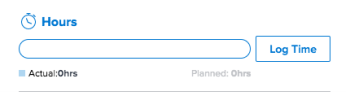

# [!UICONTROL Riepilogo] panoramica

È possibile utilizzare [!UICONTROL Riepilogo] pannello per esaminare e aggiornare le informazioni sugli elementi di lavoro direttamente da un elenco di problemi di attività, documenti o da altre aree di [!DNL Adobe Workfront] che visualizzano attività e problemi.

Nella tabella seguente vengono visualizzate le aree in cui è possibile individuare e utilizzare la [!UICONTROL Riepilogo] pannello:

<table style="table-layout:auto"> 
 <col data-mc-conditions=""> 
 <tbody> 
  <tr> 
   <td>Attività</td> 
  </tr> 
  <tr> 
   <td> 
Elenchi di attività in un
 
    <ul> 
     <li>Progetto</li> 
     <li>Sottoattività</li> 
    </ul> </td> 
  </tr> 
  <tr> 
   <td>Attività nelle aree di lavoro [!UICONTROL Non assegnato] e [!UICONTROL Assegnato] delle [!DNL Workload Balancer]</td> 
  </tr> 
  <tr data-mc-conditions=""> 
   <td>Problemi</td> 
  </tr> 
  <tr data-mc-conditions=""> 
   <td> 
Elenchi di problemi all’interno di un
 
    <ul> 
     <li>Progetto</li> 
     <li>Attività</li> 
     <li>Sottoattività</li> 
    </ul> </td> 
  </tr> 
  <tr data-mc-conditions=""> 
   <td>Problemi nell’area [!UICONTROL Lavoro assegnato] del [!DNL Workload Balancer]</td> 
  </tr> 
  <tr data-mc-conditions=""> 
   <td>Problemi nella sezione [!UICONTROL Inviato] dell’area [!UICONTROL Requests]</td> 
  </tr> 
  <tr data-mc-conditions=""> 
   <td>Documenti</td> 
  </tr> 
  <tr data-mc-conditions=""> 
   <td>Area Documenti</td> 
  </tr> 
  <tr data-mc-conditions=""> 
   <td>Sezione Documenti di qualsiasi oggetto (progetto, attività, problema, programma, portfolio, modello, task modello, utente)</td> 
  </tr> 
 </tbody> 
</table>

<!--

Workfront administrators can customize the Summary in the Layout Template. For more information, see <a href="../../administration-and-setup/customize-workfront/use-layout-templates/create-and-manage-layout-templates.md" class="MCXref xref">Create and manage layout templates</a>.

-->

Questo articolo descrive come accedere e utilizzare il [!UICONTROL Riepilogo] pannello per attività e problemi negli elenchi.

Per informazioni sull&#39;accesso a [!UICONTROL Riepilogo] in [!DNL Workload Balancer], vedi [Aggiorna gli elementi di lavoro nel [!DNL Workload Balancer] utilizzando [!UICONTROL Riepilogo]](../../resource-mgmt/workload-balancer/update-items-in-summary-panel-in-workload-balancer.md).

Per informazioni sull&#39;accesso a [!UICONTROL Riepilogo] per i documenti, vedi [[!UICONTROL Riepilogo] panoramica dei documenti](../../documents/managing-documents/summary-for-documents.md).

## Requisiti di accesso

Per eseguire i passaggi descritti in questo articolo, è necessario disporre dei seguenti diritti di accesso:

<table style="table-layout:auto"> 
 <col> 
 <col> 
 <tbody> 
  <tr> 
   <td role="rowheader"><strong>[!DNL Adobe Workfront] piano*</strong></td> 
   <td> 
Qualsiasi
 </td> 
  </tr> 
  <tr> 
   <td role="rowheader"><strong>[!DNL Adobe Workfront] licenza*</strong></td> 
   <td> 
[!UICONTROL Request] o superiore
 </td> 
  </tr> 
  <tr> 
   <td role="rowheader"><strong>Configurazioni a livello di accesso*</strong></td> 
   <td> 
Visualizzazione o accesso superiore a Attività, Problemi, Documenti
 
[!UICONTROL View] o accesso superiore a qualsiasi oggetto per il quale si desidera visualizzare i documenti’ [!UICONTROL Summary]
 
Nota: Se non hai ancora accesso, chiedi [!DNL Workfront] amministratore se imposta ulteriori restrizioni nel livello di accesso. Per informazioni su come [!DNL Workfront] l'amministratore può modificare il livello di accesso, vedi <a href="../../administration-and-setup/add-users/configure-and-grant-access/create-modify-access-levels.md" class="MCXref xref">Creare o modificare livelli di accesso personalizzati</a>.
 </td> 
  </tr> 
  <tr> 
   <td role="rowheader"><strong>Autorizzazioni oggetto</strong></td> 
   <td> 
Visualizzazione o autorizzazioni successive per un'attività, un problema o un documento
 
Per informazioni sulla richiesta di accesso aggiuntivo, vedi <a href="../../workfront-basics/grant-and-request-access-to-objects/request-access.md" class="MCXref xref">Richiedere l’accesso agli oggetti </a>.
 </td> 
  </tr> 
 </tbody> 
</table>

&#42;Per sapere quale piano, tipo di licenza o accesso hai, contatta il tuo [!DNL Workfront] amministratore.

## Visualizza la [!UICONTROL Riepilogo] in un elenco di attività o problemi

1. Passa a un’attività o a un problema e seleziona un elemento nell’elenco.
1. Fai clic sul pulsante **[!UICONTROL Riepilogo]** icona 

   oppure

   Fai clic sul pulsante **[!UICONTROL Apri riepilogo]** icona  in [!UICONTROL Inviato] della sezione [!UICONTROL Richieste] area.

   Dopo aver aperto il Riepilogo, questo rimane aperto quando si fa clic o si selezionano altre attività o problemi e rimane aperto finché non lo si chiude manualmente.

   >[!TIP]
   >
   >Puoi selezionare una sola attività o un solo problema alla volta per visualizzarne i dettagli nella [!UICONTROL Riepilogo] pannello.

   

1. (Facoltativo) Per chiudere il [!UICONTROL Riepilogo] , effettua una delle seguenti operazioni:

   * In un elenco di attività o problemi, fai clic sul pulsante **[!UICONTROL Apri riepilogo]** icona 

      Oppure

      Fai clic sul pulsante **X** nell’angolo superiore destro del [!UICONTROL Riepilogo] pannello.

   * In [!UICONTROL Inviato] della sezione [!UICONTROL Richieste] fai clic sull’area **[!UICONTROL Chiudi riepilogo]** icona 

      Oppure

      Fai clic sul pulsante **X** nell’angolo in alto a destra del pannello Riepilogo.

## [!UICONTROL Percentuale completato]

Utilizza la barra di avanzamento nella parte superiore della [!UICONTROL Riepilogo] per aggiornare la percentuale di completamento per l&#39;attività o il problema selezionato. Immettere un numero o trascinare la barra sulla percentuale corretta.

## [!UICONTROL Aggiornamenti]

Utilizza la [!UICONTROL Aggiornamenti] della sezione [!UICONTROL Riepilogo] per visualizzare gli aggiornamenti recenti e apportare aggiornamenti all&#39;attività o al problema selezionato. Fai clic su **[!UICONTROL Visualizza tutto]** per passare direttamente al [!UICONTROL Aggiornamenti] scheda sull&#39;attività.

## [!UICONTROL Documenti]

Utilizza la [!UICONTROL Documenti] della sezione [!UICONTROL Riepilogo] per visualizzare i documenti allegati all&#39;attività o al problema selezionato. Fai clic sulla miniatura per aprire un’anteprima del documento. Per passare direttamente al [!UICONTROL Documenti] fai clic sulla scheda dell’attività o del problema **[!UICONTROL Documenti]** titolo.

## [!UICONTROL Dettagli]

Utilizza la [!UICONTROL Dettagli] della sezione [!UICONTROL Riepilogo] per visualizzare i dettagli degli elementi di lavoro di alto livello, effettuare assegnazioni o aggiungere date di inizio. Fai clic su **[!UICONTROL Visualizza tutto]** per passare direttamente al [!UICONTROL Dettagli] scheda sull&#39;attività o sul problema.

>[!NOTE]
>
>I campi visualizzati in questa sezione sono gli stessi campi visualizzati nel pannello di destra in Home. È possibile personalizzare questi campi [Personalizza [!UICONTROL Pagina principale] e [!UICONTROL Riepilogo] utilizzo di un modello di layout](../../administration-and-setup/customize-workfront/use-layout-templates/customize-home-summary-layout-template.md).

## [!UICONTROL Sottoattività]

Questa sezione è disponibile solo per le attività. Utilizza la [!UICONTROL Sottoattività] della sezione [!UICONTROL Riepilogo] per visualizzare [!UICONTROL Nuovo], [!UICONTROL In corso]e [!UICONTROL Chiuso] sottoattività dell&#39;attività selezionata. Fai clic sul pulsante **[!UICONTROL Stato]** menu a discesa per passare da uno stato all’altro. Per passare direttamente al [!UICONTROL Sottoattività] fai clic sulla scheda dell’attività **[!UICONTROL Sottoattività]** Titolo &#x200B;.

Se non sono state aggiunte attività secondarie all&#39;attività, fare clic su **[!UICONTROL Aggiungi uno qui]** per passare direttamente al [!UICONTROL Sottoattività] scheda sull&#39;attività.

## [!UICONTROL Ore]

Utilizza la [!UICONTROL Ore] della sezione [!UICONTROL Riepilogo] per registrare ore sull&#39;attività o sul problema selezionato. Fai clic su **[!UICONTROL Tempo di log]** e immetti le tue ore. Per passare direttamente alla scheda Ore sull’attività o sul problema, fai clic sul pulsante **[!UICONTROL Ore]** titolo.

Il conteggio delle ore nel [!UICONTROL Riepilogo] visualizza le ore di log. Altri utenti avranno totali di ore diversi nel [!UICONTROL Riepilogo] a seconda dell’ora in cui effettuano l’accesso all’attività.

Se non è prevista alcuna [!UICONTROL ore] sull&#39;attività o sul problema e hai registrato il tempo, la barra delle ore viene visualizzata in rosso.

## Approvazioni

Utilizza la [!UICONTROL Approvazioni] della sezione [!UICONTROL Riepilogo] per visualizzare le approvazioni collegate all&#39;attività o al problema selezionato. Se non hai aggiunto alcuna approvazione, seleziona un’approvazione esistente dal menu a discesa o fai clic su **[!UICONTROL Crea un processo di approvazione a uso singolo]** per passare direttamente al [!UICONTROL Approvazioni] scheda sull&#39;attività o sul problema.

Per passare direttamente al [!UICONTROL Approvazioni] fai clic sulla scheda dell’attività o del problema **[!UICONTROL Approvazioni]** titolo.

