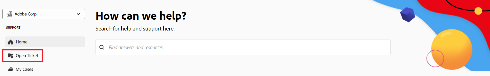

# Contatta l’Assistenza clienti

<!--

(We need to keep this as a standalone article. It is linked in multiple articles and FAQs.)

-->

Come [!DNL Adobe Workfront] cliente, puoi contattare il [!DNL Workfront] Assistenza clienti tramite telefono o invio di un ticket online.

>[!NOTE]
>
>Per problemi critici, contatta [!DNL Workfront] Assistenza clienti per telefono.

## Telefono

È possibile contattare [!DNL Workfront Customer Support] 7 giorni alla settimana, 24 ore al giorno, attraverso i seguenti numeri:

* Stati Uniti: 844-306-HELP(4357)
* EMEA: +44 1256 274200
* Australia: +61 1800 849259

## Web

Puoi inviare un ticket di supporto dal self-service [!DNL Experience League] portale.

>[!CAUTION]
>
>Solo i contatti di supporto autorizzati (o i clienti autorizzati) possono inviare ticket di supporto online.

1. Da [[!DNL Experience League]](https://experienceleague.adobe.com) sito web, fai clic su **[!UICONTROL Supporto]**  nella parte superiore della pagina.

   

   Dalla home page del supporto, puoi accedere facilmente ai casi di supporto aperti, registrare un nuovo caso, visualizzare gli articoli principali del supporto o accedere a fonti di apprendimento aggiuntive.

1. Per inviare un caso, selezionare l&#39;opzione &quot;[!UICONTROL Apri un caso di supporto]&quot;, quindi fai clic su **[!UICONTROL Sign] In**.

1. Fai clic su **[!UICONTROL Open case]** nella barra laterale sinistra.

   

   La [!UICONTROL creazione di un caso] viene visualizzata la pagina in cui puoi inserire il nome del prodotto ([!DNL Adobe Workfront], [!DNL Adobe Workfront Fusion], ecc.), il titolo del caso e la descrizione del caso.

   >[!TIP]
   >
   >Descrivi il problema con la massima descrizione possibile per velocizzare il processo di risoluzione dei problemi.

1. Compila le informazioni per i seguenti campi per fornirci dettagli più specifici:

   * **[!UICONTROL Priorità del caso]** ([!UICONTROL Basso], [!UICONTROL Media], [!UICONTROL Alta], [!UICONTROL Critico])
   * **[!UICONTROL Prodotto]** ([!UICONTROL DAM], [!DNL Fusion], [!DNL Goals], ecc.)
   * **[!UICONTROL Ambiente]** ([!UICONTROL Produzione], [!UICONTROL Anteprima], [!UICONTROL Sandbox], ecc.)
   * **[!UICONTROL Area clienti]** (Americhe, EMEA, APAC)

1. Carica i file pertinenti, quindi fai clic su **[!UICONTROL Invia caso]**.

   La [!UICONTROL Casi personali] viene visualizzata la pagina .

   

1. (Facoltativo) Nella **[!UICONTROL Casi personali]** pagina, esamina i casi inviati dalla tua organizzazione.

   >[!TIP]
   >
   >Puoi anche passare alla [!UICONTROL Casi personali] facendo clic su **[!UICONTROL Casi personali]** nella barra laterale sinistra.

1. Sulla [!UICONTROL Casi personali] utilizza le opzioni nella parte superiore della pagina per filtrare per prodotto ([!DNL Experience Cloud] soluzione) o caso [!UICONTROL Stato] (aperto o chiuso). È inoltre possibile utilizzare [!UICONTROL ricerca] per cercare le parole chiave relative ai tuoi casi di assistenza.

1. Per visualizzare ulteriori dettagli su un caso, fai clic sul pulsante **Numero del caso** per accedervi. La [!UICONTROL caso] viene visualizzata la vista.

1. In [!UICONTROL caso] visualizzare, esaminare i commenti più recenti con il proprietario del caso assegnato e aggiungere eventuali allegati o risposte aggiuntivi.

1. Fai clic su **[!UICONTROL Inoltra a gestione]** sul lato destro della pagina sotto **[!UICONTROL Dettaglio caso]** per intensificare il caso.

1. Fai clic sul pulsante **[!UICONTROL Chiudi caso]** per chiudere il caso.

In caso di domande o problemi durante l’invio di una richiesta, contatta il team di assistenza clienti.

<!--drafted: I took the information above from this blog post by Jon Chen (on September 13, 2022): https://experienceleaguecommunities.adobe.com/t5/workfront-blogs/how-to-submit-a-support-ticket-on-experience-league/ba-p/461737)

- this is the information that was there before - pointing to WorkfrontOne: 

If you are logged in as an Authorized Support Contact, you can contact Workfront Customer Support through the Workfront One site and create a case, formally called a ticket.

1. Log in to [**one.workfront.com**](https://one.workfront.com/) as an Authorized Support Contact.
1. On the **Home** page, click **Support**.

   

   The Customer Support page displays.

   >[!NOTE]
   >
   >If you don't see the Support option on the Home page, you are not an Authorized Support Contact. Your Workfront administrator can contact Workfront Customer Support and request you be added an Authorized Support Contact. If you are the only Workfront administrator for your organization, contact the Workfront Support team by phone.

1. Complete the fields in the **Create a Support Case** form. All fields are required.  

   <table style="table-layout:auto">
    <tr>
        <td><strong>Subject</strong></td>
        <td>Type a brief question or explanation of the issue you are experiencing.</td>
    </tr>
    <tr>
        <td><strong>Description</strong></td>
        <td>Type a detailed description of the issue. Include as much information as possible.</td>
    </tr>
    <tr>
        <td><strong>Priority</strong></td>
        <td> </td>
    </tr>
    <tr>
        <td><strong>Case Product</strong></td>
        <td>Select the product in which you are experiencing the issue. If the issue is not related to a specific product, select None.</td>
    </tr>
    <tr>
        <td><strong>Product Area</strong></td>
        <td>Select the area of the product that best relates to the issue. If the related area is not listed in the drop-down menu, select Not Listed.</td>
    </tr>
    <tr>
        <td><strong>Environment</strong></td>
        <td>Select the environment in which the issue occurs. If you are seeing the issue in both the Production and Sandbox environments, please select Production.</td>
    </tr>
    <tr>
        <td><strong>Customer Region</strong></td>
        <td> </td>
    </tr>
   </table>

1. (Optional) Attach a file, such as an image or video file.

   1. At the bottom of the form, click **Upload File**.
   1. Click **Upload File**, then browse for and select the desired file.

      

   1. Click **Done** to upload the file to the case.

1. Click **Submit** to submit the case to Workfront Customer Support.

-->

