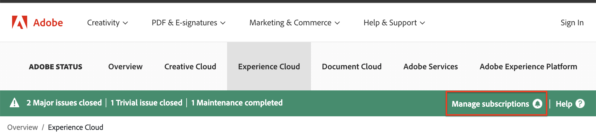

# Sito di stato [!DNL Adobe Workfront]

<!-- Audited: 1/2024 -->

## Panoramica del sito Stato

È possibile visualizzare lo stato della piattaforma [!DNL Workfront], inclusi gli incidenti, le finestre di manutenzione pianificate e lo stato corrente di tutti i cluster [!DNL Workfront] accedendo al sito [!DNL Workfront Status].

È possibile accedere alle seguenti informazioni sul sito Stato:

* Statistiche delle prestazioni del sistema in tempo reale
* Pianificazione della manutenzione pianificata
* Informazioni sulle salvaguardie utilizzate da [!DNL Workfront] per proteggere i dati utente
* Stati di vulnerabilità denominati

## Visualizza aggiornamenti di stato [!DNL Adobe Workfront]

È possibile visualizzare gli aggiornamenti di stato nel sito di stato [!DNL Adobe].

1. Digita [status.adobe.com](https://status.adobe.com/it/) nel browser per accedere al sito Status.

1. Seleziona **[!UICONTROL Experience Cloud]**.
1. Scorri verso il basso e seleziona **[!UICONTROL Adobe Workfront]** dall&#39;elenco delle soluzioni.

## Iscriviti o gestisci l’abbonamento

Per iscriversi al sito di stato o per gestire l&#39;iscrizione dopo l&#39;iscrizione:

1. Vai a [status.adobe.com](https://status.adobe.com/it/).
1. Nella barra di stato, selezionare **[!UICONTROL Gestisci sottoscrizioni]**.
   
1. Se disponi di un account esistente, accedi all’account; in caso contrario, crea un nuovo account.
1. Fare clic sul pulsante **[!UICONTROL Crea sottoscrizioni]**.
1. Seleziona **[!UICONTROL Adobe Workfront]** nell&#39;intestazione **[!UICONTROL Experience Cloud]**, quindi fai clic su **[!UICONTROL Continua]**.
1. Seleziona le tue preferenze per l&#39;area geografica e il tipo di evento, quindi fai clic su **[!UICONTROL Continua]**.
1. Fai clic su **[!UICONTROL Fine]** per confermare la sottoscrizione.

## Comprendere le vulnerabilità denominate

### Cos’è una vulnerabilità denominata? {#what-is-a-named-vulnerability}

Nella sicurezza informatica, una vulnerabilità è una debolezza che consente all&#39;autore di un attacco di ridurre la stabilità, la sicurezza o l&#39;integrità di un sistema.

I ricercatori di vulnerabilità e i creatori di exploit denominano i propri progetti internamente per semplificarne il riferimento (ad esempio, [!DNL ShellShock], [!DNL Heartbleed], [!DNL POODLE] e [!DNL WannaCry]/[!DNL Petya]). Quando una vulnerabilità ha un impatto esteso, questi nomi diventano pubblici quando le vulnerabilità vengono divulgate.

### Come si visualizzano le vulnerabilità denominate identificate da [!DNL Workfront?] {#how-do-i-view-named-vulnerabilities-identified-by-workfront}

1. Vai a [status.adobe.com](https://status.adobe.com/it/), quindi fai clic su **[!UICONTROL Security]**.

## Perché è importante? {#why-is-this-important}

Tutti gli amministratori di rete che supportano la sicurezza devono avere familiarità con il sito Status e le vulnerabilità denominate identificate da Workfront.

Quando vengono divulgate vulnerabilità di impatto di grandi dimensioni, è fondamentale garantire che i fornitori siano consapevoli e mantengano protetti i tuoi dati.

Il sito Stato offre un registro corrente di tali vulnerabilità che puoi raggiungere in qualsiasi momento, dove puoi evitare l’attesa dopo aver registrato un ticket o contattando il tuo account manager per ottenere queste informazioni.
