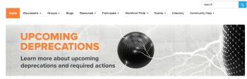

# Community [!DNL Adobe Workfront]

La community Adobe [!DNL Workfront] è un gruppo online di oltre 10.000 utenti [!DNL Workfront]. Tramite la community potrai rimanere aggiornato sulle versioni dei prodotti, conoscere gli eventi dei clienti e parlare con altri utenti di [!DNL Workfront] prodotti e servizi. Troverai le risposte alle domande e stabilirai connessioni con altri clienti [!DNL Workfront].

<!--

-->

## Accesso

* [Contatto supporto autorizzato](#authorized-support-contact)
* [Contatto per il supporto non autorizzato senza accesso SSO](#non-authorized-support-contact-without-sso-login)
* [Contatto di supporto non autorizzato con accesso SSO](#non-authorized-support-contact-with-sso-login)

### Contatto supporto autorizzato {#authorized-support-contact}

Se sei un Contatto di supporto autorizzato (ASC), disponi delle credenziali di accesso per [!UICONTROL Help Desk] e [!UICONTROL Innovation Lab]. È possibile utilizzare le stesse credenziali per accedere alla community [!DNL Workfront]. In questo caso, lascerai vuoto il sottodominio.

### Contatto per il supporto non autorizzato senza accesso SSO {#non-authorized-support-contact-without-sso-login}

Se non si è un Contatto di supporto autorizzato, è possibile accedere con le normali credenziali dell&#39;istanza [!DNL Workfront]. Utilizza lo stesso sottodominio dell&#39;istanza [!DNL Workfront].

>[!NOTE]
>
>Questa opzione funziona solo se la società non utilizza Single Sign-On (SSO) per accedere a Workfront.

### Contatto di supporto non autorizzato con accesso SSO {#non-authorized-support-contact-with-sso-login}

Se l&#39;azienda utilizza l&#39;SSO, è necessario contattare l&#39;Assistenza clienti [!DNL Workfront] telefonicamente per richiedere un account. Se non riesci a inviare un ticket o a partecipare a una chat in diretta, contatta l&#39;Assistenza clienti [!DNL Workfront] autorizzata.

Se non ricordi la password per il sito community, contatta [!DNL Workfront Customer Support] per ricevere assistenza.

## Domande frequenti

* [Qual è il mio sottodominio?](#what-s-my-subdomain)
* [Ho dimenticato il mio nome utente o password. Come si reimposta il nome utente o la password?](#i-forgot-my-username-or-password-how-do-i-reset-my-username-or-password)

### Qual è l&#39;URL per la community [!DNL Workfront]?

La community [!DNL Workfront] è disponibile nel sito Web [!DNL Adobe Experience League] al seguente URL: [[!DNL Workfront] Community](https://experienceleaguecommunities.adobe.com/t5/workfront/ct-p/workfront).

### Qual è il mio sottodominio? {#what-s-my-subdomain}

Se non conosci il sottodominio, puoi trovarlo in modo semplice. Se hai effettuato l&#39;accesso a [!DNL Workfront], il tuo sottodominio è la stringa di testo o la parola precedente a *.workfront.com* o *my.workfront.com* nell&#39;URL. Ad esempio, se l&#39;URL di Workfront legge *appetite.workfront.com,* allora *appetite* è il tuo sottodominio. Vedere il marcatore C nel diagramma seguente.

### Ho dimenticato il mio nome utente o password. Come si reimposta il nome utente o la password? {#i-forgot-my-username-or-password-how-do-i-reset-my-username-or-password}

Se dimentichi il nome utente o la password, contatta l’assistenza e un rappresentante ti aiuterà a reimpostare le credenziali.
