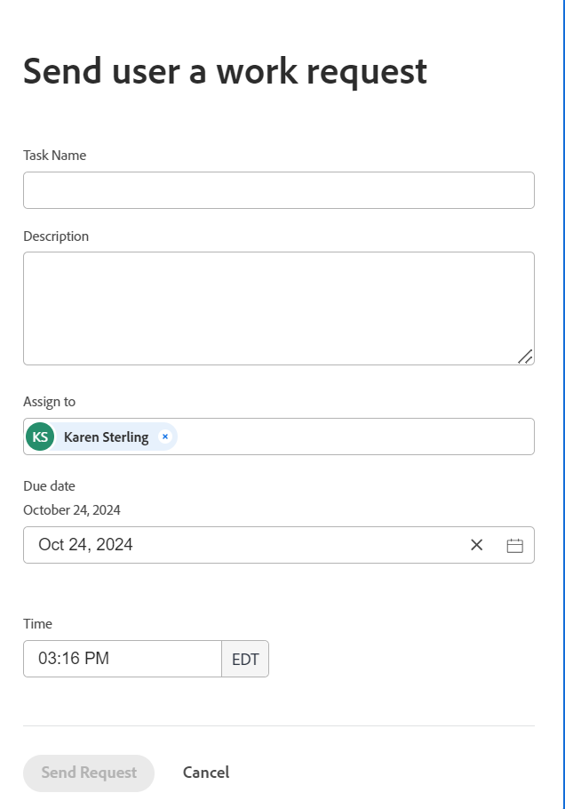

# Creare attività personali

<!--Audited: 10/2024-->

Le attività personali sono richieste di lavoro ad hoc che invii a un utente o che invii o aggiungi personalmente.

Adobe Workfront salva le richieste di lavoro ad hoc e le attività da eseguire come attività personali sul progetto personale di un utente creato automaticamente da Workfront per ogni utente.

Di seguito sono riportate le caratteristiche del progetto personale di un utente:

* Tutti gli utenti di Workfront hanno un progetto personale chiamato &quot;&lt; Nome completo dell’utente>’s Tasks&quot; (Attività). Ad esempio, &quot;John Smith&#39;s Tasks&quot;.
* Il progetto personale di ciascun utente non viene visualizzato nelle ricerche ed è nascosto.
* Un progetto personale non può essere eliminato, anche se gli utenti sono stati disattivati.
* Lo stato di un progetto personale è sempre Corrente. Non è possibile completare o annullare i progetti personali.
* Tutte le attività personali vengono memorizzate nel progetto personale di un utente.
* Se necessario, puoi spostare le attività personali in un altro progetto.

È possibile creare attività personali nei modi seguenti:

* Creare un&#39;attività nell&#39;area Home

  Per informazioni, vedere [Creare elementi di lavoro e progetti dall&#39;area Home](/help/quicksilver/workfront-basics/using-home/using-the-home-area/create-work-items-in-home.md).

* Creare e inviare una richiesta di lavoro personale a un altro utente dalla pagina del profilo utente
* Creare e inviare una richiesta di lavoro personale dalla pagina del profilo utente

Questo articolo descrive come creare una richiesta di lavoro personale per un utente o per te stesso dalla pagina del profilo utente.

Indipendentemente dalla modalità di aggiunta di un&#39;attività personale, è possibile trovarla nelle stesse aree di Workfront. Per ulteriori informazioni, vedere la sezione [Individuare l&#39;attività personale](#locate-personal-tasks) in questo articolo.

## Requisiti di accesso

+++ Espandi per visualizzare i requisiti di accesso per la funzionalità in questo articolo.

Per eseguire i passaggi descritti in questo articolo, è necessario disporre dei seguenti diritti di accesso:

<table style="table-layout:auto"> 
 <col> 
 </col> 
 <col> 
 </col> 
 <tbody> 
  <tr> 
   <td role="rowheader"><strong>piano Adobe Workfront</strong></td> 
   <td> 
Qualsiasi
 </td> 
  </tr> 
  <tr> 
   <td role="rowheader"><strong>Licenza Adobe Workfront*</strong></td> 
   <td> 
   
Nuovo: Standard per inviare richieste ad altri utenti. Tutti gli utenti possono creare autonomamente una richiesta di lavoro.
 
   
Corrente: prevede di inviare richieste ad altri utenti. Tutti gli utenti possono creare autonomamente una richiesta di lavoro.

    </td> 
  </tr> 
  <tr> 
   <td role="rowheader"><strong>Configurazioni del livello di accesso</strong></td> 
   <td> 
Modifica l’accesso agli utenti per creare una richiesta di lavoro per loro. Accesso in visualizzazione per creare una richiesta di lavoro personale. 

   </td> 
  </tr>

</tbody> 
</table>

*Per ulteriori informazioni, consulta [Requisiti di accesso nella documentazione di Workfront](/help/quicksilver/administration-and-setup/add-users/access-levels-and-object-permissions/access-level-requirements-in-documentation.md).

+++

## Creare una richiesta di lavoro personale

1. Vai alla pagina del profilo dell’utente o alla pagina del profilo di un altro utente a cui hai accesso per la visualizzazione.

   >[!TIP]
   >
   >L’amministratore di Workfront potrebbe impedire la visualizzazione di alcuni utenti durante la configurazione del livello di accesso.

1. Fai clic sul **menu Altro**  a destra del nome dell&#39;utente nell&#39;intestazione.
1. Fai clic su **Invia richiesta di lavoro**.
Viene visualizzata la casella **Invia all&#39;utente una richiesta di lavoro**.

   
1. Aggiorna le seguenti informazioni:

   * **Nome attività**: nome della richiesta di lavoro ad hoc o dell&#39;attività personale.
   * **Descrizione**: aggiungere una descrizione per l&#39;attività.
   * **Assegna a**: il nome dell&#39;utente selezionato viene visualizzato per impostazione predefinita. Puoi aggiungere altri utenti o team.
   * **Data di scadenza**: è la data entro la quale desideri che l&#39;attività venga completata. Per impostazione predefinita, questa è la data odierna. Impossibile selezionare una data nel passato
   * **Ora**: è l&#39;ora entro la quale desideri completare l&#39;attività. Per impostazione predefinita, questa è l’ora corrente.

1. Fai clic su **Invia richiesta** per salvare la richiesta di lavoro.

   La richiesta di lavoro viene salvata come attività personale in Workfront e viene aggiunta al widget Da fare dell’utente nella sua area Home. Se invii la richiesta di lavoro a te stesso, questa viene visualizzata nel widget Da fare nella Home.

## Individua attività personali

È possibile individuare le attività personali nelle seguenti aree:

* Il widget Da fare nell’area Home dell’utente a cui è stata inviata la richiesta personale.

  Per informazioni, vedere [Creare elementi di lavoro e progetti dall&#39;area Home](/help/quicksilver/workfront-basics/using-home/using-the-home-area/create-work-items-in-home.md).

* Un elenco o un report di attività personali. È possibile creare e applicare un filtro attività personale a un report o a un elenco attività per visualizzare solo le attività personali ed escludere le attività di progetto.

  Per informazioni, vedere [Filtro: attività personali](/help/quicksilver/reports-and-dashboards/reports/custom-view-filter-grouping-samples/filter-personal-tasks.md).
