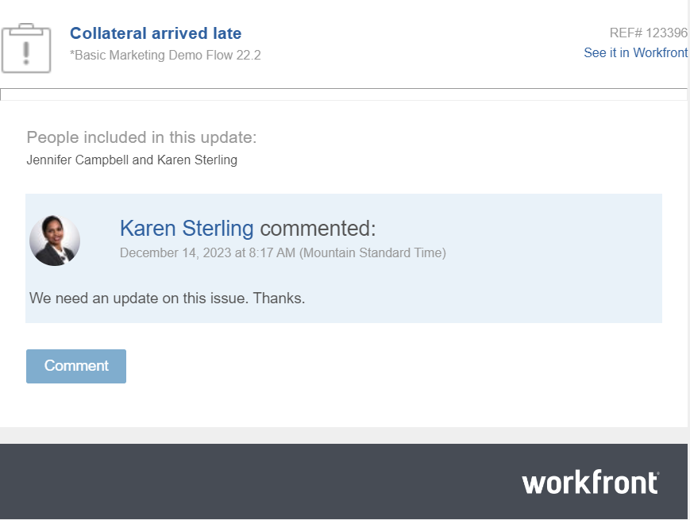

# Rispondere alle notifiche e-mail

<!-- Audited: April 2024-->

A seconda della configurazione delle notifiche e-mail, potresti ricevere una notifica e-mail quando viene effettuato un aggiornamento a determinati oggetti a cui hai accesso.

È possibile rispondere a un aggiornamento da una notifica e-mail nei modi seguenti:

* Utilizza il pulsante Commento nell&#39;e-mail per tornare a Workfront e rispondere all&#39;aggiornamento nell&#39;area Aggiornamenti.
* Rispondi all’e-mail ricevuta. L’e-mail di risposta viene aggiunta come risposta Workfront al commento originale.

<!--
>[!NOTE]
>
>Replying to updates by email is not available for environments on Cluster 6.
-->

Puoi rispondere all’e-mail Workfront generata dai commenti aggiunti ai seguenti oggetti:

* Progetto
* Attività
* Problema
* Documento
* Attività modello e modello
* Portfolio
* Programma
* Iterazione
* Scheda orario

## Requisiti di accesso

+++ Espandi per visualizzare i requisiti di accesso per la funzionalità descritta in questo articolo.

<table style="table-layout:auto">
 <col> 
 <col> 
 <tbody> 
  <tr> 
   <td role="rowheader"><strong>Pacchetto Adobe Workfront</strong></td> 
   <td> 
Qualsiasi
 </td> 
  </tr> 
  <tr> 
   <td role="rowheader"><strong>Licenza di Adobe Workfront</strong></td> 
   <td> 
Per problemi e documenti:

<ul><li>
Collaboratore o successiva
</li>
   <li>
Richiedente o successiva
</li></ul>

Per tutti gli altri oggetti:

   <ul><li>
Leggero o superiore
</li>
   <li>
Revisione o superiore
</li></ul>

</td> 
  </tr> 
  <tr> 
   <td role="rowheader"><strong>Configurazione del livello di accesso</strong></td> 
   <td> 
Visualizza o consente di accedere in modo più efficiente agli oggetti in cui si desidera pubblicare la risposta
 </td> 
  </tr> 
  <tr> 
   <td role="rowheader"><strong>Autorizzazione oggetto</strong></td> 
   <td> 
Visualizzare o aumentare le autorizzazioni per gli oggetti in cui si desidera pubblicare la risposta
 </td> 
  </tr> 
 </tbody> 
</table>

Per ulteriori informazioni, consulta [Requisiti di accesso per la documentazione di Workfront](/help/quicksilver/administration-and-setup/add-users/access-levels-and-object-permissions/access-level-requirements-in-documentation.md).

+++

<!--Old:
<table style="table-layout:auto">
 <col> 
 <col> 
 <tbody> 
  <tr> 
   <td role="rowheader"><strong>Adobe Workfront plan</strong></td> 
   <td> 
Any
 </td> 
  </tr> 
  <tr> 
   <td role="rowheader"><strong>Adobe Workfront license*</strong></td> 
   <td> 
New: Contributor or higher for issues and documents; Light or higher for all other objects

   
Current: Request or higher for issues and documents; Review or higher for all other objects
 </td> 
  </tr> 
  <tr> 
   <td role="rowheader"><strong>Access level configuration</strong></td> 
   <td> 
View or higher access to the objects where you want to post the reply
 </td> 
  </tr> 
  <tr> 
   <td role="rowheader"><strong>Object permission</strong></td> 
   <td> 
View or higher permissions to the objects where you want to post the reply
 </td> 
  </tr> 
 </tbody> 
</table>-->

## Rispondere a un aggiornamento da una notifica e-mail

Quando ricevi una notifica e-mail, puoi aprire rapidamente l’oggetto Workfront associato dalla notifica e-mail e aggiungere una risposta direttamente al thread di comunicazione.

1. Apri la notifica e-mail generata da un aggiornamento in Workfront.

   
1. Fai clic su **Commento** dalla notifica e-mail.

   La pagina Dettagli dell’oggetto si apre in Workfront.

1. Vai all’aggiornamento a cui desideri aggiungere una risposta.

   Oltre a visualizzare gli utenti che partecipano attivamente alla conversazione, è possibile visualizzare i tag di ogni risposta nella parte superiore del thread di aggiornamento. Questi utenti, insieme a tutti gli utenti sottoscritti all&#39;oggetto, ricevono una notifica ogni volta che viene eseguito un aggiornamento o una risposta sull&#39;oggetto. Per assegnare tag ad altri utenti, vedere [Assegnare tag ad altri utenti durante gli aggiornamenti](../../workfront-basics/updating-work-items-and-viewing-updates/tag-others-on-updates.md).

1. Fai clic su **Rispondi,** immetti la tua risposta, quindi fai clic su **Rispondi**.

   La risposta viene aggiunta come nuovo commento al thread di commento.

## Aggiungere un aggiornamento a un oggetto rispondendo a una notifica e-mail

Quando ricevi una notifica e-mail di Workfront, puoi aggiungere rapidamente un aggiornamento al thread di comunicazione senza effettuare l’accesso a Workfront.

>[!IMPORTANT]
>
>* Prima di poter rispondere alla notifica e-mail, è necessario disporre delle autorizzazioni necessarie per visualizzare almeno l’oggetto che ha attivato l’aggiornamento.
>
>* Per evitare errori di invio, gli utenti di Outlook devono eliminare il contenuto dell&#39;e-mail esistente prima di digitare la risposta.

Per aggiungere un aggiornamento a un’e-mail Workfront:

1. Dall’applicazione e-mail, apri l’e-mail di Workfront a cui desideri rispondere, quindi apri una finestra di e-mail di risposta dall’e-mail originale.

   >[!NOTE]
   >
   >    Non puoi rispondere a una notifica e-mail che ti è stata inoltrata da qualcun altro.

1. Digita il tuo aggiornamento nella risposta e-mail.

   Gli allegati non sono consentiti e l’eventuale formattazione Rich Text applicata a un aggiornamento in un messaggio e-mail non viene visualizzata nell’aggiornamento quando viene visualizzata nella scheda Aggiornamenti.
1. Fai clic su **Invia**.

   L&#39;aggiornamento viene aggiunto come risposta al thread di comunicazione dell&#39;oggetto.
