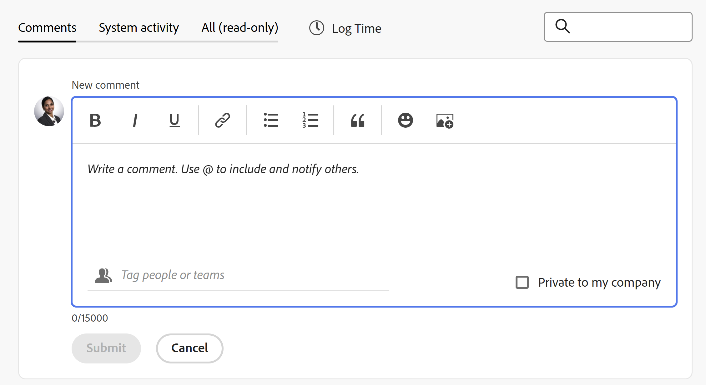

# Aggiorna lavoro

<!-- Audited: 1/2024 -->

<!--
The highlighted information on this page refers to functionality not yet generally available. It is available only in the Preview environment for all customers or in Production for customers who enabled fast releases. 

For information about fast releases, see [Enable or disable fast releases for your organization](/help/quicksilver/administration-and-setup/set-up-workfront/configure-system-defaults/enable-fast-release-process.md).

For information about the current release schedule, see [Second Quarter 2024 release overview](/help/quicksilver/product-announcements/product-releases/24-q2-release-activity/24-q2-release-overview.md).
-->

<!--info for April 11: hide the "Important" box below-->

<!--
>[!IMPORTANT]
>
>We are currently redesigning the commenting experience in Adobe Workfront.
>
>Depending on what objects you access the commenting experience for, you might see the following functionality for the Updates section:
>* The new experience
>* The legacy experience
>* The new and the legacy experience
>
>For more information about the new commenting experience and its availability, see [New commenting experience](../../product-announcements/betas/new-commenting-experience-beta/unified-commenting-experience.md). 
>
> The legacy commenting experience has been removed from projects, tasks, issues, and documents in the Preview environment. 
>
>The new commenting experience is available only for the Updates section of Workfront objects, and it is not available when you access updates from the following areas:
>
> * Home
> * Summary panel in lists
> * Summary panel in timesheets 
> * Summary panel in the Workload Balancer
>
>The new commenting experience is available in the Summary panel in lists, timesheets, and the Workload Balancer in the Preview environment and in the Production environment for customers who have opted for the fast release process. 
-->

È possibile aggiungere un aggiornamento a un oggetto Adobe Workfront per comunicare ad altri utenti l&#39;avanzamento dell&#39;oggetto. Per ulteriori informazioni sugli oggetti a cui è possibile aggiungere aggiornamenti in Workfront, consulta [Panoramica della sezione di aggiornamento](/help/quicksilver/workfront-basics/updating-work-items-and-viewing-updates/updates-tab-overview.md).

Le informazioni contenute in questo articolo descrivono come commentare e aggiornare le informazioni relative a progetti, attività e problemi. Gli utenti che sono assegnati o abbonati all’oggetto possono visualizzare l’aggiornamento. Puoi anche assegnare tag agli utenti per attirare la loro attenzione sull’aggiornamento.

L’aggiunta di commenti ad altri oggetti è simile all’aggiornamento di progetti, attività e problemi. Per ulteriori informazioni sul commento a schede, obiettivi o iterazioni, consulta anche i seguenti articoli:

* [Gestire i commenti sugli obiettivi in Obiettivi di Adobe Workfront](../../workfront-goals/goal-management/manage-goal-comments.md).

  È necessaria un&#39;ulteriore licenza per accedere a Workfront Goals.

* [Aggiungere una scheda ad hoc a una bacheca](../../agile/get-started-with-boards/add-card-to-board.md)

* [Gestisci commenti iterazione](/help/quicksilver/agile/use-scrum-in-an-agile-team/iterations/manage-iteration-updates.md)

## Requisiti di accesso

Per eseguire i passaggi descritti in questo articolo, è necessario disporre dei seguenti diritti di accesso:

<table style="table-layout:auto"> 
 <col> 
 </col> 
 <col> 
 </col> 
 <tbody> 
  <tr> 
   <td role="rowheader"><strong>piano Adobe Workfront</strong></td> 
   <td> 
Qualsiasi
 </td> 
  </tr> 
  <tr> 
   <td role="rowheader"><strong>Licenza Adobe Workfront</strong></td> 
   <td> 
   
Corrente: richiesta o successiva per problemi e documenti; revisione o successiva per tutti gli altri oggetti

   
Nuovo: Collaboratore o versione successiva per problemi e documenti: chiaro o versione successiva per tutti gli altri oggetti
 
   </td> 
  </tr> 
  <tr> 
   <td role="rowheader"><strong>Configurazioni del livello di accesso</strong></td> 
   <td> 
Accesso di visualizzazione o modifica per l'oggetto su cui si trova l'aggiornamento
</td> 
  </tr> 
  <tr> 
   <td role="rowheader"><strong>Autorizzazioni oggetto</strong></td> 
   <td> 
Accesso di visualizzazione all'oggetto
</td> 
  </tr> 
 </tbody> 
</table>

Per ulteriori dettagli sulle informazioni contenute in questa tabella, vedere [Requisiti di accesso nella documentazione di Workfront](/help/quicksilver/administration-and-setup/add-users/access-levels-and-object-permissions/access-level-requirements-in-documentation.md).

## Considerazioni sull’aggiornamento del lavoro

* Puoi aggiungere commenti alla maggior parte degli oggetti in Adobe Workfront nella sezione Aggiornamenti. Per ulteriori informazioni sugli oggetti che visualizzano la sezione Aggiornamenti, vedere [Panoramica della sezione Aggiornamenti](../updating-work-items-and-viewing-updates/updates-tab-overview.md).

* Puoi aggiungere commenti agli oggetti Workfront da altre applicazioni integrate con Workfront o dall’app mobile Workfront.

  Non tutte le applicazioni integrate con Workfront possono aggiungere commenti agli oggetti Workfront.

  Non tutte le funzionalità disponibili nella sezione Aggiornamenti di un oggetto in Workfront sono disponibili in altre applicazioni quando si accede a oggetti Workfront dall&#39;applicazione. Ad esempio, le funzionalità Rich Text o l’impostazione di un commento come privato per l’azienda di un utente potrebbero non essere disponibili quando si aggiungono commenti a un oggetto Workfront da un’applicazione di terze parti.

* È possibile comunicare informazioni sull&#39;avanzamento di un oggetto di Workfront (progetto, attività o problema) quando si commenta l&#39;oggetto. Gli utenti che sono assegnati o abbonati all’oggetto possono ricevere una notifica sull’aggiornamento. Chiunque abbia accesso in visualizzazione all’oggetto può visualizzare l’aggiornamento.

* Puoi assegnare tag agli utenti per attirare la loro attenzione sull’aggiornamento. Gli utenti taggati ricevono una notifica in-app e un’e-mail relativa all’aggiornamento.

  >[!TIP]
  >
  >Ai proprietari dei commenti vengono assegnati automaticamente dei tag. Per ulteriori informazioni, consulta [Assegna tag ad altri utenti in caso di aggiornamenti](../../workfront-basics/updating-work-items-and-viewing-updates/tag-others-on-updates.md).

* È possibile aggiungere un commento a un oggetto che è possibile visualizzare oppure accedere come amministratore di Workfront o di gruppo e aggiungere un commento per conto di un altro utente. Per ulteriori informazioni, consulta [Accedi come altro utente](../../administration-and-setup/add-users/create-and-manage-users/log-in-as-another-user.md).

* Puoi aggiungere un aggiornamento a progetti, attività e problemi dalle seguenti aree di Workfront:

   * Da un oggetto Workfront, nella sezione Aggiornamenti (per progetti, attività e problemi)
   * Dall’area Home (per attività e problemi)
   * Dal pannello Riepilogo nelle seguenti aree (per attività, problemi e documenti):

      * Un elenco di oggetti
      * Una scheda orario
      * Home
      * Il Bilanciatore dei carichi di lavoro

<!--info for April 11: hide the section below: add an update to a work item-->

<!--
## Add an update to a work item

Adding an update to a work item differs depending on what version of the Updates section you use.

You can add updates to the following objects: 

* Projects
* Tasks
* Issues
* Programs
* Portfolios
* Templates
* Template tasks
* Users
* Timesheets
* Teams
* Goals
* Cards in the Boards area
* Iterations
-->

<!--info for April 11: hide the section below completely:-->

<!--
### Add an update to a work item in the legacy Updates section

>[!IMPORTANT]
>
>The information on this page describes how you update projects, tasks, and issues.

1. Go to the work item for which you want to provide an update (such as a project, task, or issue).
1. Click the **Updates** section.
1. (Conditional) If it is enabled, click the **New commenting** option in the upper-right corner of the Updates section to disable it and enable the legacy commenting experience.
1. Click **Start a new update,** then type your update.  
1. (Optional) Use the options in the Rich Text toolbar to format your text, add emojis, links, or images to your update, to enhance your content. For more information, see the [Use Rich Text in a Workfront update](#use-rich-text-in-a-workfront-update) section in this article.
1. (Optional) Update any of the following information about the work item:

   <table style="table-layout:auto"> 
    <col> 
    <col> 
    <tbody> 
     <tr> 
      <td role="rowheader"><strong>Notify</strong></td> 
      <td>Identify users who must be notified of the update. Users assigned or subscribed to the object automatically receive notification when an update is made. 
For information about how to include others on an update, see <a href="../../workfront-basics/updating-work-items-and-viewing-updates/tag-others-on-updates.md" class="MCXref xref">Tag others on updates</a>.
</td> 
     </tr> 
     <tr> 
      <td role="rowheader"><strong>Commit Date</strong></td> 
      <td>In the date picker, select the date that you commit to complete the work item. For information about Commit Date, see <a href="../../manage-work/projects/updating-work-in-a-project/overview-of-commit-dates.md" class="MCXref xref">Commit Date overview</a>.</td> 
     </tr> 
     <tr> 
      <td role="rowheader"><strong>Condition</strong></td> 
      <td>Select a new condition for the task or issue. For information about selecting a condition, see <a href="../../manage-work/projects/updating-work-in-a-project/update-condition-for-tasks-and-issues.md" class="MCXref xref">Update Condition for tasks and issues</a>.</td> 
     </tr> 
     <tr> 
      <td role="rowheader"><strong>Status</strong></td> 
      <td>Click the arrow beside the current status, then select the desired status from the drop-down menu. For information about setting a Status, see <a href="../../manage-work/projects/updating-work-in-a-project/update-task-status.md" class="MCXref xref">Update task status</a>.
Updating the status of a work item does not automatically change the status of a project. Depending on how your project is set up, you might make updates to the project status separately. For more information on the various project update types, see <a href="../../manage-work/projects/manage-projects/select-project-update-type.md" class="MCXref xref">Select the project Update Type </a>.

<b>NOTE</b>
      
      You cannot change the status of a work item while it is in a Pending Approval status.
</td> 
     </tr> 
     <tr> 
      <td role="rowheader"><strong>Completion Bar</strong></td> 
      <td>(Only available on tasks) Indicate the percentage of work completed by sliding the progress bar to the desired percentage. You can also double-click the completion bar and enter the percent complete.</td> 
     </tr> 
     <tr> 
      <td role="rowheader"><strong>Private to my company</strong></td> 
      <td> 
Disable this option to prevent users outside your company from having access to view this update.
 
      
<b>NOTE</b>

      
This option displays only when the user is associated with a Company.

      
This option is not available in all areas where you can add updates from. For example, this is not available in third-party applications where you can add updates from. 

      </td> 
     </tr> 
    </tbody> 
   </table>

1. Click **Update** to add the update to the Workfront object.

   >[!NOTE]
   >
   >A small pop-up window will appear for seven seconds after clicking **Update**, allowing you to undo the update and return to the editing pane before the update is posted. The update is posted if you dismiss the undo pop-up, wait for it to disappear, or navigate away from the page. 
   >
   >If your Workfront administrator selects the "Never allow users to delete comments" setting in your access level, you cannot undo a comment. For more information, see [Create and modify custom access levels](../../administration-and-setup/add-users/configure-and-grant-access/create-modify-access-levels.md).

1. To reply to an update, see [Reply to updates](../../workfront-basics/updating-work-items-and-viewing-updates/reply-to-updates.md).
-->

<!--info for April 11: reword the title of this section to: "Add an update to a work item"; take out the step that says you need to enable the "New commenting" toggle (I think it is step 3??)-->

## Aggiungere un aggiornamento a un elemento di lavoro

Questo articolo descrive come aggiornare progetti, attività o problemi. L&#39;aggiornamento della maggior parte degli altri oggetti è simile.

1. Individuare l&#39;oggetto che si desidera aggiornare, quindi fare clic sul relativo nome per aprire la pagina dell&#39;oggetto.
1. Clic  **Aggiornamenti** nel pannello a sinistra.
Il **Commenti** è selezionata per impostazione predefinita.

   <!--
   1. (Conditional) If the **New commenting** option is disabled, click to enable it. 

      This enables the new commenting experience. 

         >[!TIP]
         >
         >The New commenting option has been removed in the Preview environment.
   -->

1. Inizia a immettere un commento in **Nuovo commento** casella.

   

   >[!TIP]
   >
   >Se si esce dalla sezione Aggiornamenti prima di completare la digitazione e l&#39;invio di un commento, il commento nella pagina rimane in modalità bozza anche dopo la disconnessione e la riconnessione. Nella bozza vengono salvate anche tutte le immagini aggiunte al commento. Le bozze vengono salvate per 7 giorni dopo i quali vengono eliminate e non possono essere recuperate. I commenti bozza sono visibili solo all&#39;utente che li inserisce.

1. (Facoltativo) Per annullare o ripristinare una modifica, utilizzare i seguenti tasti di scelta rapida:
   * CTRL + Z (⌘+z per Mac) per annullare una modifica
   * CTRL+Y (⌘+y per Mac) per ripetere una modifica

1. (Facoltativo) In **Assegna tag a persone o team** , inizia a digitare il nome o l’e-mail di un utente o di un team che desideri includere in questo commento, quindi selezionalo quando viene visualizzato nell’elenco.
1. (Facoltativo) Utilizza le opzioni nella barra degli strumenti Testo formattato per formattare il testo, aggiungere emoticon, collegamenti o immagini all’aggiornamento, per migliorare i contenuti. Per ulteriori informazioni, vedere [Utilizzare la funzione Rich Text in un aggiornamento di Workfront](#use-rich-text-in-a-workfront-update) in questo articolo.

   >[!TIP]
   >
   >Se un altro utente invia un commento allo stesso elemento che si sta aggiornando, viene visualizzata una linea rossa con un indicatore &quot;Nuovo&quot; per informare l&#39;utente dei commenti più recenti.
   >
   >L’indicatore viene visualizzato solo dopo che il commento è stato inviato sull’elemento e non quando il commento è ancora composto.
   >
   >L’indicatore &quot;Nuovo&quot; viene visualizzato solo quando sia l’utente che ha inserito un nuovo aggiornamento che l’utente che lo sta inserendo utilizzano la nuova esperienza di commento.
   >

1. Clic **Invia** per aggiungere l&#39;aggiornamento all&#39;oggetto Workfront.
1. (Facoltativo) Per modificare un commento, fai clic su **Altro** menu  nell’angolo superiore destro del commento, quindi fai clic su **Modifica**.

   >[!IMPORTANT]
   >
   >È possibile modificare il commento solo entro 15 minuti dall&#39;invio.

1. Modifica le informazioni nel commento, aggiungi o rimuovi immagini o rimuovi gli utenti taggati. A sinistra dell&#39;indicatore della data viene aggiunto l&#39;indicatore &quot;Modificato&quot; che viene visualizzato quando è stato inserito il commento.

   >[!TIP]
   >
   >Nei commenti relativi all&#39;anno corrente non viene visualizzato l&#39;anno nel timbro data. Passando il puntatore del mouse su una marca temporale viene visualizzata la data completa, incluso l’anno.

   

   >[!TIP]
   >
   >* Viene generata un’e-mail per avvisare gli utenti dell’aggiornamento solo quando invii l’aggiornamento originale. Dopo aver modificato l’aggiornamento, non viene generata alcuna e-mail.
   >* La data accanto al commento è la data del commento originale e non quella dell&#39;ultima modifica.
   >* Quando si aggiunge un commento per conto di un altro utente (quando si esegue l&#39;accesso come altro utente come amministratore di Workfront o di gruppo), non è possibile modificarlo se si è connessi come altro utente. Puoi modificare il commento solo dopo aver effettuato la disconnessione come utente e aver effettuato di nuovo l’accesso come utente.

1. (Facoltativo) Fai clic su **Rispondi** o inizia a digitare un commento nel **Aggiungi risposta...** per rispondere a un commento esistente, quindi seguire i passaggi 3-7 sopra. <!--(**************insure this stays accurate***********)--> Per informazioni sulla risposta a un aggiornamento, consulta [Rispondi agli aggiornamenti](../../workfront-basics/updating-work-items-and-viewing-updates/reply-to-updates.md).

1. (Condizionale e facoltativo) Se altri utenti hanno aggiunto commenti visualizzati al di fuori dell’area visibile nella sezione Aggiornamenti durante l’aggiunta dei commenti, fai clic su **Visualizza** all&#39;interno del blu **banner nuovi commenti** nella parte inferiore dello schermo per visualizzare questi commenti.

   

   Ulteriori commenti vengono visualizzati nella parte inferiore dello schermo.

1. (Facoltativo) Fai clic su **Mi piace** icona. L’icona si aggiorna con il numero di Mi piace.
1. (Condizionale e facoltativo) Se nel commento sono state incluse altre persone, fare clic sul numero di membri inclusi nell&#39;aggiornamento per visualizzare un elenco di entità con cui è condiviso il commento immesso.

   

   >[!TIP]
   >
   >I nomi delle prime due entità con tag vengono visualizzati accanto ai relativi avatar. Se più di due entità vengono contrassegnate, vengono visualizzati solo il nome della prima e il numero di entità aggiuntive.

1. (Facoltativo) Fare clic sul nome di un commentatore per visualizzarne il nome, la mansione e l&#39;indirizzo di posta elettronica in una casella delle informazioni. Fare di nuovo clic sul nome del commentatore nella casella delle informazioni per aprire il profilo utente.
1. (Facoltativo) Fai clic su **Attività di sistema** per visualizzare gli aggiornamenti registrati dal sistema Quando l&#39;oggetto o uno dei relativi figli viene aggiornato, Workfront genera una nota su tale aggiornamento e lo visualizza nella scheda Attività di sistema.

   Per ulteriori informazioni, consulta [Panoramica della sezione Aggiornamenti](../updating-work-items-and-viewing-updates/updates-tab-overview.md).

   >[!TIP]
   >
   >Non è possibile aggiungere un commento a un aggiornamento del sistema. Tuttavia, tutte le risposte ai record di attività del sistema nell’esperienza di aggiunta di commenti legacy sono state aggiunte alla scheda Attività del sistema come di sola lettura. L’esperienza di commento legacy è stata rimossa da Workfront l’11 aprile 2024.

1. (Facoltativo) Fai clic su **Tutti** per visualizzare sia i commenti degli utenti che i commenti delle attività di sistema in un&#39;unica posizione. Questa è una scheda di sola visualizzazione.

   >[!TIP]
   >
   >Non è possibile rispondere a commenti o assegnare tag ad altri utenti nei commenti esistenti nella scheda Tutti. Per rispondere a un commento nella scheda Tutto, fare clic su **Rispondi nei commenti** per aprire il commento nella scheda Commenti.

## Utilizzare la funzione Rich Text in un aggiornamento di Workfront{#use-rich-text-in-a-workfront-update}

Puoi migliorare gli aggiornamenti utilizzando Rich Text o aggiungendo vari elementi, come emoticon, collegamenti o immagini.

1. Vai a **Aggiornamenti** di un oggetto Workfront e iniziare a digitare un commento.
1. (Facoltativo) Per aggiungere la formattazione Rich Text all’aggiornamento, utilizza gli attributi nella **Rich Text** durante la digitazione.

   

   | **Attributo** | **Pulsante Barra degli strumenti** | **Tasti di scelta rapida di Mac** | **Tasti di scelta rapida di Windows** |
   |---|---|---|---|
   | Bold |  | ⌘+b | Ctrl+B |
   | Corsivo |  | ⌘+i | CTRL+I |
   | Sottolinea |  | ⌘+u | Ctrl+U |
   | Collegamento ipertestuale |  |  Per aprire la casella Aggiungi collegamenti: ⌘+K   Per incollare un collegamento sul testo selezionato: ⌘+V  |  Per aprire la casella Aggiungi collegamenti: Ctrl+K   Per incollare un collegamento sul testo selezionato: Ctrl+V  |
   | Elenco puntato |  | ⌘+Maiusc+8 | Ctrl+Maiusc+8 |
   | Elenco numerato |  | ⌘+Maiusc+7 | Ctrl+Maiusc+7 |
   <!--| Block Quote | |⌘+Shift+9 | Ctrl+Shift+9   This is not available in the new commenting experience.   |-->

   <!--remove the last row when we remove legacy from the system-->

   Per interrompere la formattazione del testo, deselezionare l&#39;attributo nella **Rich Text** barra degli strumenti.

   <!-- in the table above: take "Create Links" verbiage from the hyperlink when the old commenting is removed and the commenting beta is the only way to comment - with October 2023-->

   >[!NOTE]
   >
   >* La formattazione viene visualizzata anche in tutte le notifiche e-mail ricevute dagli utenti contenenti l’aggiornamento.
   >* La formattazione Rich Text applicata a un aggiornamento in un messaggio e-mail non viene visualizzata nell’aggiornamento quando viene visualizzata nella scheda Aggiornamenti.
   >* Se l’organizzazione utilizza Workfront con Internet Explorer, il testo formattato incollato in un aggiornamento perde la formattazione Rich Text e viene visualizzato come testo normale. È possibile riformattare il testo utilizzando gli attributi della barra degli strumenti Testo formattato.
   >* La formattazione Rich Text non è disponibile per gli aggiornamenti apportati nell’area Schede orario o per gli oggetti Note e Last Condition visualizzati in un report.

   <!--1. (Optional and conditional) If you want to include text from previous updates or from other sources and distinguish it from your own update, you can mark it as a Block Quote. Click the **Block Quote** icon  and type the text you want to quote. The quoted text displays marked with a vertical gray line. Click the **Block Quote** icon again to return to normal formatting. This is not available in the new commenting experience.-->

   <!--remove this picture below and the bullet above when we remove legacy-->

   <!---->

1. (Facoltativo) Fai clic su **emoji** icona  per aggiungere emoji all’aggiornamento.

   >[!NOTE]
   >
   >* Workfront non sostituisce gli emoticon di punteggiatura come :) con le emoticon.
   >* Le emoticon non sono disponibili per gli oggetti Note e Last Condition visualizzati in un report.
   >* La funzione emoji di Workfront utilizza caratteri Unicode e, come tali, viene visualizzata solo sui browser e sui sistemi operativi che supportano i punti di codice Unicode. Gli utenti di una piattaforma, di un browser o di una versione del sistema operativo diversa dalla tua potrebbero non avere accesso alle stesse emoji.
   >* Un emoji non supportato è rappresentato da una casella bianca o nera.
   >* Windows 7 supporta solo emoji in bianco e nero.
   >* Le emoticon applicate a un aggiornamento effettuato tramite e-mail non vengono visualizzate nell’aggiornamento quando lo si visualizza nell’area Aggiornamenti.

1. (Facoltativo) Per aggiungere un collegamento URL a origini di informazioni aggiuntive:

   1. Fai clic nell’aggiornamento nel punto in cui desideri inserire un collegamento.
   1. Il giorno **Rich Text** , fare clic sul pulsante **Collegamento ipertestuale** icona .

   1. In **Crea collegamento** casella visualizzata, sotto **URL**, digita o incolla l’URL dell’origine a cui desideri collegare il file.

   1. Sotto **Testo da visualizzare**, digita o incolla il testo del collegamento.
   1. Fai clic su **Salva**.

1. (Facoltativo) Per allegare un&#39;immagine all&#39;aggiornamento, effettuare una delle seguenti operazioni:

   * Salva l’immagine sul computer, quindi trascinala e rilasciala nell’area Nuovo commento.
   * Copia uno screenshot dal computer, quindi incollalo nel commento.<!-- This is not available in the legacy commenting experience.-->
   * Fai clic su **Aggiungi immagine** icona  e passare all&#39;immagine nel computer.

   >[!NOTE]
   >
   >* Per poter visualizzare le icone Immagine o Aggiungi allegato, l&#39;amministratore di Workfront deve abilitare l&#39;aggiunta di immagini nella sezione Preferenze feed di aggiornamento dell&#39;area Interfaccia Workfront. Per informazioni, consulta [Configurare le preferenze per gli aggiornamenti utente](../../administration-and-setup/set-up-workfront/system-tracked-update-feeds/configure-preferences-user-updates.md).
   >* La dimensione massima del file di immagine è 7 MB. I tipi di file immagine supportati sono .jpg, .gif e .png.
   >* Le immagini sono accessibili dalla sezione Aggiornamenti di un oggetto e sono disponibili anche nell&#39;area Documenti del menu principale.
   >* È possibile incollare l&#39;immagine facendo clic con il pulsante destro del mouse nel nuovo commento oppure premendo CTRL + V per Windows (o ⌘ + V per Mac) sulla tastiera.
   >* È possibile inviare un aggiornamento con un’immagine e senza testo.
   >* Quando si elimina un commento che contiene un&#39;immagine, questa viene rimossa sia dalla sezione Aggiornamenti che dall&#39;area Documenti. L&#39;immagine viene eliminata anche dall&#39;area Documenti quando modificate un commento ed eliminate l&#39;immagine.
   >* Quando qualcuno elimina un’immagine allegata a un commento dall’area Documenti, questa viene rimossa anche dal commento.

   <!--remove the statement above about legacy, when we remove the legacy environment.-->

1. (Facoltativo) Per visualizzare un&#39;immagine nell&#39;aggiornamento esistente, effettuate una delle seguenti operazioni:

   * Fai clic su **Anteprima** icona  sulla miniatura dell’immagine per aprire l’immagine a dimensione intera in una nuova scheda del browser.
   * Fai clic su **Scarica** icona  sulla miniatura dell&#39;immagine per scaricare l&#39;immagine.

1. Clic **Invia** per aggiungere il commento.

## Cerca un aggiornamento

È possibile cercare un commento o una risposta nella sezione Aggiornamenti di un oggetto.

1. Vai a **Aggiornamenti** sezione di un oggetto.
1. Inizia a digitare una parola chiave <!--or a user's name --> nel **Ricerca** nell&#39;angolo superiore destro del **Commenti** scheda.

   <!--Add this tip or note instead of the note below - when it'll be possible: You can search for users who have been tagged or for comment owners.-->

   >[!NOTE]
   >
   >È possibile cercare solo le parole che appartengono al testo di un commento o di una risposta. Non è possibile cercare nomi di utenti o team con tag in un aggiornamento.

   

   Parola chiave <!--or user--> La ricerca è evidenziata e i commenti che la contengono vengono visualizzati nella parte superiore della sezione Aggiornamenti.

   Workfront esegue la ricerca nell&#39;intero flusso di aggiornamento dell&#39;oggetto, all&#39;esterno dei commenti visibili sullo schermo.

1. Fai clic su **x** per cancellare i risultati della ricerca e tornare a tutti i commenti.

<!-- when we release search to production, check above and make sure you don't have to add that the users tagged/ owners are also searchable-->

## Copia aggiornamenti

È possibile copiare un aggiornamento in diversi modi.

È possibile copiare un collegamento all&#39;aggiornamento o il contenuto di un aggiornamento per utilizzarlo in un nuovo aggiornamento.

<!--Copying an update differs depending on which commenting experience you use.-->

<!--info for April 11: take the sentence above out and reword the section title below to: Copy an update-->

### Copiare un aggiornamento <!--in the new commenting experience-->

<!--For information about what features are available for the new commenting experience and for what objects, see [New commenting experience](../../product-announcements/betas/new-commenting-experience-beta/unified-commenting-experience.md).-->

È possibile copiare informazioni da un commento esistente effettuando una delle seguenti operazioni:

* [Copia link](#copy-link)
* [Copia corpo del testo](#copy-body-text)
* [Risposta preventivo](#quote-reply)

#### Copia link

L’opzione Copia collegamento copia il commento o il collegamento agli Appunti, in modo da poterlo condividere con altri utenti.

1. Vai all’aggiornamento di cui desideri copiare il collegamento.

1. Fai clic su **Altro** , quindi fai clic su **Copia collegamento**.

1. Incolla il collegamento copiato nel passaggio precedente in un’e-mail o in un’altra applicazione per condividerlo con altri utenti. Il collegamento condiviso apre il commento da cui hai condiviso il collegamento.

   >[!TIP]
   >
   >Quando si condivide il collegamento di una conversazione su un oggetto figlio da un oggetto di livello superiore, il collegamento apre il thread nell&#39;area Aggiornamenti dell&#39;oggetto di livello superiore.
   >
   >Ad esempio, se copi il collegamento di un commento attività dall’area Aggiornamenti del progetto, il commento apre la pagina del progetto.

#### Copia corpo del testo

L’opzione Copia corpo del testo copia il testo da un aggiornamento specifico negli Appunti.

1. Vai all’aggiornamento o alla risposta che desideri copiare.
1. Fai clic su **Altro** , quindi fai clic su **Copia corpo del testo**.

#### Risposta preventivo

L&#39;opzione Risposta preventivo copia il commento originale in una nuova risposta sotto forma di un&#39;offerta di blocco.

1. Vai all’aggiornamento o alla risposta che desideri copiare.
1. Fai clic su **Altro** , quindi fai clic su **Risposta preventivo**.

   Viene visualizzata una nuova casella di commento e la risposta tra virgolette viene inclusa nel nuovo commento e contrassegnata come virgolette.

   

1. Continua ad aggiungere il tuo aggiornamento e fai clic su **Invia** per aggiungere il commento.

<!--info for April 11: hide the entire section below - notice that there are several sub-sub sections below this main section - hide them all, all the way up to "Delete an update"-->

<!--
### Copy an update in the legacy commenting experience

* [Copy the update](#copy-the-update) 
* [Copy the thread link](#copy-the-thread-link) 
* [Copy the update link](#copy-the-update-link)
* [Quote Reply](#quote-reply)

   >[!TIP]
   >
   >When you copy and share the link of a conversation on a child object from a higher-ranking object, the link opens the thread in the child object's Updates area. 
   >
   >For example, if you copy the link of a task comment from the project's Updates area, the comment opens the task page.

#### Copy the update {#copy-the-update}

This option copies the text from a specific update to the clipboard.

1. Go to the update or reply you want to copy.
1. Click the **More** menu, then click **Copy body text**.

   

#### Copy the thread link {#copy-the-thread-link}

This option copies the full thread link to the clipboard so you can share the thread with other users.

1. Go to the update thread you want to copy.

1. Click the **More** menu, then click **Copy thread link**.

    

1. Paste the link you copied in the previous step in an email or another application to share it with others. The shared link opens the comment you shared the link from. 

#### Copy the update link {#copy-the-update-link}

This option copies a specific update link to the clipboard. When you share the update link, the user who follows it sees a border around the update.

1. Go to the update or reply you want to copy.
1. Click the **More** menu next to the individual update, then click **Copy update link**.

   

1. Paste the link you copied in the previous step in an email or another application to share it with others. The shared link opens the comment you shared the link from. 

#### Quote Reply  

The Quote Reply option copies the original comment to a new reply as a block quote. 

1. Go to the update or reply you want to copy.
1. Click the **More** menu, then click **Quote Reply**.

   A new comment box opens and the quoted reply is included in the new comment and marked as a block quote.

1. Continue adding your update and click **Reply** to add the comment.
-->

## Eliminare un aggiornamento o una risposta

A seconda dell&#39;accesso fornito dall&#39;amministratore di Workfront, è possibile eliminare gli aggiornamenti aggiunti nella scheda Aggiornamenti di un oggetto. Per ulteriori informazioni, consulta [Creare o modificare livelli di accesso personalizzati](../../administration-and-setup/add-users/configure-and-grant-access/create-modify-access-levels.md#creating-a-new-access-from-scratch) nell’articolo [Creare o modificare livelli di accesso personalizzati](../../administration-and-setup/add-users/configure-and-grant-access/create-modify-access-levels.md).

Nessun utente di Workfront (incluso l’amministratore di Workfront) può eliminare gli aggiornamenti effettuati da un altro utente. Tuttavia, se il livello di accesso di un utente consente di eliminare i propri aggiornamenti, l’amministratore di Workfront può accedere come tale utente ed eliminare gli aggiornamenti che ha apportato. Per ulteriori informazioni, consulta [Creare o modificare livelli di accesso personalizzati](../../administration-and-setup/add-users/configure-and-grant-access/create-modify-access-levels.md#creating-a-new-access-from-scratch) e [Accedi come altro utente](../../administration-and-setup/add-users/create-and-manage-users/log-in-as-another-user.md).

1. Vai all’aggiornamento o alla risposta che desideri eliminare.
1. Fai clic su **Altro** accanto all’aggiornamento o alla risposta che desideri eliminare, quindi fai clic su **Elimina**.

   

1. Nel messaggio visualizzato, fai clic su **Elimina**.

   >[!NOTE]
   >
   >Se si elimina un aggiornamento con un’immagine allegata, vengono eliminati sia il commento che l’immagine. Per ulteriori informazioni, vedere [Utilizzare la funzione Rich Text in un aggiornamento di Workfront](#use-rich-text-in-a-workfront-update) in questo articolo.

   Quando al commento eliminato sono associate delle risposte, viene indicato che il commento è stato rimosso con il nome dell&#39;utente che lo ha rimosso.

   

   I commenti eliminati vengono rimossi immediatamente da Workfront. Un utente che utilizza la sezione Aggiornamenti vede un commento eliminato da un altro utente in tempo reale.

## Rivedi aggiornamenti di sistema

Nella sezione Aggiornamenti di un oggetto Workfront vengono visualizzati due tipi di informazioni:

* **Aggiornamenti utente:** Gli aggiornamenti utente sono commenti immessi dall&#39;utente e da altri utenti del sistema. Gli aggiornamenti utente vengono visualizzati nelle schede Commenti e Tutti della sezione Aggiornamenti.

  

* **Aggiornamenti di sistema:** Gli aggiornamenti di sistema registrano la rimozione di attività o problemi, l&#39;aggiunta o l&#39;eliminazione di versioni di documenti, l&#39;aggiunta o la rimozione di una richiesta di approvazione e di eventuali modifiche apportate all&#39;oggetto. Gli aggiornamenti di sistema vengono visualizzati nelle schede Attività di sistema e Tutti nella sezione Aggiornamenti.

  

  Gli amministratori di Workfront possono determinare cosa viene tracciato negli aggiornamenti di sistema, come spiegato in [Aggiornamenti monitorati dal sistema](../../administration-and-setup/set-up-workfront/system-tracked-update-feeds/system-tracked-update-feeds.md). Puoi anche filtrare gli aggiornamenti di sistema o le attività in modo da visualizzare solo gli aggiornamenti utente per tutti gli oggetti.

  I seguenti oggetti non dispongono di aggiornamenti generati dal sistema:

   * Team
   * Modello
   * Attività modello
   * Scheda ad hoc

Per ulteriori informazioni sugli aggiornamenti di sistema nella sezione Aggiornamenti, vedere [Panoramica della sezione Aggiornamenti](../updating-work-items-and-viewing-updates/updates-tab-overview.md).

<!--
After the monthly releases to Production, the same features are also available in the Production environment for customers who enabled fast releases.   
For information about fast releases, see [Enable or disable fast releases for your organization](../../administration-and-setup/set-up-workfront/configure-system-defaults/enable-fast-release-process.md)  
-->

<!-- with October 26 release: add somewhere this, and decide where we need to keep information about the legacy commenting. Should we create an article about iterations comments like we have for goals and cards?!:

>[!NOTE]
>
>Iterations display the legacy commenting experience.-->

<!--old message, before Auhust 17: 

>[!NOTE]
>
>We are currently redesigning the commenting experience in Adobe Workfront.
>
>For more information about the new commenting experience, see [New commenting experience](../../product-announcements/betas/new-commenting-experience-beta/unified-commenting-experience.md). 
>
>You can access the new experience for the following objects:
> * Issues, projects, tasks, and documents.
>
>     This is available when you enable the commenting Beta experience.
>
>     This functionality is available only for the Updates section, and it is not available for the following areas:
>
>     * Home
>     * Summary panel in lists
>     * Summary panel in timesheets
>
> * Goals, cards in the Boards area
>
>   The new commenting experience is the only experience for goals and cards. You must have an additional license to access Workfront Goals. For more information, see [Requirements to use Workfront Goals](../../workfront-goals/goal-management/access-needed-for-wf-goals.md). 
>
>     You can add and view updates to cards in the Boards area when you enable the Comments and System Activity sections on a card. For more information, see [Add an ad hoc card to a board](../../agile/get-started-with-boards/add-card-to-board.md).
-->