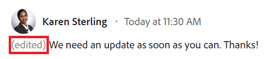

# Aggiorna lavoro

<!--take "Beta" references out when we remove the beta-->

Le informazioni evidenziate in questa pagina si riferiscono a funzionalità non ancora generalmente disponibili. È disponibile solo nell’ambiente di anteprima.

>[!NOTE]
>
>Attualmente stiamo riprogettando l’esperienza di aggiunta di commenti in Adobe Workfront.
>
>Per ulteriori informazioni sulla nuova esperienza di aggiunta di commenti, vedi [Nuova esperienza di commento](../../product-announcements/betas/new-commenting-experience-beta/unified-commenting-experience.md).
>
>Puoi accedere alla nuova esperienza per i seguenti oggetti:
> * Problemi, progetti, attività e documenti.
>
>     Questa funzione è disponibile quando abiliti l’esperienza Beta di commento.
>
>     Questa funzionalità è disponibile solo per la sezione Aggiornamenti e non per le aree seguenti:
>
>     * Home
>     * Pannello Riepilogo negli elenchi
>     * Pannello Riepilogo nelle schede orario
>
> * Obiettivi
>
>   La nuova esperienza di aggiunta di commenti è l’impostazione predefinita per gli obiettivi. È necessaria un&#39;ulteriore licenza per accedere a Workfront Goals. Per ulteriori informazioni, consulta [Requisiti per l’utilizzo degli obiettivi di Workfront](../../workfront-goals/goal-management/access-needed-for-wf-goals.md).
>
>    Per informazioni sul commento degli obiettivi, consulta [Gestire i commenti sugli obiettivi in Obiettivi di Adobe Workfront](../../workfront-goals/goal-management/manage-goal-comments.md).

Puoi aggiungere commenti alla maggior parte degli oggetti in Adobe Workfront nella sezione Aggiornamenti. Per ulteriori informazioni sugli oggetti che visualizzano la sezione Aggiornamenti, vedere [Panoramica della sezione Aggiornamenti](../updating-work-items-and-viewing-updates/updates-tab-overview.md).

È possibile aggiungere un aggiornamento a un oggetto di Workfront (progetto, attività o problema) per comunicare l&#39;avanzamento dell&#39;oggetto, quando si commenta l&#39;oggetto. Gli utenti che sono assegnati o abbonati all’oggetto possono visualizzare l’aggiornamento. Puoi anche assegnare tag agli utenti per attirare la loro attenzione sull’aggiornamento. Gli utenti taggati ricevono una notifica in-app e un’e-mail relativa all’aggiornamento.

Le informazioni contenute in questa pagina descrivono come aggiungere commenti agli oggetti di Workfront e come aggiornare progetti, attività e problemi. Per informazioni sul commento degli obiettivi, consulta [Gestire i commenti sugli obiettivi in Obiettivi di Adobe Workfront](../../workfront-goals/goal-management/manage-goal-comments.md). È necessaria un&#39;ulteriore licenza per accedere a Workfront Goals.

Puoi aggiungere un aggiornamento a progetti, attività e problemi dalle seguenti aree di Workfront:

* Da un oggetto Workfront, nella sezione Aggiornamenti
* Dall’area Home (per attività e problemi)
* Dal pannello Riepilogo in un elenco di oggetti (per attività e problemi)
* Dalla scheda orario (per attività e problemi)

## Requisiti di accesso

<!--
drafted for P&P release:
<table style="table-layout:auto"> 
 <col> 
 </col> 
 <col> 
 </col> 
 <tbody> 
  <tr> 
   <td role="rowheader"><strong>Adobe Workfront plan*</strong></td> 
   <td> 
Any
 </td> 
  </tr> 
  <tr> 
   <td role="rowheader"><strong>Adobe Workfront license*</strong></td> 
   <td> 
Current license: Contributor or higher for issues and documents: Light or higher for all other objects
 
   Or
   
Legacy  license: Request or higher for issues and documents; Review or higher for all other objects

   </td> 
  </tr> 
  <tr> 
   <td role="rowheader"><strong>Access level configurations*</strong></td> 
   <td> 
View or Edit access for the object the update is on
 
<b>NOTE</b>
   
   If you still don't have access, ask your Workfront administrator if they set additional restrictions in your access level. For information on how a Workfront administrator can modify your access level, see <a href="../../administration-and-setup/add-users/configure-and-grant-access/create-modify-access-levels.md" class="MCXref xref">Create or modify custom access levels</a>.
 </td> 
  </tr> 
  <tr> 
   <td role="rowheader"><strong>Object permissions</strong></td> 
   <td> 
View access to the object
 
For information on requesting additional access, see <a href="../../workfront-basics/grant-and-request-access-to-objects/request-access.md" class="MCXref xref">Request access to objects </a>.
 </td> 
  </tr> 
 </tbody> 
</table>
-->
Per eseguire i passaggi descritti in questo articolo, è necessario disporre dei seguenti diritti di accesso:

<table style="table-layout:auto"> 
 <col> 
 </col> 
 <col> 
 </col> 
 <tbody> 
  <tr> 
   <td role="rowheader"><strong>Piano Adobe Workfront*</strong></td> 
   <td> 
Qualsiasi
 </td> 
  </tr> 
  <tr> 
   <td role="rowheader"><strong>Licenza Adobe Workfront*</strong></td> 
   <td> 
Richiedi o superiore per problemi e documenti; rivedi o superiore per tutti gli altri oggetti
 </td> 
  </tr> 
  <tr> 
   <td role="rowheader"><strong>Configurazioni del livello di accesso*</strong></td> 
   <td> 
Accesso di visualizzazione o modifica per l'oggetto su cui si trova l'aggiornamento
 
<b>NOTA</b>

Se non disponi ancora dell’accesso, chiedi all’amministratore di Workfront se ha impostato restrizioni aggiuntive nel tuo livello di accesso. Per informazioni su come un amministratore di Workfront può modificare il tuo livello di accesso, consulta <a href="../../administration-and-setup/add-users/configure-and-grant-access/create-modify-access-levels.md" class="MCXref xref">Creare o modificare livelli di accesso personalizzati</a>.
 </td>
</tr> 
  <tr> 
   <td role="rowheader"><strong>Autorizzazioni oggetto</strong></td> 
   <td> 
Accesso di visualizzazione all'oggetto
 
Per informazioni sulla richiesta di accesso aggiuntivo, consulta <a href="../../workfront-basics/grant-and-request-access-to-objects/request-access.md" class="MCXref xref">Richiedi accesso agli oggetti </a>.
 </td> 
  </tr> 
 </tbody> 
</table>

&#42;Per conoscere il piano, il tipo di licenza o l&#39;accesso di cui si dispone, contattare l&#39;amministratore Workfront.

## Aggiungere un aggiornamento a un elemento di lavoro

<!--drafted for the commenting experience - change the NOTE at the top of the following section with every new release to other objects -->

L’aggiunta di un aggiornamento a un elemento di lavoro varia a seconda della versione della sezione Aggiornamenti e dell’oggetto scelto.

### Aggiungere un aggiornamento a un elemento di lavoro nella sezione Aggiornamenti correnti

>[!NOTE]
>
>La seguente funzionalità è disponibile per tutti gli oggetti ad eccezione degli obiettivi. È necessaria un&#39;ulteriore licenza per accedere a Workfront Goals. Per informazioni sul commento degli obiettivi, consulta [Gestire i commenti sugli obiettivi in Obiettivi di Adobe Workfront](../../workfront-goals/goal-management/manage-goal-comments.md)

1. Passare all&#39;elemento di lavoro per il quale si desidera fornire un aggiornamento, ad esempio un progetto, un&#39;attività o un problema.
1. Fai clic su **Aggiornamenti** sezione.
1. Clic **Avvia un nuovo aggiornamento,** quindi digita l’aggiornamento.
1. (Facoltativo) Utilizza Rich Text o aggiungi emoji, collegamenti o immagini all’aggiornamento per migliorarne il contenuto. Per ulteriori informazioni, vedere [Utilizzare la funzione Rich Text in un aggiornamento di Workfront](#use-rich-text-in-a-workfront-update) sezione in questo articolo
1. (Facoltativo) Aggiornare una delle seguenti informazioni sull&#39;elemento di lavoro:

   <table style="table-layout:auto"> 
    <col> 
    <col> 
    <tbody> 
     <tr> 
      <td role="rowheader"><strong>Notifica</strong></td> 
      <td>Identifica gli utenti a cui deve essere notificato l’aggiornamento. Gli utenti assegnati o sottoscritti all'oggetto ricevono automaticamente una notifica quando viene effettuato un aggiornamento. 
Per informazioni su come includere altri utenti in un aggiornamento, consulta <a href="../../workfront-basics/updating-work-items-and-viewing-updates/tag-others-on-updates.md" class="MCXref xref">Assegna tag ad altri utenti in caso di aggiornamenti</a>.
</td> 
     </tr> 
     <tr> 
      <td role="rowheader"><strong>Conferma data</strong></td> 
      <td>Nel selettore data, selezionare la data in cui si conferma il completamento dell'elemento di lavoro. Per informazioni sulla data di conferma, vedere <a href="../../manage-work/projects/updating-work-in-a-project/overview-of-commit-dates.md" class="MCXref xref">Panoramica sulla data di conferma</a>.</td> 
     </tr> 
     <tr> 
      <td role="rowheader"><strong>Condizione</strong></td> 
      <td>Seleziona una nuova condizione per l’attività o il problema. Per informazioni sulla selezione di una condizione, consulta <a href="../../manage-work/projects/updating-work-in-a-project/update-condition-for-tasks-and-issues.md" class="MCXref xref">Aggiorna condizione per attività e problemi</a>.</td> 
     </tr> 
     <tr> 
      <td role="rowheader"><strong>Stato</strong></td> 
      <td>Fai clic sulla freccia accanto allo stato corrente, quindi seleziona lo stato desiderato dal menu a discesa. Per informazioni sull'impostazione di uno stato, vedere <a href="../../manage-work/projects/updating-work-in-a-project/update-task-status.md" class="MCXref xref">Aggiorna stato attività</a>.
L'aggiornamento dello stato di un elemento di lavoro non modifica automaticamente lo stato di un progetto. A seconda della configurazione del progetto, potrebbe essere necessario aggiornare lo stato del progetto separatamente. Per ulteriori informazioni sui vari tipi di aggiornamento del progetto, consulta <a href="../../manage-work/projects/manage-projects/select-project-update-type.md" class="MCXref xref">Seleziona il tipo di aggiornamento del progetto </a>.

<b>NOTA</b>

   Non è possibile modificare lo stato di un elemento di lavoro che si trova nello stato In attesa di approvazione.
</td>
   </tr> 
     <tr> 
      <td role="rowheader"><strong>Barra di completamento</strong></td> 
      <td>(Disponibile solo per le attività) Indicare la percentuale di lavoro completata facendo scorrere la barra di avanzamento fino alla percentuale desiderata. È inoltre possibile fare doppio clic sulla barra di completamento e immettere la percentuale di completamento.</td> 
     </tr> 
     <tr> 
      <td role="rowheader"><strong>Privato per la mia azienda</strong></td> 
      <td> 
Disattiva questa opzione per impedire agli utenti esterni alla società di avere accesso alla visualizzazione di questo aggiornamento.
 
      
<b>NOTA</b>

      
Questa opzione viene visualizzata solo quando l’utente è associato a una società.

      </td> 
     </tr> 
    </tbody> 
   </table>

1. Clic **Aggiorna** per aggiungere l&#39;aggiornamento all&#39;oggetto Workfront.

   >[!NOTE]
   >
   >Una piccola finestra pop-up apparirà per sette secondi dopo aver fatto clic su **Aggiorna**, che consente di annullare l&#39;aggiornamento e tornare al riquadro di modifica prima della pubblicazione dell&#39;aggiornamento. L’aggiornamento verrà pubblicato se salti il pop-up di annullamento, attendi che scompaia o esci dalla pagina.
   >
   >Se l&#39;amministratore di Workfront seleziona l&#39;impostazione &quot;Non consentire agli utenti di eliminare commenti&quot; nel proprio livello di accesso, non è possibile annullare un commento. Per ulteriori informazioni, consulta [Creare e modificare livelli di accesso personalizzati](../../administration-and-setup/add-users/configure-and-grant-access/create-modify-access-levels.md).

1. Per rispondere a un aggiornamento, vedi [Rispondi agli aggiornamenti](../../workfront-basics/updating-work-items-and-viewing-updates/reply-to-updates.md).

### Aggiungere un aggiornamento a un elemento di lavoro utilizzando l’esperienza beta per i commenti

1. Individuare l&#39;oggetto che si desidera aggiornare, quindi fare clic sul relativo nome per aprire la pagina dell&#39;oggetto.
1. Clic  **Aggiornamenti** nel pannello a sinistra.
1. Abilita **Commento Beta** nell’angolo superiore destro dell’area Aggiornamenti, quindi fai clic su **Accetto** sull&#39;accordo beta. In questo modo nell’area Aggiornamenti viene visualizzata l’esperienza Beta con commenti.
Il **Commenti** è selezionata per impostazione predefinita.
1. Inizia a immettere un commento in **Nuovo commento** casella.

   

   >[!TIP]
   >
   >Se si esce dalla sezione Aggiornamenti prima di completare la digitazione e l&#39;invio di un commento, il commento nella pagina rimane in modalità bozza anche dopo la disconnessione e la riconnessione. Nella bozza vengono salvate anche tutte le immagini aggiunte al commento. Le bozze vengono salvate per 7 giorni dopo i quali vengono eliminate e non possono essere recuperate. I commenti bozza sono visibili solo all&#39;utente che li inserisce.

1. (Facoltativo) Per annullare o ripristinare una modifica, utilizzare i seguenti tasti di scelta rapida:
   * CTRL + Z (⌘+z per Mac) per annullare una modifica
   * CTRL+Y (⌘+y per Mac) per ripetere una modifica
1. (Facoltativo) In **Assegna tag a persone o team** , inizia a digitare il nome o l’e-mail di un utente o di un team che desideri includere in questo commento, quindi selezionalo quando viene visualizzato nell’elenco.
1. (Facoltativo) Per aggiungere la formattazione RTF all’aggiornamento, utilizza una delle seguenti opzioni della **Rich Text** per migliorare il testo:

   * Bold
   * Corsivo
   * Sottolinea
   * Link
   * Elenco puntato
   * Elenco numerato
   * Aggiungi allegato <!--(mark this parenthesis as draft: ************ this might be renamed to "Add image")-->

   Per ulteriori informazioni, vedere [Utilizzare la funzione Rich Text in un aggiornamento di Workfront](#use-rich-text-in-a-workfront-update) in questo articolo. <!--remove this list, above, when we get to parity for Rich Text-->

   >[!TIP]
   >
   >Se un altro utente invia un commento allo stesso elemento che si sta aggiornando, verrà visualizzata una linea rossa con un indicatore &quot;Nuovo&quot; per informare l&#39;utente dei commenti più recenti.
   >
   >L’indicatore viene visualizzato solo dopo che il commento è stato inviato sull’elemento e non quando il commento è ancora composto.
   >
   >L’indicatore &quot;Nuovo&quot; viene visualizzato solo quando sia l’utente che ha inserito un nuovo aggiornamento che l’utente che lo sta inserendo utilizzano la nuova esperienza di commento.
   >

1. Clic **Invia** per aggiungere l&#39;aggiornamento all&#39;oggetto Workfront.
1. (Facoltativo) Per modificare un commento, fai clic su **Altro** menu  a destra dell’icona Mi piace, quindi fai clic su **Modifica**.
1. Modifica le informazioni nel commento, aggiungi o rimuovi immagini o rimuovi gli utenti taggati.
Puoi modificare il commento entro 15 dall’invio. A sinistra dell&#39;indicatore della data viene aggiunto l&#39;indicatore &quot;Modificato&quot; che viene visualizzato quando il commento è stato aggiornato.

   

   >[!TIP]
   >
   >* Viene generata un’e-mail per avvisare gli utenti dell’aggiornamento solo quando invii l’aggiornamento originale. Dopo aver modificato l’aggiornamento, non viene generata alcuna e-mail.
   >* La data accanto al commento è la data del commento originale e non quella dell&#39;ultima modifica.

1. (Facoltativo) Fai clic su **Rispondi** per rispondere a un commento esistente, segui i passaggi da 4 a 7 di cui sopra. <!--(**************insure this stays accurate***********)-->. Per informazioni sulla risposta a un aggiornamento, consulta [Rispondi agli aggiornamenti](../../workfront-basics/updating-work-items-and-viewing-updates/reply-to-updates.md).
1. (Condizionale e facoltativo) Se altri utenti hanno aggiunto commenti visualizzati al di fuori dell’area visibile nella sezione Aggiornamenti, fai clic su **Visualizza** all&#39;interno del blu **banner nuovi commenti** nella parte inferiore dello schermo per visualizzare questi commenti.

   

   Ulteriori commenti vengono visualizzati nella parte inferiore dello schermo.

   >[!NOTE]
   >
   >   L’indicatore &quot;nuovi commenti&quot; e il pulsante &quot;Visualizza&quot; vengono visualizzati solo quando sia gli utenti che hanno inserito i nuovi aggiornamenti che quelli che stanno visualizzando la sezione Aggiornamenti utilizzano la nuova esperienza di commento.

1. (Facoltativo) Fai clic su **Mi piace** icona. L’icona si aggiorna con il numero di Mi piace.
1. (Condizionale e facoltativo) Se nel commento sono state incluse altre persone, fare clic sul numero di membri inclusi nell&#39;aggiornamento per visualizzare un elenco di entità con cui è condiviso il commento immesso.

   
1. (Facoltativo) Fai clic su **Attività di sistema** per visualizzare gli aggiornamenti registrati dal sistema Quando l&#39;oggetto o uno dei relativi figli viene aggiornato, Workfront genera una nota su tale aggiornamento e lo visualizza nella scheda Attività di sistema.

   Per ulteriori informazioni, consulta [Panoramica della sezione Aggiornamenti](../updating-work-items-and-viewing-updates/updates-tab-overview.md)

   >[!TIP]
   >
   >Non è possibile aggiungere un commento a un aggiornamento del sistema.

## Utilizzare la funzione Rich Text in un aggiornamento di Workfront{#use-rich-text-in-a-workfront-update}

<!--remove this top note when we get to parity with the current version, OR change the note to mention that some options are ONLY available in the Beta version and not the current one.-->

>[!NOTE]
>
>Alcune delle opzioni nella barra degli strumenti Testo formattato potrebbero non essere disponibili per l’esperienza di aggiunta di commenti alla versione beta.

Puoi migliorare gli aggiornamenti utilizzando Rich Text o aggiungendo vari elementi, come emoticon, collegamenti o immagini.

1. Vai alla sezione Aggiornamenti e inizia a digitare un commento.
1. (Facoltativo) Per aggiungere la formattazione RTF all’aggiornamento, utilizza gli attributi nella **Rich Text** durante la digitazione.

   | **Attributo** | **Pulsante Barra degli strumenti** | **Tasti di scelta rapida di Mac** | **Tasti di scelta rapida di Windows** |
   |---|---|---|---|
   | Bold |  | ⌘+b | Ctrl+B |
   | Corsivo |  | ⌘+i | CTRL+I |
   | Sottolinea |  | ⌘+u | Ctrl+U |
   | Collegamento ipertestuale |  |  Per aprire la casella Crea collegamenti o Aggiungi collegamenti: ⌘+K   Nell’esperienza beta per la creazione di commenti, per incollare un collegamento sul testo selezionato: ⌘+V  |  Per aprire la casella Crea collegamenti o Aggiungi collegamenti: Ctrl+K   Nell’esperienza beta per la creazione di commenti, per incollare un collegamento sul testo selezionato: Ctrl+V  |
   | Elenco puntato |  | ⌘+Maiusc+8 | Ctrl+Maiusc+8 |
   | Elenco numerato |  | ⌘+Maiusc+7 | Ctrl+Maiusc+7 |
   | Citazione |  | ⌘+Maiusc+9 | Ctrl+Maiusc+9 |

   Per interrompere la formattazione del testo, deselezionare l&#39;attributo nella **Rich Text** barra degli strumenti.

   <!-- in the table above: take "Create Links" verbiage from the hyperlink when the old commenting is removed and the commenting beta is the only way to comment-->

   >[!NOTE]
   >
   >* La formattazione viene visualizzata anche in tutte le notifiche e-mail ricevute dagli utenti contenenti l’aggiornamento.
   >* La formattazione Rich Text applicata a un aggiornamento in un messaggio e-mail non viene visualizzata nell’aggiornamento quando viene visualizzata nella scheda Aggiornamenti.
   >* Se l’organizzazione utilizza Workfront con Internet Explorer, il testo formattato incollato in un aggiornamento perde la formattazione Rich Text e viene visualizzato come testo normale. È possibile riformattare il testo utilizzando gli attributi della barra degli strumenti Testo formattato.
   >* La formattazione Rich Text non è disponibile per gli aggiornamenti apportati nell’area Schede orario o per gli oggetti Note e Last Condition visualizzati in un report.

1. (Facoltativo) Se desideri includere testo da aggiornamenti precedenti o da altre origini e distinguerlo dal tuo aggiornamento, puoi contrassegnarlo come Preventivo di blocco. Fai clic su **Citazione** icona  e digitare il testo che si desidera citare. Il testo tra virgolette è contrassegnato da una linea grigia verticale. Fai clic su **Citazione** per tornare alla formattazione normale.

   

1. (Facoltativo) Aggiungi delle emoticon all’aggiornamento.

   >[!NOTE]
   >
   >* Workfront non sostituisce gli emoticon di punteggiatura come :) con le emoticon.
   >* Le emoticon non sono disponibili per gli aggiornamenti apportati nell’area Schede orario o per gli oggetti Nota e Ultima condizione visualizzati in un rapporto.
   >* La funzione emoji di Workfront utilizza caratteri Unicode e, come tali, viene visualizzata solo sui browser e sui sistemi operativi che supportano i punti di codice Unicode. Gli utenti di una piattaforma, di un browser o di una versione del sistema operativo diversa dalla tua potrebbero non avere accesso alle stesse emoji.
   >* Un emoji non supportato è rappresentato da una casella bianca o nera.
   >* Windows 7 supporta solo emoji in bianco e nero.
   >* Le emoticon applicate a un aggiornamento effettuato tramite e-mail non vengono visualizzate nell’aggiornamento quando lo si visualizza nell’area Aggiornamenti.

1. (Facoltativo) Per aggiungere un collegamento URL a origini di informazioni aggiuntive:

   1. Fai clic nell’aggiornamento nel punto in cui desideri inserire un collegamento.
   1. Il giorno **Rich Text** , fare clic sul pulsante **Collegamento ipertestuale** icona .

   1. In **Crea collegamento** casella visualizzata, sotto **URL**, digita o incolla l’URL dell’origine a cui desideri collegare il file.

   1. Sotto **Testo da visualizzare**, digita o incolla il testo del collegamento.
   1. Fai clic su **Salva**.

1. (Facoltativo) Per allegare un’immagine all’aggiornamento, effettua una delle seguenti operazioni, a seconda dell’ambiente utilizzato:

   * Fai clic su **Immagine** icona  e individuare l&#39;immagine nel computer o trascinarla nell&#39;area di aggiornamento quando si utilizza l&#39;esperienza di aggiornamento corrente

   Oppure

   Fai clic su **Aggiungi allegato** icona  e naviga fino all’immagine sul tuo computer quando utilizzi l’esperienza beta per la creazione di commenti. <!--the name of the icon and the icon for it might change-->

   >[!NOTE]
   >
   >* Per poter visualizzare le icone Immagine o Aggiungi allegato, l&#39;amministratore di Workfront deve abilitare l&#39;aggiunta di immagini nella sezione Preferenze feed di aggiornamento dell&#39;area Interfaccia Workfront. Per informazioni, consulta [Configurare le preferenze per gli aggiornamenti utente](../../administration-and-setup/set-up-workfront/system-tracked-update-feeds/configure-preferences-user-updates.md).
   >* La dimensione massima del file di immagine è 7 MB. I tipi di file immagine supportati sono .jpg, .gif e .png.
   >* Le immagini sono accessibili dalla sezione Aggiornamenti di un oggetto e sono disponibili anche nell’area Documenti.
   >* È possibile inviare un aggiornamento con un’immagine e senza testo.
   >* Quando elimini un commento che contiene un’immagine, esistono gli scenari seguenti a seconda dell’esperienza scelta:
   >
   >     * Nell’esperienza di aggiunta di commenti corrente, l’immagine rimane nell’area Documenti ma non è più visibile nella sezione Aggiornamenti.
   >     * Nella nuova esperienza di aggiunta di commenti, l’immagine viene rimossa dalla sezione Aggiornamenti e dall’area Documenti. L&#39;immagine viene eliminata anche dall&#39;area Documenti quando modificate un commento ed eliminate l&#39;immagine.
   >* Quando qualcuno elimina un’immagine allegata a un commento dall’area Documenti, questa viene rimossa anche dal commento.

1. Clic **Aggiorna**  o **Invia**, quando si utilizza l’esperienza Beta di commento.

## Copia informazioni di aggiornamento

<!--drafted for beta release toggle - remove when copying an update will be available:

>[!NOTE]
>
>Copying an update is not possible when using the Beta commenting experience.
-->

È possibile copiare un aggiornamento in diversi modi. Dopo aver copiato un collegamento, puoi condividerlo con altri utenti per indirizzarli all’aggiornamento.

* [Copia l’aggiornamento](#copy-the-update)
* [Copiare il collegamento del thread](#copy-the-thread-link)
* [Copia il collegamento di aggiornamento](#copy-the-update-link)

### Copia l’aggiornamento {#copy-the-update}

Questa opzione consente di copiare il testo da un aggiornamento specifico negli Appunti.

1. Vai all’aggiornamento o alla risposta che desideri copiare.
1. Fai clic su **Altro** , quindi fai clic su **Copia corpo del testo**.

   

### Copiare il collegamento del thread {#copy-the-thread-link}

Questa opzione consente di copiare il collegamento thread completo negli Appunti, in modo da poter condividere il thread con altri utenti.

1. Passare al thread di aggiornamento da copiare.

1. Fai clic su **Altro** , quindi fai clic su **Copia collegamento thread** o **Copia collegamento**, quando si utilizza l’esperienza Beta.

   

### Copia il collegamento di aggiornamento {#copy-the-update-link}

Questa opzione consente di copiare negli Appunti un collegamento di aggiornamento specifico. Quando condividi il collegamento di aggiornamento, l’utente che lo segue visualizza un bordo intorno all’aggiornamento.

1. Vai all’aggiornamento o alla risposta che desideri copiare.
1. Fai clic su **Altro** accanto al singolo aggiornamento, quindi fai clic su **Copia collegamento di aggiornamento** o **Copia collegamento**, quando si utilizza l’esperienza Beta.

   

## Eliminare un aggiornamento o una risposta

A seconda dell&#39;accesso fornito dall&#39;amministratore di Workfront, è possibile eliminare gli aggiornamenti aggiunti nella scheda Aggiornamenti di un oggetto. Per ulteriori informazioni, consulta [Creare o modificare livelli di accesso personalizzati](../../administration-and-setup/add-users/configure-and-grant-access/create-modify-access-levels.md#creating-a-new-access-from-scratch) nell’articolo [Creare o modificare livelli di accesso personalizzati](../../administration-and-setup/add-users/configure-and-grant-access/create-modify-access-levels.md).

Nessun utente di Workfront (incluso l’amministratore di Workfront) può eliminare gli aggiornamenti effettuati da un altro utente. Tuttavia, se il livello di accesso di un utente consente di eliminare i propri aggiornamenti, l’amministratore di Workfront può accedere come tale utente ed eliminare gli aggiornamenti che ha apportato. Per ulteriori informazioni, consulta [Creare o modificare livelli di accesso personalizzati](../../administration-and-setup/add-users/configure-and-grant-access/create-modify-access-levels.md#creating-a-new-access-from-scratch) e [Accedi come altro utente](../../administration-and-setup/add-users/create-and-manage-users/log-in-as-another-user.md).

1. Vai all’aggiornamento o alla risposta che desideri eliminare.
1. Fai clic su **Altro** accanto all’aggiornamento o alla risposta che desideri eliminare, quindi fai clic su **Elimina**.

   

1. Nel messaggio visualizzato, fai clic su **Conferma** o fai clic su **Elimina**, quando si utilizza l’esperienza Beta di commento.

   >[!NOTE]
   >
   >Se si elimina un aggiornamento con un’immagine allegata, vengono eliminati sia il commento che l’immagine. Per ulteriori informazioni, vedere [Utilizzare il testo RTF in un aggiornamento di Workfront](#use-rich-text-in-a-workfront-update) in questo articolo.

   Quando al commento eliminato sono associate delle risposte, viene indicato che il commento è stato rimosso con il nome dell&#39;utente che lo ha rimosso.

   

   Quando si utilizza l’esperienza beta per la creazione di commenti, i commenti eliminati vengono rimossi immediatamente da Workfront. Un utente che utilizza la sezione Aggiornamenti vede un commento eliminato da un altro utente in tempo reale.

   <!--when we remove the beta, take out the first part of the sentence above about only when commenting in beta experience. Leave the rest though-->

## Aggiungere un aggiornamento a una scheda orario

1. Vai a una scheda orario per la quale desideri effettuare un aggiornamento.
1. Fai clic sulla scheda orario per aprirla.
1. Nella parte inferiore della scheda orario, fai clic su **Includi un commento**.
1. Nella casella visualizzata nella parte inferiore della scheda orario, digita un aggiornamento.

   

1. (Condizionale)Per salvare l’aggiornamento senza inviare la scheda orario per l’approvazione, fai clic su **Salva per dopo**.

   Oppure

   Per salvare l’aggiornamento e inviare la scheda orario per l’approvazione, fai clic su **Invia per approvazione**.

   Oppure

   Se la scheda orario non è configurata con un approvatore, fare clic su **Salva e chiudi scheda orario** per salvare l&#39;aggiornamento.

## Attivare o disattivare gli aggiornamenti di sistema

<!--remove the preview tag with 23.2 production, but keep the note till we remove Beta and it becomed the only exprience: -->

>[!NOTE]
>
>Non è possibile disattivare gli aggiornamenti di sistema quando si utilizza l’esperienza di commento Beta.
>Le informazioni presenti in questa sezione si riferiscono solo alle funzionalità disponibili nella sezione Aggiornamenti corrente.
>Per ulteriori informazioni sugli aggiornamenti del sistema nella versione beta, consulta [Panoramica della sezione Aggiornamenti](../updating-work-items-and-viewing-updates/updates-tab-overview.md).

Nella sezione Aggiornamenti di un oggetto Workfront vengono visualizzati due tipi di informazioni:

* **Aggiornamenti utente:** Gli aggiornamenti utente sono commenti immessi dall&#39;utente e da altri utenti del sistema.

  

* **Aggiornamenti di sistema:** Il sistema aggiorna i record che rimuovono le risorse, aggiungono o eliminano le versioni, allegano o rimuovono una richiesta di approvazione, nonché eventuali modifiche o modifiche apportate ai documenti dell&#39;oggetto.

  

A seconda della licenza di Workfront, gli aggiornamenti di sistema potrebbero essere attivati per impostazione predefinita. Gli amministratori di Workfront possono determinare cosa viene tracciato negli aggiornamenti di sistema, come spiegato in [Aggiornamenti monitorati dal sistema](../../administration-and-setup/set-up-workfront/system-tracked-update-feeds/system-tracked-update-feeds.md). Puoi anche filtrare gli aggiornamenti di sistema o le attività in modo da visualizzare solo gli aggiornamenti utente per tutti gli oggetti.

Per ulteriori informazioni sulla differenza tra gli aggiornamenti dell’utente e quelli del sistema, consulta [Aggiornamenti monitorati dal sistema](../../administration-and-setup/set-up-workfront/system-tracked-update-feeds/system-tracked-update-feeds.md).

Per attivare o disattivare gli aggiornamenti di sistema:

1. Fai clic su **Aggiornamenti** su un oggetto.
1. Clic **Mostra aggiornamenti di sistema** per far scorrere l&#39;interruttore a sinistra (disattivato) o a destra (attivato).

   

   Questa opzione è permanente per tutti gli oggetti di Workfront e rimane nella posizione selezionata, anche se si esce da Workfront.

