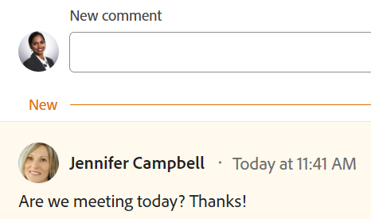

# Aggiorna lavoro

<!-- Audited: 1/2024 -->

<!--take "legacy" and "new commenting" references out when we remove the legacy - April 2024???-->

<!--
After the monthly releases to Production, the same features are also available in the Production environment for customers who enabled fast releases.   
For information about fast releases, see [Enable or disable fast releases for your organization](../../administration-and-setup/set-up-workfront/configure-system-defaults/enable-fast-release-process.md)  
-->

<!-- with October 26 release: add somewhere this, and decide where we need to keep information about the legacy commenting. Should we create an article about iterations comments like we have for goals and cards?!:

>[!NOTE]
>
>Iterations display the legacy commenting experience.-->

<!--old message, before Auhust 17: 

>[!NOTE]
>
>We are currently redesigning the commenting experience in Adobe Workfront.
>
>For more information about the new commenting experience, see [New commenting experience](../../product-announcements/betas/new-commenting-experience-beta/unified-commenting-experience.md). 
>
>You can access the new experience for the following objects:
> * Issues, projects, tasks, and documents.
>
>     This is available when you enable the commenting Beta experience.
>
>     This functionality is available only for the Updates section, and it is not available for the following areas:
>
>     * Home
>     * Summary panel in lists
>     * Summary panel in timesheets
>
> * Goals, cards in the Boards area
>
>   The new commenting experience is the only experience for goals and cards. You must have an additional license to access Workfront Goals. For more information, see [Requirements to use Workfront Goals](../../workfront-goals/goal-management/access-needed-for-wf-goals.md). 
>
>     You can add and view updates to cards in the Boards area when you enable the Comments and System Activity sections on a card. For more information, see [Add an ad hoc card to a board](../../agile/get-started-with-boards/add-card-to-board.md).
-->

Le informazioni evidenziate in questa pagina si riferiscono a funzionalità non ancora generalmente disponibili. È disponibile solo nell’ambiente di anteprima per tutti i clienti o in produzione per i clienti che hanno abilitato le versioni rapide. 

Per informazioni sulle versioni rapide, consulta [Abilitare o disabilitare le versioni rapide per la tua organizzazione](/help/quicksilver/administration-and-setup/set-up-workfront/configure-system-defaults/enable-fast-release-process.md).

Per informazioni sulla pianificazione della versione corrente, consulta [Panoramica sulla versione del secondo trimestre 2024](/help/quicksilver/product-announcements/product-releases/24-q2-release-activity/24-q2-release-overview.md).

<!--info for April 11: take out the "Important" box below (or hide it)-->

>[!IMPORTANT]
>
>Attualmente stiamo riprogettando l’esperienza di aggiunta di commenti in Adobe Workfront.
>
>A seconda degli oggetti per i quali accedi all’esperienza di commento, per la sezione Aggiornamenti potresti visualizzare le seguenti funzionalità:
>* La nuova esperienza
>* L’esperienza legacy
>* La nuova esperienza e quella legacy
>
>Per ulteriori informazioni sulla nuova esperienza di commento e sulla sua disponibilità, consulta [Nuova esperienza di commento](../../product-announcements/betas/new-commenting-experience-beta/unified-commenting-experience.md).
>
> L’esperienza di aggiunta di commenti legacy è stata rimossa da progetti, attività, problemi e documenti nell’ambiente di anteprima. 
>
>La nuova esperienza di aggiunta di commenti è disponibile solo per la sezione Aggiornamenti degli oggetti di Workfront e non è disponibile quando si accede agli aggiornamenti dalle seguenti aree:
>
> * Home
> * Pannello Riepilogo negli elenchi
> * Pannello Riepilogo nelle schede orario
> * Pannello Summary (Riepilogo) nel Bilanciatore dei carichi di lavoro
>
>La nuova esperienza di aggiunta di commenti è disponibile nel pannello Riepilogo in elenchi, schede orario e nel Bilanciatore dei carichi di lavoro nell’ambiente di anteprima e nell’ambiente di produzione per i clienti che hanno scelto il processo di rilascio rapido. 

## Considerazioni sull’aggiornamento del lavoro

* Puoi aggiungere commenti alla maggior parte degli oggetti in Adobe Workfront nella sezione Aggiornamenti. Per ulteriori informazioni sugli oggetti che visualizzano la sezione Aggiornamenti, vedere [Panoramica della sezione Aggiornamenti](../updating-work-items-and-viewing-updates/updates-tab-overview.md).

* Puoi aggiungere commenti agli oggetti Workfront da altre applicazioni integrate con Workfront o dall’app mobile Workfront.

  Non tutte le applicazioni integrate con Workfront possono aggiungere commenti agli oggetti Workfront.

  Non tutte le funzionalità disponibili nella sezione Aggiornamenti di un oggetto in Workfront sono disponibili in altre applicazioni quando si accede a oggetti Workfront dall&#39;applicazione. Ad esempio, le funzionalità Rich Text o l’impostazione di un commento come privato per l’azienda di un utente potrebbero non essere disponibili quando si aggiungono commenti a un oggetto Workfront da un’applicazione di terze parti.

* È possibile comunicare informazioni sull&#39;avanzamento di un oggetto di Workfront (progetto, attività o problema) quando si commenta l&#39;oggetto. Gli utenti che sono assegnati o abbonati all’oggetto possono ricevere una notifica sull’aggiornamento. Chiunque abbia accesso in visualizzazione all’oggetto può visualizzare l’aggiornamento.

* Puoi assegnare tag agli utenti per attirare la loro attenzione sull’aggiornamento. Gli utenti taggati ricevono una notifica in-app e un’e-mail relativa all’aggiornamento.

  >[!TIP]
  >
  >   Nella nuova esperienza di commento, i proprietari dei commenti vengono automaticamente taggati. Per ulteriori informazioni, consulta [Assegna tag ad altri utenti in caso di aggiornamenti](../../workfront-basics/updating-work-items-and-viewing-updates/tag-others-on-updates.md).
  <!--take the "in the new commenting experience" out when this is the only experience-->

* È possibile aggiungere un commento a un oggetto che è possibile visualizzare oppure accedere come amministratore di Workfront o di gruppo e aggiungere un commento per conto di un altro utente. Per ulteriori informazioni, consulta [Accedi come altro utente](../../administration-and-setup/add-users/create-and-manage-users/log-in-as-another-user.md).

* Puoi aggiungere un aggiornamento a progetti, attività e problemi dalle seguenti aree di Workfront:

   * Da un oggetto Workfront, nella sezione Aggiornamenti
   * Dall’area Home (per attività e problemi)
   * Dal pannello Riepilogo in un elenco di oggetti, una scheda orario o dal Bilanciatore dei carichi di lavoro (per attività e problemi)

Le informazioni contenute in questa pagina descrivono come aggiungere commenti agli oggetti di Workfront e come aggiornare progetti, attività e problemi durante l&#39;aggiunta di commenti.

<!--take this out (below) when we remove legacy out of the application-->

Per informazioni sul commento degli obiettivi, consulta [Gestire i commenti sugli obiettivi in Obiettivi di Adobe Workfront](../../workfront-goals/goal-management/manage-goal-comments.md). È necessaria un&#39;ulteriore licenza per accedere a Workfront Goals.

Per informazioni sull&#39;inserimento di commenti sulle schede nell&#39;area Bacheche, vedere [Aggiungere una scheda ad hoc a una bacheca](../../agile/get-started-with-boards/add-card-to-board.md).

Per informazioni sul commento delle iterazioni, consultate [Gestisci commenti iterazione](/help/quicksilver/agile/use-scrum-in-an-agile-team/iterations/manage-iteration-updates.md).

## Requisiti di accesso

Per eseguire i passaggi descritti in questo articolo, è necessario disporre dei seguenti diritti di accesso:

<table style="table-layout:auto"> 
 <col> 
 </col> 
 <col> 
 </col> 
 <tbody> 
  <tr> 
   <td role="rowheader"><strong>piano Adobe Workfront</strong></td> 
   <td> 
Qualsiasi
 </td> 
  </tr> 
  <tr> 
   <td role="rowheader"><strong>Licenza Adobe Workfront</strong></td> 
   <td> 
   
Corrente: richiesta o successiva per problemi e documenti; revisione o successiva per tutti gli altri oggetti

   
Nuovo: Collaboratore o versione successiva per problemi e documenti: chiaro o versione successiva per tutti gli altri oggetti
 
   </td> 
  </tr> 
  <tr> 
   <td role="rowheader"><strong>Configurazioni del livello di accesso</strong></td> 
   <td> 
Accesso di visualizzazione o modifica per l'oggetto su cui si trova l'aggiornamento
</td> 
  </tr> 
  <tr> 
   <td role="rowheader"><strong>Autorizzazioni oggetto</strong></td> 
   <td> 
Accesso di visualizzazione all'oggetto
</td> 
  </tr> 
 </tbody> 
</table>

Per ulteriori dettagli sulle informazioni contenute in questa tabella, vedere [Requisiti di accesso nella documentazione di Workfront](/help/quicksilver/administration-and-setup/add-users/access-levels-and-object-permissions/access-level-requirements-in-documentation.md).

## Aggiungere un aggiornamento a un elemento di lavoro

L’aggiunta di un aggiornamento a un elemento di lavoro varia a seconda della versione della sezione Aggiornamenti utilizzata.

È possibile aggiungere aggiornamenti ai seguenti oggetti:

* Progetti
* Attività
* Problemi
* Programmi
* Portfolio
* Modelli
* Attività modello
* Utenti
* Schede orario
* Team
* Obiettivi
* Schede nell’area Schede
* Iterazioni

<!--info for April 11: hide the section below completely:-->

### Aggiungere un aggiornamento a un elemento di lavoro nella sezione Aggiornamenti legacy

>[!IMPORTANT]
>
>Le informazioni contenute in questa pagina descrivono come aggiornare progetti, attività e problemi.

1. Passare all&#39;elemento di lavoro per il quale si desidera fornire un aggiornamento, ad esempio un progetto, un&#39;attività o un problema.
1. Fai clic su **Aggiornamenti** sezione.
1. (Condizionale) Se è abilitato, fai clic sul pulsante **Nuovo commento** nell’angolo in alto a destra della sezione Aggiornamenti per disabilitarla e abilitare l’esperienza di commento legacy.
1. Clic **Avvia un nuovo aggiornamento,** quindi digita l’aggiornamento.
1. (Facoltativo) Utilizza le opzioni nella barra degli strumenti Testo formattato per formattare il testo, aggiungere emoticon, collegamenti o immagini all’aggiornamento, per migliorare i contenuti. Per ulteriori informazioni, vedere [Utilizzare la funzione Rich Text in un aggiornamento di Workfront](#use-rich-text-in-a-workfront-update) in questo articolo.
1. (Facoltativo) Aggiornare una delle seguenti informazioni sull&#39;elemento di lavoro:

   <table style="table-layout:auto"> 
    <col> 
    <col> 
    <tbody> 
     <tr> 
      <td role="rowheader"><strong>Notifica</strong></td> 
      <td>Identifica gli utenti a cui deve essere notificato l’aggiornamento. Gli utenti assegnati o sottoscritti all'oggetto ricevono automaticamente una notifica quando viene effettuato un aggiornamento. 
Per informazioni su come includere altri utenti in un aggiornamento, consulta <a href="../../workfront-basics/updating-work-items-and-viewing-updates/tag-others-on-updates.md" class="MCXref xref">Assegna tag ad altri utenti in caso di aggiornamenti</a>.
</td> 
     </tr> 
     <tr> 
      <td role="rowheader"><strong>Conferma data</strong></td> 
      <td>Nel selettore data, selezionare la data in cui si conferma il completamento dell'elemento di lavoro. Per informazioni sulla data di conferma, vedere <a href="../../manage-work/projects/updating-work-in-a-project/overview-of-commit-dates.md" class="MCXref xref">Panoramica sulla data di conferma</a>.</td> 
     </tr> 
     <tr> 
      <td role="rowheader"><strong>Condizione</strong></td> 
      <td>Seleziona una nuova condizione per l’attività o il problema. Per informazioni sulla selezione di una condizione, consulta <a href="../../manage-work/projects/updating-work-in-a-project/update-condition-for-tasks-and-issues.md" class="MCXref xref">Aggiorna condizione per attività e problemi</a>.</td> 
     </tr> 
     <tr> 
      <td role="rowheader"><strong>Stato</strong></td> 
      <td>Fai clic sulla freccia accanto allo stato corrente, quindi seleziona lo stato desiderato dal menu a discesa. Per informazioni sull'impostazione di uno stato, vedere <a href="../../manage-work/projects/updating-work-in-a-project/update-task-status.md" class="MCXref xref">Aggiorna stato attività</a>.
L'aggiornamento dello stato di un elemento di lavoro non modifica automaticamente lo stato di un progetto. A seconda di come è configurato il progetto, puoi apportare separatamente gli aggiornamenti allo stato del progetto. Per ulteriori informazioni sui vari tipi di aggiornamento del progetto, consulta <a href="../../manage-work/projects/manage-projects/select-project-update-type.md" class="MCXref xref">Seleziona il tipo di aggiornamento del progetto </a>.

<b>NOTA</b>

   Non è possibile modificare lo stato di un elemento di lavoro che si trova nello stato In attesa di approvazione.
</td>
   </tr> 
     <tr> 
      <td role="rowheader"><strong>Barra di completamento</strong></td> 
      <td>(Disponibile solo per le attività) Indicare la percentuale di lavoro completata facendo scorrere la barra di avanzamento fino alla percentuale desiderata. È inoltre possibile fare doppio clic sulla barra di completamento e immettere la percentuale di completamento.</td> 
     </tr> 
     <tr> 
      <td role="rowheader"><strong>Privato per la mia azienda</strong></td> 
      <td> 
Disattiva questa opzione per impedire agli utenti esterni alla società di avere accesso alla visualizzazione di questo aggiornamento.
 
      
<b>NOTA</b>

      
Questa opzione viene visualizzata solo quando l’utente è associato a una società.

      
Questa opzione non è disponibile in tutte le aree da cui è possibile aggiungere aggiornamenti. Ad esempio, non è disponibile nelle applicazioni di terze parti da cui puoi aggiungere aggiornamenti. 

      </td> 
     </tr> 
    </tbody> 
   </table>

1. Clic **Aggiorna** per aggiungere l&#39;aggiornamento all&#39;oggetto Workfront.

   >[!NOTE]
   >
   >Una piccola finestra pop-up apparirà per sette secondi dopo aver fatto clic su **Aggiorna**, che consente di annullare l&#39;aggiornamento e tornare al riquadro di modifica prima della pubblicazione dell&#39;aggiornamento. L’aggiornamento viene pubblicato se salti il pop-up di annullamento, attendi che scompaia o esci dalla pagina.
   >
   >Se l&#39;amministratore di Workfront seleziona l&#39;impostazione &quot;Non consentire agli utenti di eliminare commenti&quot; nel proprio livello di accesso, non è possibile annullare un commento. Per ulteriori informazioni, consulta [Creare e modificare livelli di accesso personalizzati](../../administration-and-setup/add-users/configure-and-grant-access/create-modify-access-levels.md).

1. Per rispondere a un aggiornamento, vedi [Rispondi agli aggiornamenti](../../workfront-basics/updating-work-items-and-viewing-updates/reply-to-updates.md).

<!--info for April 11: reword the title of this section to: Add an update to a work item-->

### Aggiungere un aggiornamento a un elemento di lavoro utilizzando la nuova esperienza di commento

1. Individua l’oggetto da aggiornare (progetto, attività o problema), quindi fai clic sul nome per aprire la pagina dell’oggetto.
1. Clic  **Aggiornamenti** nel pannello a sinistra.
1. (Condizionale) Se **Nuovo commento** è disabilitata, fai clic su per abilitarla.

   In questo modo viene abilitata la nuova esperienza di commento. Il **Commenti** è selezionata per impostazione predefinita.

1. Inizia a immettere un commento in **Nuovo commento** casella.

   

   

   

   >[!TIP]
   >
   >Se si esce dalla sezione Aggiornamenti prima di completare la digitazione e l&#39;invio di un commento, il commento nella pagina rimane in modalità bozza anche dopo la disconnessione e la riconnessione. Nella bozza vengono salvate anche tutte le immagini aggiunte al commento. Le bozze vengono salvate per 7 giorni dopo i quali vengono eliminate e non possono essere recuperate. I commenti bozza sono visibili solo all&#39;utente che li inserisce.

1. (Facoltativo) Per annullare o ripristinare una modifica, utilizzare i seguenti tasti di scelta rapida:
   * CTRL + Z (⌘+z per Mac) per annullare una modifica
   * CTRL+Y (⌘+y per Mac) per ripetere una modifica
1. (Facoltativo) In **Assegna tag a persone o team** , inizia a digitare il nome o l’e-mail di un utente o di un team che desideri includere in questo commento, quindi selezionalo quando viene visualizzato nell’elenco.
1. (Facoltativo) Utilizza le opzioni nella barra degli strumenti Testo formattato per formattare il testo, aggiungere emoticon, collegamenti o immagini all’aggiornamento, per migliorare i contenuti. Per ulteriori informazioni, vedere [Utilizzare la funzione Rich Text in un aggiornamento di Workfront](#use-rich-text-in-a-workfront-update) in questo articolo.

   >[!TIP]
   >
   >Se un altro utente invia un commento allo stesso elemento che si sta aggiornando, viene visualizzata una linea rossa con un indicatore &quot;Nuovo&quot; per informare l&#39;utente dei commenti più recenti.
   >
   >L’indicatore viene visualizzato solo dopo che il commento è stato inviato sull’elemento e non quando il commento è ancora composto.
   >
   >L’indicatore &quot;Nuovo&quot; viene visualizzato solo quando sia l’utente che ha inserito un nuovo aggiornamento che l’utente che lo sta inserendo utilizzano la nuova esperienza di commento.
   >

1. Clic **Invia** per aggiungere l&#39;aggiornamento all&#39;oggetto Workfront.
1. (Facoltativo) Per modificare un commento, fai clic su **Altro** menu  nell’angolo superiore destro del commento, quindi fai clic su **Modifica**.

   >[!IMPORTANT]
   >
   >È possibile modificare il commento solo entro 15 minuti dall&#39;invio.

1. Modifica le informazioni nel commento, aggiungi o rimuovi immagini o rimuovi gli utenti taggati. A sinistra dell&#39;indicatore della data viene aggiunto l&#39;indicatore &quot;Modificato&quot; che viene visualizzato quando è stato inserito il commento.

   >[!TIP]
   >
   >Nei commenti relativi all&#39;anno corrente non viene visualizzato l&#39;anno nel timbro data. Passando il puntatore del mouse su una marca temporale viene visualizzata la data completa, incluso l’anno.

   

   >[!TIP]
   >
   >* Viene generata un’e-mail per avvisare gli utenti dell’aggiornamento solo quando invii l’aggiornamento originale. Dopo aver modificato l’aggiornamento, non viene generata alcuna e-mail.
   >* La data accanto al commento è la data del commento originale e non quella dell&#39;ultima modifica.
   >* Quando si aggiunge un commento per conto di un altro utente (quando si esegue l&#39;accesso come altro utente come amministratore di Workfront o di gruppo), non è possibile modificarlo se si è connessi come altro utente. Puoi modificare il commento solo dopo aver effettuato la disconnessione come utente e aver effettuato di nuovo l’accesso come utente.

1. (Facoltativo) Fai clic su **Rispondi** o inizia a digitare un commento nel **Aggiungi risposta...** per rispondere a un commento esistente, quindi seguire i passaggi 4-8 sopra. <!--(**************insure this stays accurate***********)--> Per informazioni sulla risposta a un aggiornamento, consulta [Rispondi agli aggiornamenti](../../workfront-basics/updating-work-items-and-viewing-updates/reply-to-updates.md).

1. (Condizionale e facoltativo) Se altri utenti hanno aggiunto commenti visualizzati al di fuori dell’area visibile nella sezione Aggiornamenti durante l’aggiunta dei commenti, fai clic su **Visualizza** all&#39;interno del blu **banner nuovi commenti** nella parte inferiore dello schermo per visualizzare questi commenti.

   

   Ulteriori commenti vengono visualizzati nella parte inferiore dello schermo.

   >[!NOTE]
   >
   >   L’indicatore &quot;nuovi commenti&quot; e il pulsante &quot;Visualizza&quot; vengono visualizzati solo quando sia gli utenti che hanno inserito i nuovi aggiornamenti che quelli che stanno visualizzando la sezione Aggiornamenti utilizzano la nuova esperienza di commento.

1. (Facoltativo) Fai clic su **Mi piace** icona. L’icona si aggiorna con il numero di Mi piace.
1. (Condizionale e facoltativo) Se nel commento sono state incluse altre persone, fare clic sul numero di membri inclusi nell&#39;aggiornamento per visualizzare un elenco di entità con cui è condiviso il commento immesso.

   

   >[!TIP]
   >
   >I nomi delle prime due entità con tag vengono visualizzati accanto ai relativi avatar. Se più di due entità vengono contrassegnate, vengono visualizzati solo il nome della prima e il numero di entità aggiuntive.

1.  (Facoltativo) Fare clic sul nome di un commentatore per visualizzarne il nome, la mansione e l&#39;indirizzo di posta elettronica in una casella delle informazioni. Fare di nuovo clic sul nome del commentatore nella casella delle informazioni per aprire il profilo utente.
1. (Facoltativo) Fai clic su **Attività di sistema** per visualizzare gli aggiornamenti registrati dal sistema Quando l&#39;oggetto o uno dei relativi figli viene aggiornato, Workfront genera una nota su tale aggiornamento e lo visualizza nella scheda Attività di sistema.

   Per ulteriori informazioni, consulta [Panoramica della sezione Aggiornamenti](../updating-work-items-and-viewing-updates/updates-tab-overview.md).

   >[!TIP]
   >
   >Non è possibile aggiungere un commento a un aggiornamento del sistema. Tuttavia, tutte le risposte ai record di attività del sistema nell’esperienza di commento legacy vengono popolate nella scheda Attività del sistema come di sola lettura.

1. (Facoltativo) Fai clic su **Tutti** per visualizzare sia i commenti degli utenti che i commenti delle attività di sistema in un&#39;unica posizione. Questa è una scheda di sola visualizzazione.

   >[!TIP]
   >
   >Non è possibile rispondere a commenti o assegnare tag ad altri utenti nei commenti esistenti nella scheda Tutti. Per rispondere a un commento nella scheda Tutto, fare clic su **Rispondi nei commenti** per aprire il commento nella scheda Commenti.

## Utilizzare la funzione Rich Text in un aggiornamento di Workfront{#use-rich-text-in-a-workfront-update}

<!--October 2023: remove this top note when we get to parity with the current version, OR change the note to mention that some options are ONLY available in the Beta version and not the current one.-->

>[!NOTE]
>
>Le informazioni seguenti descrivono l’utilizzo di Rich Text nella nuova esperienza di commento, se non diversamente specificato.

Puoi migliorare gli aggiornamenti utilizzando Rich Text o aggiungendo vari elementi, come emoticon, collegamenti o immagini.

1. Vai a **Aggiornamenti** di un oggetto Workfront e iniziare a digitare un commento.
1. (Facoltativo) Per aggiungere la formattazione Rich Text all’aggiornamento, utilizza gli attributi nella **Rich Text** durante la digitazione.

   

   <!--October 2023: the individual icons in the toolbar will need replacing-->

   | **Attributo** | **Pulsante Barra degli strumenti** | **Tasti di scelta rapida di Mac** | **Tasti di scelta rapida di Windows** |
   |---|---|---|---|
   | Bold |  | ⌘+b | Ctrl+B |
   | Corsivo |  | ⌘+i | CTRL+I |
   | Sottolinea |  | ⌘+u | Ctrl+U |
   | Collegamento ipertestuale |  |  Per aprire la casella Aggiungi collegamenti: ⌘+K   Per incollare un collegamento sul testo selezionato: ⌘+V  |  Per aprire la casella Aggiungi collegamenti: Ctrl+K   Per incollare un collegamento sul testo selezionato: Ctrl+V  |
   | Elenco puntato |  | ⌘+Maiusc+8 | Ctrl+Maiusc+8 |
   | Elenco numerato |  | ⌘+Maiusc+7 | Ctrl+Maiusc+7 |
   | Citazione |  | ⌘+Maiusc+9 |  Ctrl+Maiusc+9   Questo non è disponibile nella nuova esperienza di commento.   |

   <!--remove the last row when we remove legacy from the system-->

   Per interrompere la formattazione del testo, deselezionare l&#39;attributo nella **Rich Text** barra degli strumenti.

   <!-- in the table above: take "Create Links" verbiage from the hyperlink when the old commenting is removed and the commenting beta is the only way to comment - with October 2023-->

   >[!NOTE]
   >
   >* La formattazione viene visualizzata anche in tutte le notifiche e-mail ricevute dagli utenti contenenti l’aggiornamento.
   >* La formattazione Rich Text applicata a un aggiornamento in un messaggio e-mail non viene visualizzata nell’aggiornamento quando viene visualizzata nella scheda Aggiornamenti.
   >* Se l’organizzazione utilizza Workfront con Internet Explorer, il testo formattato incollato in un aggiornamento perde la formattazione Rich Text e viene visualizzato come testo normale. È possibile riformattare il testo utilizzando gli attributi della barra degli strumenti Testo formattato.
   >* La formattazione Rich Text non è disponibile per gli aggiornamenti apportati nell’area Schede orario o per gli oggetti Note e Last Condition visualizzati in un report.

1. (Facoltativo e condizionale) Se si desidera includere testo da aggiornamenti precedenti o da altre origini e distinguerlo dal proprio aggiornamento, è possibile contrassegnarlo come Preventivo di blocco. Fai clic su **Citazione** icona  e digitare il testo che si desidera citare. Il testo tra virgolette è contrassegnato da una linea grigia verticale. Fai clic su **Citazione** per tornare alla formattazione normale. Questo non è disponibile nella nuova esperienza di commento.

   <!--remove this picture below and the bullet above when we remove legacy-->

   

1. (Facoltativo) Fai clic su **emoji** icona  per aggiungere emoji all’aggiornamento.

   >[!NOTE]
   >
   >* Workfront non sostituisce gli emoticon di punteggiatura come :) con le emoticon.
   >* Le emoticon non sono disponibili per gli oggetti Note e Last Condition visualizzati in un report.
   >* La funzione emoji di Workfront utilizza caratteri Unicode e, come tali, viene visualizzata solo sui browser e sui sistemi operativi che supportano i punti di codice Unicode. Gli utenti di una piattaforma, di un browser o di una versione del sistema operativo diversa dalla tua potrebbero non avere accesso alle stesse emoji.
   >* Un emoji non supportato è rappresentato da una casella bianca o nera.
   >* Windows 7 supporta solo emoji in bianco e nero.
   >* Le emoticon applicate a un aggiornamento effettuato tramite e-mail non vengono visualizzate nell’aggiornamento quando lo si visualizza nell’area Aggiornamenti.

1. (Facoltativo) Per aggiungere un collegamento URL a origini di informazioni aggiuntive:

   1. Fai clic nell’aggiornamento nel punto in cui desideri inserire un collegamento.
   1. Il giorno **Rich Text** , fare clic sul pulsante **Collegamento ipertestuale** icona .

   1. In **Crea collegamento** casella visualizzata, sotto **URL**, digita o incolla l’URL dell’origine a cui desideri collegare il file.

   1. Sotto **Testo da visualizzare**, digita o incolla il testo del collegamento.
   1. Fai clic su **Salva**.

1. (Facoltativo) Per allegare un&#39;immagine all&#39;aggiornamento, effettuare una delle seguenti operazioni:

   * Salva l’immagine sul computer, quindi trascinala e rilasciala nell’area Nuovo commento.
   * Copia uno screenshot dal computer, quindi incollalo nel commento. Questa funzione non è disponibile nell’esperienza di commento legacy.
   * Fai clic su **Aggiungi immagine** icona  e passare all&#39;immagine nel computer.

   >[!NOTE]
   >
   >* Per poter visualizzare le icone Immagine o Aggiungi allegato, l&#39;amministratore di Workfront deve abilitare l&#39;aggiunta di immagini nella sezione Preferenze feed di aggiornamento dell&#39;area Interfaccia Workfront. Per informazioni, consulta [Configurare le preferenze per gli aggiornamenti utente](../../administration-and-setup/set-up-workfront/system-tracked-update-feeds/configure-preferences-user-updates.md).
   >* La dimensione massima del file di immagine è 7 MB. I tipi di file immagine supportati sono .jpg, .gif e .png.
   >* Le immagini sono accessibili dalla sezione Aggiornamenti di un oggetto e sono disponibili anche nell&#39;area Documenti del menu principale.
   >* È possibile incollare l&#39;immagine facendo clic con il pulsante destro del mouse nel nuovo commento oppure premendo CTRL + V per Windows (o ⌘ + V per Mac) sulla tastiera.
   >* È possibile inviare un aggiornamento con un’immagine e senza testo.
   >* Quando elimini un commento che contiene un’immagine, esistono gli scenari seguenti a seconda dell’esperienza scelta:
   >
   >     * Nell’esperienza di aggiunta di commenti legacy, l’immagine rimane nell’area Documenti ma non è più visibile nella sezione Aggiornamenti.
   >     * Nella nuova esperienza di aggiunta di commenti, l’immagine viene rimossa dalla sezione Aggiornamenti e dall’area Documenti. L&#39;immagine viene eliminata anche dall&#39;area Documenti quando modificate un commento ed eliminate l&#39;immagine.
   >* Quando qualcuno elimina un’immagine allegata a un commento dall’area Documenti, questa viene rimossa anche dal commento.

   <!--remove the statement above about legacy, when we remove the legacy environment.-->

1. (Facoltativo) Per visualizzare un&#39;immagine nell&#39;aggiornamento esistente, effettuate una delle seguenti operazioni:

   * Fai clic su **Anteprima** icona  sulla miniatura dell’immagine per aprire l’immagine a dimensione intera in una nuova scheda del browser.
   * Fai clic su **Scarica** icona  sulla miniatura dell&#39;immagine per scaricare l&#39;immagine.

1. Clic **Invia** per aggiungere il commento.

## Cerca un aggiornamento

>[!NOTE]
>
>Questa funzionalità è disponibile solo per la scheda Commenti nella nuova esperienza di commento. Questa opzione non è disponibile per la scheda Attività di sistema della sezione Aggiornamenti.

È possibile cercare un commento o una risposta nella sezione Aggiornamenti di un oggetto.

1. Vai a **Aggiornamenti** sezione di un oggetto.
1. Inizia a digitare una parola chiave <!--or a user's name --> nel **Ricerca** nell&#39;angolo superiore destro del **Commenti** scheda.

   <!--Add this tip or note instead of the note below - when it'll be possible: You can search for users who have been tagged or for comment owners.-->

   >[!NOTE]
   >
   >È possibile cercare solo le parole che appartengono al testo di un commento o di una risposta. Non è possibile cercare nomi di utenti o team con tag in un aggiornamento.

   

   

   

   Parola chiave <!--or user--> La ricerca è evidenziata e i commenti che la contengono vengono visualizzati nella parte superiore della sezione Aggiornamenti.

   Workfront esegue la ricerca nell&#39;intero flusso di aggiornamento dell&#39;oggetto, all&#39;esterno dei commenti visibili sullo schermo.

1. Fai clic su **x** per cancellare i risultati della ricerca e tornare a tutti i commenti.

<!-- when we release search to production, check above and make sure you don't have to add that the users tagged/ owners are also searchable-->

## Copia informazioni di aggiornamento

È possibile copiare un aggiornamento in diversi modi. Dopo aver copiato un collegamento, puoi condividerlo con altri utenti per indirizzarli all’aggiornamento.

La copia di un aggiornamento varia a seconda dell’esperienza di commento utilizzata.

<!--info for April 11: take the sentence above out and reword the section title below to: Copy an update-->

### Copiare un aggiornamento nella nuova esperienza di commento

Per informazioni sulle funzioni disponibili per la nuova esperienza di commento e per gli oggetti, consulta [Nuova esperienza di commento](../../product-announcements/betas/new-commenting-experience-beta/unified-commenting-experience.md).

<!--when we remove and deprecate the legacy stream, add screen shots in the sections below- October 2023-->

È possibile copiare informazioni da un commento esistente effettuando una delle seguenti operazioni:

* [Copia link](#copy-link)
* [Copia corpo del testo](#copy-body-text)
* [Risposta preventivo](#quote-reply-1)

#### Copia link

L’opzione Copia collegamento copia il commento o il collegamento agli Appunti, in modo da poterlo condividere con altri utenti.

1. Vai all’aggiornamento di cui desideri copiare il collegamento.

1. Fai clic su **Altro** , quindi fai clic su **Copia collegamento**.

1. Incolla il collegamento copiato nel passaggio precedente in un’e-mail o in un’altra applicazione per condividerlo con altri utenti. Il collegamento condiviso apre il commento da cui hai condiviso il collegamento.

   >[!TIP]
   >
   >Quando si condivide il collegamento di una conversazione su un oggetto figlio da un oggetto di livello superiore, il collegamento apre il thread nell&#39;area Aggiornamenti dell&#39;oggetto di livello superiore.
   >
   >Ad esempio, se copi il collegamento di un commento attività dall’area Aggiornamenti del progetto, il commento apre la pagina del progetto.

#### Copia corpo del testo

L’opzione Copia corpo del testo copia il testo da un aggiornamento specifico negli Appunti.

1. Vai all’aggiornamento o alla risposta che desideri copiare.
1. Fai clic su **Altro** , quindi fai clic su **Copia corpo del testo**.

#### Risposta preventivo

L&#39;opzione Risposta preventivo copia il commento originale in una nuova risposta sotto forma di un&#39;offerta di blocco.

1. Vai all’aggiornamento o alla risposta che desideri copiare.
1. Fai clic su **Altro** , quindi fai clic su **Risposta preventivo**.

   Viene visualizzata una nuova casella di commento e la risposta tra virgolette viene inclusa nel nuovo commento e contrassegnata come virgolette.

   

   <!--ensure the screen shot above is correct - missing he block quote icon in rich text -->

1. Continua ad aggiungere il tuo aggiornamento e fai clic su **Invia** per aggiungere il commento.

<!--info for April 11: hide the entire section below - notice that there are several sub-sub sections below this main section-->

### Copiare un aggiornamento nell’esperienza di commento legacy

* [Copia l’aggiornamento](#copy-the-update)
* [Copiare il collegamento del thread](#copy-the-thread-link)
* [Copia il collegamento di aggiornamento](#copy-the-update-link)
* [Risposta preventivo](#quote-reply)

  >[!TIP]
  >
  >Quando si copia e si condivide il collegamento di una conversazione su un oggetto figlio da un oggetto di livello superiore, il collegamento apre il thread nell&#39;area Aggiornamenti dell&#39;oggetto figlio.
  >
  >Se ad esempio si copia il collegamento di un commento attività dall&#39;area Aggiornamenti del progetto, il commento apre la pagina attività.

#### Copia l’aggiornamento {#copy-the-update}

Questa opzione consente di copiare il testo da un aggiornamento specifico negli Appunti.

1. Vai all’aggiornamento o alla risposta che desideri copiare.
1. Fai clic su **Altro** , quindi fai clic su **Copia corpo del testo**.

   

#### Copiare il collegamento del thread {#copy-the-thread-link}

Questa opzione consente di copiare il collegamento thread completo negli Appunti, in modo da poter condividere il thread con altri utenti.

1. Passare al thread di aggiornamento da copiare.

1. Fai clic su **Altro** , quindi fai clic su **Copia collegamento thread**.

   

1. Incolla il collegamento copiato nel passaggio precedente in un’e-mail o in un’altra applicazione per condividerlo con altri utenti. Il collegamento condiviso apre il commento da cui hai condiviso il collegamento.

#### Copia il collegamento di aggiornamento {#copy-the-update-link}

Questa opzione consente di copiare negli Appunti un collegamento di aggiornamento specifico. Quando condividi il collegamento di aggiornamento, l’utente che lo segue visualizza un bordo intorno all’aggiornamento.

1. Vai all’aggiornamento o alla risposta che desideri copiare.
1. Fai clic su **Altro** accanto al singolo aggiornamento, quindi fai clic su **Copia collegamento di aggiornamento**.

   

1. Incolla il collegamento copiato nel passaggio precedente in un’e-mail o in un’altra applicazione per condividerlo con altri utenti. Il collegamento condiviso apre il commento da cui hai condiviso il collegamento.

#### Risposta preventivo

L&#39;opzione Risposta preventivo copia il commento originale in una nuova risposta sotto forma di un&#39;offerta di blocco.

1. Vai all’aggiornamento o alla risposta che desideri copiare.
1. Fai clic su **Altro** , quindi fai clic su **Risposta preventivo**.

   Viene visualizzata una nuova casella di commento e la risposta tra virgolette viene inclusa nel nuovo commento e contrassegnata come virgolette.

1. Continua ad aggiungere il tuo aggiornamento e fai clic su **Rispondi** per aggiungere il commento.

## Eliminare un aggiornamento o una risposta

A seconda dell&#39;accesso fornito dall&#39;amministratore di Workfront, è possibile eliminare gli aggiornamenti aggiunti nella scheda Aggiornamenti di un oggetto. Per ulteriori informazioni, consulta [Creare o modificare livelli di accesso personalizzati](../../administration-and-setup/add-users/configure-and-grant-access/create-modify-access-levels.md#creating-a-new-access-from-scratch) nell’articolo [Creare o modificare livelli di accesso personalizzati](../../administration-and-setup/add-users/configure-and-grant-access/create-modify-access-levels.md).

Nessun utente di Workfront (incluso l’amministratore di Workfront) può eliminare gli aggiornamenti effettuati da un altro utente. Tuttavia, se il livello di accesso di un utente consente di eliminare i propri aggiornamenti, l’amministratore di Workfront può accedere come tale utente ed eliminare gli aggiornamenti che ha apportato. Per ulteriori informazioni, consulta [Creare o modificare livelli di accesso personalizzati](../../administration-and-setup/add-users/configure-and-grant-access/create-modify-access-levels.md#creating-a-new-access-from-scratch) e [Accedi come altro utente](../../administration-and-setup/add-users/create-and-manage-users/log-in-as-another-user.md).

1. Vai all’aggiornamento o alla risposta che desideri eliminare.
1. Fai clic su **Altro** accanto all’aggiornamento o alla risposta che desideri eliminare, quindi fai clic su **Elimina**. <!--October 2023 - replace screen shot here-->

   

1. Nel messaggio visualizzato, fai clic su **Elimina**.

   >[!NOTE]
   >
   >Se si elimina un aggiornamento con un’immagine allegata, vengono eliminati sia il commento che l’immagine. Per ulteriori informazioni, vedere [Utilizzare la funzione Rich Text in un aggiornamento di Workfront](#use-rich-text-in-a-workfront-update) in questo articolo.

   Quando al commento eliminato sono associate delle risposte, viene indicato che il commento è stato rimosso con il nome dell&#39;utente che lo ha rimosso.

   

   I commenti eliminati vengono rimossi immediatamente da Workfront. Un utente che utilizza la sezione Aggiornamenti vede un commento eliminato da un altro utente in tempo reale.

   <!--when we remove the beta, take out the first part of the sentence above about only when commenting in beta experience. Leave the rest though-->

<!--this is no longer needed - adding timesheet comments is just like adding comments to any other object now

## Add an update on a Timesheet

1. Go to a Timesheet on which you want to make an update.
1. Click the Timesheet to open it.
1. At the bottom of the Timesheet, click **Include a comment**.
1. In the box that displays at the bottom of the Timesheet, type an update.

   

1. (Conditional) To save your update without submitting the Timesheet for approval, click **Save for Later**.

   Or

   To save your update and submit the Timesheet for approval, click **Submit for Approval**.

   Or

   If your Timesheet is not set up with an approver, click **Save and Close Timesheet** to save your update.

-->

## Rivedi aggiornamenti di sistema

Nella sezione Aggiornamenti di un oggetto Workfront vengono visualizzati due tipi di informazioni:

* **Aggiornamenti utente:** Gli aggiornamenti utente sono commenti immessi dall&#39;utente e da altri utenti del sistema. Gli aggiornamenti utente vengono visualizzati nelle schede Commenti e Tutti della sezione Aggiornamenti.

  

* **Aggiornamenti di sistema:** Gli aggiornamenti di sistema registrano la rimozione di attività o problemi, l&#39;aggiunta o l&#39;eliminazione di versioni di documenti, l&#39;aggiunta o la rimozione di una richiesta di approvazione e di eventuali modifiche apportate all&#39;oggetto. Gli aggiornamenti di sistema vengono visualizzati nelle schede Attività di sistema e Tutti nella sezione Aggiornamenti.

  

  Gli amministratori di Workfront possono determinare cosa viene tracciato negli aggiornamenti di sistema, come spiegato in [Aggiornamenti monitorati dal sistema](../../administration-and-setup/set-up-workfront/system-tracked-update-feeds/system-tracked-update-feeds.md). Puoi anche filtrare gli aggiornamenti di sistema o le attività in modo da visualizzare solo gli aggiornamenti utente per tutti gli oggetti.

  I seguenti oggetti non dispongono di aggiornamenti generati dal sistema:

   * Team
   * Modello
   * Attività modello

Per ulteriori informazioni sugli aggiornamenti di sistema nella sezione Aggiornamenti, vedere [Panoramica della sezione Aggiornamenti](../updating-work-items-and-viewing-updates/updates-tab-overview.md).

