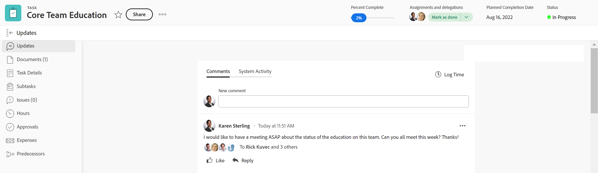

# Panoramica della sezione Aggiornamenti

<!--take "Beta" references out when we remove the beta-->

Le informazioni evidenziate in questa pagina si riferiscono a funzionalità non ancora generalmente disponibili. È disponibile solo nell’ambiente di anteprima per tutti i clienti. Dopo i rilasci mensili in Produzione, le stesse funzioni sono disponibili nell’ambiente di Produzione per i clienti che hanno abilitato i rilasci rapidi. \
Per informazioni sulle versioni rapide, consulta [Abilitare o disabilitare le versioni rapide per la tua organizzazione](../../administration-and-setup/set-up-workfront/configure-system-defaults/enable-fast-release-process.md). 

Per informazioni sulla pianificazione della versione corrente, consulta [Panoramica sulla versione del quarto trimestre 2023](../../product-announcements/product-releases/23-q4-release-activity/23-q4-release-overview.md)

>[!IMPORTANT]
>
>Attualmente stiamo riprogettando l’esperienza di aggiunta di commenti in Adobe Workfront.
>
>A seconda dell’ambiente e degli oggetti da cui accedi all’esperienza di commento, nella sezione Aggiornamenti potrebbero essere presenti funzionalità diverse.
>
>Per ulteriori informazioni sulla nuova esperienza di commento e sulla sua disponibilità, consulta [Nuova esperienza di commento](../../product-announcements/betas/new-commenting-experience-beta/unified-commenting-experience.md).
>
>La nuova esperienza di aggiunta di commenti è disponibile solo per la sezione Aggiornamenti e non per le seguenti aree:
>
> * Home
> * Pannello Riepilogo negli elenchi
> * Pannello Riepilogo nelle schede orario

<!-- with October 26 release: add somewhere this:

>[!NOTE]
>
>Iterations display the legacy commenting experience.-->

<!--old note, removed with August 2023: 

>[!NOTE]
>
>We are currently redesigning the commenting experience in Adobe Workfront.
>
>For more information about the new commenting experience, see [New commenting experience](../../product-announcements/betas/new-commenting-experience-beta/unified-commenting-experience.md). 
>
>You can access the new experience for the following objects:
> * Issues, projects, tasks, and documents.
>
>     This is available when you enable the new commenting experience.
>
>     This functionality is available only for the Updates section, and it is not available for the following areas:
>
>     * Home
>     * Summary panel in lists
>     * Summary panel in timesheets
>
> * Goals, cards in the Boards area
>
>   The new commenting experience is the only experience for goals and cards. You must have an additional license to access Workfront Goals. For more information, see [Requirements to uses Workfront Goals](../../workfront-goals/goal-management/access-needed-for-wf-goals.md). 
>
>     You can add and view updates to cards in the Boards area when you enable the Comments and System Activity sections on a card. For more information, see [Add an ad hoc card to a board](../../agile/get-started-with-boards/add-card-to-board.md).

The Updates section of an object displays comments that users make on the object or system updates that track changes to the object.

-->

## Panoramica della sezione Aggiornamenti

* La sezione Aggiornamenti di un oggetto mostra fino a 200 degli aggiornamenti più recenti effettuati negli ultimi 90 giorni.

  

* Viene visualizzata la sezione Aggiornamenti per i seguenti oggetti:

  <table style="table-layout:auto"> 
  <col> 
  <col> 
  <tbody> 
    <tr> 
    <td> 
      <ul> 
      <li>Documenti</li> 
      <li>Obiettivi</li> 
      <li>Problemi</li> 
      <li>Iterazioni</li> 
      <li>Progetti</li> 
      <li>Programmi</li> 
      <li>Portfolio</li> 
      </ul> </td> 
    <td> 
      <ul> 
      <li>Storie*</li> 
      <li>Attività</li> 
      <li>Modelli</li> 
      <li>Attività modello</li> 
      <li>Schede orario</li> 
      <li>Utenti</li>
      <li>Schede su una bacheca</li>
      </ul> </td> 
    </tr> 
  </tbody> 
  </table>

  *Le storie sono attività. Tutte le informazioni relative alle attività sono disponibili anche per gli articoli.

Le informazioni nella sezione Aggiornamenti sono organizzate in modo diverso a seconda dell’ambiente da cui accedi.

### Panoramica della sezione Aggiornamenti corrente

<!--October 26 - replace current with legacy-->

* La sezione Aggiornamenti correnti mostra le seguenti informazioni:

   * **Aggiornamenti utente**: osservazioni degli utilizzatori e risposte a tali osservazioni.
   * **Aggiornamenti di sistema**: messaggi informativi creati da Workfront per registrare determinati eventi su un oggetto. Ad esempio, puoi acquisire le modifiche nei campi di stato, nome o personalizzati con gli aggiornamenti del sistema. L&#39;amministratore del Workfront o del gruppo può abilitare gli aggiornamenti di sistema per gli oggetti. Per ulteriori informazioni, consulta [Configurare gli aggiornamenti di sistema](../../administration-and-setup/set-up-workfront/system-tracked-update-feeds/configure-system-updates.md).

* I seguenti oggetti non registrano gli aggiornamenti di sistema:

   * Team
   * Modello
   * Attività modello

### Panoramica della sezione Aggiornamenti nella nuova esperienza di commento

Per informazioni sulle funzioni disponibili per la nuova esperienza di commento e per gli oggetti, consulta [Nuova esperienza di commento](../../product-announcements/betas/new-commenting-experience-beta/unified-commenting-experience.md).

* La sezione Aggiornamenti visualizza le informazioni nelle schede seguenti nella nuova esperienza di commento:

   * **Commenti**: visualizza i commenti degli utenti e le relative risposte. Per informazioni sull’aggiornamento degli oggetti nella nuova esperienza di commento, consulta [Aggiorna lavoro](../updating-work-items-and-viewing-updates/update-work.md).
   * **Attività di sistema**: visualizza gli aggiornamenti del sistema, ovvero messaggi informativi creati da Workfront per registrare determinati eventi su un oggetto. Ad esempio, puoi acquisire le modifiche nei campi di stato, nome o personalizzati con gli aggiornamenti del sistema. L&#39;amministratore del Workfront o del gruppo può abilitare gli aggiornamenti di sistema per gli oggetti. Per ulteriori informazioni, consulta [Configurare gli aggiornamenti di sistema](../../administration-and-setup/set-up-workfront/system-tracked-update-feeds/configure-system-updates.md).

      * I seguenti oggetti non dispongono di una scheda Attività di sistema:

         * Team
         * Modello
         * Attività modello
         * Scheda ad hoc

* Al momento, è possibile aggiungere commenti e rispondere agli aggiornamenti utilizzando la nuova esperienza di commento per i seguenti oggetti:

   * Progetti
   * Attività (e storie)
   * Problemi
   * Documenti
   * Obiettivi

  >[!NOTE]
  >
  >È necessaria un&#39;ulteriore licenza per accedere a Workfront Goals. Per ulteriori informazioni, consulta [Requisiti per l’utilizzo degli obiettivi di Workfront](../../workfront-goals/goal-management/access-needed-for-wf-goals.md).

   * Schede su una bacheca

  >[!NOTE]
  >
  > È possibile aggiungere e visualizzare aggiornamenti alle schede nell&#39;area Bacheche quando si abilitano le sezioni Commenti e Attività di sistema su una scheda. Per ulteriori informazioni, consulta [Aggiungere una scheda ad hoc a una bacheca](../../agile/get-started-with-boards/add-card-to-board.md).

  

   * Modelli
   * Attività modello
   * Schede orario
   * Utenti
   * Portfolio
   * Programmi

  >[!NOTE]
  >
  >    Non è possibile visualizzare la nuova esperienza di commento per le iterazioni.

  

<!--hidden in August 2023 and replaced by the list above: 

  <table style="table-layout:auto"> 
    <col> 
    <col> 
    <tbody> 
      <tr> 
      <td> 
        <ul> 
        <li>
Goals

        <li>Cards in the Boards area*</li>
          This is the only experience for goals and cards.
        </li> 
        <li>Projects</li>
        </ul> </td> 
      <td> 
        <ul> 
        <li>Issues</li> 
        <li>Tasks</li>
        <li>Documents</li>
        </ul> </td> 
      </tr> 
    </tbody> 
    </table>

  *You can add and view updates to cards in the Board areas when you enable the Comments and System Activity sections on a card. For more information, see [Add an ad hoc card to a board](../../agile/get-started-with-boards/add-card-to-board.md). 
  -->

## Aggiornamenti visualizzati anche su oggetti di livello superiore

I commenti o le risposte agli aggiornamenti su determinati oggetti vengono visualizzati anche nella sezione Aggiornamenti di oggetti di livello superiore.

Ad esempio, quando si aggiunge un aggiornamento a un&#39;attività, l&#39;aggiornamento viene visualizzato nella sezione Aggiornamenti relativa all&#39;attività e nella sezione Aggiornamenti relativa al progetto contenente l&#39;attività.

>[!NOTE]
>
>Quando abilitate la nuova esperienza di commento, i commenti vengono visualizzati sui seguenti oggetti di rango superiore:
>
>* Problemi
>* Progetti
>* Attività
>
>Per ulteriori informazioni, consulta [Nuova esperienza di commento](../../product-announcements/betas/new-commenting-experience-beta/unified-commenting-experience.md).

Nella tabella seguente vengono illustrati gli oggetti i cui commenti vengono visualizzati anche sugli oggetti di livello superiore:

<table style="table-layout:auto"> 
 <col> 
 <col> 
 <thead> 
  <tr> 
   <th><strong>Oggetto in cui è stato aggiunto l’aggiornamento originale</strong> </th> 
   <th> 
<strong>Oggetto di livello superiore in cui viene visualizzato anche l'aggiornamento originale</strong> 
 </th> 
  </tr> 
 </thead> 
 <tbody> 
  <tr> 
   <td>Problema</td> 
   <td>Progetto</td> 
  </tr> 
  <tr> 
   <td>Attività</td> 
   <td>Progetto</td> 
  </tr> 
  <tr> 
   <td>Progetto</td> 
   <td>Programma, Portfolio</td> 
  </tr> 
  <tr data-mc-conditions=""> 
   <td>Documento </td> 
   <td>Oggetto in cui è allegato un documento, Project </td> 
  </tr> 
  <tr> 
   <td>Programma</td> 
   <td>Portfolio</td> 
  </tr> 
  <tr> 
   <td>Utente</td> 
   <td>Team</td> 
  </tr> 
  <tr> 
   <td>Scheda orario</td> 
   <td>Utente, team</td> 
  </tr> 
  <tr> 
   <td>Attività modello</td> 
   <td>Modello</td> 
  </tr> 
  <tr> 
   <td>Storia</td> 
   <td>Iterazione, team</td> 
  </tr> 
  <tr> 
   <td>Iterazione</td> 
   <td>Team</td> 
  </tr>

<tr> 
   <td>Obiettivi</td> 
   <td>Risultato, attività</td> 
  </tr> 
 </tbody> 
</table>

>[!NOTE]
>
>Le risposte aggiunte agli aggiornamenti di sistema non vengono riportate nell&#39;oggetto padre. Solo le risposte dirette su un oggetto figlio e le risposte aggiunte agli aggiornamenti esistenti vengono raggruppate in oggetti padre.
>
>Per informazioni sulla gerarchia degli oggetti in Adobe Workfront, consulta [Comprendere gli oggetti in Adobe Workfront](../../workfront-basics/navigate-workfront/workfront-navigation/understand-objects.md).
>
> Nella nuova esperienza di inserimento di commenti non è possibile rispondere agli aggiornamenti di sistema. Per ulteriori informazioni, consulta [Nuova esperienza di commento](../../product-announcements/betas/new-commenting-experience-beta/unified-commenting-experience.md).

## Limitazioni della sezione Aggiornamenti

Nella sezione Aggiornamenti di un team e quando si immettono aggiornamenti per conto di altri utenti, esistono alcune limitazioni.

### Limitazioni per utenti e team

Non è possibile aggiungere nuovi commenti nella sezione Aggiornamenti di un team.

È possibile aggiungere una risposta a un aggiornamento visualizzato in un team. La risposta viene visualizzata nella sezione Aggiornamenti del team e nella sezione Aggiornamenti dell’oggetto a cui appartiene. 

La sezione Aggiornamenti per i team è compilata con gli aggiornamenti immessi sui seguenti oggetti:

* Utenti
* Schede orario
* Storie
* Iterazioni

Nella sezione Aggiornamenti per utenti e team, puoi visualizzare gli aggiornamenti immessi negli ultimi 90 giorni.

Se desideri visualizzare tutti gli aggiornamenti effettuati su un utente o su un team, oltre il limite di 90 giorni, puoi creare un rapporto per le note. Il rapporto non deve avere un filtro temporale che visualizzi tutti gli aggiornamenti apportati per utenti o team. Per ulteriori informazioni, consulta [Creare un rapporto personalizzato](../../reports-and-dashboards/reports/creating-and-managing-reports/create-custom-report.md).

### Limitazioni nell’inserimento di commenti per conto di un altro utente

Gli amministratori di Adobe Workfront e gli amministratori di gruppi possono accedere come altri utenti ed eseguire azioni in Workfront, ad esempio immettere commenti.

Per informazioni, consulta [Accedi come altro utente](../../administration-and-setup/add-users/create-and-manage-users/log-in-as-another-user.md).

Quando si effettua l’accesso come altro utente e si aggiungono commenti, considera quanto segue:

* Eventuali commenti formulati per conto di un altro utente sono indicati nel commento.

* Un amministratore gruppo può aggiungere commenti per conto di un altro utente, ma non può eliminarli. Solo un amministratore di Adobe Workfront può eliminare un commento fatto per conto di un altro utente.

* Un amministratore di Workfront o di gruppo può modificare un commento aggiunto per conto di un altro utente solo quando si disconnette come utente e accede nuovamente come utente.

## Visualizzare gli aggiornamenti di sistema per gli elementi di lavoro con il rapporto Scrittura contabile

Il rapporto Scrittura contabile presenta gli aggiornamenti di sistema dall&#39;area Aggiornamenti di progetti, attività e problemi.

Il rapporto ti consente di visualizzare:

* Quante modifiche di stato si sono verificate
* Quando un&#39;attività o un problema è stato eliminato
* Modifica dei valori nei campi personalizzati importanti nel corso di un progetto
* Quali date importanti sono cambiate nel corso di un progetto
* Se la priorità cambia nel corso di un progetto
* Se il proprietario di un progetto cambia

Per ulteriori informazioni, consulta [Rapporto sulla sezione Aggiornamenti](../../reports-and-dashboards/reports/creating-and-managing-reports/create-journal-entry-report.md).
